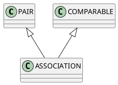

# 11 Dictionaries and ASSOCIATIONS 

In the remainder of this book, we will concentrate on object structures that are organized in ways that make it easy to find specific objects.
The best metaphor for an object structure that is used for looking up specific objects is the dictionary. 

## 11.1 Dictionaries 

A dictionary is a structure that organizes definitions (or translations) in such a way that they can be quickly found. 

What makes a typical dictionary easy to search is the fact that all entries in it are sorted.
This allows a reader to pick a page and see whether the definition being sought appears on it, before it, or after it.
Namely, if we see a definition for a word that lexicographically follows the word whose definition we seek, then the definition we need appears earlier than the one we are looking at now.
If the definition is for a word that is identical to the one we are looking up (allowing a few spelling mistakes on our part),
then we take that definition. 
Otherwise, we look for the definition in the remainder of the dictionary. 

This activity is called “looking up a word,” but that is misleading.
We already know the word.
What we are looking up is the definition, using the word to identify it. 

Moving a generation ahead in the dictionary technology, we get the electronic dictionary.
All we do to search one of those is type in a word, and out comes the definition. 

The implementers of a dictionary in its book form do not have a choice regarding a dictionary’s organization: If it were not sorted alphabetically by the defined word, it would be useless.
A book is a data structure rather than an object structure: Its users have to perform the operations themselves, so they 
need to know its internal organization.

By age-old convention, that organization is that of an array of (<word>, <definition>) pairs, sorted by the <word>. 
On the other hand, the electronic dictionary gives no clue as to how it is organized inside.
It may well use an array of sorted (<word>, <definition>) 
pairs (as we will see in Chapter 14),
but it could use something else.
For instance, if the dictionary allows users to add their own entries, then the array representation may be too slow. 

The implementation of the digital dictionary is the implementers’ business;
the contract with the users (“type in a word and hit the ‘define’ button, 
and the result will be a definition if the word is in the dictionary”) is all that is needed to operate it. 

## 11.2 The DICTIONARY Object Structure 

Traditional dictionaries let people use words to find definitions.
Dictionary object structures have a more general role:
to use any type of object to locate any other kind of object.
The object that is used to identify the goal of the search is called the “key,” and the object that is identified by it is called the “value.” 

We can set up the contract for DICTIONARY 

[KEY, VALUE] right now.
As we did with the various versions of LIST [ITEM], we will make DICTIONARY 
a deferred class.
Specific fully implemented subclasses will be discussed in Section 11.5 and Chapter 14, after we develop a few tools. 

But first, we need to consider how keys and values are tied together. 

## 11.3 Associations 

The first thing we need is a class of objects to tie together a key and a value.
In Chapter 3, we had a class of objects to tie two objects together: PAIR.
Unfortunately, we cannot use it directly.
The first problem is that a pair is_equal to another if first of both tracks the same item and second of both tracks the same item.
That is too strong to be used to identify an association in a dictionary: If we had the same key and value objects to put into an association for comparison purposes, we would not need to look for the value object in the dictionary. ' 
An association's is_equal needs to compare only the keys—and compare them for equality, not identity: If we want to look up the translation for the word “mother,” we should be able to use any STRING object whose value equals "mother", not just the one that is part of the association in the dictionary. 

The second problem is that there is no way to compare PAIR objects that tells us which should precede the other in a dictionary.
There is, however, a deferred class in the standard Eiffel library called COMPARABLE that defines the ordering features we need (see Appendix B).
These features are infix "<", (the last three are defined in terms of infix "<=", infix ">", and infix ">=" “<” and is_equal). 

The **infix** declaration allows expressions of the form 

```
comparablel < comparable2 
```

which means “tell the object tracked by comparable1 to execute the feature ‘<’ 
using the object tracked by comparable2 as its single parameter.” 

Thus, we need ASSOCIATION objects to act like both COMPARABLE and PAIR.
We define the class to be an heir to both (see Figure 11.1),
redefining features from either as needed.
While we are at it, we can use Eiffel’s rename instruction to give first, second, set_first, and set_second names that are more appropriate for associations:
key, value, set_key, and set_value, respectively. 
The resulting class is shown in Listing 11.1. 


Figure 11.1 Class ASSOCIATION is an heir to both PAIR and the predefined 
class COMPARABLE. 


Since ASSOCIATION’s inherit section is more complicated than the ones we have previously encountered, it deserves a closer look.
First, there are two parent classes, each with its own rename-undefine-redefine-end structure. 
Second, the rename section for PAIR[KEY, VALUE] provides new names to the features inherited from PAIR.
If an association object is addressed through an entity of type ASSOCIATION, new names are used;
if it is addressed through a PAIR entity, then the old names are used.
For example, the following code segment is perfectly legal: 

```Eiffel
local 
p: PAIR|STRING, STRING]; 
a: ASSOCIATION| 

STRING, STRING]; 

do 
create a.make; 
a.set_key ("aardwolf"); 
!ASSOCIATION[STRING,STRING|!p.make; 
p.set_first ( "olatypus " ye 
end 
```

```Eiffel
class ASSOCIATION[KEY —> COMPARABLE, VALUE] inherit PAIR[KEY,VALUE] 

rename 
first as key, second as value, 
set_first as set_key, set_second as set_value 
redefine 
is_equal 
end; 

COMPARABLE 
undefine 
out, is_equal 
redefine 
infix "<" 

end; 

creation make 
feature 
is_equal (other:
like Current): BOOLEAN is 
——Same as key.is_equal (other.key). 

do 
Result := 

(key = Void and other.key = Void) or else ((key /= Void and other.key /= Void) and then key.is_equal (other.key)); 

end; ——is_equal 
infix "<"(other:
like Current): BOOLEAN is 
——Same as key < other.key. 

do 
Result := (key /= Void and other.key /= Void) and then key < other.key; 

end; ——infix "<" 
end —-class ASSOCIATION 
```
Listing 11.1 Class ASSOCIATION. 

The feature that sets the first item of the pair is being called, regardless of what name is used to invoke it. 

The third thing to consider is the fact that when a class has more than one parent, two (or more) different features with the same name could be inherited. 

In the case of COMPARABLE and PAIR, there is a conflict with out.
For instance, class COMPARABLE inherits the standard out from ANY, but PAIR 
redefines it to be a different feature.
ASSOCIATION would inherit both features, which would be perfectly fine if they didn’t have the same name.
To avoid the conflict, we have to either rename one of them or undefine one of them.
Since we. have no use for the feature that COMPARABLE calls “out,” we undefine that one.
The same reasoning applies to is_equal. 

The last new bit of Eiffel in class ASSOCIATION is in the class section itself: “KEY —>COMPARABLE”.
This notation indicates that the type that is plugged in for KEY when the association object is created is constrained to type COMPARABLE.
In other words, the key of an association must be an object of class COMPARABLE or one of its subclasses.
We require this so that we can be sure that expressions like “key<other.key” are safe to use.
If we leave off the “—><type>” part, then “—>ANY” is assumed. 

A simple tester for class ASSOCIATION is given in Listing 11.2. 

```Eiffel
class ASSOCIATION_TESTER 

creation test 
feature 
test is 
——Test ASSOCIATIONS. 

local 
assoc1: ASSOCIATION(|STRING, STRING}; 
assoc2: ASSOCIATION|STRING, STRING]; 
STRING, STRING}; 
assoc3: ASSOCIATION| 

do 
'assocl.make; 
assocl.set_key ("dictionary"); 
assoc1.set_value 
("a book containing words along with their definitions"); 

print("Assoc1 created: %N"); 
print (assoc1); 
print ("NSN"); 
Nassoc2.make; 
assoc2.set_key ("dictionary"); 

assoc2.set_value ("a book giving for words of one language equivalents% 

$in another"); 

print("Assoc2 created: %N"); 
print (assoc2); 
print ("SNN"); 

check 
‘ 

assoc1_equals_assoc2:
assoc1.is_equal (assoc2); 
assoc1_not_less_than_assoc2:
not (assoc1 < assoc2); 

assoc1_not_greater_than_assoc2:
not (assoc1 > assoc2); 

end; 

Nassoc3.make; 
assoc3.set_key ("diction"); 
assoc3.set_value("vocal expression:
enunciation"); 

print("Assoc3 created: %N"); 

print (assoc3); 
print ("SNN"); 

check 
assoc1_not_equal_assoc3:
not assoc1.is_equal (assoc3); 
assoc1_not_less_than_assoc3:
not (assoc1 < assoc3); 

assoc1_greater_than_assoc3:
assoc1 > assoc3; 

end; 

print("Test done. %N%N"); 

end; ——test 
end ——class ASSOCIATION_TESTER 
```
Listing 11.2 Class ASSOCIATION_TESTER. (Definitions adapted from The NeXT Digital Edition of Webster’s Ninth New Collegiate Dictionary, 
Copyright 1988 Merriam-Webster, Inc., and NeXT Computer Inc.) 

## 11.4 The Contract for DICTIONARY 

All that a dictionary needs to do is keep track of associations of keys and values. 
If the key shows up in the dictionary only once, then a function value (<key>) 
can be provided for retrieving the value associated with that key.
But that is not an assumption to be made lightly. 

First, it appears to be a rather severe restriction: Real-world dictionaries contain several descriptions or translations for many of the words.
This, however, can be easily worked around: Just make each value an array of translations instead of individual translations. 

Second, it is expensive to enforce.
The bullet-proof way to ensure that no duplicate keys exist is to treat the key analogously to the index in an ARRAY: 
When you put(<value>,<key>) it replaces whatever value was associated with that key, if any—just as put (<value>,<position>) does in class ARRAY. 

The problem is that this forces us to perform a search inside each put, an expensive process that will have to be repeated O(N) times as a dictionary of size N 
is initially filled. 

The second alternative is to allow multiple associations to the same key within the dictionary.
Then inserting associations is no problem, but looking them up is.
Either we can write a values (<key>) function, which builds and returns an array of values, or we need to write a set of features that allows the user to find all the values for that key, and then traverse them in a loop, getting the next value each time.
The latter solution is wasteful, because it forces us to duplicate the traversal facilities that are already present in ARRAY (and, for that matter, in LIST). 

Writing a values function that results in an array or a list of values is also problematic.
If we return an ARRAY or a LIST_ARRAY, we need to make a good estimate about the size of the array, or resizing it will kill our performance.
This may be acceptable if we know something about the dictionary: For example, if no more than five definitions are ever present per key, values can always create five-item arrays, and then resize them down if necessary. 

Alternatively, we could have values always result in a LIST_LINKED, but that would mean that class LIST_LINKED and at least one of its undeferred subclasses must be present in the system even if the rest of the dictionary is completely array based. 

So given several not quite satisfactory solutions, here is what we are going to do.
We will provide the users with Boolean feature has (<key>) for determining if a key is already in the dictionary, and put “not has (key)” into put’s precondition.
If precondition checking is enabled, this will still perform searching during every put, but at least the user can easily disable it. 

Given a has feature, we can insist on has(key) as a precondition to value (key),
or we can have value return Void if the key is not found.
We can use the same precondition to delete (key),
or we can make it ignore requests to delete a missing key.
Since there is a harmless way to deal with the missing key situations, my preference is for allowing it, though it does complicate the postconditions somewhat. 

The remainder of the features are the familiar out, wipe_out, and copy.
The whole contract is shown in Listing 11.3. 

```EIffel
deferred class DICTIONARY [KEY—>COMPARABLE, VALUE] inherit 
ANY 

undefine 
is_equal, out, copy 
redefine 
is_equal, out 
end; 

feature ——Creation and initialization 
make is 
——Create a new, empty dictionary. 

deferred end; ——make 
feature ——Adding, removing, and checking associations 
has (key: KEY ): BOOLEAN is 
——Is there an association for key in this dictionary? 

deferred end; ——has 
put (new_value: VALUE;
key: KEY) is 
——Insert an association of key and new_value into this dictionary. 

require 
unique_key:
not has (key); 
enough_room:
not is_full; 

deferred ensure 
has_after_put:
has (key); 
size_after_put:
size = old size+ 1; 

end; ——put 
delete (key: KEY) is 
——Delete the association for key (if any) from this dictionary. 

deferred ensure 
size_after_delete:
size = old size — 1 or else 
(size = old size and then not old has (key)); 

end; ——delete 
value (key: KEY ): VALUE is 
——The value associated with key in this dictionary. 
——Void if there is no such association. 

deferred end; ——value 
Wwipe_out is 
——Make this dictionary empty. 

deferred ensure 
empty:
is_empty; 

end; ——wipe_out 

feature ——Sizing 
size: INTEGER is 
——The number of associations currently in this dictionary. 

deferred end; —-size 
_ts_empty: BOOLEAN is 
——Is this dictionary empty? 

deferred end; ——is_empty 
is_full: BOOLEAN is 
——Is there no room in this dictionary for one more association? 

deferred end; ——is_full 
feature ——Comparisons and copying 
is_equal (other:
like Current) is 
——Do this dictionary and other associate the same values —-—with the same keys? 

deferred end; ——is_equal 
feature ——Simple input and output 
out: STRING is 
——"< (<key 1>.out,<val 1>.out)...(<key n>.out,<val n>.out) >". 

deferred 
end; ——out 
invariant 
empty_iff_zero_size:
is_empty = (size = 0); 
size_not_negative:
size >=0; 

end ——class DICTIONARY 
```
Listing 11.3 The contract for DICTIONARY in the form of a deferred class. 

## 11.5 Linear Search Implementation 

The simplest way to do a dictionary given the structures we have already seen is to keep an unsorted list of associations.
To locate an association, we can simply loop through the list until we find an association whose key is_equal to the one we want to match.
This is called a “linear search.” Class DICTIONARY _ 
LINEAR, shown in Listing 11.4, uses this technique. 

The list of associations is named “associations.” An internal feature locate (key) is used to move associations’ cursor to the association for key if it is the dictionary, or all the way off-right if it is not.
It is used then in `value`, `has`, `put`, and `delete`. 

```
class DICTIONARY_LINEAR[KEY—>COMPARABLE, VALUE] inherit 
DICTIONARY [KEY, VALUE] 

creation make 
feature {DICTIONARY_LINEAR} 

associations: LIST_DOUBLY_LINKED[ASSOCIATION{KEY, VALUE}]; 

——The list of associations. 

locate (key: KEY) is 
——Move associations’ cursor to the association for key —-or off-right if there is no such association. 

do 
from 
associations.move_off_left;
associations.move_right; 

until 
associations.is_off_right or else key.is_equal (associations.item.key) 

loop 
associations.move_right; 

end; 

end; ——locate 
feature ——Creation and initialization 
make is 
——Create a new, empty dictionary. 

do 
Nassociations.make; 

end; ——make 
feature ——Adding, removing, and checking associations 
value (key: KEY): VALUE is 
——The value associated with key in this dictionary. 
——Void if there is no such association. 

local 
void_value: VALUE; 

do 
locate (key); 

if associations.is_off_right then 
Result := void_value; 

else 
Result := associations.item.value; 

end; 

end; ——value 

has (key: KEY): BOOLEAN is 
——Is there an association for key in this dictionary? 

do 
locate (key); 

Result := not associations.is_off_right; 

end; ——has 
put (new_value: VALUE;
key: KEY) is 
——Insert an association of key and new_value into this dictionary. 

local 
association: ASSOCIATION(|KEY, VALUE]; 

do 
Nassociation.make; 
association.set_key (key); 
association.set_value (new_value); 

——Less trouble to go to off-left than to check for off-right. 
associations.move_off_left; 
associations.insert_on_right (association); 

end; ——put 
delete (key: KEY) is 
——Delete the association for key from this dictionary. 

do 
locate (key); 

if not associations.is_off_right then 
associations.delete; 

end; 

end; ——delete 
wipe_out is 
——Make this dictionary empty. 

do 
associations.wipe_out; 

end; ——wipe_out 
feature —-—Sizing 
size: INTEGER is 
——The number of associations currently in this dictionary. 

do 
Result := associations.length; 

end; ——size 

is_empty: BOOLEAN is 
——Is this dictionary empty? 

do 
Result := associations.is_empty; 

end; ——is_empty 
is_full: BOOLEAN is 
——Is there no room in this dictionary for one more association? 

do 
Result := associations.is_full; 

end; ——is_/full 
feature ——Comparisons and copying 
copy (other:
like Current) is 
——Copy other onto Current. 

do 
——Start from scratch. 
make; 

associations.copy (other.associations); 

end; ——copy 
is_equal (other:
like Current): BOOLEAN is 
——Do this dictionary and other associate ——the same values with the same keys? 

local 
other_value: VALUE; 

do 
if size /= other.size then 
Result := false; 

else 
from 
Result := true; 
associations.move_off_left;
associations.move_right; 

until 
Result = false or else associations.is_off_right 
loop 
other_value := other.value (associations.item.key); 
Result := other_value /= Void and then 
associations.item.value.is_equal (other_value); 

associations.move_right; 

end; 

end; 

end; ——is_equal 

feature ——Simple input and output 
out: STRING is 
——"< (<key 1>.out,<val 1>.out)... (<key n>.out,<val n>.out) >". 

do 
Result := associations.out; 

end; ——out 
invariant 
have_list:
associations /= Void; 

end —-class DICTIONARY LINEAR 
```
Listing 11.4 Class DICTIONARY_LINEAR—a dictionary implementation  that uses a linear search. 

Most features in DICTIONARY_LINEAR are straightforward, but the implementation of is_equal is significantly different from the way we have done it for LIST, STACK, and QUEUE.
Since associations is not sorted, it is possible to have two dictionaries that are equal even though they do not store the equal associations in the same order.
Thus, instead of going through the two lists in parallel and compairing the keys and the values of associations, we go through Current.associations and see if each key appears in other (no matter where) 
and is associated with the same value there. (The local entity other_value is used so that other does not have to be searched twice:
once to establish that it contains the key, and once to get the associated value.) 

## 11.6 Performance Analysis 

Having to search through the list of associations is quite expensive.
As Table 11.1 shows, while building the dictionary is quick (O(1) for each insertion),
the features that look up associations are slow (O(N)).
Dictionaries tend to be built once, and then accessed for lookups many times, so this is not a particularly efficient implementation. 

Table 11.1 Average and worst case time complexities for the linear 
implementation of dictionaries (using a doubly linked list). 
N = size. 

| Feature   | Linear             |
|-----------|--------------------|
| make      | O(1)               |
| value     | O(N)               |
| has       | O(N)               |
| put       | O(1)               |
| delete    | O(1)               |
| wipe_out  | O(1) [^alpha]      |
| size      | O(N)               |
| is_empty  | O(1)               |
| is_full   | O(1)               |
| copy      | See Exercise 10.2  |
| is_equal  | See Exercise 10.3  |
| out       | O(N)               |

[alpha]: The garbage collector may have to do O(N) work to recycle the discarded nodes. 


Consider the book dictionary again.
If every time you had to look up a word, you had to scan the whole dictionary from the beginning to the end, how long would it take?
It would be foolish to do dictionary searches that way.
The same situation applies to dictionary object structures: If the list of associations was sorted, we could zero in on the needed association much quicker. 

We will do such an implementation in Chapter 14, after learning how to sort lists in Chapters 12 and 13. 

# Summary 
Associations are specialized pairs.
They associate a key with a value.
They are intended for use in dictionaries, where the key is used to find the associated value. 

Dictionaries are collections of associations.
In this chapter, only linearly searched dictionaries were considered.
Searching such a dictionary is an O(N) 
operation. 

# Exercises 

1. Write class DICTIONARY TESTER. Use it to test DICTIONARY LINEAR. 

2. What is the time complexity of copy in DICTIONARY_LINEAR? 

3. What is the time complexity of is_equal in DICTIONARY_LINEAR? 

4. If DICTIONARY_LINEAR used LIST_ARRAY instead of LIST_DOUBLY_LINKED, 
    1. on which end of the list should new associations be inserted? 
    2. what would be the time complexity of delete? 
5. If DICTIONARY_LINEAR used LIST_SINGLY_LINKED instead of LIST_DOUBLY_LINKED, 
    1. on which end of the list should new associations be inserted? 
    2. what would be the time complexity of delete? 