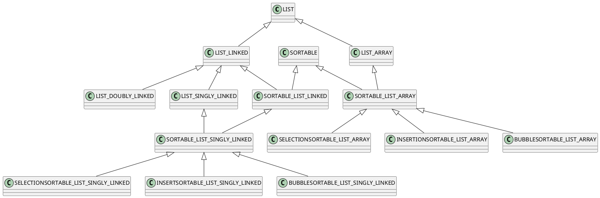
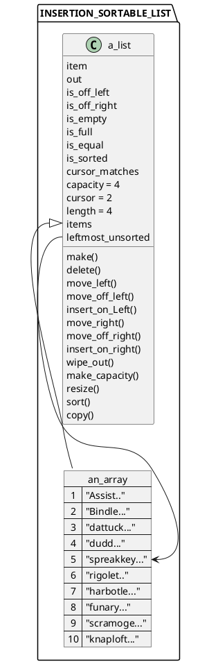
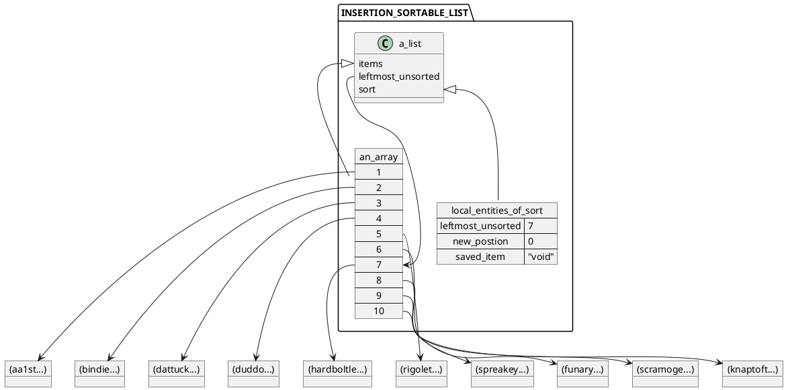
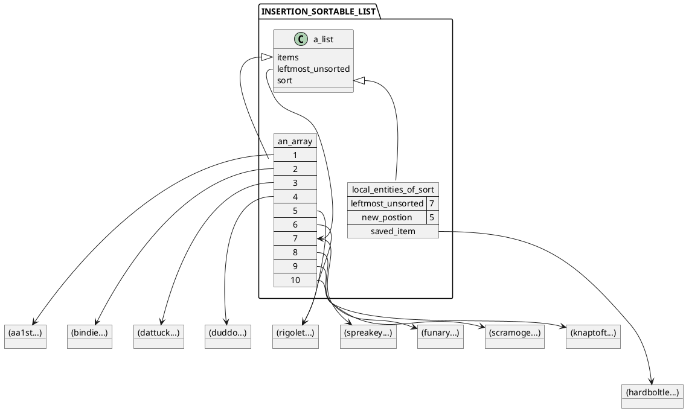
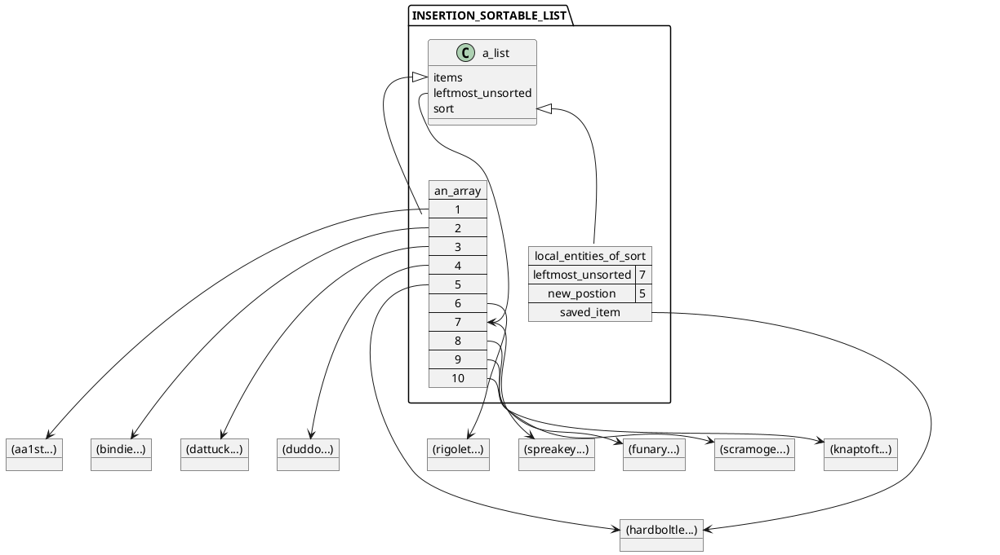
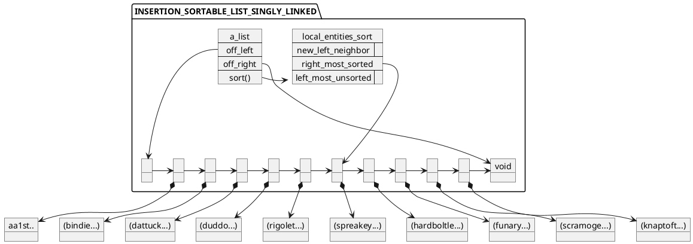
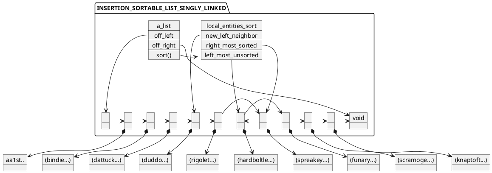
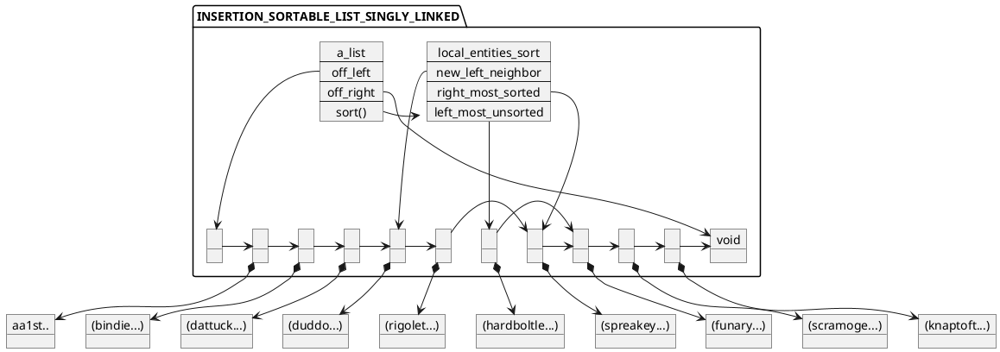
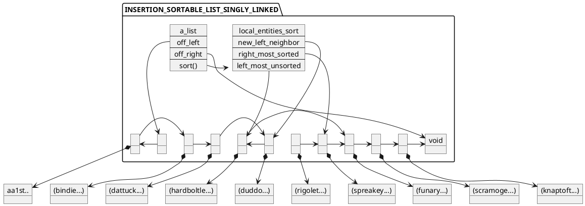
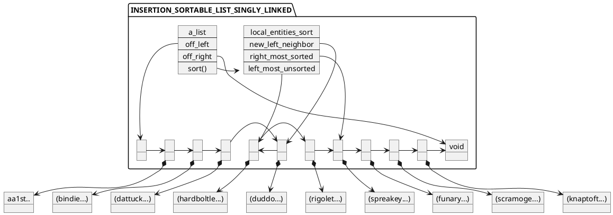

# 12 Sorting 

To facilitate more intelligent searching for an association in a list, we need to have a sorted list, according to the comparison methods we discussed in Chapter 11.
Let us look at three ways to do that, and think about their time complexities.[^1]

[1]: The words and definitions used in the examples in this and the following chapter are from The Deeper Meaning of Liff: A Dictionary of Things There Aren't Any Words for Yet—But There Ought to Be by Douglas Adams and John Lloyd, copyright 1990 by Serious Productions Ltd. and John Lloyd. Used by permission. 


## 12.1 Sortable Lists 

A list is sorted if for any two adjacent items tracked by it, the item on the left is infix "<=" to the item on the right.
There are two approaches to this: 

1. Replace insert_on_left and insert_on_right with an insert feature that places the new item into a position in which it is infix ">=" its left neighbor and infix "<=" its right neighbor. 

2. Allow insertion anywhere, and provide features sort and is_sorted so that the user can sort the list on demand. 

The first approach results in a list that is always sorted: “list is sorted” is part of its invariant.
Since it discards the semantics of insertion either to the left or the right of the cursor, it cannot be an heir to class LIST. 

The second method gives us a class of objects that can act as LISTs, and just adds a sorting facility.
Let us use this approach. 

Following the example of COMPARABLE, we create a deferred class called SORTABLE, which holds the contract for sortable object structures, as shown in Listing 12.1. 

```Eiffel
deferred class SORTABLE[ITEM —> COMPARABLE] inherit 
ANY 

undefine 
out, is_equal, copy 
end; 

feature 
is_sorted: BOOLEAN is 
——Is this structure currently sorted? 

deferred end; ——is_sorted 
sort is 
——Sort this structure. 

deferred ensure 
sorted:
is_sorted; 

end; ——sort 
end ——class SORTABLE 
```
Listing 12.1 Deferred class SORTABLE, providing the contract for all sortable object structures. 

A sortable list is an heir to classes SORTABLE and LIST.
Since LIST is deferred, if we inherit from it directly we will lose the three implementations we have written in Chapters 6 and 7.
Instead, we will have class SORTABLE_LIST_ARRAY, which inherits from LIST_ARRAY and SORTABLE on the array implementation side.
For linked implementations, there is class SORTABLE_LIST_SINGLY_LINKED, which inherits from SORTABLE_LIST_LINKED, 
which in turn is an heir to LIST_SINGLY_LINKED and SORTABLE.
We will skip the study of SORTABLE_LIST_DOUBLY_LINKED:
if you can sort a singly linked list, you can figure out how to sort a doubly linked list (see the exercises). 

Since we will be studying several ways to sort a list, feature sort will stay deferred in SORTABLE_LIST_ARRAY and SORTABLE_LIST_SINGLY_LINKED.
For each sorting algorithm, we will have a subclass that implements sort in that specific way.
Figure 12.1 shows the list class hierarchy with which we will end up at the end of this chapter. 

Listing 12.2 shows deferred class SORTABLE_LIST_ARRAY.
It implements *is_sorted* fully, but defers the implementation of sort to its algorithmspecific heirs.
It does, however, place an additional postcondition on them: 
After the list is sorted, the cursor must be placed off-left (it needs to be placed into some predictable spot). 


Figure 12.1 The hierarchy of sortable list classes used in this chapter.

```Eiffel
deferred class SORTABLE_LIST_ARRAY[ITEM —> COMPARABLE] inherit 
LIST_ARRAY [ITEM]; 

SORTABLE [ITEM] 

redefine 
is_sorted, sort 
end; 

feature 
is_sorted: BOOLEAN is 
——Is this list currently sorted? 

local 
index: INTEGER; 

do 
from 
index := 1; 

Result := true; 

variant 
length — index 
until 
index >= length or Result = false 
loop 
Result := 

(items.item (index) /= Void and items.item (index +1) /= Void) 
and then items.item (index) <= items.item (index +1); 

index := index + 1; 

end; 

end; ——is_sorted 
sort is 
——Make this list sorted and off-left. 

deferred ensure then 
off_left:
is_off_left; 

end; ——sort 
end —-—class SORTABLE_LIST_ARRAY 
```
Listing 12.2 Deferred class SORTABLE_LIST_ARRAY. 

Deferred class SORTABLE_LIST_LINKED is left as an exercise (12.1). 
All that SORTABLE_LIST_SINGLY_LINKED (Listing 12.3) does, for now, is inherit everything from SORTABLE_LIST_LINKED and LIST_SINGLY_LINKED. Nothing is added at this stage: SORTABLE_LINKED_SINGLY_SORTING 

```Eiffel
deferred class SORTABLE_LIST_SINGLY_LINKED[ITEM —> COMPARABLE] 

inherit 
LIST_SINGLY_LINKED{ITEM]; 

SORTABLE_LIST_LINKED{ITEM], 

end —-class SORTABLE_LIST_SINGLY_LINKED 
```
Listing 12.3 A convenient class that combines the parental qualities of SORTABLE_LINKED_LIST and LIST_SINGLY_LINKED. 

LINKED is just a convenient ancestor for the algorithm-specific sortable singly linked list classes. 

## 12.2 Insertion Sort 

The first algorithm we will consider is perhaps the closest to the method most people intuitively use to sort a stack of papers: 

1. Sort the first two sheets. 

2. Take the third sheet and insert it into the correct place among the first two sheets. 

3. Take the fourth sheet and insert it into the correct place among the first three sheets. 

4. Etc., until the last sheet has been inserted into the correct place. 

To make the algorithm more consistent, we note that step 1 is not much different from the rest of them, and we rewrite it as 

1. Take the second sheet and insert it into the correct place among the first 
one sheet. 

As an English sentence it stinks, but it makes it clear that we have a nice, general loop on our hands. 

This loop looks at each unsorted item, and puts it in its proper place among the sorted items.
The sorted portion starts out with just one item in it (a list of only one item cannot help being sorted),
and grows longer by one item each time through the loop. 

Let us first look at the array version of this algorithm. 

### 12.2.1 Insertion Sorting a SORTABLE_LIST_ARRAY 

In a LIST_ARRAY object, the internally tracked array called items is used to line up the references to all the items in positions [1, ... , length].
Thus, sorting from left to right, we use a local entity called leftmost_unsorted to store the index of the next item that needs to be placed. 

The sorted region of the array is in positions 

```
[1,..., leftmost_unsorted — 1] 
```

This is always true about this loop: *It is true upon each entry into the loop and also true right after the loop terminates*.
Such a property is called the **loop invariant**, and Eiffel provides a place for it in the loop statement itself.
We have been omitting loop invariants until now, but they will come in handy when trying to understand sorts, where iterations can get quite convoluted. 
Figure 12.2 shows the state of a list with ten items at the entry into the loop with leftmost_unsorted = 5. 


Listing 12.4 shows the complete class INSERTIONSORTABLE_LIST_ARRAY.
The main loop is in feature sort, and two hidden features are invoked from within that loop.
Let us look at the main loop first. 


Figure 12.2 A partially sorted INSERTIONSORTABLE_LIST_ARRAY.
Upon this entry into the loop (when leftmost_unsorted=5),
the left four positions have already been sorted. 

```Eiffel
class INSERTIONSORTABLE_LIST_ARRAY[ITEM —> COMPARABLE] 
inherit 
SORTING 

SORTABLE_LIST_ARRAY|ITEM] 

redefine 
sort 
end; 

creation make, make_capacity 
feature {NONE} 

position_for (unsorted_item: ITEM): INTEGER is 
——First index such that unsorted_item <= items.item (Result). 

require 
——unsorted_item is tracked by items. 

do 
from 
Result := 1; 

until 
unsorted_item <= items.item (Result) 

loop 
Result := Result + 1; 

end; 

end; ——position_for 
shift_right (from_index: INTEGER;
to_index: INTEGER) is 
—~—Shift all items between from_index and to_index ——inclusively one step to the right. 

local 
index: INTEGER; 

do 
from 
index := to_index; 

variant 
index — from_index 
until 
from_index > index 
loop 
items. put (items.item (index),
index +1); 

index := index — 1; 

end; 

end; ——shift_right 

feature 
sort is 
——Make this list sorted and off-left. 

local 
leftmost_unsorted: INTEGER; 
saved_item: ITEM; 
new_position: INTEGER; 

do 
from 
leftmost_unsorted := 2; 

invariant 
—~items.item(1),
... ,items.item (leftmost_unsorted—1) are sorted 
variant 
length — leftmost_unsorted 
until 
leftmost_unsorted > length 
loop 
new_ position := position_for (items.item (leftmost_unsorted)); 

if new_position /= leftmost_unsorted then 
——Rotate items.item (new_position),
... ,items.item (leftmost_unsorted) 
——one position to the right. 
saved_item := items.item (leftmost_unsorted); 
shift_right (new_position, leftmost_unsorted — 1); 
items. put (saved_item, new_ position); 

end; 

leftmost_unsorted := leftmost_unsorted + 1; 

end; 

move_off_left; 

end; ——sort 
end ——class INSERTIONSORTABLE_LIST_ARRAY 
```
Listing 12.4 Class INSERTIONSORTABLE_LIST_ARRAY. 


We start with leftmost_unsorted set to 2, since everything to its left is already sorted (because there is only one item there).
So the loop invariant holds.
We leave the invariant as a comment, but we could have written a hidden feature is_sorted_between (<left index>,<right index>) and put “is_sorted_between (1,leftmost_unsorted—1)” into the **invariant** part of the loop.
(Since that check is O(N),
it would be very expensive to use it at every entry into the loop, so it would probably be disabled most of the time.) 

The next section of this loop is the **loop variant**, which we have also been omitting.
A variant of a loop is an integer number that gets smaller each time the loop is entered, but never becomes negative.
Why does a loop need a variant?
Well, it does not need one, in the sense that stating the variant does not alter the execution of the loop at all
(just like stating the invariant does not alter the execution).
The question is whether a variant for a given loop exists. 
Is there an integer expression that becomes smaller every time through the loop, but never turns negative?
If there is, that means that the loop will finish its work after a finite number of iterations.
If there is no such expression, then the loop is potentially infinite. [^2]

[2]: Infinite loops are not necessarily bad. For example, a traffic light controller operates in an infinite loop: red, green, yellow, red. Sorting loops are never infinite, so they always have a variant. 

Putting a **variant** section into a **loop** tells the compiler what its variant is, 
so that it can be checked at run time: If the variant does not decrease between two loops, or if it becomes negative, then an exception is triggered.
Since the Eiffel loop statement does not have an automatic increment section, it is rather easy to forget to put an `index:=index+1` type statement at the end of the loop;
many Eiffel programmers use the variant section to flag such problems and detect accidental infinite loops. 
The loop in `sort` does two things: 

1. Finds the proper position for `items.item (leftmost_unsorted)` in the range *[1, ... , leftmost_unsorted]*
(it may already be in its proper place, if all items to its left are less than it).
This is done using hidden feature `position_for`. 

2. Slides all items between that position and where it is now one step to the right, and then makes items track it in that position. Hidden feature `shift_righ` assists that operation. 

Features `position_for` and `shift_right` are often expanded within sort, to speed things up, since on most
(but not all) computers each feature invocation costs a noticeable time delay,
which adds up when you invoke the feature in a loop that runs O(N) times.
This text separates them for the sake of clarity. 

Feature `position_for` itself uses a loop that steps through items from the left edge until it finds an item that is greater than the unsorted item.
That is the spot into which the unsorted item will have to be inserted.
Note that if it happens that items.item (leftmost_unsorted) is already greater than everything to its left, then the loop in position_for will stop when the search hits the leftmost unsorted item itself, and result in the position that it already occupies. 

One pass through this loop is illustrated in Figure 12.3. 


a. The loop is interede with leftmost_unsorted = 7


b. The result of *position_for (items.item(7)) is 5



c. After “saved_item:=items.item (7); shift_right (5,7). 



d. After “items.put(saved_item, 5)”. 

Figure 12.3 The sixth pass through the loop in INSERTIONSORTABLE_LIST_ARRAY’s sort. 

### 12.2.2 Insertion Sorting a SORTABLE_LIST_SINGLY_LINKED 

The insertion sort algorithm works with singly linked lists too, but with a slight modification.
In the array list implementation, we tucked away the leftmost unsorted item, found the position into which it should go, and inserted it into that slot, using an operation very similar to `insert_on_left`. 

We could do the same thing with a singly linked list if we leave all the nodes alone, and just rotate their items to the right.
But one of the reasons to favor a linked implementation is to avoid copying O(N) items to the left or to the right. 
There should be a way to move the leftmost unsorted item into its proper position by relinking its node into the proper place in the chain. 

To do that, we have to remove that node from the chain (an operation similar to delete),
and insert it into its new place (similar to `insert_on_left` and `insert_on_right`).
Well, insert_on_right is O(1) in this implementation, whereas `insert_on_left` is O(N),
so we definitely want to be inserting to the right of a node rather than to its left.
Since our search for the proper place for the leftmost unsorted item goes from left to right, all we have to do is stop at the node that will become the new node’s left neighbor, and insert to its right. 

What about `delete`?
It is O(N),
but what we need to do now is not as general, so perhaps we can avoid that part of delete that makes it O(N).
Recall that what makes delete (and insert_on_left) slow is the need to find the node’s left neighbor.
Since our main loop has just visited that node the previous time around, all we have to do is remember from where it came.
In other words, we must not lose sight of the rightmost_sorted item. 

The resulting class, INSERTIONSORTABLE_LIST_SINGLY_LINKED, is shown in Listing 12.5.
The “find the right spot” loop is done in hidden feature left_neighbor_for, which stops at the last node whose item is infix "<" the leftmost unsorted item (since there is nothing to move over to the right, it makes no sense to pass over all the nodes whose items are equal to the unsorted one, 
as we did in position_for in the array implementation). 

The main loop (in sort) uses rightmost_sorted as its cursor, so that its right neighbor (the node tracking the leftmost unsorted item) can be removed from the chain in O(1) time. (The variant keyword is commented out because at print time Eiffel does not allow a comment to be used in place of the variant expression [though this restriction will probably be removed], and we do not have an arithmetic expression to represent this loop’s variant.) 
One pass through this loop is illustrated in Figure 12.4. 

```Eiffel
class 
INSERTIONSORTABLE_LIST_SINGLY_LINKED[ITEM —> COMPARABLE] 

inherit 
SORTABLE_LIST_SINGLY_LINKED[ITEM] 

redefine 
sort 
end; 

creation make 
feature {NONE} 

left_neighbor_for (unsorted_item: ITEM):
like off_left is 
——First node such that unsorted_item <= Result.right.item. 

require 
not is_empty; 
——unsorted_item is in this list’s node chain. 

do 
from 
Result := off_left; 

until 
unsorted_item <= Result.right.item 
loop 
Result := Result.right; 

end; 

end; ——left_neighbor_for 
feature 
sort is 
——Make this list sorted and off-left. 

local 
rightmost_sorted:
like off_left; 
leftmost_unsorted:
like off_left; 
new _left_neighbor:
like off_left; 

do 
——If length < 2, then the list is already sorted. 
——Avoid it, or Void.right and Void.item will happen. 
if length >= 2 then 
from 
rightmost_sorted := off_left.right; 

invariant 
——The chain up to rightmost_sorted is sorted. 

——variant 
——The length of the unsorted part of the list 
until 
rightmost_sorted.right = off_right 
loop 
leftmost_unsorted := rightmost_sorted.right; 

——Where does leftmost_unsorted.item belong? 
new_left_neighbor := left_neighbor_for (leftmost_unsorted.item),


if new_left_neighbor = rightmost_sorted then 

——The item in question is already where it ——belongs, so now it is the rightmost sorted item. 
rightmost_sorted := leftmost_unsorted; 

else 
—~—Remove the leftmost unsorted item’s node from the chain. 
rightmost_sorted.set_right (leftmost_unsorted.right); 

——Insert it to the right of new_left_neighbor. 
leftmost_unsorted.set_right (new_left_neighbor.right); 
new_left_neighbor.set_right (leftmost_unsorted); 

—-rightmost_sorted is still over the rightmost sorted item. 

end; 

end; 

end; 

move_off_left; 

end; ——sort 
end —-class INSERTIONSORTABLE_LIST_SINGLY_LINKED 
```
Listing 12.5 Class INSERTIONSORTABLE_LIST_SINGLY_LINKED



a. The loop is entered with rightmost_sorted tracking the node that tracks (harbottle, .. .). 


b. The result of left_neighbor_for (leftmost_unsorted.item) tracks the node that tracks (duddo, .. 


c. The leftmost unsorted item’s node (the right neighbor of rightmost_sorted) has been bypassed. 


d. The leftmost unsorted item’s node has been linked into the chain to the right of left_neighbor_for (leftmost_unsorted.item). 


e. Same state, just cleaning up the diagram. 

#### Figure 12.4 The sixth pass through the loop in INSERTIONSORTABLE_LIST_SINGLY_LINKED’s sort. 

### 12.2.3 Performance Analyses 
We have been very careful, in both the array and the singly linked implementation, to avoid in our loops all list operations that take longer than O(1).
In previous chapters, that gave us an O(N) implementation for the loop.
In the case of insertion sorting, it does not work that way, since we have loops within loops. 
In fact, it has been shown that it is impossible for a sorting algorithm that works by comparing pairs of items to be as fast as O(N): The best possible time complexity for such an algorithm is O(N log N) (see Ref. 1, Theorem 2.7) [^3] 

[3]: There are algorithms that work faster for keys that have a certain kind of internal structuare, but they do not work when keys are arbitrary objects. 

To see what happens during an insertion sort, let us consider the array implementation, and what the loops have to do.
We draw the array, and trace the execution of sort and its friends by leaving a trail of markers everywhere they go: 

1. During the first pass through sort’s loop, the loops in position_for and shift_right visit positions 1 and 2.
So we put markers under positions 1 and 2 of the array, as shown in Figure 12.5a. 

2. During the second pass through sort’s loop, the loops in position_for and shift_right visit positions 1, 2, and 3.
On the line below, we put markers under positions 1, 2, and 3 (Figure 12.5b). 

3. Etc. We keep doing this until sort’s loop is finished. 

When we are done, we will end up with a chart that has N — 1 rows of markers, one row for each pass through sort’s loop.
The width of each row is equal to the value of leftmost_unsorted, so the last row is going to be N markers wide. 
This chart is shown in Figure 12.5c. 

The total number of these markers, in terms of the length of the list, is the time complexity of sort.
Recall that with the big O notation, we just want the proportion, so there is no need to get the precise count.
The quickest way to get the “on-the-order-of” count of the markers is shown in Figure 12.6: Look at the triangle formed by the markers, and name its area in terms of N.
Why area? 
Well, as we learned in calculus, the area within certain bounds is the accumulation of the areas of all the little squares you can stuff into those bounds. [^4]

[4]: Calculus books tend to express this idea a bit differently. 

If each of those squares happens to be 1 x 1, then the area of each square is 1, so the accumulation of those areas is equal to the number of the squares, which is what we seek. 


a. Positions of the array visited during the first pass through sort’s loop. 

b. Positions of the array visited during the first two passes through sort’s loop. 

c. Positions of the array visited during all of the passes through sort’s loop. 

Figure 12.5 The execution chart for the INSERTIONSORTABLE_ LIST _ARRAY’s sort routine. 


Figure 12.6 Tallying up the item visiting markers to get the time complexity of sort in INSERTIONSORTABLE_LIST_ARRAY. 

The quickest way to get the area of the triangle is to recall that it is a rectangle sliced in half diagonally, so the area is “one-half the base times the height.”
The base of the rectangle is approximately equal to the longest trek taken by position_for and shift_right (about N),
and the height is approximately equal to the number of passes through sort’s loop the algorithm takes (also about N).
Thus, the number of position visitations performed by the sort routine is roughly (1/2)*N^2, which is O(N^2). 


If we chart the progress of sort in INSERTIONSORTABLE_LIST_SINGLY_LINKED,
we only get the full triangle in the worst case scenario, which is when everything in the sorted portion is always infix "<" the unsorted item, 
so left_neighbor_for has to go all the way through the sorted portion every time.
Ironically, this worst case happens when the list is already sorted and each key is unique. 

In the average case, we can expect that the left_neighbor_for’s loop will go through half of the sorted region before the proper spot for the leftmost unsorted item is found, which will give us roughly 1/2 * N^2 markers, which is still * N^2. 

There is a variation of the algorithm for insertion sorting an array that works better with sorted or partially sorted lists: Instead of having position_for search the sorted region from left to right, have it search it from right to left.
In this way, the marker path taken by position_for and shift_right is identical—in fact, the two can be done in one loop: Compare the leftmost unsorted item to its left neighbor and swap them if they are out of order, and keep doing that until it percolates left to its proper spot.
If the list is partially sorted, there is a good chance that the leftmost unsorted item is greater than everything in the sorted region, and the percolation stops immediately.
With this algorithm, 
insertion sorting a list that is already sorted becomes O(N)—provided, of course, that moving left in the list is O(1),
so doing this in a singly linked list is difficult (but not impossible:
it can be done by making a reverse copy of the node chain). 

## 12.3 Bubble Sort 
Whereas insertion sort mimicked the way humans tend to perform manual sorting, bubble sort takes a brute-force whack at the definition of the problem.
To sort a list means to produce a list that is sorted.
A list is sorted if no two consecutive items in it are out of order.
Bubble sort looks for consecutive pairs of items that are out of order and swaps them.
Figure 12.7 demonstrates how this operation is performed on an unsorted list.
The first two items happen to be in order, so they are left alone.
Items in positions 2 and 3 are out of sequence, so they are swapped.
So far, it looks like everything to the left of the position being checked is sorted, but the next step proves that wrong: The item that is moved to the left during a swap will definitely be “<=” its new right neighbor, but that — 
says nothing about its relationship with items to its left (see Figure 12.7d). 

What does happen, however, is that the greater item keeps moving to the right, until it meets with an item that is even greater (Figure 12.7e).
At that point, that item starts moving to the right.
At the end of the sweep, we know . .)” has bubbled up to the right end of the that the greatest item, “(spreakley, . 
unsorted region (Figure 12.7f).
All of its left neighbors are “<=” to it.
Thus, there is no reason to ever move it again—it is, for what little it is worth, our sorted region. 


a. Items in positions 1 and 2 are in order. 

b. Items in positions 2 and 3 must be swapped. 

c. Items in positions 3 and 4 must be swapped. 

d. The region to the left of the swapping activity is demonstratively not sorted. Items in positions 4 and 5 must be swapped. 

e. After two more steps (not shown), “(scramoge, . . .)” stops moving to the . .)” right because an even greater item, “(spreakley, .  is encountered. No swapping here. 

f. Two steps later (not shown), the greatest item has bubbled up to the right  end of the unsorted region. 

Figure 12.7 One left-to-right sweep through the items, exchanging those that are out of sequence. 


Figure 12.8 The list in Figure 12.7 after the second sweep. 

Obviously, one sweep is not enough to sort the list, but if we perform anothe sweep, then the second greatest item, “(scramoge...),” will bubble up to the right end of the unsorted region,
coming to rest in front of “(spreakley, ...),"
thus joining the sorted region (Figure 12.8).n
In fact, since we know that everything in the sorted region is “>=” the greatest item in the unsorted region,
we can stop the sweep at the end of the unsorted region.
In this example, since there are 10 items, the first sweep stops after 9 comparisons, the second—after 8 comparisons, the third—after 7, and so on. 

The algorithm then consists of two loops:
a loop to make one sweep of comparisons and exchanges, and
a loop around it to make enough sweeps to sort the entire list.
The resulting routine sort (this time self-contained, though we could have separated the two loops as we had in the insertion sortable classes) 
is shown in Listing 12.6.
Its singly linked list counterpart is left as an exercise (Hint: Never go left). 

```Eiffel
class BUBBLESORTABLE_LIST_ARRAY[ITEM —> COMPARABLE] inherit 
SORTABLE_LIST_ARRAY|[ITEM] 

redefine 
sort 
end; 

creation make, make_capacity 
feature {NONE} 

sweep (sweep_length: INTEGER) is 
——Make one sweep from position 1 through position sweep_length, 
——exchanging consecutive items that are out of order. 

local 
position: INTEGER; 
saved_item: ITEM; 

do 
from 
position := 1; 

invariant 
1 <= position and position <= sweep_length 
variant 
sweep_length — position 
until 
position = sweep_length 
loop 
if items.item (position) > items.item (position+1) then 
——Swap them. 
saved_item := items.item (position); 
items.put (items.item( position +1),
position); 
items.put (saved_item, position +1); 

end; 

position := position + 1; 

end; 

end; ——sweep 
feature 
sort is 
——Make this list sorted and off-left. 

local 
unsorted_length: INTEGER; 

do 
from 
unsorted_length := length; 

invariant 
——Items to the right of position unsorted_length are sorted all items in positions 1 through unsorted_length. 
——and >= 

variant 
unsorted_length — 1 

until 
unsorted_length = 1 

loop 

sweep (unsorted_length); 

unsorted_length := unsorted_length — 1; 

end; 

move_off_left; 

end; ——sort 
end —-class BUBBLESORTABLE_LIST_ARRAY 
```
Listing 12.6 Class BUBBLESORTABLE_LIST_ARRAY. 


### 12.3.1 Performance Analysis 

Figure 12.9 shows the execution trace of the routines in Listing 12.6.
The singly linked version, if properly written, will have exactly the same trace.
As was the case with insertion sorting, the trace takes the shape of an equilateral right triangle with base of approximately N, indicating O(N^2) time complexity. 

#### Figure 12.9 The tally of execution markers of the bubble sort algorithm. 


### 12.3.2 Counting the Swaps 

Both insertion sort and bubble sort have a time complexity of O(N^2),
because that is how many comparisons they perform.
But while the number of comparisons is about the same, the number of object references that get moved around is quite different.
Swapping object references in memory is cheap, so this is not a critical consideration for us.
However, there are other sorting situations where swapping items is significantly expensive, and the number of swaps needs to be minimized (rearranging large files on disk, for example). 

Consider insertion sort in the array implementation.
The worst case situation is when the list starts out sorted in reverse: Then each new insertion goes into position 1, forcing the rest of the previously sorted region to move.
If we place a marker at each spot where an object reference was moved, we get exactly the triangle of Figure 12.6.
Thus, there are O(N?) object reference movements. 
If the objects start out in random order, then the insertion will happen, on the average, halfway through the sorted region.
This gives us a right triangle with the horizontal edge being half the vertical one, but it is still OWV7) (it is half the area of the comparison tracing triangle, but the constant 3 does not matter). 

The linked list implementation is much more efficient in terms of object reference swapping, because each insertion is O(1),
and one insertion is done on each pass, so the total number of insertions is O(N). 

Bubble sorting, on the other hand, performs many object reference swaps on every sweep (on the average, roughly half of the pairs in the unsorted region will be out of order),
giving us the triangle again.
Performing one swap is O(1) 
in both the array and the linked implementation (if you did it correctly),
so both implementations perform O(N?) swaps. 

If the goal is to work the greatest item to the right end of the unsorted region of the list, why not just select it and put it there, instead of bubbling it through all the others, swapping half the time, on the average? 

## 12.4 Selection Sort 

The third and last sorting algorithm in this chapter does just that: It sweeps the unsorted region, remembering which element is the greatest, and moves it to the right end of the region, where it is adjoined to the sorted region. 

Both the array and the singly linked versions of this algorithm are left up to you.
I suggest using a hidden function that results in the position of the greatest item within a range.
Then swap the item at that position with the rightmost unsorted item—especially in the array implementation, this is much cheaper than shifting everything to the left (O(1) instead of O(N)). 

# Summary 
Three sorting algorithms were considered in this chapter:
insertion sort, bubble sort, and selection sort. 

Insertion sort works by repeatedly inserting items into their proper place within the sorted portion of the list. 

Bubble sort works by bubbling the greatest item to one end of the list, then repeating the process with the shorter unsorted region. 

Selection sort is similar to bubble sort, but instead of bubbling greater items to one side, it first finds the greatest item of the unsorted region and then swaps it with the one at the end of the unsorted region. 

All three of these algorithms have average and worst case performance of O(N^2).
Selection sort may be advantageous in situations where swapping is expensive.
Insertion sort can be programmed to perform better than others on lists that are already mostly sorted. 

# Exercises 
1. Write the deferred class SORTABLE_LIST_SINGLY_LINKED. 
2. Modify INSERTIONSORTABLE_LIST_ARRAY to improve its performance with partially sorted lists. 
3. If the algorithm in Exercise 2 was used in INSERTIONSORTABLE_LIST_SINGLY_LINKED, what would be its worst case time complexity? 
4. Implement bubble sort with singly linked lists. 
5. Add the sortable doubly linked classes to Figure 12.1.
6. Implement selection sort with array-based lists. What is the time complexity of your implementation? 
7. Implement selection sort with singly linked lists. What is the time complexity of your implementation? 
8. Implement insertion sort with doubly linked lists. 
9. Implement bubble sort with doubly linked lists. 
10. Implement selection sort with doubly linked lists. 
11. Use inheritance to factor out the common code in classes BUBBLESORTABLE _LIST_ARRAY and BUBBLESORTABLE_LIST_SINGLY_ 
LINKED. 
12. Each of the sort routines listed in this chapter makes a call to a hidden feature (e.g., left_neighbor_for and sweep) to do the inner loop.
Unless the compiler is very clever at optimizing, each one of these feature calls will take some time to set up and return from.
Execution of the sort routines can be sped up by expanding the code of the hidden feature within the loop inside sort. 

    1. Does this optimization change the time complexity of the routine? If so, how? 
    2. Rewrite one of the sort routines presented in this chapter using this optimization. 

13. Draw the execution chart of feature delete of DICTIONARY_LINEAR (see Listing 11.4). 
14. Eiffel language rules insist that the loop variant must be an integer expression. Could real expressions be allowed? Explain. 
