# 16 Heaps 

Searching for an equal object is not always what is needed.
For example, we may want the first object to arrive at the scene (remember queues?),
or perhaps the object considered to be of greatest importance.
Let us see how that can be done with linear object structures, and then see how using a tree can speed up things. 

## 16.1 Priority Queues 

An interesting variation of a queue is a priority queue.
It is similar to the queues we studied in Chapter 9, but with one distinction: Items in it are conceptually sorted by their “greatness,” so that if an item is at the front of the queue, no item behind it is “>” it. 

I say “conceptually sorted” because how a priority queue is implemented is only the implementer’s business.
It may actually be a sorted linear structure inside, but it does not have to be.
All it needs to do is make sure that front results in the greatest item (or one of the greatest items if there are equal items in the queue). 

### 16.1.1 Linear Versions 

If we did implement the queue as a linear structure, we would not need to use any of the sort algorithms to keep it in sorted order.
We could simply have enqueue start at the end of the queue and move the new item forward until it is behind an item that is “>=” the new item. 

For example, suppose you are in a martial arts class, and the instructor is reviewing the techniques of individual students today.
The instructor reviews  students in the order of their rank, so when you arrive, everybody who got there before you is already lined up by rank.
To enqueue yourself, you move through the line until you are behind a person of your own or higher rank. 

This is an O(N) operation, which is better than the O(N log N) a real sort would require. (Well, insertion sort would also be O() in this case, because it would be using essentially the same algorithm.) 

Alternatively, we could let enqueue be O(1) by just adding the new item to the end, and letting front and dequeue search the queue for the greatest item. 
This would also be O(N),
though with a higher average-case constant, since to determine the highest item in a list that is sorted only chronologically, it is always necessary to scan the entire list. (In the worst case, the enqueue in the keep-it-sorted method will also scan the whole queue.)
In our example, the instructor would just scan the queue to find the frontmost student of the highest rank still in the queue. 

However, we do not have to settle for an O(N) implementation.
Now that we 
know about trees, we have a way to do it in O(log N) time. 

### 16.1.2 A Tree Version 

Suppose instead of one line to wait in, there were two sorted lines.
To pick the next student to evaluate, the instructor could look at the two front people, and call the one with the higher rank (recall the merge operation in merge sort). 
But in the martial arts culture, students do not make their instructors do work that the students can do themselves.
So the two front people look at each other, 
and the one with higher rank steps forward and stands between the two lines, 
ready for dequeuing.
Everybody behind the newly vacated spot then moves up a step.
The enqueue operation would pick a line and do as before, but this time the line is only half as long (if the lines are balanced). 

Let us proceed with this optimization.
Suppose the two half-lines were split into two quarter-lines.
The higher ranked of the two left lines moves forward, 
and the highest ranked of the two right lines moves forward.
Now we have the two highest ranking students up front, and we have already covered what they do to make the instuctor’s life easier.
The enqueue routine now only has about zN positions to traverse. 

If we continue this process, we wind up with a binary tree, with its root being the front of the queue.
The tree is sorted, but not the way binary search trees in Chapter 15 were.
The ordering is now “the root item of a tree is ‘>=’ 
the root items of both subtrees.” A tree like that is shown in Figure 16.1.
With this arrangement, front is O(1),
since the front item is right there at the root. 


#### Figure 16.1 A priority queue. The belts are ranked as follows: White < Gold < Green < Blue < Red < Black. 

An enqueue starts by adding the new item into an empty subtree, and then moving it up (trading places with its parent) until its parent is “>=” it.
Thus, the time complexity of insert is the height of the tree, which is O(log N) if the tree is balanced. 

The dequeue takes the front item.
This creates a vacancy at the root, which is filled by promoting the greater of the root items of the two subtrees, and the process is repeated recursively.
Its time complexity is also O(height) which is O(log NV) if the tree is balanced. 

Fortunately, unlike the case with binary search trees, there is a way to keep priority queues balanced.
We need to be clever about how enqueuing and dequeuing work. 

First, a couple of new definitions.
We have been talking about balanced trees, but never really defined them.
A balanced binary tree is one in which, 
for every node, |left.height — right.height| < 1. (When we talk of a tree as “less balanced” or “more balanced,” we refer to how close that tree is to this ideal.) 

A binary tree is full if the only way to add a node to the tree is to start a new level.
A full tree looks like a triangle with no holes in it.
All of its leaves are lined up at the bottom level (for example, see Figure 16.2).
A full tree is as balanced as it gets.
However, only binary trees of certain sizes can possibly be full:
trees with 1 item, 3 items, 7 items, 15 items, etc.—in other words, trees with 2” — 1 items.
For other sizes, we need balanced trees that are a little less restrictive in form. 


#### Figure 16.2 A full tree. 

A binary tree is complete if when you do its breadth-first traversal, you encounter no holes.
As the example in Figure 16.3 shows, a complete tree looks like a full tree with the right side of the bottom layer cut off. (Note that a full tree is complete too.) 

If a binary tree is complete and for every node in it, the root item is “>=” 
the root items of both subtrees, then it is a heap. (For example, the trees in Figure 16.2 and Figure 16.3 are heaps.) 

Heaps make a natural representation for priority queues, but they serve other purposes as well (for example, in Section 16.3 we will use a heap for sorting).
Thus, instead of going over how to implement priority queues specifically, 
let us concentrate on heaps.
Implementations of linear and heap-based priority queues are too straightforward for us to study at this point. 


#### Figure 16.3 A complete tree. 

## 16.2 Heaps

As we said in the previous section, heaps are complete binary trees in which the item at every node is “>=” the items at that node’s children.
The item at the root (at the top of the heap) is thus one of the greatest items (items below it may be equal to it, but not greater). 

There is no reason to assume the heap is to be used as a priority queue, so instead of the queue terminology (front, enqueue and dequeue),
we will stick to the ordered tree terminology we used in Chapter 15:
root_item, insert, and delete. 

Routines insert and delete must preserve the qualities of the tree that 
make it a heap.
In the case of insert, that means two things: 

1. The new item must end up as a child to an item that is “>=” it. 

2. Since the new tree will be a complete tree too, it will be shaped so that the leftmost unoccupied space in the bottom layer becomes occupied. (If the tree had been full, then the additional node would be in the leftmost position of a newly opened bottom layer.) 

A heap’s delete always removes the root item.
The constraints of the heap mean that after the root item is deleted, the spot occupied by the rightmost item in the bottom layer is the one to vacate while preserving the “parent is ‘>=’ both children” ordering. 

Although it is possible to implement heaps as linked trees, the heap algorithms were created for the array version.
The linked-version algorithms are clever adaptations of the array-based ones
(see, for example, Section 4.14 in L.C. Paulson’s ML for the Working Programmer [7]).
We will only study the array-based version in this chapter. 

### 16.2.1 The Contract 

In a priority queue, only access to the front item is allowed;
but there is no prohibition against traversing a heap as a binary tree.
In fact, a HEAP can do anything a BINARY_TREE can, so we can use inheritance to save ourselves some work.
The contract, shown in Listing 16.1, inherits BINARY_TREE’s contract (as well as the default, high-level implementations of routines such as out),
and adds to it the features insert, delete, and is_full (compare it with the contract for BINARY_SEARCH_TREE in Listing 15.2). 

```python
deferred class HEAP_EXAMPLE [ITEM -> COMPARABLE]

inherit
	BINARY_TREE_EXAMPLE [ITEM]
	redefine
		is_equal
	end
feature -- Adding, removing, and finding items
	insert (new_item: ITEM)
			-- Insert new_item into this heap.
		require
			not_void: new_item /= Void
			not_full: not is_full
		deferred
		ensure
			size_after_insert: size = old size + 1
		end -- insert

	delete
			-- Delete the root item.
		require
			not_empty: not is_empty
		deferred
		ensure
			size_after_delete: size = old size - 1
		end -- delete
feature -- Sizing
	is_full: BOOLEAN
			-- Is there no room in this heap for another item?
		deferred
		end -- is_full

end -- class HEAP
```
Listing 16.1 The contract for heaps. 


### 16.2.2 The Array-Based Implementation 

An implementation of heaps must provide two sets of features:
those that are general to binary trees (since we have inherited the BINARY_TREE contract) 
and the ones specific to heaps. 

Since BINARY_SEARCH_TREE_ARRAY is also an array-based implementation of a binary tree, it and HEAP_ARRAY have much in common: 

* They both use an array (items) and an integer identifying the root index (root_index). 

* They both implement left and right as features that create tree objects that share items with the parent tree. 

* They use the same algorithms for copying, comparing, and wiping out trees. 

Looks like we need a common ancestor for these two classes!
Well, since you have done all that work in the exercises for Chapter 15, I will provide this one. 
The entire class BINARY_TREE_ARRAY is given in Listing 16.2. 

Note that although the features left and right are implemented identically in HEAP and BINARY_SEARCH_TREE_ARRAY,
they cannot be factored out into BINARY_TREE_ARRAY.
The reason is that they do “!!Result.make_subtree,” 
for which make_subtree needs to be a creation routine.
But BINARY_TREE_ARRAY is a deferred class, so it is not allowed creation routines
(since it is impossible to create an object of a deferred class). 

That is why left and right must be duplicated in the two fully implemented subclasses.
Feature make_subtree itself can be shared via the superclass,
but the subclasses are the ones that declare that it is a creation routine. 

The task of class HEAP_ARRAY is to inherit everything from both HEAP 
and BINARY TREE_ARRAY, and add implementations for insert and delete,
creation routines make and make_capacity, and navigation features left and right (since they cannot go into BINARY_TREE_ARRAY, as we have just discussed). 
We have set ourselves up to use the same representation as we did in BINARY_SEARCH_TREE_ARRAY, but we can actually improve on it in HEAP_ 
ARRAY, thanks to the fact that heaps are always complete trees. 

```python
deferred class BINARY_TREE_ARRAY_EXAMPLE[ITEM -> COMPARABLE] inherit
    BINARY_TREE_EXAMPLE[ITEM]

feature {BINARY_TREE_ARRAY_EXAMPLE}
    items: ARRAY[ITEM]
    root_index: INTEGER

feature {BINARY_TREE_ARRAY_EXAMPLE} -- Creation and initialization
    -- This is really a creation routine, but it is illegal to declare
    -- it as such in a deferred class. Fully implemented subclasses
    -- need to declare "creation make_subtree," and implement left
    -- and right that use it as a creation routine.
    make_subtree (the_items: like items; the_root_index: like root_index)
        -- Make this tree share the array the_items and start at the_root_index.
    do
        items := the_items
        root_index := the_root_index
    end -- make_subtree

feature -- Accessing the components
    root_item: ITEM
        -- The item at the root.
    do
        Result := items.item(root_index)
    end -- root_item

    is_empty: BOOLEAN
        -- Is this tree empty?
    do
        Result := root_index > items.count or else items.item(root_index) = Void
    end -- is_empty

    is_full: BOOLEAN
        -- Cannot predict jumping out of the array,
        -- so will have to resize as necessary.
    do
        Result := False
    end -- is_full

    wipe_out
        -- Make this tree empty.
    local
        void_item: ITEM
        subtree: like Current
    do
    	create void_item.make_empty

        subtree := left
        if not subtree.is_empty then
            subtree.wipe_out
        end

        subtree := right
        if not subtree.is_empty then
            subtree.wipe_out
        end

        items.put(void_item, root_index)
    end -- wipe_out

feature -- Cloning and comparing
    copy (other: like Current)
        -- Copy other onto this tree.
    do
        if root_index = 1 then
            -- Chances are that we were called from clone, which had aliased
            -- our items to other.items. Remake that array, just in case.
            -- items.make_empty(1, other.items.count)
        	items.make_empty
        end

        if not is_empty then
            wipe_out
        end

        if not other.is_empty then
            -- Track the same item at the root.
            items.put(other.root_item, root_index)

            -- Clone other's subtrees.
            left.copy(other.left)
            right.copy(other.right)
        end
    end -- copy

invariant
    have_array: items /= Void
    empty_if_no_item: is_empty = (root_item = Void)
    root_index_positive: root_index > 0

end -- class BINARY_TREE_ARRAY
```
Listing 16.2 Class BINARY_TREE_ARRAY a common ancestor to BINARY_SEARCH_TREE_ARRAY and HEAP_ARRAY


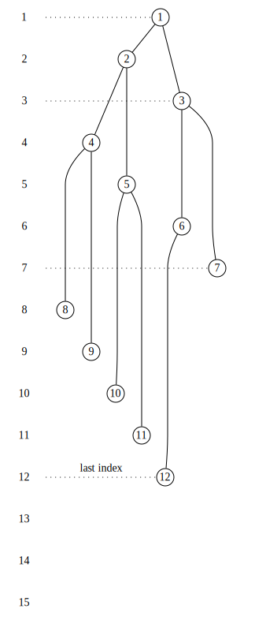

[Source](https://edotor.net/?engine=dot?engine=dot#digraph%20TreeArray%20%7B%0A%09%20%20%20%20%2F%2F%20Array%20index%20representation%0A%20%20%20%20subgraph%20cluster_index%20%7B%0A%20%20%20%20%20%20%20%20rankdir%3D%22TB%22%0A%20%20%20%20%20%20%20%20label%3D%22Array%20Index%22%3B%0A%20%20%20%20%20%20%20%20style%3D%22filled%22%3B%0A%0A%0A%20%20%20%20%20%20%20%20%2F%2F%20Index%20nodes%20(invisible%20except%20for%20label)%0A%20%20%20%20%20%20%20%20idx1%20%5Blabel%3D%221%22%2C%20shape%3Dplaintext%5D%3B%0A%20%20%20%20%20%20%20%20idx2%20%5Blabel%3D%222%22%2C%20shape%3Dplaintext%5D%3B%0A%20%20%20%20%20%20%20%20idx3%20%5Blabel%3D%223%22%2C%20shape%3Dplaintext%5D%3B%0A%20%20%20%20%20%20%20%20idx4%20%5Blabel%3D%224%22%2C%20shape%3Dplaintext%5D%3B%0A%20%20%20%20%20%20%20%20idx5%20%5Blabel%3D%225%22%2C%20shape%3Dplaintext%5D%3B%0A%20%20%20%20%20%20%20%20idx6%20%5Blabel%3D%226%22%2C%20shape%3Dplaintext%5D%3B%0A%20%20%20%20%20%20%20%20idx7%20%5Blabel%3D%227%22%2C%20shape%3Dplaintext%5D%3B%0A%20%20%20%20%20%20%20%20idx8%20%5Blabel%3D%228%22%2C%20shape%3Dplaintext%5D%3B%0A%20%20%20%20%20%20%20%20idx9%20%5Blabel%3D%229%22%2C%20shape%3Dplaintext%5D%3B%0A%20%20%20%20%20%20%20%20idx10%20%5Blabel%3D%2210%22%2C%20shape%3Dplaintext%5D%3B%0A%20%20%20%20%20%20%20%20idx11%20%5Blabel%3D%2211%22%2C%20shape%3Dplaintext%5D%3B%0A%20%20%20%20%20%20%20%20idx12%20%5Blabel%3D%2212%22%2C%20shape%3Dplaintext%5D%3B%0A%20%20%20%20%20%20%20%20idx13%20%5Blabel%3D%2213%22%2C%20shape%3Dplaintext%5D%3B%0A%20%20%20%20%20%20%20%20idx14%20%5Blabel%3D%2214%22%2C%20shape%3Dplaintext%5D%3B%0A%20%20%20%20%20%20%20%20idx15%20%5Blabel%3D%2215%22%2C%20shape%3Dplaintext%5D%3B%0A%20%20%20%20%20%20%20%20%0A%20%20%20%20%20%20%20%20%2F%2F%20Index%20grid%20lines%0A%20%20%20%20%20%20%20%20%7B%0A%20%20%20%20%20%20%20%20%20%20%20%20rank%3Dsame%3B%0A%09%09%09%0A%20%20%20%20%20%20%20%20%20%20%20%20idx1%20-%3E%20idx2%20-%3E%20idx3%20-%3E%20idx4%20-%3E%20idx5%20-%3E%20idx6%20-%3E%20idx7%20-%3E%20idx8%20-%3E%20idx9%20-%3E%20idx10%20-%3E%20idx11%20-%3E%20idx12%20-%3E%20idx13%20-%3E%20idx14%20-%3E%20idx15%20%5Bstyle%3Dinvis%5D%3B%20%2F%2F%20%20%0A%20%20%20%20%20%20%20%20%7D%0A%20%20%20%20%7D%0A%0A%20%20%20%20%2F%2F%20Graph%20settings%0A%20%20%20%20rankdir%3DTB%3B%0A%20%20%20%20node%20%5Bshape%3Dcircle%2C%20style%3Dfilled%2C%20fillcolor%3Dwhite%2C%20fixedsize%3Dtrue%2C%20width%3D0.3%5D%3B%0A%20%20%20%20edge%20%5Bdir%3Dnone%5D%3B%0A%20%20%20%20nodesep%3D0.2%3B%0A%20%20%20%20ranksep%3D0.1%3B%0A%20%20%20%20%0A%20%20%20%20%2F%2F%20Tree%20nodes%20and%20connections%0A%20%20%20%20n1%20%5Blabel%3D%221%22%5D%3B%0A%20%20%20%20n2%20%5Blabel%3D%222%22%5D%3B%0A%20%20%20%20n3%20%5Blabel%3D%223%22%5D%3B%0A%20%20%20%20n4%20%5Blabel%3D%224%22%5D%3B%0A%20%20%20%20n5%20%5Blabel%3D%225%22%5D%3B%0A%20%20%20%20n6%20%5Blabel%3D%226%22%5D%3B%0A%20%20%20%20n7%20%5Blabel%3D%227%22%5D%3B%0A%20%20%20%20n8%20%5Blabel%3D%228%22%5D%3B%0A%20%20%20%20n9%20%5Blabel%3D%229%22%5D%3B%0A%20%20%20%20n10%20%5Blabel%3D%2210%22%5D%3B%0A%20%20%20%20n11%20%5Blabel%3D%2211%22%5D%3B%0A%20%20%20%20n12%20%5Blabel%3D%2212%22%5D%3B%0A%20%20%20%20n13%20%5Blabel%3D%2213%22%2C%20style%3Ddashed%5D%3B%0A%20%20%20%20%0A%20%20%20%20%2F%2F%20Tree%20edges%0A%20%20%20%20n1%20-%3E%20n2%3B%0A%20%20%20%20n1%20-%3E%20n3%3B%0A%20%20%20%20n2%20-%3E%20n4%3B%0A%20%20%20%20n2%20-%3E%20n5%3B%0A%20%20%20%20n4%20-%3E%20n8%3B%0A%20%20%20%20n4%20-%3E%20n9%3B%0A%20%20%20%20n5%20-%3E%20n10%3B%0A%20%20%20%20n5%20-%3E%20n11%3B%0A%20%20%20%20n3%20-%3E%20n6%3B%0A%20%20%20%20n3%20-%3E%20n7%3B%0A%20%20%20%20n6%20-%3E%20n12%3B%0A%20%20%20%20n6%20-%3E%20n13%20%5Bstyle%3Dinvis%5D%3B%0A%20%20%20%20n7%20-%3E%20n14%20%5Bstyle%3Dinvis%5D%0A%20%20%20%20n7%20-%3E%20n15%20%5Bstyle%3Dinvis%5D%0A%20%20%20%20%0A%20%20%20%20%0A%20%20%20%20%2F%2F%20Node%20positioning%20with%20invisible%20edges%0A%20%20%20%20%7Brank%3Dsame%3B%20idx1%20-%3E%20n1%20%5Bconstraint%3Dfalse%2C%20style%3Ddotted%5D%3B%7D%0A%20%20%20%20%7Brank%3Dsame%3B%20idx2%20-%3E%20n2%20%5Bstyle%3D%22invis%22%2C%20xlabel%3D%22what%20is%20this%22%20label%3D%222nd%20Level%22%2C%20constraint%3Dfalse%2C%20%5D%3B%7D%0A%20%20%20%20%7Brank%3Dsame%3B%20idx3%20-%3E%20n3%20%5Bconstraint%3Dfalse%2C%20style%3Ddotted%5D%3B%20%7D%0A%20%20%20%20%7Brank%3Dsame%3B%20idx4%3B%20n4%3B%7D%0A%20%20%20%20%7Brank%3Dsame%3B%20idx5%3B%20n5%3B%7D%0A%20%20%20%20%7Brank%3Dsame%3B%20idx6%3B%20n6%3B%7D%0A%20%20%20%20%7Brank%3Dsame%3B%20idx7%20-%3E%20n7%20%5Bconstraint%3Dfalse%2C%20style%3Ddotted%5D%3B%7D%0A%20%20%20%20%7Brank%3Dsame%3B%20idx8%3B%20n8%3B%7D%0A%20%20%20%20%7Brank%3Dsame%3B%20idx9%3B%20n9%3B%7D%0A%20%20%20%20%7Brank%3Dsame%3B%20idx10%3B%20n10%3B%7D%0A%20%20%20%20%7Brank%3Dsame%3B%20idx11%3B%20n11%3B%7D%0A%20%20%20%20%7Brank%3Dsame%3B%20idx12%20-%3E%20n12%20%5Blabel%3D%22last%20index%22%2C%20constraint%3Dfalse%2C%20style%3Ddotted%5D%3B%7D%0A%20%20%20%20%7Brank%3Dsame%3B%20idx13%3B%20n13%20%5Bstyle%3Dinvis%5D%3B%7D%0A%20%20%20%20%7Brank%3Dsame%3B%20idx14%3B%20n14%20%5Bstyle%3Dinvis%5D%7D%0A%20%20%20%20%7Brank%3Dsame%3B%20idx15%3B%20n15%20%5Bstyle%3Dinvis%5D%7D%0A%20%20%20%20%0A%20%20%20%20%0A%7D%0A)

#### Figure 16.4 The mapping of a 12-item heap onto an internal array. 


For a complete tree, the breadth-first mapping of its nodes onto the array items looks like the one in Figure 16.4.
The items line up nicely, from position 1 through the position corresponding to the rightmost node in the bottom layer, 
with no holes.
This allows us to keep track of the last array index associated with the heap. 

An immediate advantage of this improvement is that we can do a meaningful is_full with heaps: The heap is full if the last index of the heap is equal to the size of the array.
So we redefine the is_full from the implementation that we inherited from BINARY_TREE_ARRAY to the more precise one that uses the new private feature last_index (Listing 16.3). 

Let us now attend to insert.
We know that after the insertion, the heap will extend to position last_index+1, as shown in Figure 16.5 (or it would not be a complete tree anymore). 

The trouble is that if we just drop the new item into position last_index+1, 
we may have a complete tree that is not a heap, since the new item could be “>” 
the item at its parent node.
Well, if that happens, we can exchange them.
In the example in Figure 16.5, we would compare the items in positions 13 and 6, 
and exchange them if they are out of order. 

```Eiffel
deferred class HEAP_EXAMPLE [ITEM -> COMPARABLE]

inherit
	BINARY_TREE_EXAMPLE [ITEM]
	redefine
		is_equal
	end
feature -- Adding, removing, and finding items
	insert (new_item: ITEM)
			-- Insert new_item into this heap.
		require
			not_void: new_item /= Void
			not_full: not is_full
		deferred
		ensure
			size_after_insert: size = old size + 1
		end -- insert

	delete
			-- Delete the root item.
		require
			not_empty: not is_empty
		deferred
		ensure
			size_after_delete: size = old size - 1
		end -- delete
feature -- Sizing
	is_full: BOOLEAN
			-- Is there no room in this heap for another item?
		deferred
		end -- is_full

end -- class HEAP
```
Listing 16.3 The redefinition specifications and features last_index and is_full of class HEAP_ARRAY. 

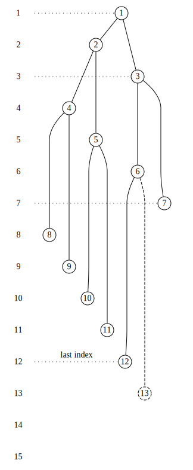

[Source](https://edotor.net/?engine=dot?engine=dot#digraph%20TreeArray%20%7B%0A%09%20%20%20%20%2F%2F%20Array%20index%20representation%0A%20%20%20%20subgraph%20cluster_index%20%7B%0A%20%20%20%20%20%20%20%20rankdir%3D%22TB%22%0A%20%20%20%20%20%20%20%20label%3D%22Array%20Index%22%3B%0A%20%20%20%20%20%20%20%20style%3D%22filled%22%3B%0A%0A%0A%20%20%20%20%20%20%20%20%2F%2F%20Index%20nodes%20(invisible%20except%20for%20label)%0A%20%20%20%20%20%20%20%20idx1%20%5Blabel%3D%221%22%2C%20shape%3Dplaintext%5D%3B%0A%20%20%20%20%20%20%20%20idx2%20%5Blabel%3D%222%22%2C%20shape%3Dplaintext%5D%3B%0A%20%20%20%20%20%20%20%20idx3%20%5Blabel%3D%223%22%2C%20shape%3Dplaintext%5D%3B%0A%20%20%20%20%20%20%20%20idx4%20%5Blabel%3D%224%22%2C%20shape%3Dplaintext%5D%3B%0A%20%20%20%20%20%20%20%20idx5%20%5Blabel%3D%225%22%2C%20shape%3Dplaintext%5D%3B%0A%20%20%20%20%20%20%20%20idx6%20%5Blabel%3D%226%22%2C%20shape%3Dplaintext%5D%3B%0A%20%20%20%20%20%20%20%20idx7%20%5Blabel%3D%227%22%2C%20shape%3Dplaintext%5D%3B%0A%20%20%20%20%20%20%20%20idx8%20%5Blabel%3D%228%22%2C%20shape%3Dplaintext%5D%3B%0A%20%20%20%20%20%20%20%20idx9%20%5Blabel%3D%229%22%2C%20shape%3Dplaintext%5D%3B%0A%20%20%20%20%20%20%20%20idx10%20%5Blabel%3D%2210%22%2C%20shape%3Dplaintext%5D%3B%0A%20%20%20%20%20%20%20%20idx11%20%5Blabel%3D%2211%22%2C%20shape%3Dplaintext%5D%3B%0A%20%20%20%20%20%20%20%20idx12%20%5Blabel%3D%2212%22%2C%20shape%3Dplaintext%5D%3B%0A%20%20%20%20%20%20%20%20idx13%20%5Blabel%3D%2213%22%2C%20shape%3Dplaintext%5D%3B%0A%20%20%20%20%20%20%20%20idx14%20%5Blabel%3D%2214%22%2C%20shape%3Dplaintext%5D%3B%0A%20%20%20%20%20%20%20%20idx15%20%5Blabel%3D%2215%22%2C%20shape%3Dplaintext%5D%3B%0A%20%20%20%20%20%20%20%20%0A%20%20%20%20%20%20%20%20%2F%2F%20Index%20grid%20lines%0A%20%20%20%20%20%20%20%20%7B%0A%20%20%20%20%20%20%20%20%20%20%20%20rank%3Dsame%3B%0A%09%09%09%0A%20%20%20%20%20%20%20%20%20%20%20%20idx1%20-%3E%20idx2%20-%3E%20idx3%20-%3E%20idx4%20-%3E%20idx5%20-%3E%20idx6%20-%3E%20idx7%20-%3E%20idx8%20-%3E%20idx9%20-%3E%20idx10%20-%3E%20idx11%20-%3E%20idx12%20-%3E%20idx13%20-%3E%20idx14%20-%3E%20idx15%20%5Bstyle%3Dinvis%5D%3B%20%2F%2F%20%20%0A%20%20%20%20%20%20%20%20%7D%0A%20%20%20%20%7D%0A%0A%20%20%20%20%2F%2F%20Graph%20settings%0A%20%20%20%20rankdir%3DTB%3B%0A%20%20%20%20node%20%5Bshape%3Dcircle%2C%20style%3Dfilled%2C%20fillcolor%3Dwhite%2C%20fixedsize%3Dtrue%2C%20width%3D0.3%5D%3B%0A%20%20%20%20edge%20%5Bdir%3Dnone%5D%3B%0A%20%20%20%20nodesep%3D0.2%3B%0A%20%20%20%20ranksep%3D0.1%3B%0A%20%20%20%20%0A%20%20%20%20%2F%2F%20Tree%20nodes%20and%20connections%0A%20%20%20%20n1%20%5Blabel%3D%221%22%5D%3B%0A%20%20%20%20n2%20%5Blabel%3D%222%22%5D%3B%0A%20%20%20%20n3%20%5Blabel%3D%223%22%5D%3B%0A%20%20%20%20n4%20%5Blabel%3D%224%22%5D%3B%0A%20%20%20%20n5%20%5Blabel%3D%225%22%5D%3B%0A%20%20%20%20n6%20%5Blabel%3D%226%22%5D%3B%0A%20%20%20%20n7%20%5Blabel%3D%227%22%5D%3B%0A%20%20%20%20n8%20%5Blabel%3D%228%22%5D%3B%0A%20%20%20%20n9%20%5Blabel%3D%229%22%5D%3B%0A%20%20%20%20n10%20%5Blabel%3D%2210%22%5D%3B%0A%20%20%20%20n11%20%5Blabel%3D%2211%22%5D%3B%0A%20%20%20%20n12%20%5Blabel%3D%2212%22%5D%3B%0A%20%20%20%20n13%20%5Blabel%3D%2213%22%2C%20style%3Ddashed%5D%3B%0A%20%20%20%20%0A%20%20%20%20%2F%2F%20Tree%20edges%0A%20%20%20%20n1%20-%3E%20n2%3B%0A%20%20%20%20n1%20-%3E%20n3%3B%0A%20%20%20%20n2%20-%3E%20n4%3B%0A%20%20%20%20n2%20-%3E%20n5%3B%0A%20%20%20%20n4%20-%3E%20n8%3B%0A%20%20%20%20n4%20-%3E%20n9%3B%0A%20%20%20%20n5%20-%3E%20n10%3B%0A%20%20%20%20n5%20-%3E%20n11%3B%0A%20%20%20%20n3%20-%3E%20n6%3B%0A%20%20%20%20n3%20-%3E%20n7%3B%0A%20%20%20%20n6%20-%3E%20n12%3B%0A%20%20%20%20n6%20-%3E%20n13%20%5Bstyle%3Ddashed%5D%3B%0A%20%20%20%20n7%20-%3E%20n14%20%5Bstyle%3Dinvis%5D%0A%20%20%20%20n7%20-%3E%20n15%20%5Bstyle%3Dinvis%5D%0A%20%20%20%20%0A%20%20%20%20%0A%20%20%20%20%2F%2F%20Node%20positioning%20with%20invisible%20edges%0A%20%20%20%20%7Brank%3Dsame%3B%20idx1%20-%3E%20n1%20%5Bconstraint%3Dfalse%2C%20style%3Ddotted%5D%3B%7D%0A%20%20%20%20%7Brank%3Dsame%3B%20idx2%20-%3E%20n2%20%5Bstyle%3D%22invis%22%2C%20xlabel%3D%22what%20is%20this%22%20label%3D%222nd%20Level%22%2C%20constraint%3Dfalse%2C%20%5D%3B%7D%0A%20%20%20%20%7Brank%3Dsame%3B%20idx3%20-%3E%20n3%20%5Bconstraint%3Dfalse%2C%20style%3Ddotted%5D%3B%20%7D%0A%20%20%20%20%7Brank%3Dsame%3B%20idx4%3B%20n4%3B%7D%0A%20%20%20%20%7Brank%3Dsame%3B%20idx5%3B%20n5%3B%7D%0A%20%20%20%20%7Brank%3Dsame%3B%20idx6%3B%20n6%3B%7D%0A%20%20%20%20%7Brank%3Dsame%3B%20idx7%20-%3E%20n7%20%5Bconstraint%3Dfalse%2C%20style%3Ddotted%5D%3B%7D%0A%20%20%20%20%7Brank%3Dsame%3B%20idx8%3B%20n8%3B%7D%0A%20%20%20%20%7Brank%3Dsame%3B%20idx9%3B%20n9%3B%7D%0A%20%20%20%20%7Brank%3Dsame%3B%20idx10%3B%20n10%3B%7D%0A%20%20%20%20%7Brank%3Dsame%3B%20idx11%3B%20n11%3B%7D%0A%20%20%20%20%7Brank%3Dsame%3B%20idx12%20-%3E%20n12%20%5Blabel%3D%22last%20index%22%2C%20constraint%3Dfalse%2C%20style%3Ddotted%5D%3B%7D%0A%20%20%20%20%7Brank%3Dsame%3B%20idx13%3B%20n13%20%3B%7D%0A%20%20%20%20%7Brank%3Dsame%3B%20idx14%3B%20n14%20%5Bstyle%3Dinvis%5D%7D%0A%20%20%20%20%7Brank%3Dsame%3B%20idx15%3B%20n15%20%5Bstyle%3Dinvis%5D%7D%0A%20%20%20%20%0A%20%20%20%20%0A%7D%0A)

#### Figure 16.5 If there is an insertion, the shape of the resulting heap will extend to position last_index+1. 

That would assure that the subtree rooted at index 6 is a heap.
Since we had a heap before insert started its work, the item that was in position 6 was “>=” its other child (in position 12).
If we swap the items in positions 13 and 6, 
it is because the new item was “>” the item in position 6, so it must also be “>” 
its former sibling in position 12. 

However, if we had to do a swap and put the new item into position 6, we might still not have a heap.
What if the new item is “>” the item in position 3? 
Well, if it is, we swap them.
We keep tumbling the new item up until it either comes to rest below a greater or equal parent, or becomes the root of the whole heap.
This process is illustrated in Figure 16.6. 


a. Into this heap, (Black Belt, Baker) will be added. 


b. Place the new item in the next available complete tree slot. It is “>” its parent’s item, so they will have to be exchanged. 


c. It is “>” its new parent’s item, so they will have to be exchanged. 


d. It is “<=” its new parent’s item, so we are done. 

#### Figure 16.6 Inserting a new item into a heap. (The new item is marked with a black border.) 

This tumbling-up progresses from a leaf toward the root, against the arrows.
In a linked tree, this would be inefficient, but the array representation makes it just as easy to go up as to go down.
If to compute a child’s index we multiply the parent’s index by 2 and then add 1 if it is the right child, then to compute the parent’s index from the child’s index we just divide by 2 and drop the remainder.
In other words, 

```
<parent’s index> := <child’s index>//2 
```

An implementation of insert that uses this technique is provided in Listing 16.4. 

```python
insert (new_item: ITEM)
    -- Insert new_item into this heap.
local
    index: INTEGER
    parent_index: INTEGER
    saved_item: ITEM
do
    -- Start at the end.
    last_index := last_index + 1
    items.put(new_item, last_index)
    
    -- Move it up until it runs into a greater parent.
    from
        index := last_index
        parent_index := index // 2
    invariant
        item_ge_left_child:
            index * 2 <= last_index implies 
                items.item(index) >= items.item(index * 2)
        item_ge_right_child:
            index * 2 + 1 <= last_index implies 
                items.item(index) >= items.item(index * 2 + 1)
    variant
        index
    until
        parent_index < root_index or else items.item(index) <= items.item(parent_index)
    loop
        -- Swap the item with that of the parent node.
        saved_item := items.item(index)
        items.put(items.item(parent_index), index)
        items.put(saved_item, parent_index)
        index := parent_index
        parent_index := index // 2
    end
end -- insert
```
Listing 16.4 Routine insert of class HEAP_ARRAY. 

A similar approach is taken with delete.
The root item is always the one being removed, but it is the last position in the breadth-first traversal that must be vacated.
So we simply move the item from the last position to the root (Figure 16.7a). 

It could be out of place in its new position, so we compare it with its children.
If it is “<” at least one of its children, then it must be swapped.

```plantuml
@startuml
top to bottom direction

object "(Black Belt, Morton)" as morton
object "(Black Belt, Baker)" as baker

object "(Red Belt, Apodaca)" as apodaca
object "(Gren Belt, Wu)" as wu
object "(Gold Belt, Melendez)" as melendez
object "(White Belt, Carter)" as carter
object "(Green Belt, Heldt)" as heldt

object "(Blue Belt, Zalewski)" as zalewski

note to right of zalewski
  Delete
end note

object "(Red Belt, Young)" as young
object "(Blue Belt, Odegaard)" as odegaard
object "(Gold Belt, Morris)" as morris


morton -down-> baker
baker -down-> wu
wu -down-> melendez
wu -down-> carter
baker -down-> apodaca
apodaca -down-> heldt
apodaca -down-> zalewski
morton -down-> young
young -down-> odegaard
young -down-> morris

morton <.. zalewski : replace
@enduml
```
a. The last-indexed item will be moved to the root. 


b. It is “<” at least one of its children, so it must be exchanged with the greater child. 


c. It is “<” at least one of its children, so it must be exchanged with the greater child. 


d. It is “>=” all of its children, so we are done. 

#### Figure 16.7 Deleting the top item from a heap. (The item being moved is marked with a black border.) 

We swap it with the greater of its children 
(because if we swapped it with the lesser one, the lesser one would become the parent of the greater one, violating the heap’s definition of order),
as shown in Figure 16.7b.
We keep tumbling it down the heap (Figure 16.7c) until it finds itself “>=” all of its children (Figure 16.7d). 

The coding of this routine is left as an exercise. 

## 16.3 Heap Sort 

There is a clever sorting algorithm that uses the heap structure to sort the array onto which it is mapped.
It works through a variation of the delete algorithm. 
The idea is simple.
Suppose the whole array of length n was overlaid with a heap, as in Figure 16.8a.
Position 1 is the root of the heap, so it is tracking the greatest item.
In a sorted array, the greatest item belongs in the last position of the array, not the first.
No problem.
We do a delete, thus removing the root item from the heap and making the heap overlay only array positions through  n—1. 

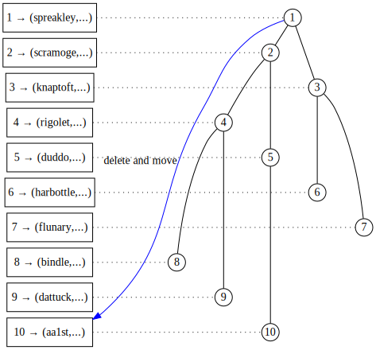
[source](https://edotor.net/?engine=dot?engine=dot?engine=dot#digraph%20TreeArray%20%7B%0A%09%20%20%20%20%2F%2F%20Array%20index%20representation%0A%20%20%20%20subgraph%20cluster_index%20%7B%0A%20%20%20%20%20%20%20%20rankdir%3D%22TB%22%0A%20%20%20%20%20%20%20%20label%3D%22Array%20Index%22%0A%20%20%20%20%20%20%20%20style%3D%22filled%22%0A%20%20%20%20%20%20%20%20node%20%5B%20shape%3Dbox%2C%20width%3D1.5%5D%0A%20%20%20%20%20%20%20%20%0A%20%20%20%20%20%20%20%20%2F%2F%20Index%20nodes%20(invisible%20except%20for%20label)%0A%20%20%20%20%20%20%20%20idx1%20%5Blabel%3D%221%20%E2%86%92%20(spreakley%2C...)%22%5D%0A%20%20%20%20%20%20%20%20idx2%20%5Blabel%3D%222%20%E2%86%92%20(scramoge%2C...)%22%5D%0A%20%20%20%20%20%20%20%20idx3%20%5Blabel%3D%223%20%E2%86%92%20(knaptoft%2C...)%22%5D%0A%20%20%20%20%20%20%20%20idx4%20%5Blabel%3D%224%20%E2%86%92%20(rigolet%2C...)%22%5D%0A%20%20%20%20%20%20%20%20idx5%20%5Blabel%3D%225%20%E2%86%92%20(duddo%2C...)%22%5D%0A%20%20%20%20%20%20%20%20idx6%20%5Blabel%3D%226%20%E2%86%92%20(harbottle%2C...)%22%5D%0A%20%20%20%20%20%20%20%20idx7%20%5Blabel%3D%227%20%E2%86%92%20(flunary%2C...)%22%5D%0A%20%20%20%20%20%20%20%20idx8%20%5Blabel%3D%228%20%E2%86%92%20(bindle%2C...)%22%5D%0A%20%20%20%20%20%20%20%20idx9%20%5Blabel%3D%229%20%E2%86%92%20(dattuck%2C...)%22%5D%0A%20%20%20%20%20%20%20%20idx10%20%5Blabel%3D%2210%20%E2%86%92%20(aa1st%2C...)%22%5D%0A%20%20%20%20%20%20%20%20%0A%20%20%20%20%20%20%20%20%2F%2F%20Index%20grid%20lines%0A%20%20%20%20%20%20%20%20%7B%0A%20%20%20%20%20%20%20%20%20%20%20%20rank%3Dsame%0A%09%09%09%0A%20%20%20%20%20%20%20%20%20%20%20%20idx1%20-%3E%20idx2%20-%3E%20idx3%20-%3E%20idx4%20-%3E%20idx5%20-%3E%20idx6%20-%3E%20idx7%20-%3E%20idx8%20-%3E%20idx9%20-%3E%20idx10%20%5Bstyle%3Dinvis%5D%20%2F%2F%20%20%0A%20%20%20%20%20%20%20%20%7D%0A%20%20%20%20%7D%0A%0A%20%20%20%20%2F%2F%20Graph%20settings%0A%20%20%20%20rankdir%3DTB%0A%20%20%20%20node%20%5Bshape%3Dcircle%2C%20style%3Dfilled%2C%20fillcolor%3Dwhite%2C%20fixedsize%3Dtrue%2C%20width%3D0.3%5D%0A%20%20%20%20edge%20%5Bdir%3Dnone%5D%0A%20%20%20%20nodesep%3D0.4%0A%20%20%20%20ranksep%3D0.1%0A%20%20%20%20%0A%20%20%20%20%2F%2F%20Tree%20nodes%20and%20connections%0A%20%20%20%20n1%20%5Blabel%3D%221%22%5D%0A%20%20%20%20n2%20%5Blabel%3D%222%22%5D%0A%20%20%20%20n3%20%5Blabel%3D%223%22%5D%0A%20%20%20%20n4%20%5Blabel%3D%224%22%5D%0A%20%20%20%20n5%20%5Blabel%3D%225%22%5D%0A%20%20%20%20n6%20%5Blabel%3D%226%22%5D%0A%20%20%20%20n7%20%5Blabel%3D%227%22%5D%0A%20%20%20%20n8%20%5Blabel%3D%228%22%5D%0A%20%20%20%20n9%20%5Blabel%3D%229%22%5D%0A%20%20%20%20n10%20%5Blabel%3D%2210%22%5D%0A%20%20%20%20%0A%20%20%20%20%2F%2F%20Tree%20edges%0A%20%20%20%20n1%20-%3E%20n2%0A%20%20%20%20n1%20-%3E%20n3%0A%20%20%20%20n2%20-%3E%20n4%0A%20%20%20%20n2%20-%3E%20n5%0A%20%20%20%20n4%20-%3E%20n8%0A%20%20%20%20n4%20-%3E%20n9%0A%20%20%20%20n5%20-%3E%20n10%0A%20%20%20%20n3%20-%3E%20n6%0A%20%20%20%20n3%20-%3E%20n7%0A%20%20%20%20%0A%20%20%20%20%0A%20%20%20%20%2F%2F%20Node%20positioning%20with%20invisible%20edges%0A%20%20%20%20%7Brank%3Dsame%20idx1%20-%3E%20n1%20%5Bconstraint%3Dfalse%2C%20style%3Ddotted%5D%7D%0A%20%20%20%20%7Brank%3Dsame%20idx2%20-%3E%20n2%20%5Bconstraint%3Dfalse%2C%20style%3Ddotted%5D%7D%0A%20%20%20%20%7Brank%3Dsame%20idx3%20-%3E%20n3%20%5Bconstraint%3Dfalse%2C%20style%3Ddotted%5D%7D%0A%20%20%20%20%7Brank%3Dsame%20idx4%20-%3E%20n4%20%5Bconstraint%3Dfalse%2C%20style%3Ddotted%5D%7D%0A%20%20%20%20%7Brank%3Dsame%20idx5%20-%3E%20n5%20%5Bconstraint%3Dfalse%2C%20style%3Ddotted%5D%7D%0A%20%20%20%20%7Brank%3Dsame%20idx6%20-%3E%20n6%20%5Bconstraint%3Dfalse%2C%20style%3Ddotted%5D%7D%0A%20%20%20%20%7Brank%3Dsame%20idx7%20-%3E%20n7%20%5Bconstraint%3Dfalse%2C%20style%3Ddotted%5D%7D%0A%20%20%20%20%7Brank%3Dsame%20idx8%20-%3E%20n8%20%5Bconstraint%3Dfalse%2C%20style%3Ddotted%5D%7D%0A%20%20%20%20%7Brank%3Dsame%20idx9%20-%3E%20n9%20%5Bconstraint%3Dfalse%2C%20style%3Ddotted%5D%7D%0A%20%20%20%20%7Brank%3Dsame%20idx10%20-%3E%20n10%20%5Bconstraint%3Dfalse%2C%20style%3Ddotted%5D%7D%0A%20%20%20%20%0A%7B%20n1%20-%3E%20idx10%20%5B%20xlabel%3D%22delete%20and%20move%22%2C%20color%3Dblue%2C%20constraint%3Dfalse%2C%20dir%3Dright%20%2C%20arrowhead%3Dnormal%2C%20arrowtail%3Dnormal%20%5D%7D%0A%7D%0A)

a. Starting with a 10-item heap, delete and move the deleted item to the newly vacated position 10. 

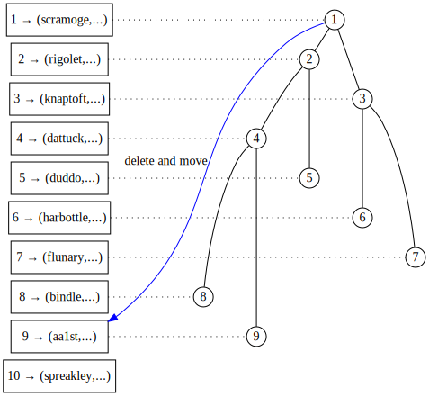
[source](https://edotor.net/?engine=dot?engine=dot?engine=dot?engine=dot#digraph%20TreeArray%20%7B%0A%09%20%20%20%20%2F%2F%20Array%20index%20representation%0A%20%20%20%20subgraph%20cluster_index%20%7B%0A%20%20%20%20%20%20%20%20rankdir%3D%22TB%22%0A%20%20%20%20%20%20%20%20label%3D%22Array%20Index%22%0A%20%20%20%20%20%20%20%20style%3D%22filled%22%0A%20%20%20%20%20%20%20%20node%20%5B%20shape%3Dbox%2C%20width%3D1.5%5D%0A%20%20%20%20%20%20%20%20%0A%20%20%20%20%20%20%20%20%2F%2F%20Index%20nodes%20(invisible%20except%20for%20label)%0A%20%20%20%20%20%20%20%20idx10%20%5Blabel%3D%2210%20%E2%86%92%20(spreakley%2C...)%22%5D%0A%20%20%20%20%20%20%20%20idx1%20%5Blabel%3D%221%20%E2%86%92%20(scramoge%2C...)%22%5D%0A%20%20%20%20%20%20%20%20idx3%20%5Blabel%3D%223%20%E2%86%92%20(knaptoft%2C...)%22%5D%0A%20%20%20%20%20%20%20%20idx2%20%5Blabel%3D%222%20%E2%86%92%20(rigolet%2C...)%22%5D%0A%20%20%20%20%20%20%20%20idx5%20%5Blabel%3D%225%20%E2%86%92%20(duddo%2C...)%22%5D%0A%20%20%20%20%20%20%20%20idx6%20%5Blabel%3D%226%20%E2%86%92%20(harbottle%2C...)%22%5D%0A%20%20%20%20%20%20%20%20idx7%20%5Blabel%3D%227%20%E2%86%92%20(flunary%2C...)%22%5D%0A%20%20%20%20%20%20%20%20idx8%20%5Blabel%3D%228%20%E2%86%92%20(bindle%2C...)%22%5D%0A%20%20%20%20%20%20%20%20idx4%20%5Blabel%3D%224%20%E2%86%92%20(dattuck%2C...)%22%5D%0A%20%20%20%20%20%20%20%20idx9%20%5Blabel%3D%229%20%E2%86%92%20(aa1st%2C...)%22%5D%0A%20%20%20%20%20%20%20%20%0A%20%20%20%20%20%20%20%20%2F%2F%20Index%20grid%20lines%0A%20%20%20%20%20%20%20%20%7B%0A%20%20%20%20%20%20%20%20%20%20%20%20rank%3Dsame%0A%09%09%09%0A%20%20%20%20%20%20%20%20%20%20%20%20idx1%20-%3E%20idx2%20-%3E%20idx3%20-%3E%20idx4%20-%3E%20idx5%20-%3E%20idx6%20-%3E%20idx7%20-%3E%20idx8%20-%3E%20idx9%20-%3E%20idx10%20%5Bstyle%3Dinvis%5D%20%2F%2F%20%20%0A%20%20%20%20%20%20%20%20%7D%0A%20%20%20%20%7D%0A%0A%20%20%20%20%2F%2F%20Graph%20settings%0A%20%20%20%20rankdir%3DTB%0A%20%20%20%20node%20%5Bshape%3Dcircle%2C%20style%3Dfilled%2C%20fillcolor%3Dwhite%2C%20fixedsize%3Dtrue%2C%20width%3D0.3%5D%0A%20%20%20%20edge%20%5Bdir%3Dnone%5D%0A%20%20%20%20nodesep%3D0.4%0A%20%20%20%20ranksep%3D0.1%0A%20%20%20%20%0A%20%20%20%20%2F%2F%20Tree%20nodes%20and%20connections%0A%20%20%20%20n1%20%5Blabel%3D%221%22%5D%0A%20%20%20%20n2%20%5Blabel%3D%222%22%5D%0A%20%20%20%20n3%20%5Blabel%3D%223%22%5D%0A%20%20%20%20n4%20%5Blabel%3D%224%22%5D%0A%20%20%20%20n5%20%5Blabel%3D%225%22%5D%0A%20%20%20%20n6%20%5Blabel%3D%226%22%5D%0A%20%20%20%20n7%20%5Blabel%3D%227%22%5D%0A%20%20%20%20n8%20%5Blabel%3D%228%22%5D%0A%20%20%20%20n9%20%5Blabel%3D%229%22%5D%0A%20%20%20%20n10%20%5Blabel%3D%2210%22%2C%20style%3Dinvis%5D%0A%20%20%20%20%0A%20%20%20%20%2F%2F%20Tree%20edges%0A%20%20%20%20n1%20-%3E%20n2%0A%20%20%20%20n1%20-%3E%20n3%0A%20%20%20%20n2%20-%3E%20n4%0A%20%20%20%20n2%20-%3E%20n5%0A%20%20%20%20n4%20-%3E%20n8%0A%20%20%20%20n4%20-%3E%20n9%0A%20%20%20%20n5%20-%3E%20n10%20%5Bstyle%3Dinvis%5D%0A%20%20%20%20n3%20-%3E%20n6%0A%20%20%20%20n3%20-%3E%20n7%0A%20%20%20%20%0A%20%20%20%20%0A%20%20%20%20%2F%2F%20Node%20positioning%20with%20invisible%20edges%0A%20%20%20%20%7Brank%3Dsame%20idx1%20-%3E%20n1%20%5Bconstraint%3Dfalse%2C%20style%3Ddotted%5D%7D%0A%20%20%20%20%7Brank%3Dsame%20idx2%20-%3E%20n2%20%5Bconstraint%3Dfalse%2C%20style%3Ddotted%5D%7D%0A%20%20%20%20%7Brank%3Dsame%20idx3%20-%3E%20n3%20%5Bconstraint%3Dfalse%2C%20style%3Ddotted%5D%7D%0A%20%20%20%20%7Brank%3Dsame%20idx4%20-%3E%20n4%20%5Bconstraint%3Dfalse%2C%20style%3Ddotted%5D%7D%0A%20%20%20%20%7Brank%3Dsame%20idx5%20-%3E%20n5%20%5Bconstraint%3Dfalse%2C%20style%3Ddotted%5D%7D%0A%20%20%20%20%7Brank%3Dsame%20idx6%20-%3E%20n6%20%5Bconstraint%3Dfalse%2C%20style%3Ddotted%5D%7D%0A%20%20%20%20%7Brank%3Dsame%20idx7%20-%3E%20n7%20%5Bconstraint%3Dfalse%2C%20style%3Ddotted%5D%7D%0A%20%20%20%20%7Brank%3Dsame%20idx8%20-%3E%20n8%20%5Bconstraint%3Dfalse%2C%20style%3Ddotted%5D%7D%0A%20%20%20%20%7Brank%3Dsame%20idx9%20-%3E%20n9%20%5Bconstraint%3Dfalse%2C%20style%3Ddotted%5D%7D%0A%20%20%20%20%7Brank%3Dsame%20idx10%20-%3E%20n10%20%5Bconstraint%3Dfalse%2C%20style%3Dinvis%5D%7D%0A%20%20%20%20%0A%7B%20n1%20-%3E%20idx9%20%5B%20xlabel%3D%22delete%20and%20move%22%2C%20color%3Dblue%2C%20constraint%3Dfalse%2C%20dir%3Dright%20%2C%20arrowhead%3Dnormal%2C%20arrowtail%3Dnormal%20%5D%7D%0A%7D%0A)

b. Again delete and move the deleted item to position 9. 


[source](https://edotor.net/?engine=dot?engine=dot?engine=dot?engine=dot#digraph%20TreeArray%20%7B%0A%09%20%20%20%20%2F%2F%20Array%20index%20representation%0A%20%20%20%20subgraph%20cluster_index%20%7B%0A%20%20%20%20%20%20%20%20rankdir%3D%22TB%22%0A%20%20%20%20%20%20%20%20label%3D%22Array%20Index%22%0A%20%20%20%20%20%20%20%20style%3D%22filled%22%0A%20%20%20%20%20%20%20%20node%20%5B%20shape%3Dbox%2C%20width%3D1.5%5D%0A%20%20%20%20%20%20%20%20%0A%20%20%20%20%20%20%20%20%2F%2F%20Index%20nodes%20(invisible%20except%20for%20label)%0A%20%20%20%20%20%20%20%20idx10%20%5Blabel%3D%2210%20%E2%86%92%20(spreakley%2C...)%22%5D%0A%20%20%20%20%20%20%20%20idx9%20%5Blabel%3D%229%20%E2%86%92%20(scramoge%2C...)%22%5D%0A%20%20%20%20%20%20%20%20idx3%20%5Blabel%3D%223%20%E2%86%92%20(knaptoft%2C...)%22%5D%0A%20%20%20%20%20%20%20%20idx1%20%5Blabel%3D%221%20%E2%86%92%20(rigolet%2C...)%22%5D%0A%20%20%20%20%20%20%20%20idx5%20%5Blabel%3D%225%20%E2%86%92%20(duddo%2C...)%22%5D%0A%20%20%20%20%20%20%20%20idx6%20%5Blabel%3D%226%20%E2%86%92%20(harbottle%2C...)%22%5D%0A%20%20%20%20%20%20%20%20idx7%20%5Blabel%3D%227%20%E2%86%92%20(flunary%2C...)%22%5D%0A%20%20%20%20%20%20%20%20idx4%20%5Blabel%3D%224%20%E2%86%92%20(bindle%2C...)%22%5D%0A%20%20%20%20%20%20%20%20idx2%20%5Blabel%3D%222%20%E2%86%92%20(dattuck%2C...)%22%5D%0A%20%20%20%20%20%20%20%20idx8%20%5Blabel%3D%228%20%E2%86%92%20(aa1st%2C...)%22%5D%0A%20%20%20%20%20%20%20%20%0A%20%20%20%20%20%20%20%20%2F%2F%20Index%20grid%20lines%0A%20%20%20%20%20%20%20%20%7B%0A%20%20%20%20%20%20%20%20%20%20%20%20rank%3Dsame%0A%09%09%09%0A%20%20%20%20%20%20%20%20%20%20%20%20idx1%20-%3E%20idx2%20-%3E%20idx3%20-%3E%20idx4%20-%3E%20idx5%20-%3E%20idx6%20-%3E%20idx7%20-%3E%20idx8%20-%3E%20idx9%20-%3E%20idx10%20%5Bstyle%3Dinvis%5D%20%2F%2F%20%20%0A%20%20%20%20%20%20%20%20%7D%0A%20%20%20%20%7D%0A%0A%20%20%20%20%2F%2F%20Graph%20settings%0A%20%20%20%20rankdir%3DTB%0A%20%20%20%20node%20%5Bshape%3Dcircle%2C%20style%3Dfilled%2C%20fillcolor%3Dwhite%2C%20fixedsize%3Dtrue%2C%20width%3D0.3%5D%0A%20%20%20%20edge%20%5Bdir%3Dnone%5D%0A%20%20%20%20nodesep%3D0.4%0A%20%20%20%20ranksep%3D0.1%0A%20%20%20%20%0A%20%20%20%20%2F%2F%20Tree%20nodes%20and%20connections%0A%20%20%20%20n1%20%5Blabel%3D%221%22%5D%0A%20%20%20%20n2%20%5Blabel%3D%222%22%5D%0A%20%20%20%20n3%20%5Blabel%3D%223%22%5D%0A%20%20%20%20n4%20%5Blabel%3D%224%22%5D%0A%20%20%20%20n5%20%5Blabel%3D%225%22%5D%0A%20%20%20%20n6%20%5Blabel%3D%226%22%5D%0A%20%20%20%20n7%20%5Blabel%3D%227%22%5D%0A%20%20%20%20n8%20%5Blabel%3D%228%22%5D%0A%20%20%20%20n9%20%5Blabel%3D%229%22%2C%20style%3Dinvis%5D%0A%20%20%20%20n10%20%5Blabel%3D%2210%22%2C%20style%3Dinvis%5D%0A%20%20%20%20%0A%20%20%20%20%2F%2F%20Tree%20edges%0A%20%20%20%20n1%20-%3E%20n2%0A%20%20%20%20n1%20-%3E%20n3%0A%20%20%20%20n2%20-%3E%20n4%0A%20%20%20%20n2%20-%3E%20n5%0A%20%20%20%20n4%20-%3E%20n8%0A%20%20%20%20n4%20-%3E%20n9%20%5Bstyle%3Dinvis%5D%0A%20%20%20%20n5%20-%3E%20n10%20%5Bstyle%3Dinvis%5D%0A%20%20%20%20n3%20-%3E%20n6%0A%20%20%20%20n3%20-%3E%20n7%0A%20%20%20%20%0A%20%20%20%20%0A%20%20%20%20%2F%2F%20Node%20positioning%20with%20invisible%20edges%0A%20%20%20%20%7Brank%3Dsame%20idx1%20-%3E%20n1%20%5Bconstraint%3Dfalse%2C%20style%3Ddotted%5D%7D%0A%20%20%20%20%7Brank%3Dsame%20idx2%20-%3E%20n2%20%5Bconstraint%3Dfalse%2C%20style%3Ddotted%5D%7D%0A%20%20%20%20%7Brank%3Dsame%20idx3%20-%3E%20n3%20%5Bconstraint%3Dfalse%2C%20style%3Ddotted%5D%7D%0A%20%20%20%20%7Brank%3Dsame%20idx4%20-%3E%20n4%20%5Bconstraint%3Dfalse%2C%20style%3Ddotted%5D%7D%0A%20%20%20%20%7Brank%3Dsame%20idx5%20-%3E%20n5%20%5Bconstraint%3Dfalse%2C%20style%3Ddotted%5D%7D%0A%20%20%20%20%7Brank%3Dsame%20idx6%20-%3E%20n6%20%5Bconstraint%3Dfalse%2C%20style%3Ddotted%5D%7D%0A%20%20%20%20%7Brank%3Dsame%20idx7%20-%3E%20n7%20%5Bconstraint%3Dfalse%2C%20style%3Ddotted%5D%7D%0A%20%20%20%20%7Brank%3Dsame%20idx8%20-%3E%20n8%20%5Bconstraint%3Dfalse%2C%20style%3Ddotted%5D%7D%0A%20%20%20%20%7Brank%3Dsame%20idx9%20-%3E%20n9%20%5Bconstraint%3Dfalse%2C%20style%3Dinvis%5D%7D%0A%20%20%20%20%7Brank%3Dsame%20idx10%20-%3E%20n10%20%5Bconstraint%3Dfalse%2C%20style%3Dinvis%5D%7D%0A%20%20%20%20%0A%7B%20n1%20-%3E%20idx8%20%5B%20xlabel%3D%22delete%20and%20move%22%2C%20color%3Dblue%2C%20constraint%3Dfalse%2C%20dir%3Dright%20%2C%20arrowhead%3Dnormal%2C%20arrowtail%3Dnormal%20%5D%7D%0A%7D%0A)
c. Move the next deleted item to position 8. 

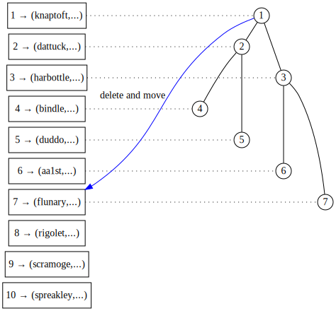
[source](https://edotor.net/?engine=dot?engine=dot?engine=dot?engine=dot#digraph%20TreeArray%20%7B%0A%09%20%20%20%20%2F%2F%20Array%20index%20representation%0A%20%20%20%20subgraph%20cluster_index%20%7B%0A%20%20%20%20%20%20%20%20rankdir%3D%22TB%22%0A%20%20%20%20%20%20%20%20label%3D%22Array%20Index%22%0A%20%20%20%20%20%20%20%20style%3D%22filled%22%0A%20%20%20%20%20%20%20%20node%20%5B%20shape%3Dbox%2C%20width%3D1.5%5D%0A%20%20%20%20%20%20%20%20%0A%20%20%20%20%20%20%20%20%2F%2F%20Index%20nodes%20(invisible%20except%20for%20label)%0A%20%20%20%20%20%20%20%20idx10%20%5Blabel%3D%2210%20%E2%86%92%20(spreakley%2C...)%22%5D%0A%20%20%20%20%20%20%20%20idx9%20%5Blabel%3D%229%20%E2%86%92%20(scramoge%2C...)%22%5D%0A%20%20%20%20%20%20%20%20idx1%20%5Blabel%3D%221%20%E2%86%92%20(knaptoft%2C...)%22%5D%0A%20%20%20%20%20%20%20%20idx8%20%5Blabel%3D%228%20%E2%86%92%20(rigolet%2C...)%22%5D%0A%20%20%20%20%20%20%20%20idx5%20%5Blabel%3D%225%20%E2%86%92%20(duddo%2C...)%22%5D%0A%20%20%20%20%20%20%20%20idx3%20%5Blabel%3D%223%20%E2%86%92%20(harbottle%2C...)%22%5D%0A%20%20%20%20%20%20%20%20idx7%20%5Blabel%3D%227%20%E2%86%92%20(flunary%2C...)%22%5D%0A%20%20%20%20%20%20%20%20idx4%20%5Blabel%3D%224%20%E2%86%92%20(bindle%2C...)%22%5D%0A%20%20%20%20%20%20%20%20idx2%20%5Blabel%3D%222%20%E2%86%92%20(dattuck%2C...)%22%5D%0A%20%20%20%20%20%20%20%20idx6%20%5Blabel%3D%226%20%E2%86%92%20(aa1st%2C...)%22%5D%0A%20%20%20%20%20%20%20%20%0A%20%20%20%20%20%20%20%20%2F%2F%20Index%20grid%20lines%0A%20%20%20%20%20%20%20%20%7B%0A%20%20%20%20%20%20%20%20%20%20%20%20rank%3Dsame%0A%09%09%09%0A%20%20%20%20%20%20%20%20%20%20%20%20idx1%20-%3E%20idx2%20-%3E%20idx3%20-%3E%20idx4%20-%3E%20idx5%20-%3E%20idx6%20-%3E%20idx7%20-%3E%20idx8%20-%3E%20idx9%20-%3E%20idx10%20%5Bstyle%3Dinvis%5D%20%2F%2F%20%20%0A%20%20%20%20%20%20%20%20%7D%0A%20%20%20%20%7D%0A%0A%20%20%20%20%2F%2F%20Graph%20settings%0A%20%20%20%20rankdir%3DTB%0A%20%20%20%20node%20%5Bshape%3Dcircle%2C%20style%3Dfilled%2C%20fillcolor%3Dwhite%2C%20fixedsize%3Dtrue%2C%20width%3D0.3%5D%0A%20%20%20%20edge%20%5Bdir%3Dnone%5D%0A%20%20%20%20nodesep%3D0.4%0A%20%20%20%20ranksep%3D0.1%0A%20%20%20%20%0A%20%20%20%20%2F%2F%20Tree%20nodes%20and%20connections%0A%20%20%20%20n1%20%5Blabel%3D%221%22%5D%0A%20%20%20%20n2%20%5Blabel%3D%222%22%5D%0A%20%20%20%20n3%20%5Blabel%3D%223%22%5D%0A%20%20%20%20n4%20%5Blabel%3D%224%22%5D%0A%20%20%20%20n5%20%5Blabel%3D%225%22%5D%0A%20%20%20%20n6%20%5Blabel%3D%226%22%5D%0A%20%20%20%20n7%20%5Blabel%3D%227%22%5D%0A%20%20%20%20n8%20%5Blabel%3D%228%22%2C%20style%3Dinvis%5D%0A%20%20%20%20n9%20%5Blabel%3D%229%22%2C%20style%3Dinvis%5D%0A%20%20%20%20n10%20%5Blabel%3D%2210%22%2C%20style%3Dinvis%5D%0A%20%20%20%20%0A%20%20%20%20%2F%2F%20Tree%20edges%0A%20%20%20%20n1%20-%3E%20n2%0A%20%20%20%20n1%20-%3E%20n3%0A%20%20%20%20n2%20-%3E%20n4%0A%20%20%20%20n2%20-%3E%20n5%0A%20%20%20%20n4%20-%3E%20n8%20%5Bstyle%3Dinvis%5D%0A%20%20%20%20n4%20-%3E%20n9%20%5Bstyle%3Dinvis%5D%0A%20%20%20%20n5%20-%3E%20n10%20%5Bstyle%3Dinvis%5D%0A%20%20%20%20n3%20-%3E%20n6%0A%20%20%20%20n3%20-%3E%20n7%0A%20%20%20%20%0A%20%20%20%20%0A%20%20%20%20%2F%2F%20Node%20positioning%20with%20invisible%20edges%0A%20%20%20%20%7Brank%3Dsame%20idx1%20-%3E%20n1%20%5Bconstraint%3Dfalse%2C%20style%3Ddotted%5D%7D%0A%20%20%20%20%7Brank%3Dsame%20idx2%20-%3E%20n2%20%5Bconstraint%3Dfalse%2C%20style%3Ddotted%5D%7D%0A%20%20%20%20%7Brank%3Dsame%20idx3%20-%3E%20n3%20%5Bconstraint%3Dfalse%2C%20style%3Ddotted%5D%7D%0A%20%20%20%20%7Brank%3Dsame%20idx4%20-%3E%20n4%20%5Bconstraint%3Dfalse%2C%20style%3Ddotted%5D%7D%0A%20%20%20%20%7Brank%3Dsame%20idx5%20-%3E%20n5%20%5Bconstraint%3Dfalse%2C%20style%3Ddotted%5D%7D%0A%20%20%20%20%7Brank%3Dsame%20idx6%20-%3E%20n6%20%5Bconstraint%3Dfalse%2C%20style%3Ddotted%5D%7D%0A%20%20%20%20%7Brank%3Dsame%20idx7%20-%3E%20n7%20%5Bconstraint%3Dfalse%2C%20style%3Ddotted%5D%7D%0A%20%20%20%20%7Brank%3Dsame%20idx8%20-%3E%20n8%20%5Bconstraint%3Dfalse%2C%20style%3Dinvis%5D%7D%0A%20%20%20%20%7Brank%3Dsame%20idx9%20-%3E%20n9%20%5Bconstraint%3Dfalse%2C%20style%3Dinvis%5D%7D%0A%20%20%20%20%7Brank%3Dsame%20idx10%20-%3E%20n10%20%5Bconstraint%3Dfalse%2C%20style%3Dinvis%5D%7D%0A%20%20%20%20%0A%7B%20n1%20-%3E%20idx7%20%5B%20xlabel%3D%22delete%20and%20move%22%2C%20color%3Dblue%2C%20constraint%3Dfalse%2C%20dir%3Dright%20%2C%20arrowhead%3Dnormal%2C%20arrowtail%3Dnormal%20%5D%7D%0A%7D%0A)

d. ... to position 7. 

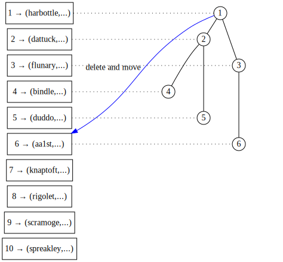
[source](https://edotor.net/?engine=dot?engine=dot?engine=dot?engine=dot#digraph%20TreeArray%20%7B%0A%09%20%20%20%20%2F%2F%20Array%20index%20representation%0A%20%20%20%20subgraph%20cluster_index%20%7B%0A%20%20%20%20%20%20%20%20rankdir%3D%22TB%22%0A%20%20%20%20%20%20%20%20label%3D%22Array%20Index%22%0A%20%20%20%20%20%20%20%20style%3D%22filled%22%0A%20%20%20%20%20%20%20%20node%20%5B%20shape%3Dbox%2C%20width%3D1.5%5D%0A%20%20%20%20%20%20%20%20%0A%20%20%20%20%20%20%20%20%2F%2F%20Index%20nodes%20(invisible%20except%20for%20label)%0A%20%20%20%20%20%20%20%20idx10%20%5Blabel%3D%2210%20%E2%86%92%20(spreakley%2C...)%22%5D%0A%20%20%20%20%20%20%20%20idx9%20%5Blabel%3D%229%20%E2%86%92%20(scramoge%2C...)%22%5D%0A%20%20%20%20%20%20%20%20idx7%20%5Blabel%3D%227%20%E2%86%92%20(knaptoft%2C...)%22%5D%0A%20%20%20%20%20%20%20%20idx8%20%5Blabel%3D%228%20%E2%86%92%20(rigolet%2C...)%22%5D%0A%20%20%20%20%20%20%20%20idx5%20%5Blabel%3D%225%20%E2%86%92%20(duddo%2C...)%22%5D%0A%20%20%20%20%20%20%20%20idx1%20%5Blabel%3D%221%20%E2%86%92%20(harbottle%2C...)%22%5D%0A%20%20%20%20%20%20%20%20idx3%20%5Blabel%3D%223%20%E2%86%92%20(flunary%2C...)%22%5D%0A%20%20%20%20%20%20%20%20idx4%20%5Blabel%3D%224%20%E2%86%92%20(bindle%2C...)%22%5D%0A%20%20%20%20%20%20%20%20idx2%20%5Blabel%3D%222%20%E2%86%92%20(dattuck%2C...)%22%5D%0A%20%20%20%20%20%20%20%20idx6%20%5Blabel%3D%226%20%E2%86%92%20(aa1st%2C...)%22%5D%0A%20%20%20%20%20%20%20%20%0A%20%20%20%20%20%20%20%20%2F%2F%20Index%20grid%20lines%0A%20%20%20%20%20%20%20%20%7B%0A%20%20%20%20%20%20%20%20%20%20%20%20rank%3Dsame%0A%09%09%09%0A%20%20%20%20%20%20%20%20%20%20%20%20idx1%20-%3E%20idx2%20-%3E%20idx3%20-%3E%20idx4%20-%3E%20idx5%20-%3E%20idx6%20-%3E%20idx7%20-%3E%20idx8%20-%3E%20idx9%20-%3E%20idx10%20%5Bstyle%3Dinvis%5D%20%2F%2F%20%20%0A%20%20%20%20%20%20%20%20%7D%0A%20%20%20%20%7D%0A%0A%20%20%20%20%2F%2F%20Graph%20settings%0A%20%20%20%20rankdir%3DTB%0A%20%20%20%20node%20%5Bshape%3Dcircle%2C%20style%3Dfilled%2C%20fillcolor%3Dwhite%2C%20fixedsize%3Dtrue%2C%20width%3D0.3%5D%0A%20%20%20%20edge%20%5Bdir%3Dnone%5D%0A%20%20%20%20nodesep%3D0.4%0A%20%20%20%20ranksep%3D0.1%0A%20%20%20%20%0A%20%20%20%20%2F%2F%20Tree%20nodes%20and%20connections%0A%20%20%20%20n1%20%5Blabel%3D%221%22%5D%0A%20%20%20%20n2%20%5Blabel%3D%222%22%5D%0A%20%20%20%20n3%20%5Blabel%3D%223%22%5D%0A%20%20%20%20n4%20%5Blabel%3D%224%22%5D%0A%20%20%20%20n5%20%5Blabel%3D%225%22%5D%0A%20%20%20%20n6%20%5Blabel%3D%226%22%5D%0A%20%20%20%20n7%20%5Blabel%3D%227%22%2C%20style%3Dinvis%5D%0A%20%20%20%20n8%20%5Blabel%3D%228%22%2C%20style%3Dinvis%5D%0A%20%20%20%20n9%20%5Blabel%3D%229%22%2C%20style%3Dinvis%5D%0A%20%20%20%20n10%20%5Blabel%3D%2210%22%2C%20style%3Dinvis%5D%0A%20%20%20%20%0A%20%20%20%20%2F%2F%20Tree%20edges%0A%20%20%20%20n1%20-%3E%20n2%0A%20%20%20%20n1%20-%3E%20n3%0A%20%20%20%20n2%20-%3E%20n4%0A%20%20%20%20n2%20-%3E%20n5%0A%20%20%20%20n4%20-%3E%20n8%20%5Bstyle%3Dinvis%5D%0A%20%20%20%20n4%20-%3E%20n9%20%5Bstyle%3Dinvis%5D%0A%20%20%20%20n5%20-%3E%20n10%20%5Bstyle%3Dinvis%5D%0A%20%20%20%20n3%20-%3E%20n6%20%0A%20%20%20%20n3%20-%3E%20n7%20%5Bstyle%3Dinvis%5D%0A%20%20%20%20%0A%20%20%20%20%0A%20%20%20%20%2F%2F%20Node%20positioning%20with%20invisible%20edges%0A%20%20%20%20%7Brank%3Dsame%20idx1%20-%3E%20n1%20%5Bconstraint%3Dfalse%2C%20style%3Ddotted%5D%7D%0A%20%20%20%20%7Brank%3Dsame%20idx2%20-%3E%20n2%20%5Bconstraint%3Dfalse%2C%20style%3Ddotted%5D%7D%0A%20%20%20%20%7Brank%3Dsame%20idx3%20-%3E%20n3%20%5Bconstraint%3Dfalse%2C%20style%3Ddotted%5D%7D%0A%20%20%20%20%7Brank%3Dsame%20idx4%20-%3E%20n4%20%5Bconstraint%3Dfalse%2C%20style%3Ddotted%5D%7D%0A%20%20%20%20%7Brank%3Dsame%20idx5%20-%3E%20n5%20%5Bconstraint%3Dfalse%2C%20style%3Ddotted%5D%7D%0A%20%20%20%20%7Brank%3Dsame%20idx6%20-%3E%20n6%20%5Bconstraint%3Dfalse%2C%20style%3Ddotted%5D%7D%0A%20%20%20%20%7Brank%3Dsame%20idx7%20-%3E%20n7%20%5Bconstraint%3Dfalse%2C%20style%3Dinvis%5D%7D%0A%20%20%20%20%7Brank%3Dsame%20idx8%20-%3E%20n8%20%5Bconstraint%3Dfalse%2C%20style%3Dinvis%5D%7D%0A%20%20%20%20%7Brank%3Dsame%20idx9%20-%3E%20n9%20%5Bconstraint%3Dfalse%2C%20style%3Dinvis%5D%7D%0A%20%20%20%20%7Brank%3Dsame%20idx10%20-%3E%20n10%20%5Bconstraint%3Dfalse%2C%20style%3Dinvis%5D%7D%0A%20%20%20%20%0A%7B%20n1%20-%3E%20idx6%20%5B%20xlabel%3D%22delete%20and%20move%22%2C%20color%3Dblue%2C%20constraint%3Dfalse%2C%20dir%3Dright%20%2C%20arrowhead%3Dnormal%2C%20arrowtail%3Dnormal%20%5D%7D%0A%7D%0A)

e. ... to position 6

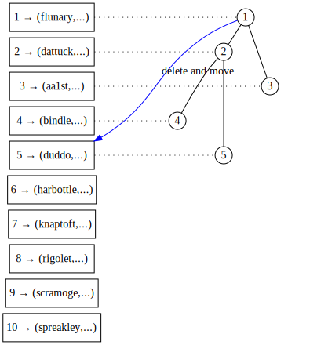
[source](https://edotor.net/?engine=dot?engine=dot?engine=dot?engine=dot#digraph%20TreeArray%20%7B%0A%09%20%20%20%20%2F%2F%20Array%20index%20representation%0A%20%20%20%20subgraph%20cluster_index%20%7B%0A%20%20%20%20%20%20%20%20rankdir%3D%22TB%22%0A%20%20%20%20%20%20%20%20label%3D%22Array%20Index%22%0A%20%20%20%20%20%20%20%20style%3D%22filled%22%0A%20%20%20%20%20%20%20%20node%20%5B%20shape%3Dbox%2C%20width%3D1.5%5D%0A%20%20%20%20%20%20%20%20%0A%20%20%20%20%20%20%20%20%2F%2F%20Index%20nodes%20(invisible%20except%20for%20label)%0A%20%20%20%20%20%20%20%20idx10%20%5Blabel%3D%2210%20%E2%86%92%20(spreakley%2C...)%22%5D%0A%20%20%20%20%20%20%20%20idx9%20%5Blabel%3D%229%20%E2%86%92%20(scramoge%2C...)%22%5D%0A%20%20%20%20%20%20%20%20idx7%20%5Blabel%3D%227%20%E2%86%92%20(knaptoft%2C...)%22%5D%0A%20%20%20%20%20%20%20%20idx8%20%5Blabel%3D%228%20%E2%86%92%20(rigolet%2C...)%22%5D%0A%20%20%20%20%20%20%20%20idx5%20%5Blabel%3D%225%20%E2%86%92%20(duddo%2C...)%22%5D%0A%20%20%20%20%20%20%20%20idx6%20%5Blabel%3D%226%20%E2%86%92%20(harbottle%2C...)%22%5D%0A%20%20%20%20%20%20%20%20idx1%20%5Blabel%3D%221%20%E2%86%92%20(flunary%2C...)%22%5D%0A%20%20%20%20%20%20%20%20idx4%20%5Blabel%3D%224%20%E2%86%92%20(bindle%2C...)%22%5D%0A%20%20%20%20%20%20%20%20idx2%20%5Blabel%3D%222%20%E2%86%92%20(dattuck%2C...)%22%5D%0A%20%20%20%20%20%20%20%20idx3%20%5Blabel%3D%223%20%E2%86%92%20(aa1st%2C...)%22%5D%0A%20%20%20%20%20%20%20%20%0A%20%20%20%20%20%20%20%20%2F%2F%20Index%20grid%20lines%0A%20%20%20%20%20%20%20%20%7B%0A%20%20%20%20%20%20%20%20%20%20%20%20rank%3Dsame%0A%09%09%09%0A%20%20%20%20%20%20%20%20%20%20%20%20idx1%20-%3E%20idx2%20-%3E%20idx3%20-%3E%20idx4%20-%3E%20idx5%20-%3E%20idx6%20-%3E%20idx7%20-%3E%20idx8%20-%3E%20idx9%20-%3E%20idx10%20%5Bstyle%3Dinvis%5D%20%2F%2F%20%20%0A%20%20%20%20%20%20%20%20%7D%0A%20%20%20%20%7D%0A%0A%20%20%20%20%2F%2F%20Graph%20settings%0A%20%20%20%20rankdir%3DTB%0A%20%20%20%20node%20%5Bshape%3Dcircle%2C%20style%3Dfilled%2C%20fillcolor%3Dwhite%2C%20fixedsize%3Dtrue%2C%20width%3D0.3%5D%0A%20%20%20%20edge%20%5Bdir%3Dnone%5D%0A%20%20%20%20nodesep%3D0.4%0A%20%20%20%20ranksep%3D0.1%0A%20%20%20%20%0A%20%20%20%20%2F%2F%20Tree%20nodes%20and%20connections%0A%20%20%20%20n1%20%5Blabel%3D%221%22%5D%0A%20%20%20%20n2%20%5Blabel%3D%222%22%5D%0A%20%20%20%20n3%20%5Blabel%3D%223%22%5D%0A%20%20%20%20n4%20%5Blabel%3D%224%22%5D%0A%20%20%20%20n5%20%5Blabel%3D%225%22%5D%0A%20%20%20%20n6%20%5Blabel%3D%226%22%2C%20style%3Dinvis%5D%0A%20%20%20%20n7%20%5Blabel%3D%227%22%2C%20style%3Dinvis%5D%0A%20%20%20%20n8%20%5Blabel%3D%228%22%2C%20style%3Dinvis%5D%0A%20%20%20%20n9%20%5Blabel%3D%229%22%2C%20style%3Dinvis%5D%0A%20%20%20%20n10%20%5Blabel%3D%2210%22%2C%20style%3Dinvis%5D%0A%20%20%20%20%0A%20%20%20%20%2F%2F%20Tree%20edges%0A%20%20%20%20n1%20-%3E%20n2%0A%20%20%20%20n1%20-%3E%20n3%0A%20%20%20%20n2%20-%3E%20n4%0A%20%20%20%20n2%20-%3E%20n5%0A%20%20%20%20n4%20-%3E%20n8%20%5Bstyle%3Dinvis%5D%0A%20%20%20%20n4%20-%3E%20n9%20%5Bstyle%3Dinvis%5D%0A%20%20%20%20n5%20-%3E%20n10%20%5Bstyle%3Dinvis%5D%0A%20%20%20%20n3%20-%3E%20n6%20%5Bstyle%3Dinvis%5D%0A%20%20%20%20n3%20-%3E%20n7%20%5Bstyle%3Dinvis%5D%0A%20%20%20%20%0A%20%20%20%20%0A%20%20%20%20%2F%2F%20Node%20positioning%20with%20invisible%20edges%0A%20%20%20%20%7Brank%3Dsame%20idx1%20-%3E%20n1%20%5Bconstraint%3Dfalse%2C%20style%3Ddotted%5D%7D%0A%20%20%20%20%7Brank%3Dsame%20idx2%20-%3E%20n2%20%5Bconstraint%3Dfalse%2C%20style%3Ddotted%5D%7D%0A%20%20%20%20%7Brank%3Dsame%20idx3%20-%3E%20n3%20%5Bconstraint%3Dfalse%2C%20style%3Ddotted%5D%7D%0A%20%20%20%20%7Brank%3Dsame%20idx4%20-%3E%20n4%20%5Bconstraint%3Dfalse%2C%20style%3Ddotted%5D%7D%0A%20%20%20%20%7Brank%3Dsame%20idx5%20-%3E%20n5%20%5Bconstraint%3Dfalse%2C%20style%3Ddotted%5D%7D%0A%20%20%20%20%7Brank%3Dsame%20idx6%20-%3E%20n6%20%5Bconstraint%3Dfalse%2C%20style%3Dinvis%5D%7D%0A%20%20%20%20%7Brank%3Dsame%20idx7%20-%3E%20n7%20%5Bconstraint%3Dfalse%2C%20style%3Dinvis%5D%7D%0A%20%20%20%20%7Brank%3Dsame%20idx8%20-%3E%20n8%20%5Bconstraint%3Dfalse%2C%20style%3Dinvis%5D%7D%0A%20%20%20%20%7Brank%3Dsame%20idx9%20-%3E%20n9%20%5Bconstraint%3Dfalse%2C%20style%3Dinvis%5D%7D%0A%20%20%20%20%7Brank%3Dsame%20idx10%20-%3E%20n10%20%5Bconstraint%3Dfalse%2C%20style%3Dinvis%5D%7D%0A%20%20%20%20%0A%7B%20n1%20-%3E%20idx5%20%5B%20xlabel%3D%22delete%20and%20move%22%2C%20color%3Dblue%2C%20constraint%3Dfalse%2C%20dir%3Dright%20%2C%20arrowhead%3Dnormal%2C%20arrowtail%3Dnormal%20%5D%7D%0A%7D%0A)

f. ... to position 5. 

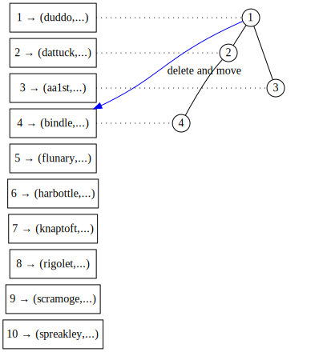
[source](https://edotor.net/?engine=dot?engine=dot?engine=dot?engine=dot#digraph%20TreeArray%20%7B%0A%09%20%20%20%20%2F%2F%20Array%20index%20representation%0A%20%20%20%20subgraph%20cluster_index%20%7B%0A%20%20%20%20%20%20%20%20rankdir%3D%22TB%22%0A%20%20%20%20%20%20%20%20label%3D%22Array%20Index%22%0A%20%20%20%20%20%20%20%20style%3D%22filled%22%0A%20%20%20%20%20%20%20%20node%20%5B%20shape%3Dbox%2C%20width%3D1.5%5D%0A%20%20%20%20%20%20%20%20%0A%20%20%20%20%20%20%20%20%2F%2F%20Index%20nodes%20(invisible%20except%20for%20label)%0A%20%20%20%20%20%20%20%20idx10%20%5Blabel%3D%2210%20%E2%86%92%20(spreakley%2C...)%22%5D%0A%20%20%20%20%20%20%20%20idx9%20%5Blabel%3D%229%20%E2%86%92%20(scramoge%2C...)%22%5D%0A%20%20%20%20%20%20%20%20idx7%20%5Blabel%3D%227%20%E2%86%92%20(knaptoft%2C...)%22%5D%0A%20%20%20%20%20%20%20%20idx8%20%5Blabel%3D%228%20%E2%86%92%20(rigolet%2C...)%22%5D%0A%20%20%20%20%20%20%20%20idx1%20%5Blabel%3D%221%20%E2%86%92%20(duddo%2C...)%22%5D%0A%20%20%20%20%20%20%20%20idx6%20%5Blabel%3D%226%20%E2%86%92%20(harbottle%2C...)%22%5D%0A%20%20%20%20%20%20%20%20idx5%20%5Blabel%3D%225%20%E2%86%92%20(flunary%2C...)%22%5D%0A%20%20%20%20%20%20%20%20idx4%20%5Blabel%3D%224%20%E2%86%92%20(bindle%2C...)%22%5D%0A%20%20%20%20%20%20%20%20idx2%20%5Blabel%3D%222%20%E2%86%92%20(dattuck%2C...)%22%5D%0A%20%20%20%20%20%20%20%20idx3%20%5Blabel%3D%223%20%E2%86%92%20(aa1st%2C...)%22%5D%0A%20%20%20%20%20%20%20%20%0A%20%20%20%20%20%20%20%20%2F%2F%20Index%20grid%20lines%0A%20%20%20%20%20%20%20%20%7B%0A%20%20%20%20%20%20%20%20%20%20%20%20rank%3Dsame%0A%09%09%09%0A%20%20%20%20%20%20%20%20%20%20%20%20idx1%20-%3E%20idx2%20-%3E%20idx3%20-%3E%20idx4%20-%3E%20idx5%20-%3E%20idx6%20-%3E%20idx7%20-%3E%20idx8%20-%3E%20idx9%20-%3E%20idx10%20%5Bstyle%3Dinvis%5D%20%2F%2F%20%20%0A%20%20%20%20%20%20%20%20%7D%0A%20%20%20%20%7D%0A%0A%20%20%20%20%2F%2F%20Graph%20settings%0A%20%20%20%20rankdir%3DTB%0A%20%20%20%20node%20%5Bshape%3Dcircle%2C%20style%3Dfilled%2C%20fillcolor%3Dwhite%2C%20fixedsize%3Dtrue%2C%20width%3D0.3%5D%0A%20%20%20%20edge%20%5Bdir%3Dnone%5D%0A%20%20%20%20nodesep%3D0.4%0A%20%20%20%20ranksep%3D0.1%0A%20%20%20%20%0A%20%20%20%20%2F%2F%20Tree%20nodes%20and%20connections%0A%20%20%20%20n1%20%5Blabel%3D%221%22%5D%0A%20%20%20%20n2%20%5Blabel%3D%222%22%5D%0A%20%20%20%20n3%20%5Blabel%3D%223%22%5D%0A%20%20%20%20n4%20%5Blabel%3D%224%22%5D%0A%20%20%20%20n5%20%5Blabel%3D%225%22%2C%20style%3Dinvis%5D%0A%20%20%20%20n6%20%5Blabel%3D%226%22%2C%20style%3Dinvis%5D%0A%20%20%20%20n7%20%5Blabel%3D%227%22%2C%20style%3Dinvis%5D%0A%20%20%20%20n8%20%5Blabel%3D%228%22%2C%20style%3Dinvis%5D%0A%20%20%20%20n9%20%5Blabel%3D%229%22%2C%20style%3Dinvis%5D%0A%20%20%20%20n10%20%5Blabel%3D%2210%22%2C%20style%3Dinvis%5D%0A%20%20%20%20%0A%20%20%20%20%2F%2F%20Tree%20edges%0A%20%20%20%20n1%20-%3E%20n2%0A%20%20%20%20n1%20-%3E%20n3%0A%20%20%20%20n2%20-%3E%20n4%0A%20%20%20%20n2%20-%3E%20n5%20%5Bstyle%3Dinvis%5D%0A%20%20%20%20n4%20-%3E%20n8%20%5Bstyle%3Dinvis%5D%0A%20%20%20%20n4%20-%3E%20n9%20%5Bstyle%3Dinvis%5D%0A%20%20%20%20n5%20-%3E%20n10%20%5Bstyle%3Dinvis%5D%0A%20%20%20%20n3%20-%3E%20n6%20%5Bstyle%3Dinvis%5D%0A%20%20%20%20n3%20-%3E%20n7%20%5Bstyle%3Dinvis%5D%0A%20%20%20%20%0A%20%20%20%20%0A%20%20%20%20%2F%2F%20Node%20positioning%20with%20invisible%20edges%0A%20%20%20%20%7Brank%3Dsame%20idx1%20-%3E%20n1%20%5Bconstraint%3Dfalse%2C%20style%3Ddotted%5D%7D%0A%20%20%20%20%7Brank%3Dsame%20idx2%20-%3E%20n2%20%5Bconstraint%3Dfalse%2C%20style%3Ddotted%5D%7D%0A%20%20%20%20%7Brank%3Dsame%20idx3%20-%3E%20n3%20%5Bconstraint%3Dfalse%2C%20style%3Ddotted%5D%7D%0A%20%20%20%20%7Brank%3Dsame%20idx4%20-%3E%20n4%20%5Bconstraint%3Dfalse%2C%20style%3Ddotted%5D%7D%0A%20%20%20%20%7Brank%3Dsame%20idx5%20-%3E%20n5%20%5Bconstraint%3Dfalse%2C%20style%3Dinvis%5D%7D%0A%20%20%20%20%7Brank%3Dsame%20idx6%20-%3E%20n6%20%5Bconstraint%3Dfalse%2C%20style%3Dinvis%5D%7D%0A%20%20%20%20%7Brank%3Dsame%20idx7%20-%3E%20n7%20%5Bconstraint%3Dfalse%2C%20style%3Dinvis%5D%7D%0A%20%20%20%20%7Brank%3Dsame%20idx8%20-%3E%20n8%20%5Bconstraint%3Dfalse%2C%20style%3Dinvis%5D%7D%0A%20%20%20%20%7Brank%3Dsame%20idx9%20-%3E%20n9%20%5Bconstraint%3Dfalse%2C%20style%3Dinvis%5D%7D%0A%20%20%20%20%7Brank%3Dsame%20idx10%20-%3E%20n10%20%5Bconstraint%3Dfalse%2C%20style%3Dinvis%5D%7D%0A%20%20%20%20%0A%7B%20n1%20-%3E%20idx4%20%5B%20xlabel%3D%22delete%20and%20move%22%2C%20color%3Dblue%2C%20constraint%3Dfalse%2C%20dir%3Dright%20%2C%20arrowhead%3Dnormal%2C%20arrowtail%3Dnormal%20%5D%7D%0A%7D%0A)
g. ... to position 4. 

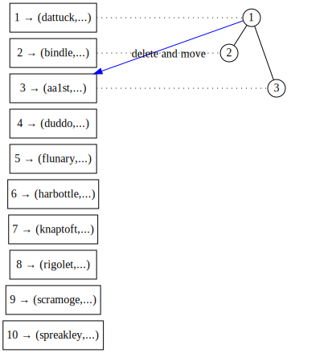
[source](https://edotor.net/?engine=dot?engine=dot?engine=dot?engine=dot#digraph%20TreeArray%20%7B%0A%09%20%20%20%20%2F%2F%20Array%20index%20representation%0A%20%20%20%20subgraph%20cluster_index%20%7B%0A%20%20%20%20%20%20%20%20rankdir%3D%22TB%22%0A%20%20%20%20%20%20%20%20label%3D%22Array%20Index%22%0A%20%20%20%20%20%20%20%20style%3D%22filled%22%0A%20%20%20%20%20%20%20%20node%20%5B%20shape%3Dbox%2C%20width%3D1.5%5D%0A%20%20%20%20%20%20%20%20%0A%20%20%20%20%20%20%20%20%2F%2F%20Index%20nodes%20(invisible%20except%20for%20label)%0A%20%20%20%20%20%20%20%20idx10%20%5Blabel%3D%2210%20%E2%86%92%20(spreakley%2C...)%22%5D%0A%20%20%20%20%20%20%20%20idx9%20%5Blabel%3D%229%20%E2%86%92%20(scramoge%2C...)%22%5D%0A%20%20%20%20%20%20%20%20idx7%20%5Blabel%3D%227%20%E2%86%92%20(knaptoft%2C...)%22%5D%0A%20%20%20%20%20%20%20%20idx8%20%5Blabel%3D%228%20%E2%86%92%20(rigolet%2C...)%22%5D%0A%20%20%20%20%20%20%20%20idx4%20%5Blabel%3D%224%20%E2%86%92%20(duddo%2C...)%22%5D%0A%20%20%20%20%20%20%20%20idx6%20%5Blabel%3D%226%20%E2%86%92%20(harbottle%2C...)%22%5D%0A%20%20%20%20%20%20%20%20idx5%20%5Blabel%3D%225%20%E2%86%92%20(flunary%2C...)%22%5D%0A%20%20%20%20%20%20%20%20idx2%20%5Blabel%3D%222%20%E2%86%92%20(bindle%2C...)%22%5D%0A%20%20%20%20%20%20%20%20idx1%20%5Blabel%3D%221%20%E2%86%92%20(dattuck%2C...)%22%5D%0A%20%20%20%20%20%20%20%20idx3%20%5Blabel%3D%223%20%E2%86%92%20(aa1st%2C...)%22%5D%0A%20%20%20%20%20%20%20%20%0A%20%20%20%20%20%20%20%20%2F%2F%20Index%20grid%20lines%0A%20%20%20%20%20%20%20%20%7B%0A%20%20%20%20%20%20%20%20%20%20%20%20rank%3Dsame%0A%09%09%09%0A%20%20%20%20%20%20%20%20%20%20%20%20idx1%20-%3E%20idx2%20-%3E%20idx3%20-%3E%20idx4%20-%3E%20idx5%20-%3E%20idx6%20-%3E%20idx7%20-%3E%20idx8%20-%3E%20idx9%20-%3E%20idx10%20%5Bstyle%3Dinvis%5D%20%2F%2F%20%20%0A%20%20%20%20%20%20%20%20%7D%0A%20%20%20%20%7D%0A%0A%20%20%20%20%2F%2F%20Graph%20settings%0A%20%20%20%20rankdir%3DTB%0A%20%20%20%20node%20%5Bshape%3Dcircle%2C%20style%3Dfilled%2C%20fillcolor%3Dwhite%2C%20fixedsize%3Dtrue%2C%20width%3D0.3%5D%0A%20%20%20%20edge%20%5Bdir%3Dnone%5D%0A%20%20%20%20nodesep%3D0.4%0A%20%20%20%20ranksep%3D0.1%0A%20%20%20%20%0A%20%20%20%20%2F%2F%20Tree%20nodes%20and%20connections%0A%20%20%20%20n1%20%5Blabel%3D%221%22%5D%0A%20%20%20%20n2%20%5Blabel%3D%222%22%5D%0A%20%20%20%20n3%20%5Blabel%3D%223%22%5D%0A%20%20%20%20n4%20%5Blabel%3D%224%22%2C%20style%3Dinvis%5D%0A%20%20%20%20n5%20%5Blabel%3D%225%22%2C%20style%3Dinvis%5D%0A%20%20%20%20n6%20%5Blabel%3D%226%22%2C%20style%3Dinvis%5D%0A%20%20%20%20n7%20%5Blabel%3D%227%22%2C%20style%3Dinvis%5D%0A%20%20%20%20n8%20%5Blabel%3D%228%22%2C%20style%3Dinvis%5D%0A%20%20%20%20n9%20%5Blabel%3D%229%22%2C%20style%3Dinvis%5D%0A%20%20%20%20n10%20%5Blabel%3D%2210%22%2C%20style%3Dinvis%5D%0A%20%20%20%20%0A%20%20%20%20%2F%2F%20Tree%20edges%0A%20%20%20%20n1%20-%3E%20n2%0A%20%20%20%20n1%20-%3E%20n3%0A%20%20%20%20n2%20-%3E%20n4%20%5Bstyle%3Dinvis%5D%0A%20%20%20%20n2%20-%3E%20n5%20%5Bstyle%3Dinvis%5D%0A%20%20%20%20n4%20-%3E%20n8%20%5Bstyle%3Dinvis%5D%0A%20%20%20%20n4%20-%3E%20n9%20%5Bstyle%3Dinvis%5D%0A%20%20%20%20n5%20-%3E%20n10%20%5Bstyle%3Dinvis%5D%0A%20%20%20%20n3%20-%3E%20n6%20%5Bstyle%3Dinvis%5D%0A%20%20%20%20n3%20-%3E%20n7%20%5Bstyle%3Dinvis%5D%0A%20%20%20%20%0A%20%20%20%20%0A%20%20%20%20%2F%2F%20Node%20positioning%20with%20invisible%20edges%0A%20%20%20%20%7Brank%3Dsame%20idx1%20-%3E%20n1%20%5Bconstraint%3Dfalse%2C%20style%3Ddotted%5D%7D%0A%20%20%20%20%7Brank%3Dsame%20idx2%20-%3E%20n2%20%5Bconstraint%3Dfalse%2C%20style%3Ddotted%5D%7D%0A%20%20%20%20%7Brank%3Dsame%20idx3%20-%3E%20n3%20%5Bconstraint%3Dfalse%2C%20style%3Ddotted%5D%7D%0A%20%20%20%20%7Brank%3Dsame%20idx4%20-%3E%20n4%20%5Bconstraint%3Dfalse%2C%20style%3Dinvis%5D%7D%0A%20%20%20%20%7Brank%3Dsame%20idx5%20-%3E%20n5%20%5Bconstraint%3Dfalse%2C%20style%3Dinvis%5D%7D%0A%20%20%20%20%7Brank%3Dsame%20idx6%20-%3E%20n6%20%5Bconstraint%3Dfalse%2C%20style%3Dinvis%5D%7D%0A%20%20%20%20%7Brank%3Dsame%20idx7%20-%3E%20n7%20%5Bconstraint%3Dfalse%2C%20style%3Dinvis%5D%7D%0A%20%20%20%20%7Brank%3Dsame%20idx8%20-%3E%20n8%20%5Bconstraint%3Dfalse%2C%20style%3Dinvis%5D%7D%0A%20%20%20%20%7Brank%3Dsame%20idx9%20-%3E%20n9%20%5Bconstraint%3Dfalse%2C%20style%3Dinvis%5D%7D%0A%20%20%20%20%7Brank%3Dsame%20idx10%20-%3E%20n10%20%5Bconstraint%3Dfalse%2C%20style%3Dinvis%5D%7D%0A%20%20%20%20%0A%7B%20n1%20-%3E%20idx3%20%5B%20xlabel%3D%22delete%20and%20move%22%2C%20color%3Dblue%2C%20constraint%3Dfalse%2C%20dir%3Dright%20%2C%20arrowhead%3Dnormal%2C%20arrowtail%3Dnormal%20%5D%7D%0A%7D%0A)
h. ... to position 3. 

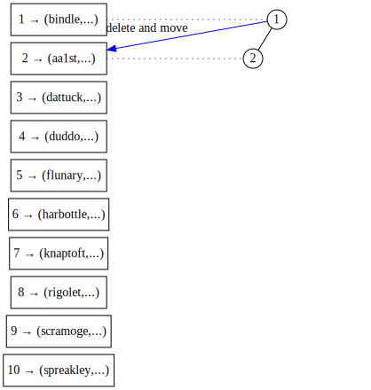
[source](https://edotor.net/?engine=dot?engine=dot?engine=dot?engine=dot#digraph%20TreeArray%20%7B%0A%09%20%20%20%20%2F%2F%20Array%20index%20representation%0A%20%20%20%20subgraph%20cluster_index%20%7B%0A%20%20%20%20%20%20%20%20rankdir%3D%22TB%22%0A%20%20%20%20%20%20%20%20label%3D%22Array%20Index%22%0A%20%20%20%20%20%20%20%20style%3D%22filled%22%0A%20%20%20%20%20%20%20%20node%20%5B%20shape%3Dbox%2C%20width%3D1.5%5D%0A%20%20%20%20%20%20%20%20%0A%20%20%20%20%20%20%20%20%2F%2F%20Index%20nodes%20(invisible%20except%20for%20label)%0A%20%20%20%20%20%20%20%20idx10%20%5Blabel%3D%2210%20%E2%86%92%20(spreakley%2C...)%22%5D%0A%20%20%20%20%20%20%20%20idx9%20%5Blabel%3D%229%20%E2%86%92%20(scramoge%2C...)%22%5D%0A%20%20%20%20%20%20%20%20idx7%20%5Blabel%3D%227%20%E2%86%92%20(knaptoft%2C...)%22%5D%0A%20%20%20%20%20%20%20%20idx8%20%5Blabel%3D%228%20%E2%86%92%20(rigolet%2C...)%22%5D%0A%20%20%20%20%20%20%20%20idx4%20%5Blabel%3D%224%20%E2%86%92%20(duddo%2C...)%22%5D%0A%20%20%20%20%20%20%20%20idx6%20%5Blabel%3D%226%20%E2%86%92%20(harbottle%2C...)%22%5D%0A%20%20%20%20%20%20%20%20idx5%20%5Blabel%3D%225%20%E2%86%92%20(flunary%2C...)%22%5D%0A%20%20%20%20%20%20%20%20idx1%20%5Blabel%3D%221%20%E2%86%92%20(bindle%2C...)%22%5D%0A%20%20%20%20%20%20%20%20idx3%20%5Blabel%3D%223%20%E2%86%92%20(dattuck%2C...)%22%5D%0A%20%20%20%20%20%20%20%20idx2%20%5Blabel%3D%222%20%E2%86%92%20(aa1st%2C...)%22%5D%0A%20%20%20%20%20%20%20%20%0A%20%20%20%20%20%20%20%20%2F%2F%20Index%20grid%20lines%0A%20%20%20%20%20%20%20%20%7B%0A%20%20%20%20%20%20%20%20%20%20%20%20rank%3Dsame%0A%09%09%09%0A%20%20%20%20%20%20%20%20%20%20%20%20idx1%20-%3E%20idx2%20-%3E%20idx3%20-%3E%20idx4%20-%3E%20idx5%20-%3E%20idx6%20-%3E%20idx7%20-%3E%20idx8%20-%3E%20idx9%20-%3E%20idx10%20%5Bstyle%3Dinvis%5D%20%2F%2F%20%20%0A%20%20%20%20%20%20%20%20%7D%0A%20%20%20%20%7D%0A%0A%20%20%20%20%2F%2F%20Graph%20settings%0A%20%20%20%20rankdir%3DTB%0A%20%20%20%20node%20%5Bshape%3Dcircle%2C%20style%3Dfilled%2C%20fillcolor%3Dwhite%2C%20fixedsize%3Dtrue%2C%20width%3D0.3%5D%0A%20%20%20%20edge%20%5Bdir%3Dnone%5D%0A%20%20%20%20nodesep%3D0.4%0A%20%20%20%20ranksep%3D0.1%0A%20%20%20%20%0A%20%20%20%20%2F%2F%20Tree%20nodes%20and%20connections%0A%20%20%20%20n1%20%5Blabel%3D%221%22%5D%0A%20%20%20%20n2%20%5Blabel%3D%222%22%5D%0A%20%20%20%20n3%20%5Blabel%3D%223%22%2C%20style%3Dinvis%5D%0A%20%20%20%20n4%20%5Blabel%3D%224%22%2C%20style%3Dinvis%5D%0A%20%20%20%20n5%20%5Blabel%3D%225%22%2C%20style%3Dinvis%5D%0A%20%20%20%20n6%20%5Blabel%3D%226%22%2C%20style%3Dinvis%5D%0A%20%20%20%20n7%20%5Blabel%3D%227%22%2C%20style%3Dinvis%5D%0A%20%20%20%20n8%20%5Blabel%3D%228%22%2C%20style%3Dinvis%5D%0A%20%20%20%20n9%20%5Blabel%3D%229%22%2C%20style%3Dinvis%5D%0A%20%20%20%20n10%20%5Blabel%3D%2210%22%2C%20style%3Dinvis%5D%0A%20%20%20%20%0A%20%20%20%20%2F%2F%20Tree%20edges%0A%20%20%20%20n1%20-%3E%20n2%0A%20%20%20%20n1%20-%3E%20n3%20%5Bstyle%3Dinvis%5D%0A%20%20%20%20n2%20-%3E%20n4%20%5Bstyle%3Dinvis%5D%0A%20%20%20%20n2%20-%3E%20n5%20%5Bstyle%3Dinvis%5D%0A%20%20%20%20n4%20-%3E%20n8%20%5Bstyle%3Dinvis%5D%0A%20%20%20%20n4%20-%3E%20n9%20%5Bstyle%3Dinvis%5D%0A%20%20%20%20n5%20-%3E%20n10%20%5Bstyle%3Dinvis%5D%0A%20%20%20%20n3%20-%3E%20n6%20%5Bstyle%3Dinvis%5D%0A%20%20%20%20n3%20-%3E%20n7%20%5Bstyle%3Dinvis%5D%0A%20%20%20%20%0A%20%20%20%20%0A%20%20%20%20%2F%2F%20Node%20positioning%20with%20invisible%20edges%0A%20%20%20%20%7Brank%3Dsame%20idx1%20-%3E%20n1%20%5Bconstraint%3Dfalse%2C%20style%3Ddotted%5D%7D%0A%20%20%20%20%7Brank%3Dsame%20idx2%20-%3E%20n2%20%5Bconstraint%3Dfalse%2C%20style%3Ddotted%5D%7D%0A%20%20%20%20%7Brank%3Dsame%20idx3%20-%3E%20n3%20%5Bconstraint%3Dfalse%2C%20style%3Dinvis%5D%7D%0A%20%20%20%20%7Brank%3Dsame%20idx4%20-%3E%20n4%20%5Bconstraint%3Dfalse%2C%20style%3Dinvis%5D%7D%0A%20%20%20%20%7Brank%3Dsame%20idx5%20-%3E%20n5%20%5Bconstraint%3Dfalse%2C%20style%3Dinvis%5D%7D%0A%20%20%20%20%7Brank%3Dsame%20idx6%20-%3E%20n6%20%5Bconstraint%3Dfalse%2C%20style%3Dinvis%5D%7D%0A%20%20%20%20%7Brank%3Dsame%20idx7%20-%3E%20n7%20%5Bconstraint%3Dfalse%2C%20style%3Dinvis%5D%7D%0A%20%20%20%20%7Brank%3Dsame%20idx8%20-%3E%20n8%20%5Bconstraint%3Dfalse%2C%20style%3Dinvis%5D%7D%0A%20%20%20%20%7Brank%3Dsame%20idx9%20-%3E%20n9%20%5Bconstraint%3Dfalse%2C%20style%3Dinvis%5D%7D%0A%20%20%20%20%7Brank%3Dsame%20idx10%20-%3E%20n10%20%5Bconstraint%3Dfalse%2C%20style%3Dinvis%5D%7D%0A%20%20%20%20%0A%7B%20n1%20-%3E%20idx2%20%5B%20xlabel%3D%22delete%20and%20move%22%2C%20color%3Dblue%2C%20constraint%3Dfalse%2C%20dir%3Dright%20%2C%20arrowhead%3Dnormal%2C%20arrowtail%3Dnormal%20%5D%7D%0A%7D%0A)
i. ... to position 2. 

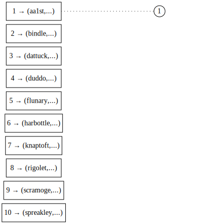
[source](https://edotor.net/?engine=dot?engine=dot?engine=dot?engine=dot#digraph%20TreeArray%20%7B%0A%09%20%20%20%20%2F%2F%20Array%20index%20representation%0A%20%20%20%20subgraph%20cluster_index%20%7B%0A%20%20%20%20%20%20%20%20rankdir%3D%22TB%22%0A%20%20%20%20%20%20%20%20label%3D%22Array%20Index%22%0A%20%20%20%20%20%20%20%20style%3D%22filled%22%0A%20%20%20%20%20%20%20%20node%20%5B%20shape%3Dbox%2C%20width%3D1.5%5D%0A%20%20%20%20%20%20%20%20%0A%20%20%20%20%20%20%20%20%2F%2F%20Index%20nodes%20(invisible%20except%20for%20label)%0A%20%20%20%20%20%20%20%20idx10%20%5Blabel%3D%2210%20%E2%86%92%20(spreakley%2C...)%22%5D%0A%20%20%20%20%20%20%20%20idx9%20%5Blabel%3D%229%20%E2%86%92%20(scramoge%2C...)%22%5D%0A%20%20%20%20%20%20%20%20idx7%20%5Blabel%3D%227%20%E2%86%92%20(knaptoft%2C...)%22%5D%0A%20%20%20%20%20%20%20%20idx8%20%5Blabel%3D%228%20%E2%86%92%20(rigolet%2C...)%22%5D%0A%20%20%20%20%20%20%20%20idx4%20%5Blabel%3D%224%20%E2%86%92%20(duddo%2C...)%22%5D%0A%20%20%20%20%20%20%20%20idx6%20%5Blabel%3D%226%20%E2%86%92%20(harbottle%2C...)%22%5D%0A%20%20%20%20%20%20%20%20idx5%20%5Blabel%3D%225%20%E2%86%92%20(flunary%2C...)%22%5D%0A%20%20%20%20%20%20%20%20idx2%20%5Blabel%3D%222%20%E2%86%92%20(bindle%2C...)%22%5D%0A%20%20%20%20%20%20%20%20idx3%20%5Blabel%3D%223%20%E2%86%92%20(dattuck%2C...)%22%5D%0A%20%20%20%20%20%20%20%20idx1%20%5Blabel%3D%221%20%E2%86%92%20(aa1st%2C...)%22%5D%0A%20%20%20%20%20%20%20%20%0A%20%20%20%20%20%20%20%20%2F%2F%20Index%20grid%20lines%0A%20%20%20%20%20%20%20%20%7B%0A%20%20%20%20%20%20%20%20%20%20%20%20rank%3Dsame%0A%09%09%09%0A%20%20%20%20%20%20%20%20%20%20%20%20idx1%20-%3E%20idx2%20-%3E%20idx3%20-%3E%20idx4%20-%3E%20idx5%20-%3E%20idx6%20-%3E%20idx7%20-%3E%20idx8%20-%3E%20idx9%20-%3E%20idx10%20%5Bstyle%3Dinvis%5D%20%2F%2F%20%20%0A%20%20%20%20%20%20%20%20%7D%0A%20%20%20%20%7D%0A%0A%20%20%20%20%2F%2F%20Graph%20settings%0A%20%20%20%20rankdir%3DTB%0A%20%20%20%20node%20%5Bshape%3Dcircle%2C%20style%3Dfilled%2C%20fillcolor%3Dwhite%2C%20fixedsize%3Dtrue%2C%20width%3D0.3%5D%0A%20%20%20%20edge%20%5Bdir%3Dnone%5D%0A%20%20%20%20nodesep%3D0.4%0A%20%20%20%20ranksep%3D0.1%0A%20%20%20%20%0A%20%20%20%20%2F%2F%20Tree%20nodes%20and%20connections%0A%20%20%20%20n1%20%5Blabel%3D%221%22%5D%0A%20%20%20%20n2%20%5Blabel%3D%222%22%2C%20style%3Dinvis%5D%0A%20%20%20%20n3%20%5Blabel%3D%223%22%2C%20style%3Dinvis%5D%0A%20%20%20%20n4%20%5Blabel%3D%224%22%2C%20style%3Dinvis%5D%0A%20%20%20%20n5%20%5Blabel%3D%225%22%2C%20style%3Dinvis%5D%0A%20%20%20%20n6%20%5Blabel%3D%226%22%2C%20style%3Dinvis%5D%0A%20%20%20%20n7%20%5Blabel%3D%227%22%2C%20style%3Dinvis%5D%0A%20%20%20%20n8%20%5Blabel%3D%228%22%2C%20style%3Dinvis%5D%0A%20%20%20%20n9%20%5Blabel%3D%229%22%2C%20style%3Dinvis%5D%0A%20%20%20%20n10%20%5Blabel%3D%2210%22%2C%20style%3Dinvis%5D%0A%20%20%20%20%0A%20%20%20%20%2F%2F%20Tree%20edges%0A%20%20%20%20n1%20-%3E%20n2%20%5Bstyle%3Dinvis%5D%0A%20%20%20%20n1%20-%3E%20n3%20%5Bstyle%3Dinvis%5D%0A%20%20%20%20n2%20-%3E%20n4%20%5Bstyle%3Dinvis%5D%0A%20%20%20%20n2%20-%3E%20n5%20%5Bstyle%3Dinvis%5D%0A%20%20%20%20n4%20-%3E%20n8%20%5Bstyle%3Dinvis%5D%0A%20%20%20%20n4%20-%3E%20n9%20%5Bstyle%3Dinvis%5D%0A%20%20%20%20n5%20-%3E%20n10%20%5Bstyle%3Dinvis%5D%0A%20%20%20%20n3%20-%3E%20n6%20%5Bstyle%3Dinvis%5D%0A%20%20%20%20n3%20-%3E%20n7%20%5Bstyle%3Dinvis%5D%0A%20%20%20%20%0A%20%20%20%20%0A%20%20%20%20%2F%2F%20Node%20positioning%20with%20invisible%20edges%0A%20%20%20%20%7Brank%3Dsame%20idx1%20-%3E%20n1%20%5Bconstraint%3Dfalse%2C%20style%3Ddotted%5D%7D%0A%20%20%20%20%7Brank%3Dsame%20idx2%20-%3E%20n2%20%5Bconstraint%3Dfalse%2C%20style%3Dinvis%5D%7D%0A%20%20%20%20%7Brank%3Dsame%20idx3%20-%3E%20n3%20%5Bconstraint%3Dfalse%2C%20style%3Dinvis%5D%7D%0A%20%20%20%20%7Brank%3Dsame%20idx4%20-%3E%20n4%20%5Bconstraint%3Dfalse%2C%20style%3Dinvis%5D%7D%0A%20%20%20%20%7Brank%3Dsame%20idx5%20-%3E%20n5%20%5Bconstraint%3Dfalse%2C%20style%3Dinvis%5D%7D%0A%20%20%20%20%7Brank%3Dsame%20idx6%20-%3E%20n6%20%5Bconstraint%3Dfalse%2C%20style%3Dinvis%5D%7D%0A%20%20%20%20%7Brank%3Dsame%20idx7%20-%3E%20n7%20%5Bconstraint%3Dfalse%2C%20style%3Dinvis%5D%7D%0A%20%20%20%20%7Brank%3Dsame%20idx8%20-%3E%20n8%20%5Bconstraint%3Dfalse%2C%20style%3Dinvis%5D%7D%0A%20%20%20%20%7Brank%3Dsame%20idx9%20-%3E%20n9%20%5Bconstraint%3Dfalse%2C%20style%3Dinvis%5D%7D%0A%20%20%20%20%7Brank%3Dsame%20idx10%20-%3E%20n10%20%5Bconstraint%3Dfalse%2C%20style%3Dinvis%5D%7D%0A%20%20%20%20%0A%2F%2F%7B%20n1%20-%3E%20idx1%20%5B%20xlabel%3D%22delete%20and%20move%22%2C%20color%3Dblue%2C%20constraint%3Dfalse%2C%20dir%3Dright%20%2C%20arrowhead%3Dnormal%2C%20arrowtail%3Dnormal%20%5D%7D%0A%7D%0A)
j. The array is fully sorted. 

Figure 16.8 Execution of heap sort on a 10-item array.

sorted region 
The item that was removed from the heap is placed into the newly vacated position n.
That one position is now the sorted region of the array (Figure 16.8b). 

Now the second greatest item of the array is at the root of the heap, in position 1.
We do another delete, moving that item to the newly vacated position n — 1.
Positions 1,...,n — 2 are now representing a heap, and positions n-—1,...,n are sorted (Figure 16.8c). 

This goes on (Figure 16.8d—i) until the heap shrinks to contain just the smallest item of the array (Figure 16.8j),
and the whole array is sorted.
Heap sort is thus very similar to selection sort, except in the latter we had to look for the next greatest item linearly, while in heap sort it is propagated to the root at every step. 

Let us determine the time complexity of this process.
It performs delete O(N) times, so the total sorting time will be roughly the sum of the time each delete takes.
We cannot take for granted that the answer is “N times the complexity of delete,” because the heap shrinks as the sorting progresses, giving delete shorter and shorter trees on which to work. 

So, let us count the steps that the algorithm has to take.
This time, rather than leaving little square bread crumbs at every step, we will just draw an example tree and mark each node with the number of steps it would take to tumble it up to the proper place (since that is the part of delete that varies with the height of the tree). 

Figure 16.9a shows a full tree of height 4 (15 items).
The delete that vacates the last position of the tree (the rightmost position in the bottom level) 
will take up to log 15 (three) swaps (after the former last item is moved to the root).
So we put “log 15” next to that node.
The next delete will vacate the position just to its left, and will take log 14 (still three) swaps in the worst case, so we mark it with a log 14 (Figure 16.9b). 

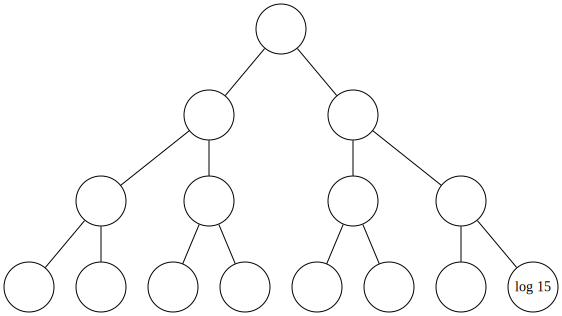
[source](https://edotor.net/?engine=dot#digraph%20BinaryTree%20%7B%0A%20%20%20%20%2F%2F%20Node%20appearance%20settings%0A%20%20%20%20node%20%5Bshape%3Dcircle%2C%20fixedsize%3Dtrue%2C%20width%3D0.7%2C%20style%3Dfilled%2C%20fillcolor%3Dwhite%2C%20color%3Dblack%5D%3B%0A%20%20%20%20%0A%20%20%20%20%2F%2F%20Edge%20appearance%0A%20%20%20%20edge%20%5Barrowhead%3Dnone%5D%3B%0A%20%20%20%20%0A%20%20%20%20%2F%2F%20The%20nodes%20in%20the%20tree%20(using%20level-order%20numbering)%0A%20%20%20%201%20%5Blabel%3D%22%22%5D%3B%0A%20%20%20%202%20%5Blabel%3D%22%22%5D%3B%0A%20%20%20%203%20%5Blabel%3D%22%22%5D%3B%0A%20%20%20%204%20%5Blabel%3D%22%22%5D%3B%0A%20%20%20%205%20%5Blabel%3D%22%22%5D%3B%0A%20%20%20%206%20%5Blabel%3D%22%22%5D%3B%0A%20%20%20%207%20%5Blabel%3D%22%22%5D%3B%0A%20%20%20%208%20%5Blabel%3D%22%22%5D%3B%0A%20%20%20%209%20%5Blabel%3D%22%22%5D%3B%0A%20%20%20%2010%20%5Blabel%3D%22%22%5D%3B%0A%20%20%20%2011%20%5Blabel%3D%22%22%5D%3B%0A%20%20%20%2012%20%5Blabel%3D%22%22%5D%3B%0A%20%20%20%2013%20%5Blabel%3D%22%22%5D%3B%0A%20%20%20%2014%20%5Blabel%3D%22%22%5D%3B%0A%20%20%20%2015%20%5Blabel%3D%22log%2015%22%5D%3B%0A%20%20%20%20%0A%20%20%20%20%2F%2F%20Define%20the%20edges%20connecting%20the%20nodes%0A%20%20%20%201%20-%3E%202%3B%0A%20%20%20%201%20-%3E%203%3B%0A%20%20%20%202%20-%3E%204%3B%0A%20%20%20%202%20-%3E%205%3B%0A%20%20%20%203%20-%3E%206%3B%0A%20%20%20%203%20-%3E%207%3B%0A%20%20%20%204%20-%3E%208%3B%0A%20%20%20%204%20-%3E%209%3B%0A%20%20%20%205%20-%3E%2010%3B%0A%20%20%20%205%20-%3E%2011%3B%0A%20%20%20%206%20-%3E%2012%3B%0A%20%20%20%206%20-%3E%2013%3B%0A%20%20%20%207%20-%3E%2014%3B%0A%20%20%20%207%20-%3E%2015%3B%0A%20%20%20%20%0A%20%20%20%20%2F%2F%20Graph%20layout%20settings%0A%20%20%20%20graph%20%5Bordering%3Dout%2C%20ranksep%3D0.5%2C%20nodesep%3D0.3%5D%3B%0A%7D)
a. With a 15-item heap, delete takes log 15 steps. 

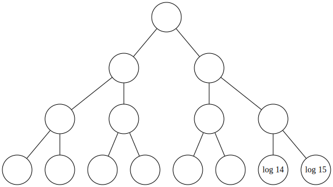
[source](https://edotor.net/?engine=dot#digraph%20BinaryTree%20%7B%0A%20%20%20%20%2F%2F%20Node%20appearance%20settings%0A%20%20%20%20node%20%5Bshape%3Dcircle%2C%20fixedsize%3Dtrue%2C%20width%3D0.7%2C%20style%3Dfilled%2C%20fillcolor%3Dwhite%2C%20color%3Dblack%5D%3B%0A%20%20%20%20%0A%20%20%20%20%2F%2F%20Edge%20appearance%0A%20%20%20%20edge%20%5Barrowhead%3Dnone%5D%3B%0A%20%20%20%20%0A%20%20%20%20%2F%2F%20The%20nodes%20in%20the%20tree%20(using%20level-order%20numbering)%0A%20%20%20%201%20%5Blabel%3D%22%22%5D%3B%0A%20%20%20%202%20%5Blabel%3D%22%22%5D%3B%0A%20%20%20%203%20%5Blabel%3D%22%22%5D%3B%0A%20%20%20%204%20%5Blabel%3D%22%22%5D%3B%0A%20%20%20%205%20%5Blabel%3D%22%22%5D%3B%0A%20%20%20%206%20%5Blabel%3D%22%22%5D%3B%0A%20%20%20%207%20%5Blabel%3D%22%22%5D%3B%0A%20%20%20%208%20%5Blabel%3D%22%22%5D%3B%0A%20%20%20%209%20%5Blabel%3D%22%22%5D%3B%0A%20%20%20%2010%20%5Blabel%3D%22%22%5D%3B%0A%20%20%20%2011%20%5Blabel%3D%22%22%5D%3B%0A%20%20%20%2012%20%5Blabel%3D%22%22%5D%3B%0A%20%20%20%2013%20%5Blabel%3D%22%22%5D%3B%0A%20%20%20%2014%20%5Blabel%3D%22log%2014%22%5D%3B%0A%20%20%20%2015%20%5Blabel%3D%22log%2015%22%5D%3B%0A%20%20%20%20%0A%20%20%20%20%2F%2F%20Define%20the%20edges%20connecting%20the%20nodes%0A%20%20%20%201%20-%3E%202%3B%0A%20%20%20%201%20-%3E%203%3B%0A%20%20%20%202%20-%3E%204%3B%0A%20%20%20%202%20-%3E%205%3B%0A%20%20%20%203%20-%3E%206%3B%0A%20%20%20%203%20-%3E%207%3B%0A%20%20%20%204%20-%3E%208%3B%0A%20%20%20%204%20-%3E%209%3B%0A%20%20%20%205%20-%3E%2010%3B%0A%20%20%20%205%20-%3E%2011%3B%0A%20%20%20%206%20-%3E%2012%3B%0A%20%20%20%206%20-%3E%2013%3B%0A%20%20%20%207%20-%3E%2014%3B%0A%20%20%20%207%20-%3E%2015%3B%0A%20%20%20%20%0A%20%20%20%20%2F%2F%20Graph%20layout%20settings%0A%20%20%20%20graph%20%5Bordering%3Dout%2C%20ranksep%3D0.5%2C%20nodesep%3D0.3%5D%3B%0A%7D)

b. Log 14 more for the smaller heap, etc. 


[source](https://edotor.net/?engine=dot#digraph%20BinaryTree%20%7B%0A%20%20%20%20%2F%2F%20Node%20appearance%20settings%0A%20%20%20%20node%20%5Bshape%3Dcircle%2C%20fixedsize%3Dtrue%2C%20width%3D0.7%2C%20style%3Dfilled%2C%20fillcolor%3Dwhite%2C%20color%3Dblack%5D%3B%0A%20%20%20%20%0A%20%20%20%20%2F%2F%20Edge%20appearance%0A%20%20%20%20edge%20%5Barrowhead%3Dnone%5D%3B%0A%20%20%20%20%0A%20%20%20%20%2F%2F%20The%20nodes%20in%20the%20tree%20(using%20level-order%20numbering)%0A%20%20%20%201%20%5Blabel%3D%22log%201%22%5D%3B%0A%20%20%20%202%20%5Blabel%3D%22log%202%22%5D%3B%0A%20%20%20%203%20%5Blabel%3D%22log%203%22%5D%3B%0A%20%20%20%204%20%5Blabel%3D%22log%204%22%5D%3B%0A%20%20%20%205%20%5Blabel%3D%22log%205%22%5D%3B%0A%20%20%20%206%20%5Blabel%3D%22log%206%22%5D%3B%0A%20%20%20%207%20%5Blabel%3D%22log%207%22%5D%3B%0A%20%20%20%208%20%5Blabel%3D%22log%208%22%5D%3B%0A%20%20%20%209%20%5Blabel%3D%22log%209%22%5D%3B%0A%20%20%20%2010%20%5Blabel%3D%22log%2010%22%5D%3B%0A%20%20%20%2011%20%5Blabel%3D%22log%2011%22%5D%3B%0A%20%20%20%2012%20%5Blabel%3D%22log%2012%22%5D%3B%0A%20%20%20%2013%20%5Blabel%3D%22log%2013%22%5D%3B%0A%20%20%20%2014%20%5Blabel%3D%22log%2014%22%5D%3B%0A%20%20%20%2015%20%5Blabel%3D%22log%2015%22%5D%3B%0A%20%20%20%20%0A%20%20%20%20%2F%2F%20Define%20the%20edges%20connecting%20the%20nodes%0A%20%20%20%201%20-%3E%202%3B%0A%20%20%20%201%20-%3E%203%3B%0A%20%20%20%202%20-%3E%204%3B%0A%20%20%20%202%20-%3E%205%3B%0A%20%20%20%203%20-%3E%206%3B%0A%20%20%20%203%20-%3E%207%3B%0A%20%20%20%204%20-%3E%208%3B%0A%20%20%20%204%20-%3E%209%3B%0A%20%20%20%205%20-%3E%2010%3B%0A%20%20%20%205%20-%3E%2011%3B%0A%20%20%20%206%20-%3E%2012%3B%0A%20%20%20%206%20-%3E%2013%3B%0A%20%20%20%207%20-%3E%2014%3B%0A%20%20%20%207%20-%3E%2015%3B%0A%20%20%20%20%0A%20%20%20%20%2F%2F%20Graph%20layout%20settings%0A%20%20%20%20graph%20%5Bordering%3Dout%2C%20ranksep%3D0.5%2C%20nodesep%3D0.3%5D%3B%0A%7D)

c. At the end, the tally is sum from i =1 to 15 log i. 

#### Figure 16.9 Counting the number of swaps performed by the sorting stage of heap sort. 

This process continues until there is only one item left, which takes no 
effort at all (log 1 = 0),
resulting in Figure 16.9c. 

So, if the heap is of size N, the first deletion will take log N steps.
The remaining heap will be of size N — 1, so the next delete will take log(N — 1) 
steps.
The third deletion will take log(N — 2) and so on, until we get down to the one-item heap, which takes log 1 steps (i.e., zero).
So we need to add all of these up: 

```
log N + log(N — 1) + ... +  log 2 + log 1 
```

or, more compactly, 

```
sum from 1 =1 to N log i i=l 
```

Since the time when we began figuring out algorithm complexities back in Section 6.5, we have used intuitive techniques to count up the steps.
Unfortunately, this case is one where intuition hits a dead end, and rigorous mathematics is needed to determine that this sum is O(N log N). (For a proof, see Herbert S.Wilf’s Algorithms and Complexity [12, Eqs. 1.1.1—1.1.7].) 

### 16.3.1 Building the Heap 

We are not done with the heap sort algorithm yet.
Our discussion started with the words “suppose the whole array was overlaid with a heap.” Well, we cannot just tell our users “Make sure you list the objects to sort in breadth-first heap order!”, can we?
We need a way to convert an array of arbitrarily organized items into a heap. 

One way would be to perform the preceding sorting process in reverse: 
Start with a heap of size 1, then insert the element from position 2 into it, then insert the element from position 3 into it, and so on. 

The time complexity of this operation is 

```
O(log 1+ log 2+ ---+ log(N — 1) + log N) 
```

which is the same as it was for the sorting portion of the algorithm: O(N log N). 
With two consecutive O(N log N) parts, the total time complexity of heap sort is ON log N). 

But there is a faster way to turn the array into a heap.
The algorithm is based on the observation that the reason delete can work in O(log N) time is that the tumbling-down process starts with a structure that is almost a heap already: Both of its subtrees are heaps, we are just not sure if the new root item is in the right place (such a structure is called a “semiheap”).
Thus, when we tumble it down to a spot where it is “>=” both of its children, we know that it is “>=” all items in both subtrees. 

The build-the-heap algorithm works by building little heaps at the bottom of the tree, and then it takes advantage of the fact that two sibling heaps plus their parent form a semiheap.
Then it tumbles the parent down to form a larger heap.
To make this process systematic, it starts at the last nonleaf node in the breadth-first traversal (i.e., the last position in the array that is not a leaf),
and moves backward toward the root of the main heap. 

For example, Figure 16.10a shows an unsorted 10-position array and the complete binary tree structure that overlays it.
Our task is to turn that binary tree into a heap.
The first thing to do is turn the subtree with root at position 5 
into a heap.
That is achieved by tumbling its root down, just as in delete, giving us the tree in Figure 16.10b. 

Then we move on to the tree rooted at position 4, and turn it into a heap by tumbling down its root.
This gives us the tree in Figure 16.10c.
Repeating the process for trees with roots at positions 3-1, we get figures Figure 16.10d-f. 

So what makes this algorithm faster than just inserting N items?
We are looping 7 times (the number of nonleaves in the tree), and doing a delete equivalent at each step.

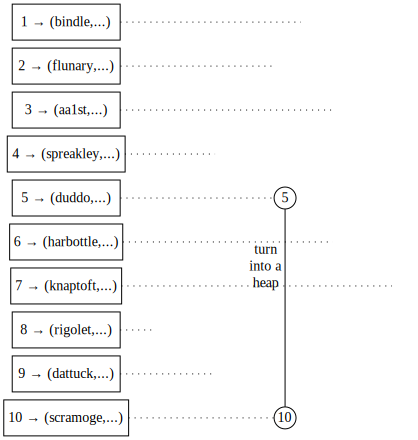
[source](https://edotor.net/?engine=dot?engine=dot?engine=dot?engine=dot?engine=dot#digraph%20TreeArray%20%7B%0A%09%20%20%20%20%2F%2F%20Array%20index%20representation%0A%20%20%20%20subgraph%20cluster_index%20%7B%0A%20%20%20%20%20%20%20%20rankdir%3D%22TB%22%0A%20%20%20%20%20%20%20%20label%3D%22Array%20Index%22%0A%20%20%20%20%20%20%20%20style%3D%22filled%22%0A%20%20%20%20%20%20%20%20node%20%5B%20shape%3Dbox%2C%20width%3D1.5%5D%0A%20%20%20%20%20%20%20%20%0A%20%20%20%20%20%20%20%20%2F%2F%20Index%20nodes%20(invisible%20except%20for%20label)%0A%20%20%20%20%20%20%20%20idx1%20%5Blabel%3D%221%20%E2%86%92%20(bindle%2C...)%22%5D%0A%20%20%20%20%20%20%20%20idx2%20%5Blabel%3D%222%20%E2%86%92%20(flunary%2C...)%22%5D%0A%20%20%20%20%20%20%20%20idx3%20%5Blabel%3D%223%20%E2%86%92%20(aa1st%2C...)%22%5D%0A%20%20%20%20%20%20%20%20idx4%20%5Blabel%3D%224%20%E2%86%92%20(spreakley%2C...)%22%5D%0A%20%20%20%20%20%20%20%20idx5%20%5Blabel%3D%225%20%E2%86%92%20(duddo%2C...)%22%5D%0A%20%20%20%20%20%20%20%20idx6%20%5Blabel%3D%226%20%E2%86%92%20(harbottle%2C...)%22%5D%0A%20%20%20%20%20%20%20%20idx7%20%5Blabel%3D%227%20%E2%86%92%20(knaptoft%2C...)%22%5D%0A%20%20%20%20%20%20%20%20idx8%20%5Blabel%3D%228%20%E2%86%92%20(rigolet%2C...)%22%5D%0A%20%20%20%20%20%20%20%20idx9%20%5Blabel%3D%229%20%E2%86%92%20(dattuck%2C...)%22%5D%0A%20%20%20%20%20%20%20%20idx10%20%5Blabel%3D%2210%20%E2%86%92%20(scramoge%2C...)%22%5D%0A%20%20%20%20%20%20%20%20%0A%20%20%20%20%20%20%20%20%2F%2F%20Index%20grid%20lines%0A%20%20%20%20%20%20%20%20%7B%0A%20%20%20%20%20%20%20%20%20%20%20%20rank%3Dsame%0A%09%09%09%0A%20%20%20%20%20%20%20%20%20%20%20%20idx1%20-%3E%20idx2%20-%3E%20idx3%20-%3E%20idx4%20-%3E%20idx5%20-%3E%20idx6%20-%3E%20idx7%20-%3E%20idx8%20-%3E%20idx9%20-%3E%20idx10%20%5Bstyle%3Dinvis%5D%20%2F%2F%20%20%0A%20%20%20%20%20%20%20%20%7D%0A%20%20%20%20%7D%0A%0A%20%20%20%20%2F%2F%20Graph%20settings%0A%20%20%20%20rankdir%3DTB%0A%20%20%20%20node%20%5Bshape%3Dcircle%2C%20style%3Dfilled%2C%20fillcolor%3Dwhite%2C%20fixedsize%3Dtrue%2C%20width%3D0.3%5D%0A%20%20%20%20edge%20%5Bdir%3Dnone%5D%0A%20%20%20%20nodesep%3D0.4%0A%20%20%20%20ranksep%3D0.1%0A%20%20%20%20%0A%20%20%20%20%2F%2F%20Tree%20nodes%20and%20connections%0A%20%20%20%20n1%20%5Blabel%3D%221%22%2Cstyle%3Dinvis%5D%0A%20%20%20%20n2%20%5Blabel%3D%222%22%2C%20style%3Dinvis%5D%0A%20%20%20%20n3%20%5Blabel%3D%223%22%2C%20style%3Dinvis%5D%0A%20%20%20%20n4%20%5Blabel%3D%224%22%2C%20style%3Dinvis%5D%0A%20%20%20%20n5%20%5Blabel%3D%225%22%5D%0A%20%20%20%20n6%20%5Blabel%3D%226%22%2C%20style%3Dinvis%5D%0A%20%20%20%20n7%20%5Blabel%3D%227%22%2C%20style%3Dinvis%5D%0A%20%20%20%20n8%20%5Blabel%3D%228%22%2C%20style%3Dinvis%5D%0A%20%20%20%20n9%20%5Blabel%3D%229%22%2C%20style%3Dinvis%5D%0A%20%20%20%20n10%20%5Blabel%3D%2210%22%5D%0A%20%20%20%20%0A%20%20%20%20%2F%2F%20Tree%20edges%0A%20%20%20%20n1%20-%3E%20n2%20%5Bstyle%3Dinvis%5D%0A%20%20%20%20n1%20-%3E%20n3%20%5Bstyle%3Dinvis%5D%0A%20%20%20%20n2%20-%3E%20n4%20%5Bstyle%3Dinvis%5D%0A%20%20%20%20n2%20-%3E%20n5%20%5Bstyle%3Dinvis%5D%0A%20%20%20%20n4%20-%3E%20n8%20%5Bstyle%3Dinvis%5D%0A%20%20%20%20n4%20-%3E%20n9%20%5Bstyle%3Dinvis%5D%0A%20%20%20%20n5%20-%3E%20n10%20%5Bxlabel%3D%22turn%20into%20%5Cn%20a%20heap%22%5D%20%0A%20%20%20%20n3%20-%3E%20n6%20%5Bstyle%3Dinvis%5D%0A%20%20%20%20n3%20-%3E%20n7%20%5Bstyle%3Dinvis%5D%0A%20%20%20%20%0A%20%20%20%20%0A%20%20%20%20%2F%2F%20Node%20positioning%20with%20invisible%20edges%0A%20%20%20%20%7Brank%3Dsame%20idx1%20-%3E%20n1%20%5Bconstraint%3Dfalse%2C%20style%3Ddotted%5D%7D%0A%20%20%20%20%7Brank%3Dsame%20idx2%20-%3E%20n2%20%5Bconstraint%3Dfalse%2C%20style%3Ddotted%5D%7D%0A%20%20%20%20%7Brank%3Dsame%20idx3%20-%3E%20n3%20%5Bconstraint%3Dfalse%2C%20style%3Ddotted%5D%7D%0A%20%20%20%20%7Brank%3Dsame%20idx4%20-%3E%20n4%20%5Bconstraint%3Dfalse%2C%20style%3Ddotted%5D%7D%0A%20%20%20%20%7Brank%3Dsame%20idx5%20-%3E%20n5%20%5Bconstraint%3Dfalse%2C%20style%3Ddotted%5D%7D%0A%20%20%20%20%7Brank%3Dsame%20idx6%20-%3E%20n6%20%5Bconstraint%3Dfalse%2C%20style%3Ddotted%5D%7D%0A%20%20%20%20%7Brank%3Dsame%20idx7%20-%3E%20n7%20%5Bconstraint%3Dfalse%2C%20style%3Ddotted%5D%7D%0A%20%20%20%20%7Brank%3Dsame%20idx8%20-%3E%20n8%20%5Bconstraint%3Dfalse%2C%20style%3Ddotted%5D%7D%0A%20%20%20%20%7Brank%3Dsame%20idx9%20-%3E%20n9%20%5Bconstraint%3Dfalse%2C%20style%3Ddotted%5D%7D%0A%20%20%20%20%7Brank%3Dsame%20idx10%20-%3E%20n10%20%5Bconstraint%3Dfalse%2C%20style%3Ddotted%5D%7D%0A%20%20%20%20%0A%7D%0A)
a. Start with the last nonleaf position (position 5). 

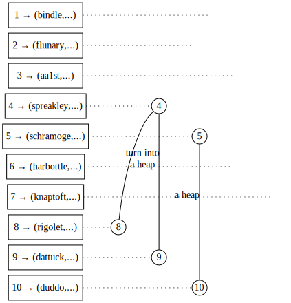
[source](https://edotor.net/?engine=dot?engine=dot?engine=dot?engine=dot?engine=dot#digraph%20TreeArray%20%7B%0A%09%20%20%20%20%2F%2F%20Array%20index%20representation%0A%20%20%20%20subgraph%20cluster_index%20%7B%0A%20%20%20%20%20%20%20%20rankdir%3D%22TB%22%0A%20%20%20%20%20%20%20%20label%3D%22Array%20Index%22%0A%20%20%20%20%20%20%20%20style%3D%22filled%22%0A%20%20%20%20%20%20%20%20node%20%5B%20shape%3Dbox%2C%20width%3D1.5%5D%0A%20%20%20%20%20%20%20%20%0A%20%20%20%20%20%20%20%20%2F%2F%20Index%20nodes%20(invisible%20except%20for%20label)%0A%20%20%20%20%20%20%20%20idx1%20%5Blabel%3D%221%20%E2%86%92%20(bindle%2C...)%22%5D%0A%20%20%20%20%20%20%20%20idx2%20%5Blabel%3D%222%20%E2%86%92%20(flunary%2C...)%22%5D%0A%20%20%20%20%20%20%20%20idx3%20%5Blabel%3D%223%20%E2%86%92%20(aa1st%2C...)%22%5D%0A%20%20%20%20%20%20%20%20idx4%20%5Blabel%3D%224%20%E2%86%92%20(spreakley%2C...)%22%5D%0A%20%20%20%20%20%20%20%20idx5%20%5Blabel%3D%225%20%E2%86%92%20(schramoge%2C...)%22%5D%0A%20%20%20%20%20%20%20%20idx6%20%5Blabel%3D%226%20%E2%86%92%20(harbottle%2C...)%22%5D%0A%20%20%20%20%20%20%20%20idx7%20%5Blabel%3D%227%20%E2%86%92%20(knaptoft%2C...)%22%5D%0A%20%20%20%20%20%20%20%20idx8%20%5Blabel%3D%228%20%E2%86%92%20(rigolet%2C...)%22%5D%0A%20%20%20%20%20%20%20%20idx9%20%5Blabel%3D%229%20%E2%86%92%20(dattuck%2C...)%22%5D%0A%20%20%20%20%20%20%20%20idx10%20%5Blabel%3D%2210%20%E2%86%92%20(duddo%2C...)%22%5D%0A%20%20%20%20%20%20%20%20%0A%20%20%20%20%20%20%20%20%2F%2F%20Index%20grid%20lines%0A%20%20%20%20%20%20%20%20%7B%0A%20%20%20%20%20%20%20%20%20%20%20%20rank%3Dsame%0A%09%09%09%0A%20%20%20%20%20%20%20%20%20%20%20%20idx1%20-%3E%20idx2%20-%3E%20idx3%20-%3E%20idx4%20-%3E%20idx5%20-%3E%20idx6%20-%3E%20idx7%20-%3E%20idx8%20-%3E%20idx9%20-%3E%20idx10%20%5Bstyle%3Dinvis%5D%20%2F%2F%20%20%0A%20%20%20%20%20%20%20%20%7D%0A%20%20%20%20%7D%0A%0A%20%20%20%20%2F%2F%20Graph%20settings%0A%20%20%20%20rankdir%3DTB%0A%20%20%20%20node%20%5Bshape%3Dcircle%2C%20style%3Dfilled%2C%20fillcolor%3Dwhite%2C%20fixedsize%3Dtrue%2C%20width%3D0.3%5D%0A%20%20%20%20edge%20%5Bdir%3Dnone%5D%0A%20%20%20%20nodesep%3D0.4%0A%20%20%20%20ranksep%3D0.1%0A%20%20%20%20%0A%20%20%20%20%2F%2F%20Tree%20nodes%20and%20connections%0A%20%20%20%20n1%20%5Blabel%3D%221%22%2Cstyle%3Dinvis%5D%0A%20%20%20%20n2%20%5Blabel%3D%222%22%2C%20style%3Dinvis%5D%0A%20%20%20%20n3%20%5Blabel%3D%223%22%2C%20style%3Dinvis%5D%0A%20%20%20%20n4%20%5Blabel%3D%224%22%5D%0A%20%20%20%20n5%20%5Blabel%3D%225%22%5D%0A%20%20%20%20n6%20%5Blabel%3D%226%22%2C%20style%3Dinvis%5D%0A%20%20%20%20n7%20%5Blabel%3D%227%22%2C%20style%3Dinvis%5D%0A%20%20%20%20n8%20%5Blabel%3D%228%22%5D%0A%20%20%20%20n9%20%5Blabel%3D%229%22%5D%0A%20%20%20%20n10%20%5Blabel%3D%2210%22%5D%0A%20%20%20%20%0A%20%20%20%20%2F%2F%20Tree%20edges%0A%20%20%20%20n1%20-%3E%20n2%20%5Bstyle%3Dinvis%5D%0A%20%20%20%20n1%20-%3E%20n3%20%5Bstyle%3Dinvis%5D%0A%20%20%20%20n2%20-%3E%20n4%20%5Bstyle%3Dinvis%5D%0A%20%20%20%20n2%20-%3E%20n5%20%5Bstyle%3Dinvis%5D%0A%20%20%20%20n4%20-%3E%20n8%20%0A%20%20%20%20n4%20-%3E%20n9%20%5Bxlabel%3D%22turn%20into%5Cna%20heap%22%5D%0A%20%20%20%20n5%20-%3E%20n10%20%5Bxlabel%3D%22a%20heap%22%5D%20%0A%20%20%20%20n3%20-%3E%20n6%20%5Bstyle%3Dinvis%5D%0A%20%20%20%20n3%20-%3E%20n7%20%5Bstyle%3Dinvis%5D%0A%20%20%20%20%0A%20%20%20%20%0A%20%20%20%20%2F%2F%20Node%20positioning%20with%20invisible%20edges%0A%20%20%20%20%7Brank%3Dsame%20idx1%20-%3E%20n1%20%5Bconstraint%3Dfalse%2C%20style%3Ddotted%5D%7D%0A%20%20%20%20%7Brank%3Dsame%20idx2%20-%3E%20n2%20%5Bconstraint%3Dfalse%2C%20style%3Ddotted%5D%7D%0A%20%20%20%20%7Brank%3Dsame%20idx3%20-%3E%20n3%20%5Bconstraint%3Dfalse%2C%20style%3Ddotted%5D%7D%0A%20%20%20%20%7Brank%3Dsame%20idx4%20-%3E%20n4%20%5Bconstraint%3Dfalse%2C%20style%3Ddotted%5D%7D%0A%20%20%20%20%7Brank%3Dsame%20idx5%20-%3E%20n5%20%5Bconstraint%3Dfalse%2C%20style%3Ddotted%5D%7D%0A%20%20%20%20%7Brank%3Dsame%20idx6%20-%3E%20n6%20%5Bconstraint%3Dfalse%2C%20style%3Ddotted%5D%7D%0A%20%20%20%20%7Brank%3Dsame%20idx7%20-%3E%20n7%20%5Bconstraint%3Dfalse%2C%20style%3Ddotted%5D%7D%0A%20%20%20%20%7Brank%3Dsame%20idx8%20-%3E%20n8%20%5Bconstraint%3Dfalse%2C%20style%3Ddotted%5D%7D%0A%20%20%20%20%7Brank%3Dsame%20idx9%20-%3E%20n9%20%5Bconstraint%3Dfalse%2C%20style%3Ddotted%5D%7D%0A%20%20%20%20%7Brank%3Dsame%20idx10%20-%3E%20n10%20%5Bconstraint%3Dfalse%2C%20style%3Ddotted%5D%7D%0A%20%20%20%20%0A%7D%0A)

b. Tumble that item down and move on to position 4. 

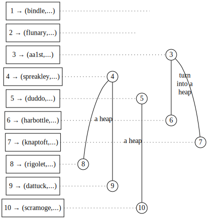
[source](https://edotor.net/?engine=dot?engine=dot?engine=dot?engine=dot?engine=dot?engine=dot#digraph%20TreeArray%20%7B%0A%09%20%20%20%20%2F%2F%20Array%20index%20representation%0A%20%20%20%20subgraph%20cluster_index%20%7B%0A%20%20%20%20%20%20%20%20rankdir%3D%22TB%22%0A%20%20%20%20%20%20%20%20label%3D%22Array%20Index%22%0A%20%20%20%20%20%20%20%20style%3D%22filled%22%0A%20%20%20%20%20%20%20%20node%20%5B%20shape%3Dbox%2C%20width%3D1.5%5D%0A%20%20%20%20%20%20%20%20%0A%20%20%20%20%20%20%20%20%2F%2F%20Index%20nodes%20(invisible%20except%20for%20label)%0A%20%20%20%20%20%20%20%20idx1%20%5Blabel%3D%221%20%E2%86%92%20(bindle%2C...)%22%5D%0A%20%20%20%20%20%20%20%20idx2%20%5Blabel%3D%222%20%E2%86%92%20(flunary%2C...)%22%5D%0A%20%20%20%20%20%20%20%20idx3%20%5Blabel%3D%223%20%E2%86%92%20(aa1st%2C...)%22%5D%0A%20%20%20%20%20%20%20%20idx4%20%5Blabel%3D%224%20%E2%86%92%20(spreakley%2C...)%22%5D%0A%20%20%20%20%20%20%20%20idx5%20%5Blabel%3D%225%20%E2%86%92%20(scramoge%2C...)%22%5D%0A%20%20%20%20%20%20%20%20idx6%20%5Blabel%3D%226%20%E2%86%92%20(harbottle%2C...)%22%5D%0A%20%20%20%20%20%20%20%20idx7%20%5Blabel%3D%227%20%E2%86%92%20(knaptoft%2C...)%22%5D%0A%20%20%20%20%20%20%20%20idx8%20%5Blabel%3D%228%20%E2%86%92%20(rigolet%2C...)%22%5D%0A%20%20%20%20%20%20%20%20idx9%20%5Blabel%3D%229%20%E2%86%92%20(dattuck%2C...)%22%5D%0A%20%20%20%20%20%20%20%20idx10%20%5Blabel%3D%2210%20%E2%86%92%20(duddo%2C...)%22%5D%0A%20%20%20%20%20%20%20%20%0A%20%20%20%20%20%20%20%20%2F%2F%20Index%20grid%20lines%0A%20%20%20%20%20%20%20%20%7B%0A%20%20%20%20%20%20%20%20%20%20%20%20rank%3Dsame%0A%09%09%09%0A%20%20%20%20%20%20%20%20%20%20%20%20idx1%20-%3E%20idx2%20-%3E%20idx3%20-%3E%20idx4%20-%3E%20idx5%20-%3E%20idx6%20-%3E%20idx7%20-%3E%20idx8%20-%3E%20idx9%20-%3E%20idx10%20%5Bstyle%3Dinvis%5D%20%2F%2F%20%20%0A%20%20%20%20%20%20%20%20%7D%0A%20%20%20%20%7D%0A%0A%20%20%20%20%2F%2F%20Graph%20settings%0A%20%20%20%20rankdir%3DTB%0A%20%20%20%20node%20%5Bshape%3Dcircle%2C%20style%3Dfilled%2C%20fillcolor%3Dwhite%2C%20fixedsize%3Dtrue%2C%20width%3D0.3%5D%0A%20%20%20%20edge%20%5Bdir%3Dnone%5D%0A%20%20%20%20nodesep%3D0.4%0A%20%20%20%20ranksep%3D0.1%0A%20%20%20%20%0A%20%20%20%20%2F%2F%20Tree%20nodes%20and%20connections%0A%20%20%20%20n1%20%5Blabel%3D%221%22%2Cstyle%3Dinvis%5D%0A%20%20%20%20n2%20%5Blabel%3D%222%22%2C%20style%3Dinvis%5D%0A%20%20%20%20n3%20%5Blabel%3D%223%22%5D%0A%20%20%20%20n4%20%5Blabel%3D%224%22%5D%0A%20%20%20%20n5%20%5Blabel%3D%225%22%5D%0A%20%20%20%20n6%20%5Blabel%3D%226%22%5D%0A%20%20%20%20n7%20%5Blabel%3D%227%22%5D%0A%20%20%20%20n8%20%5Blabel%3D%228%22%5D%0A%20%20%20%20n9%20%5Blabel%3D%229%22%5D%0A%20%20%20%20n10%20%5Blabel%3D%2210%22%5D%0A%20%20%20%20%0A%20%20%20%20%2F%2F%20Tree%20edges%0A%20%20%20%20n1%20-%3E%20n2%20%5Bstyle%3Dinvis%5D%0A%20%20%20%20n1%20-%3E%20n3%20%5Bstyle%3Dinvis%5D%0A%20%20%20%20n2%20-%3E%20n4%20%5Bstyle%3Dinvis%5D%0A%20%20%20%20n2%20-%3E%20n5%20%5Bstyle%3Dinvis%5D%0A%20%20%20%20n4%20-%3E%20n8%20%0A%20%20%20%20n4%20-%3E%20n9%20%5Bxlabel%3D%22a%20heap%22%5D%20%0A%20%20%20%20n5%20-%3E%20n10%20%5Bxlabel%3D%22a%20heap%22%5D%20%0A%20%20%20%20n3%20-%3E%20n6%20%0A%20%20%20%20n3%20-%3E%20n7%20%5Bxlabel%3D%22turn%20into%5Cna%20heap%22%5D%0A%20%20%20%20%0A%20%20%20%20%0A%20%20%20%20%2F%2F%20Node%20positioning%20with%20invisible%20edges%0A%20%20%20%20%7Brank%3Dsame%20idx1%20-%3E%20n1%20%5Bconstraint%3Dfalse%2C%20style%3Ddotted%5D%7D%0A%20%20%20%20%7Brank%3Dsame%20idx2%20-%3E%20n2%20%5Bconstraint%3Dfalse%2C%20style%3Ddotted%5D%7D%0A%20%20%20%20%7Brank%3Dsame%20idx3%20-%3E%20n3%20%5Bconstraint%3Dfalse%2C%20style%3Ddotted%5D%7D%0A%20%20%20%20%7Brank%3Dsame%20idx4%20-%3E%20n4%20%5Bconstraint%3Dfalse%2C%20style%3Ddotted%5D%7D%0A%20%20%20%20%7Brank%3Dsame%20idx5%20-%3E%20n5%20%5Bconstraint%3Dfalse%2C%20style%3Ddotted%5D%7D%0A%20%20%20%20%7Brank%3Dsame%20idx6%20-%3E%20n6%20%5Bconstraint%3Dfalse%2C%20style%3Ddotted%5D%7D%0A%20%20%20%20%7Brank%3Dsame%20idx7%20-%3E%20n7%20%5Bconstraint%3Dfalse%2C%20style%3Ddotted%5D%7D%0A%20%20%20%20%7Brank%3Dsame%20idx8%20-%3E%20n8%20%5Bconstraint%3Dfalse%2C%20style%3Ddotted%5D%7D%0A%20%20%20%20%7Brank%3Dsame%20idx9%20-%3E%20n9%20%5Bconstraint%3Dfalse%2C%20style%3Ddotted%5D%7D%0A%20%20%20%20%7Brank%3Dsame%20idx10%20-%3E%20n10%20%5Bconstraint%3Dfalse%2C%20style%3Ddotted%5D%7D%0A%20%20%20%20%0A%7D%0A)

c. Tumble down and move to position 3. 

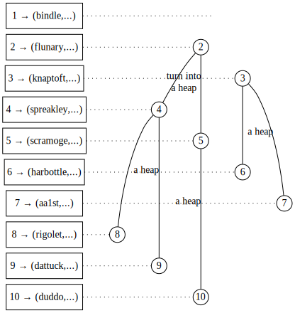
[source](https://edotor.net/?engine=dot?engine=dot?engine=dot?engine=dot?engine=dot?engine=dot#digraph%20TreeArray%20%7B%0A%09%20%20%20%20%2F%2F%20Array%20index%20representation%0A%20%20%20%20subgraph%20cluster_index%20%7B%0A%20%20%20%20%20%20%20%20rankdir%3D%22TB%22%0A%20%20%20%20%20%20%20%20label%3D%22Array%20Index%22%0A%20%20%20%20%20%20%20%20style%3D%22filled%22%0A%20%20%20%20%20%20%20%20node%20%5B%20shape%3Dbox%2C%20width%3D1.5%5D%0A%20%20%20%20%20%20%20%20%0A%20%20%20%20%20%20%20%20%2F%2F%20Index%20nodes%20(invisible%20except%20for%20label)%0A%20%20%20%20%20%20%20%20idx1%20%5Blabel%3D%221%20%E2%86%92%20(bindle%2C...)%22%5D%0A%20%20%20%20%20%20%20%20idx2%20%5Blabel%3D%222%20%E2%86%92%20(flunary%2C...)%22%5D%0A%20%20%20%20%20%20%20%20idx3%20%5Blabel%3D%223%20%E2%86%92%20(knaptoft%2C...)%22%5D%0A%20%20%20%20%20%20%20%20idx4%20%5Blabel%3D%224%20%E2%86%92%20(spreakley%2C...)%22%5D%0A%20%20%20%20%20%20%20%20idx5%20%5Blabel%3D%225%20%E2%86%92%20(scramoge%2C...)%22%5D%0A%20%20%20%20%20%20%20%20idx6%20%5Blabel%3D%226%20%E2%86%92%20(harbottle%2C...)%22%5D%0A%20%20%20%20%20%20%20%20idx7%20%5Blabel%3D%227%20%E2%86%92%20(aa1st%2C...)%22%5D%0A%20%20%20%20%20%20%20%20idx8%20%5Blabel%3D%228%20%E2%86%92%20(rigolet%2C...)%22%5D%0A%20%20%20%20%20%20%20%20idx9%20%5Blabel%3D%229%20%E2%86%92%20(dattuck%2C...)%22%5D%0A%20%20%20%20%20%20%20%20idx10%20%5Blabel%3D%2210%20%E2%86%92%20(duddo%2C...)%22%5D%0A%20%20%20%20%20%20%20%20%0A%20%20%20%20%20%20%20%20%2F%2F%20Index%20grid%20lines%0A%20%20%20%20%20%20%20%20%7B%0A%20%20%20%20%20%20%20%20%20%20%20%20rank%3Dsame%0A%09%09%09%0A%20%20%20%20%20%20%20%20%20%20%20%20idx1%20-%3E%20idx2%20-%3E%20idx3%20-%3E%20idx4%20-%3E%20idx5%20-%3E%20idx6%20-%3E%20idx7%20-%3E%20idx8%20-%3E%20idx9%20-%3E%20idx10%20%5Bstyle%3Dinvis%5D%20%2F%2F%20%20%0A%20%20%20%20%20%20%20%20%7D%0A%20%20%20%20%7D%0A%0A%20%20%20%20%2F%2F%20Graph%20settings%0A%20%20%20%20rankdir%3DTB%0A%20%20%20%20node%20%5Bshape%3Dcircle%2C%20style%3Dfilled%2C%20fillcolor%3Dwhite%2C%20fixedsize%3Dtrue%2C%20width%3D0.3%5D%0A%20%20%20%20edge%20%5Bdir%3Dnone%5D%0A%20%20%20%20nodesep%3D0.4%0A%20%20%20%20ranksep%3D0.1%0A%20%20%20%20%0A%20%20%20%20%2F%2F%20Tree%20nodes%20and%20connections%0A%20%20%20%20n1%20%5Blabel%3D%221%22%2Cstyle%3Dinvis%5D%0A%20%20%20%20n2%20%5Blabel%3D%222%22%5D%0A%20%20%20%20n3%20%5Blabel%3D%223%22%5D%0A%20%20%20%20n4%20%5Blabel%3D%224%22%5D%0A%20%20%20%20n5%20%5Blabel%3D%225%22%5D%0A%20%20%20%20n6%20%5Blabel%3D%226%22%5D%0A%20%20%20%20n7%20%5Blabel%3D%227%22%5D%0A%20%20%20%20n8%20%5Blabel%3D%228%22%5D%0A%20%20%20%20n9%20%5Blabel%3D%229%22%5D%0A%20%20%20%20n10%20%5Blabel%3D%2210%22%5D%0A%20%20%20%20%0A%20%20%20%20%2F%2F%20Tree%20edges%0A%20%20%20%20n1%20-%3E%20n2%20%5Bstyle%3Dinvis%5D%0A%20%20%20%20n1%20-%3E%20n3%20%5Bstyle%3Dinvis%5D%0A%20%20%20%20n2%20-%3E%20n4%20%0A%20%20%20%20n2%20-%3E%20n5%20%5Bxlabel%3D%22turn%20into%5Cna%20heap%22%5D%0A%20%20%20%20n4%20-%3E%20n8%20%0A%20%20%20%20n4%20-%3E%20n9%20%5Bxlabel%3D%22a%20heap%22%5D%20%0A%20%20%20%20n5%20-%3E%20n10%20%5Bxlabel%3D%22a%20heap%22%5D%20%0A%20%20%20%20n3%20-%3E%20n6%20%0A%20%20%20%20n3%20-%3E%20n7%20%5Bxlabel%3D%22a%20heap%22%5D%0A%20%20%20%20%0A%20%20%20%20%0A%20%20%20%20%2F%2F%20Node%20positioning%20with%20invisible%20edges%0A%20%20%20%20%7Brank%3Dsame%20idx1%20-%3E%20n1%20%5Bconstraint%3Dfalse%2C%20style%3Ddotted%5D%7D%0A%20%20%20%20%7Brank%3Dsame%20idx2%20-%3E%20n2%20%5Bconstraint%3Dfalse%2C%20style%3Ddotted%5D%7D%0A%20%20%20%20%7Brank%3Dsame%20idx3%20-%3E%20n3%20%5Bconstraint%3Dfalse%2C%20style%3Ddotted%5D%7D%0A%20%20%20%20%7Brank%3Dsame%20idx4%20-%3E%20n4%20%5Bconstraint%3Dfalse%2C%20style%3Ddotted%5D%7D%0A%20%20%20%20%7Brank%3Dsame%20idx5%20-%3E%20n5%20%5Bconstraint%3Dfalse%2C%20style%3Ddotted%5D%7D%0A%20%20%20%20%7Brank%3Dsame%20idx6%20-%3E%20n6%20%5Bconstraint%3Dfalse%2C%20style%3Ddotted%5D%7D%0A%20%20%20%20%7Brank%3Dsame%20idx7%20-%3E%20n7%20%5Bconstraint%3Dfalse%2C%20style%3Ddotted%5D%7D%0A%20%20%20%20%7Brank%3Dsame%20idx8%20-%3E%20n8%20%5Bconstraint%3Dfalse%2C%20style%3Ddotted%5D%7D%0A%20%20%20%20%7Brank%3Dsame%20idx9%20-%3E%20n9%20%5Bconstraint%3Dfalse%2C%20style%3Ddotted%5D%7D%0A%20%20%20%20%7Brank%3Dsame%20idx10%20-%3E%20n10%20%5Bconstraint%3Dfalse%2C%20style%3Ddotted%5D%7D%0A%20%20%20%20%0A%7D%0A)

d. Tumble down and move to position 2. 

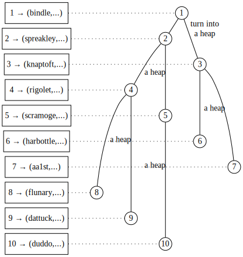
[source](https://edotor.net/?engine=dot?engine=dot?engine=dot?engine=dot?engine=dot?engine=dot#digraph%20TreeArray%20%7B%0A%09%20%20%20%20%2F%2F%20Array%20index%20representation%0A%20%20%20%20subgraph%20cluster_index%20%7B%0A%20%20%20%20%20%20%20%20rankdir%3D%22TB%22%0A%20%20%20%20%20%20%20%20label%3D%22Array%20Index%22%0A%20%20%20%20%20%20%20%20style%3D%22filled%22%0A%20%20%20%20%20%20%20%20node%20%5B%20shape%3Dbox%2C%20width%3D1.5%5D%0A%20%20%20%20%20%20%20%20%0A%20%20%20%20%20%20%20%20%2F%2F%20Index%20nodes%20(invisible%20except%20for%20label)%0A%20%20%20%20%20%20%20%20idx1%20%5Blabel%3D%221%20%E2%86%92%20(bindle%2C...)%22%5D%0A%20%20%20%20%20%20%20%20idx2%20%5Blabel%3D%222%20%E2%86%92%20(spreakley%2C...)%22%5D%0A%20%20%20%20%20%20%20%20idx3%20%5Blabel%3D%223%20%E2%86%92%20(knaptoft%2C...)%22%5D%0A%20%20%20%20%20%20%20%20idx4%20%5Blabel%3D%224%20%E2%86%92%20(rigolet%2C...)%22%5D%0A%20%20%20%20%20%20%20%20idx5%20%5Blabel%3D%225%20%E2%86%92%20(scramoge%2C...)%22%5D%0A%20%20%20%20%20%20%20%20idx6%20%5Blabel%3D%226%20%E2%86%92%20(harbottle%2C...)%22%5D%0A%20%20%20%20%20%20%20%20idx7%20%5Blabel%3D%227%20%E2%86%92%20(aa1st%2C...)%22%5D%0A%20%20%20%20%20%20%20%20idx8%20%5Blabel%3D%228%20%E2%86%92%20(flunary%2C...)%22%5D%0A%20%20%20%20%20%20%20%20idx9%20%5Blabel%3D%229%20%E2%86%92%20(dattuck%2C...)%22%5D%0A%20%20%20%20%20%20%20%20idx10%20%5Blabel%3D%2210%20%E2%86%92%20(duddo%2C...)%22%5D%0A%20%20%20%20%20%20%20%20%0A%20%20%20%20%20%20%20%20%2F%2F%20Index%20grid%20lines%0A%20%20%20%20%20%20%20%20%7B%0A%20%20%20%20%20%20%20%20%20%20%20%20rank%3Dsame%0A%09%09%09%0A%20%20%20%20%20%20%20%20%20%20%20%20idx1%20-%3E%20idx2%20-%3E%20idx3%20-%3E%20idx4%20-%3E%20idx5%20-%3E%20idx6%20-%3E%20idx7%20-%3E%20idx8%20-%3E%20idx9%20-%3E%20idx10%20%5Bstyle%3Dinvis%5D%20%2F%2F%20%20%0A%20%20%20%20%20%20%20%20%7D%0A%20%20%20%20%7D%0A%0A%20%20%20%20%2F%2F%20Graph%20settings%0A%20%20%20%20rankdir%3DTB%0A%20%20%20%20node%20%5Bshape%3Dcircle%2C%20style%3Dfilled%2C%20fillcolor%3Dwhite%2C%20fixedsize%3Dtrue%2C%20width%3D0.3%5D%0A%20%20%20%20edge%20%5Bdir%3Dnone%5D%0A%20%20%20%20nodesep%3D0.4%0A%20%20%20%20ranksep%3D0.1%0A%20%20%20%20%0A%20%20%20%20%2F%2F%20Tree%20nodes%20and%20connections%0A%20%20%20%20n1%20%5Blabel%3D%221%22%5D%0A%20%20%20%20n2%20%5Blabel%3D%222%22%5D%0A%20%20%20%20n3%20%5Blabel%3D%223%22%5D%0A%20%20%20%20n4%20%5Blabel%3D%224%22%5D%0A%20%20%20%20n5%20%5Blabel%3D%225%22%5D%0A%20%20%20%20n6%20%5Blabel%3D%226%22%5D%0A%20%20%20%20n7%20%5Blabel%3D%227%22%5D%0A%20%20%20%20n8%20%5Blabel%3D%228%22%5D%0A%20%20%20%20n9%20%5Blabel%3D%229%22%5D%0A%20%20%20%20n10%20%5Blabel%3D%2210%22%5D%0A%20%20%20%20%0A%20%20%20%20%2F%2F%20Tree%20edges%0A%20%20%20%20n1%20-%3E%20n2%20%0A%20%20%20%20n1%20-%3E%20n3%20%5Bxlabel%3D%22turn%20into%5Cna%20heap%22%5D%0A%20%20%20%20n2%20-%3E%20n4%20%0A%20%20%20%20n2%20-%3E%20n5%20%5Bxlabel%3D%22a%20heap%22%5D%0A%20%20%20%20n4%20-%3E%20n8%20%0A%20%20%20%20n4%20-%3E%20n9%20%5Bxlabel%3D%22a%20heap%22%5D%20%0A%20%20%20%20n5%20-%3E%20n10%20%5Bxlabel%3D%22a%20heap%22%5D%20%0A%20%20%20%20n3%20-%3E%20n6%20%0A%20%20%20%20n3%20-%3E%20n7%20%5Bxlabel%3D%22a%20heap%22%5D%0A%20%20%20%20%0A%20%20%20%20%0A%20%20%20%20%2F%2F%20Node%20positioning%20with%20invisible%20edges%0A%20%20%20%20%7Brank%3Dsame%20idx1%20-%3E%20n1%20%5Bconstraint%3Dfalse%2C%20style%3Ddotted%5D%7D%0A%20%20%20%20%7Brank%3Dsame%20idx2%20-%3E%20n2%20%5Bconstraint%3Dfalse%2C%20style%3Ddotted%5D%7D%0A%20%20%20%20%7Brank%3Dsame%20idx3%20-%3E%20n3%20%5Bconstraint%3Dfalse%2C%20style%3Ddotted%5D%7D%0A%20%20%20%20%7Brank%3Dsame%20idx4%20-%3E%20n4%20%5Bconstraint%3Dfalse%2C%20style%3Ddotted%5D%7D%0A%20%20%20%20%7Brank%3Dsame%20idx5%20-%3E%20n5%20%5Bconstraint%3Dfalse%2C%20style%3Ddotted%5D%7D%0A%20%20%20%20%7Brank%3Dsame%20idx6%20-%3E%20n6%20%5Bconstraint%3Dfalse%2C%20style%3Ddotted%5D%7D%0A%20%20%20%20%7Brank%3Dsame%20idx7%20-%3E%20n7%20%5Bconstraint%3Dfalse%2C%20style%3Ddotted%5D%7D%0A%20%20%20%20%7Brank%3Dsame%20idx8%20-%3E%20n8%20%5Bconstraint%3Dfalse%2C%20style%3Ddotted%5D%7D%0A%20%20%20%20%7Brank%3Dsame%20idx9%20-%3E%20n9%20%5Bconstraint%3Dfalse%2C%20style%3Ddotted%5D%7D%0A%20%20%20%20%7Brank%3Dsame%20idx10%20-%3E%20n10%20%5Bconstraint%3Dfalse%2C%20style%3Ddotted%5D%7D%0A%20%20%20%20%0A%7D%0A)

e. Tumble down and move to position 1. 

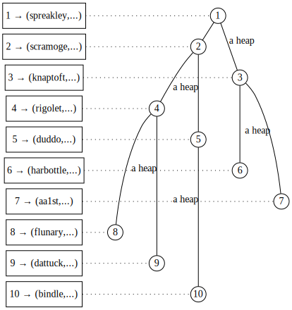
[source](https://edotor.net/?engine=dot?engine=dot?engine=dot?engine=dot?engine=dot?engine=dot#digraph%20TreeArray%20%7B%0A%09%20%20%20%20%2F%2F%20Array%20index%20representation%0A%20%20%20%20subgraph%20cluster_index%20%7B%0A%20%20%20%20%20%20%20%20rankdir%3D%22TB%22%0A%20%20%20%20%20%20%20%20label%3D%22Array%20Index%22%0A%20%20%20%20%20%20%20%20style%3D%22filled%22%0A%20%20%20%20%20%20%20%20node%20%5B%20shape%3Dbox%2C%20width%3D1.5%5D%0A%20%20%20%20%20%20%20%20%0A%20%20%20%20%20%20%20%20%2F%2F%20Index%20nodes%20(invisible%20except%20for%20label)%0A%20%20%20%20%20%20%20%20idx1%20%5Blabel%3D%221%20%E2%86%92%20(spreakley%2C...)%22%5D%0A%20%20%20%20%20%20%20%20idx2%20%5Blabel%3D%222%20%E2%86%92%20(scramoge%2C...)%22%5D%0A%20%20%20%20%20%20%20%20idx3%20%5Blabel%3D%223%20%E2%86%92%20(knaptoft%2C...)%22%5D%0A%20%20%20%20%20%20%20%20idx4%20%5Blabel%3D%224%20%E2%86%92%20(rigolet%2C...)%22%5D%0A%20%20%20%20%20%20%20%20idx5%20%5Blabel%3D%225%20%E2%86%92%20(duddo%2C...)%22%5D%0A%20%20%20%20%20%20%20%20idx6%20%5Blabel%3D%226%20%E2%86%92%20(harbottle%2C...)%22%5D%0A%20%20%20%20%20%20%20%20idx7%20%5Blabel%3D%227%20%E2%86%92%20(aa1st%2C...)%22%5D%0A%20%20%20%20%20%20%20%20idx8%20%5Blabel%3D%228%20%E2%86%92%20(flunary%2C...)%22%5D%0A%20%20%20%20%20%20%20%20idx9%20%5Blabel%3D%229%20%E2%86%92%20(dattuck%2C...)%22%5D%0A%20%20%20%20%20%20%20%20idx10%20%5Blabel%3D%2210%20%E2%86%92%20(bindle%2C...)%22%5D%0A%20%20%20%20%20%20%20%20%0A%20%20%20%20%20%20%20%20%2F%2F%20Index%20grid%20lines%0A%20%20%20%20%20%20%20%20%7B%0A%20%20%20%20%20%20%20%20%20%20%20%20rank%3Dsame%0A%09%09%09%0A%20%20%20%20%20%20%20%20%20%20%20%20idx1%20-%3E%20idx2%20-%3E%20idx3%20-%3E%20idx4%20-%3E%20idx5%20-%3E%20idx6%20-%3E%20idx7%20-%3E%20idx8%20-%3E%20idx9%20-%3E%20idx10%20%5Bstyle%3Dinvis%5D%20%2F%2F%20%20%0A%20%20%20%20%20%20%20%20%7D%0A%20%20%20%20%7D%0A%0A%20%20%20%20%2F%2F%20Graph%20settings%0A%20%20%20%20rankdir%3DTB%0A%20%20%20%20node%20%5Bshape%3Dcircle%2C%20style%3Dfilled%2C%20fillcolor%3Dwhite%2C%20fixedsize%3Dtrue%2C%20width%3D0.3%5D%0A%20%20%20%20edge%20%5Bdir%3Dnone%5D%0A%20%20%20%20nodesep%3D0.4%0A%20%20%20%20ranksep%3D0.1%0A%20%20%20%20%0A%20%20%20%20%2F%2F%20Tree%20nodes%20and%20connections%0A%20%20%20%20n1%20%5Blabel%3D%221%22%5D%0A%20%20%20%20n2%20%5Blabel%3D%222%22%5D%0A%20%20%20%20n3%20%5Blabel%3D%223%22%5D%0A%20%20%20%20n4%20%5Blabel%3D%224%22%5D%0A%20%20%20%20n5%20%5Blabel%3D%225%22%5D%0A%20%20%20%20n6%20%5Blabel%3D%226%22%5D%0A%20%20%20%20n7%20%5Blabel%3D%227%22%5D%0A%20%20%20%20n8%20%5Blabel%3D%228%22%5D%0A%20%20%20%20n9%20%5Blabel%3D%229%22%5D%0A%20%20%20%20n10%20%5Blabel%3D%2210%22%5D%0A%20%20%20%20%0A%20%20%20%20%2F%2F%20Tree%20edges%0A%20%20%20%20n1%20-%3E%20n2%20%0A%20%20%20%20n1%20-%3E%20n3%20%5Bxlabel%3D%22a%20heap%22%5D%0A%20%20%20%20n2%20-%3E%20n4%20%0A%20%20%20%20n2%20-%3E%20n5%20%5Bxlabel%3D%22a%20heap%22%5D%0A%20%20%20%20n4%20-%3E%20n8%20%0A%20%20%20%20n4%20-%3E%20n9%20%5Bxlabel%3D%22a%20heap%22%5D%20%0A%20%20%20%20n5%20-%3E%20n10%20%5Bxlabel%3D%22a%20heap%22%5D%20%0A%20%20%20%20n3%20-%3E%20n6%20%0A%20%20%20%20n3%20-%3E%20n7%20%5Bxlabel%3D%22a%20heap%22%5D%0A%20%20%20%20%0A%20%20%20%20%0A%20%20%20%20%2F%2F%20Node%20positioning%20with%20invisible%20edges%0A%20%20%20%20%7Brank%3Dsame%20idx1%20-%3E%20n1%20%5Bconstraint%3Dfalse%2C%20style%3Ddotted%5D%7D%0A%20%20%20%20%7Brank%3Dsame%20idx2%20-%3E%20n2%20%5Bconstraint%3Dfalse%2C%20style%3Ddotted%5D%7D%0A%20%20%20%20%7Brank%3Dsame%20idx3%20-%3E%20n3%20%5Bconstraint%3Dfalse%2C%20style%3Ddotted%5D%7D%0A%20%20%20%20%7Brank%3Dsame%20idx4%20-%3E%20n4%20%5Bconstraint%3Dfalse%2C%20style%3Ddotted%5D%7D%0A%20%20%20%20%7Brank%3Dsame%20idx5%20-%3E%20n5%20%5Bconstraint%3Dfalse%2C%20style%3Ddotted%5D%7D%0A%20%20%20%20%7Brank%3Dsame%20idx6%20-%3E%20n6%20%5Bconstraint%3Dfalse%2C%20style%3Ddotted%5D%7D%0A%20%20%20%20%7Brank%3Dsame%20idx7%20-%3E%20n7%20%5Bconstraint%3Dfalse%2C%20style%3Ddotted%5D%7D%0A%20%20%20%20%7Brank%3Dsame%20idx8%20-%3E%20n8%20%5Bconstraint%3Dfalse%2C%20style%3Ddotted%5D%7D%0A%20%20%20%20%7Brank%3Dsame%20idx9%20-%3E%20n9%20%5Bconstraint%3Dfalse%2C%20style%3Ddotted%5D%7D%0A%20%20%20%20%7Brank%3Dsame%20idx10%20-%3E%20n10%20%5Bconstraint%3Dfalse%2C%20style%3Ddotted%5D%7D%0A%20%20%20%20%0A%7D%0A)

f. Tumble down. The whole tree is now a heap. 

#### Figure 16.10 Building a heap out of an unsorted tree.


Doesn't that add up to O(N log N)?
Perhaps, but we cannot take that for granted, for the same reason we could not in the analysis of the sorting portion of heap sort: The tree height is not fixed at N. 

Figure 16.11a shows the number of swaps needed to build a 15-node heap by starting with an empty heap and inserting 15 items (the top-down approach).
The number at each node is the maximum number of swaps needed to insert an item into a heap so that it extends to that position.
This illustration is the same as Figure 16.9c, except the “log i” have been replaced with their numeric values. 

The bottom-up approach gives us a different picture.
It takes zero swaps to turn the bottom row (level 4) into eight heaps, because being leaves, all of those nodes are  heaps already.
Turning the trees rooted in level 3 into heaps takes at most one swap each.
Trees with their roots in level 2 will take no more than two swaps to turn into heaps, and tumbling the main root down will take a maximum of three swaps.
Comparing the resulting tally diagram (Figure 16.11b) 
with the one of the top-down technique (Figure 16.11a),
it is clear that the bottom-up method takes fewer steps.
It may even be possible that it has lower time complexity, so let us look at it closer. 

Adding up the numbers in Figure 16.11b (starting at the bottom),

8 X 0 + 4 X 1 + 2 x 2 + 1 x 3

or 

2^3 X 0 + 2 ^ 2 X 1 + 2 ^ 1 x 2 + 2 ^ 0 X 3

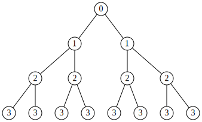
[source](https://edotor.net/?engine=dot?engine=dot#digraph%20BinaryTree%20%7B%0A%20%20%20%20%2F%2F%20Node%20appearance%20settings%0A%20%20%20%20node%20%5Bshape%3Dcircle%2C%20fixedsize%3Dtrue%2C%20width%3D0.3%2C%20style%3Dfilled%2C%20fillcolor%3Dwhite%2C%20color%3Dblack%5D%3B%0A%20%20%20%20%0A%20%20%20%20%2F%2F%20Edge%20appearance%0A%20%20%20%20edge%20%5Barrowhead%3Dnone%5D%3B%0A%20%20%20%20%0A%20%20%20%20%2F%2F%20The%20nodes%20in%20the%20tree%20(using%20level-order%20numbering)%0A%20%20%20%201%20%5Blabel%3D%220%22%5D%3B%0A%20%20%20%202%20%5Blabel%3D%221%22%5D%3B%0A%20%20%20%203%20%5Blabel%3D%221%22%5D%3B%0A%20%20%20%204%20%5Blabel%3D%222%22%5D%3B%0A%20%20%20%205%20%5Blabel%3D%222%22%5D%3B%0A%20%20%20%206%20%5Blabel%3D%222%22%5D%3B%0A%20%20%20%207%20%5Blabel%3D%222%22%5D%3B%0A%20%20%20%208%20%5Blabel%3D%223%22%5D%3B%0A%20%20%20%209%20%5Blabel%3D%223%22%5D%3B%0A%20%20%20%2010%20%5Blabel%3D%223%22%5D%3B%0A%20%20%20%2011%20%5Blabel%3D%223%22%5D%3B%0A%20%20%20%2012%20%5Blabel%3D%223%22%5D%3B%0A%20%20%20%2013%20%5Blabel%3D%223%22%5D%3B%0A%20%20%20%2014%20%5Blabel%3D%223%22%5D%3B%0A%20%20%20%2015%20%5Blabel%3D%223%22%5D%3B%0A%20%20%20%20%0A%20%20%20%20%2F%2F%20Define%20the%20edges%20connecting%20the%20nodes%0A%20%20%20%201%20-%3E%202%3B%0A%20%20%20%201%20-%3E%203%3B%0A%20%20%20%202%20-%3E%204%3B%0A%20%20%20%202%20-%3E%205%3B%0A%20%20%20%203%20-%3E%206%3B%0A%20%20%20%203%20-%3E%207%3B%0A%20%20%20%204%20-%3E%208%3B%0A%20%20%20%204%20-%3E%209%3B%0A%20%20%20%205%20-%3E%2010%3B%0A%20%20%20%205%20-%3E%2011%3B%0A%20%20%20%206%20-%3E%2012%3B%0A%20%20%20%206%20-%3E%2013%3B%0A%20%20%20%207%20-%3E%2014%3B%0A%20%20%20%207%20-%3E%2015%3B%0A%20%20%20%20%0A%20%20%20%20%2F%2F%20Graph%20layout%20settings%0A%20%20%20%20graph%20%5Bordering%3Dout%2C%20ranksep%3D0.5%2C%20nodesep%3D0.3%5D%3B%0A%7D)
a. top-down 

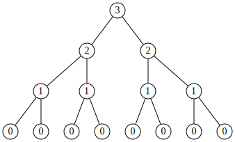
[source](https://edotor.net/?engine=dot?engine=dot#digraph%20BinaryTree%20%7B%0A%20%20%20%20%2F%2F%20Node%20appearance%20settings%0A%20%20%20%20node%20%5Bshape%3Dcircle%2C%20fixedsize%3Dtrue%2C%20width%3D0.3%2C%20style%3Dfilled%2C%20fillcolor%3Dwhite%2C%20color%3Dblack%5D%3B%0A%20%20%20%20%0A%20%20%20%20%2F%2F%20Edge%20appearance%0A%20%20%20%20edge%20%5Barrowhead%3Dnone%5D%3B%0A%20%20%20%20%0A%20%20%20%20%2F%2F%20The%20nodes%20in%20the%20tree%20(using%20level-order%20numbering)%0A%20%20%20%201%20%5Blabel%3D%223%22%5D%3B%0A%20%20%20%202%20%5Blabel%3D%222%22%5D%3B%0A%20%20%20%203%20%5Blabel%3D%222%22%5D%3B%0A%20%20%20%204%20%5Blabel%3D%221%22%5D%3B%0A%20%20%20%205%20%5Blabel%3D%221%22%5D%3B%0A%20%20%20%206%20%5Blabel%3D%221%22%5D%3B%0A%20%20%20%207%20%5Blabel%3D%221%22%5D%3B%0A%20%20%20%208%20%5Blabel%3D%220%22%5D%3B%0A%20%20%20%209%20%5Blabel%3D%220%22%5D%3B%0A%20%20%20%2010%20%5Blabel%3D%220%22%5D%3B%0A%20%20%20%2011%20%5Blabel%3D%220%22%5D%3B%0A%20%20%20%2012%20%5Blabel%3D%220%22%5D%3B%0A%20%20%20%2013%20%5Blabel%3D%220%22%5D%3B%0A%20%20%20%2014%20%5Blabel%3D%220%22%5D%3B%0A%20%20%20%2015%20%5Blabel%3D%220%22%5D%3B%0A%20%20%20%20%0A%20%20%20%20%2F%2F%20Define%20the%20edges%20connecting%20the%20nodes%0A%20%20%20%201%20-%3E%202%3B%0A%20%20%20%201%20-%3E%203%3B%0A%20%20%20%202%20-%3E%204%3B%0A%20%20%20%202%20-%3E%205%3B%0A%20%20%20%203%20-%3E%206%3B%0A%20%20%20%203%20-%3E%207%3B%0A%20%20%20%204%20-%3E%208%3B%0A%20%20%20%204%20-%3E%209%3B%0A%20%20%20%205%20-%3E%2010%3B%0A%20%20%20%205%20-%3E%2011%3B%0A%20%20%20%206%20-%3E%2012%3B%0A%20%20%20%206%20-%3E%2013%3B%0A%20%20%20%207%20-%3E%2014%3B%0A%20%20%20%207%20-%3E%2015%3B%0A%20%20%20%20%0A%20%20%20%20%2F%2F%20Graph%20layout%20settings%0A%20%20%20%20graph%20%5Bordering%3Dout%2C%20ranksep%3D0.5%2C%20nodesep%3D0.3%5D%3B%0A%7D)

b. bottom-up 

### Figure 16.11 The number of swaps needed to build a heap top-down (start empty and insert all items) and bottom-up. 


So as the exponent of 2 goes down by 1, the number of steps needed to tumble the root down from that level goes up by 1. 

How does N fit into the picture?
In the example, N = 15, or 24 — 1.
A full tree of height A always has 2” — 1 nodes.
So the first factor in our example (2?) 
is approximately ¥.
The second is about #;
the third, 

and so on. 

So in general, for a full tree of size N, the sum is approximately 

$$\frac{N}{2^1} \times 0 + \frac{N}{2^2} \times 1 + \frac{N}{2^3} \times 2 + \cdots + \frac{N}{2^{h-1}} \times (h-2) + \frac{N}{2^h} \times (h-1)$$


where h is the height (h = log N). 
If we factor out $N$, we get 

$$N\left(\frac{0}{2^1} + \frac{1}{2^2} + \frac{2}{2^3} + \cdots + \frac{h-2}{2^{h-1}} + \frac{h-1}{2^h}\right)$$

So if the sum in parentheses is less than $O(log N)$,
then bottom-up heap building has better time complexity than top-down heap building. 

Let us take a brief mathematical detour, to establish a fact that turns out to be quite a useful tool for software writers.
Not infrequently, one runs into the sum 

$$\frac{1}{2} + \frac{1}{2^2} + \frac{1}{2^3} + \frac{1}{2^4} + \cdots$$

To what does that add up?
There is an infinite number of terms, but they keep getting smaller and smaller, so the answer may not be “infinity.” 

Consider an empty glass.
Add to it half a glass of water (3).
The result is a glass that is half empty.[^1]
Add to it a quarter glass (%);
now it is only a quarter empty.
Add to it an eighth of a glass (3);
now there is only one-eighth of a glass left to fill.
Add & of a glass;
x of a glass is left.
And so on. 

The more of the terms of the sum you add, the closer you will get to a full 1, 

but you will never get exactly 1, and you will certainly never go over it.

$$\frac{1}{2} + \frac{1}{2^2} + \frac{1}{2^3} + \frac{1}{2^4} + \cdots < 1 $$
(16.2) 

So (You may recall that we got approximately the same result by counting squares in the linked list version of binary search, Figure 14.2.) 

End of detour, back to Eq. (16.1).
Can we use Eq. (16.2) to solve it?
Well, it starts at = instead of 3, but it is easy to compensate for that.
We can just subtract 3 from the answer (in other words, use a half-size glass).
The tricky difference lies in the fact that the numerators in Eq. (16.2) are all 1, while in Kq. (16.1) they keep increasing. 

[1]: No, I am not a pessimist. Just read on. 

Let us rewrite the sum in Eq. (16.1) a little, by splitting up the terms to get a sum where every numerator is 1: Replace $\frac{2}{2^3}$ with “$\frac{1}{2^3} + \frac{1}{2^3}$,” “$\frac{3}{2^4}$” with “$\frac{1}{2^4} + \frac{1}{2^4} + \frac{1}{2^4}$,” 
and so on. 

$$\frac{1}{2^2} + \frac{1}{2^3} + \frac{1}{2^3} + \frac{1}{2^4} + \frac{1}{2^4} + \frac{1}{2^4} + \cdots$$

[The sum in Eq. (16.1) is finite while this one is infinite, so if this sum has a limit, the one we seek will be bound by it too.] Do you see the sum from Eq. (16.2) lurking in it? 

Let us rewrite it two dimensionally, putting the terms with the same power 
of 2 under each other instead of consecutively: 

$$\frac{1}{2^2} + \frac{1}{2^3} + \frac{1}{2^4} + \frac{1}{2^5} + \cdots$$
$$+ \frac{1}{2^3} + \frac{1}{2^4} + \frac{1}{2^5} + \cdots$$
$$+ \frac{1}{2^4} + \frac{1}{2^5} + \cdots$$
$$+ \frac{1}{2^5} + \cdots$$

Well, well, well.
Not only is Eq. (16.2) lurking in this sum, but it appears in every row!
The sum of row 1 is $< \frac{1}{2}$ [subtracting $\frac{1}{2}$ from both sides of Eq. (16.2)]; 
the second row adds up to almost $\frac{1}{2^2}$;
the third approaches $\frac{1}{2^3}$;
and so on. 

If we add up the sums of the rows, we get 

$$\frac{1}{2} + \frac{1}{2^2} + \frac{1}{2^3} + \frac{1}{2^4} $$

in which Eq. (16.2) does not have to lurk. 

So the sum in Kq. (16.1) will be a number between 0 (if the tree is of size 1) 
and 1 (if the tree is infinite in size).
Thus, the time complexity of the bottom-up heap building algorithm is O(N). 

### 16.3.2 Heap Sort vs. Other O(N log N) Sorts 

Heap sort consists of two parts:
building the heap and sorting.
The time it takes to do a heap sort is the sum of the times it takes to do each part, which is $O(N + N log N)$,
which is $O(N log N)$. 

In Chapter 13, we looked at two other algorithms that can perform with equally low time complexity:
merge sort, which is consistently $O(N log N)$ 
but has a rather high constant, and quick sort, which tends to be a quicker $O(N log N)$ but can get as bad as $O(N^2)$. 

Heap sort is always $O(N log N)$,
so its worst case is much better than quick sort’s worst case.
In the average case, though, quick sort can be coded to be a little faster. 

In the worst case, heap sort is the same as merge sort.
On the average, 
heap sort is still $O(N log N)$,
but the constant gets lower.
Merge sort keeps the same constant in the average case as in the worst case, so it tends to be slower than heap sort. 

# Summary

A balanced tree is one where for every node, the difference between the heights of its subtrees is no greater than 1.
A complete tree is one whose breadth-first traversal has no holes (thus, a complete tree is balanced).
A heap is a complete tree that obeys priority queue ordering: For every subtree, the root item is “>=” the root items of its children.
This chapter presented an $O(N)$ algorithm for building a heap, and $O(log N)$ algorithms for building a heap, and inserting and deleting items. 

Heap sort overlays a breadth-first heap structure over a list, and works by removing the greatest item from the heap’s root (the leftmost item of the list) 
and exchanging it with the item in the last breadth-first position of the old heap (the rightmost item of the unsorted region).
It is similar to selection sort, 
except the heap is used to select the greatest item.
Heap sort’s performance is $O(N log N)$,
and on the average it tends to perform better than merge sort but not quite as well as quick sort. 

# Exercises 

1. Write feature delete for class `HEAP_ARRAY`. 
2. Complete class `HEAP_ARRAY`. 
3. What is the time complexity of insert? 
4. Show that the time complexity of delete is $O(log N)$. 
5. Design and implement priority queues: 
    1. Write deferred class `PRIORITY_QUEUE`. 
    2. Write class `PRIORITY_QUEUE_HEAP` using `HEAP_ARRAY`. 
6. Make `BINARY_SEARCH_TREE_ARRAY` take advantage of `BINARY_TREE_ARRAY`. 
7. How well does heap sort perform on a mostly sorted array? 
8. Write class `HEAPSORTABLE_LIST_ARRAY`. 