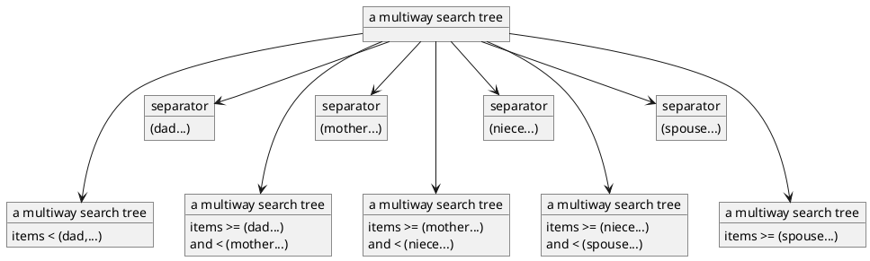
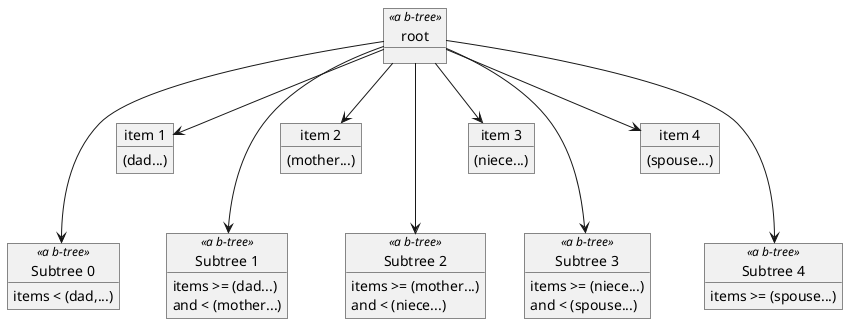
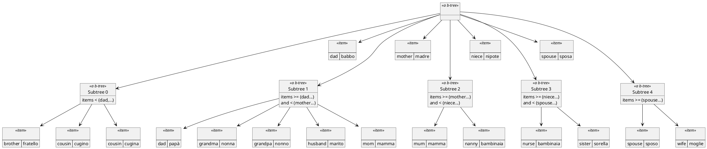
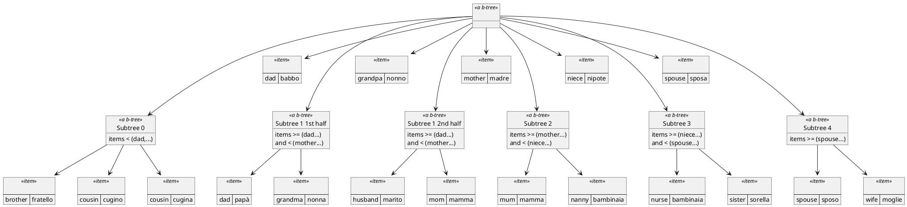
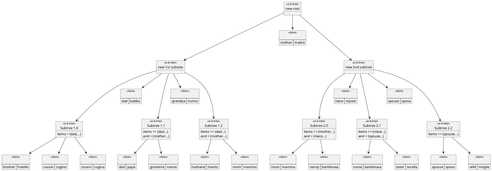

# 17 Balanced Trees (B-Trees)

We saw in Chapter 15 how binary search trees provide O(log N) performance when they are balanced,
but we also saw how easy it is to unbalance them.

Heaps, on the other hand, were always complete and thus always balanced,
but they are not suitable for searching for a specific object.
There are several ways to keep search trees balanced,
and we examine one of them in this chapter.

## 17.1 What a B_TREE is and What It Does

The name b-tree is short for “balanced tree.” It is not a binary search tree,
but rather a multiway search tree.
In a binary one, each node has two ordered subtrees and one separator item between them.
When we seek an item, we compare it with the separator, 
and go to the left subtree if the separator is greater,
and to the right subtree if the separator is less.
For example, if our binary search tree was a dictionary,
having a "mother" item between the two subtrees told us that all items in the left subtree were “<"mother",”
and all items in the right subtree were “>="mother".”

A multiway search tree uses a more flexible organization:
A node has m subtrees, and there are m - 1 separator items between them,
as shown in Figure 17.1. 
The subtree bracketed by items "mother" and "niece" tracks items 
that are “>="mother"” and “<"niece".” 
The leftmost subtree tracks items that are “<” the leftmost separator;
the rightmost subtree tracks items that are “>=” the rightmost separator.
The binary search tree is just a two-way search tree,
i.e., a multiway search tree in which m = 2.

A b-tree is a multiway tree where the number of trees per node is not fixed,
but varies within limits.
The maximum number of subtrees a b-tree node is allowed to have is called “the degree of the b-tree.”
While the degree can be any positive integer,
we will only look at odd-degree b-trees.


Figure 17.1 A multiway search tree node.

The assumption that the degree is odd will simplify our algorithms and the discussion,
and this limitation is easy to accommodate in practice.
The following rules apply for a b-tree of degree *m*,
where m is odd:

1. The maximum number of subtrees is m.
Therefore, the maximum number of separator items is m - 1.

2. The minimum number of subtrees is $\left\lceil\frac{m}{2}\right\rceil$.
The minimum number of separator items is thus $\left\lfloor\frac{m}{2}\right\rfloor$.

3. The root of the whole b-tree is exempt from rule 2
(otherwise, it would be impossible to start a b-tree from scratch).
The roots of the subtrees must follow rule 2
(otherwise, it would be legal to have just one humongous node, which would be no better than using a sorted array).

4. There must be an item between any two adjacent subtrees.

5. For any node that is not a leaf,
there must be a subtree to the left of any item,
and a subtree to the right of any item.
(This implies that all leaves must be at the bottom level of the tree.)

Since only the root is allowed to have fewer than $\left\lfloor\frac{m}{2}\right\rfloor$ [^1] items,
we cannot define leaves as “nodes all of whose subtrees are empty”:
Only the main tree is allowed to be empty;
empty subtrees are forbidden by rule 2.
Thus, in a b-tree, a leaf is a node with no subtrees.

[^1]: Since *m* is odd, The equation is $\frac{m}{2} = \left\lfloor\frac{m}{2}\right\rfloor + 0.5$

Figure 17.2 shows a b-tree of degree 5.
All the leaves are at the bottom level,
each node has no more than 5 subtrees (4 separator items),
and each  nonleaf node except the root has at least 3 subtrees (2 items).
Leaves have at least 2 items and no subtrees.

##### TODO this image I couln't see well on the pdf

#### Figure 17.2 A b-tree of degree 5

To maintain these rules,
b-trees must use insertion and deletion algorithms
that are considerably more complicated than those of binary search trees.
We
will examine them after we state the contract.

### 17.1.1 Preliminary Contract

Listing 17.1 contains a contract for b-trees.
It is an extension of the binary search tree contract
(Listing 15.1),
with the following differences:

1. Feature *degree* is used to indicate the degree of the tree.
It must be an odd positive integer.

2. Feature make is told what degree b-tree to make.
3. Feature root_width indicates the number of items the root node is tracking.
In general, the condition *“degree //2 < root_width < degree”* must hold,
but for the root of the whole tree,
root_width can be as low as 0.
The preliminary contract avoids specifying this condition;
we will get back to it when we consider an implementation.

4. Since only the main tree can have root width below *degree // 2*,
only the main tree can be empty.
This means that it is impossible to have empty subtrees attached to the leaves.
In BINARY_TREE, we allowed empty subtrees everywhere,
and a leaf was simply a node with two empty subtrees;
here, we provide feature *is_leaf* to identify leaves.
Subtrees of leaves are not empty, they are void.

5. With binary trees,
there was only one root item and only two subtrees.
Features *root_item, left, and right* provided them to the user for external tree traversals.
A b-tree has up to *degree - 1* root items and up to *degree* subtrees,
so we need to refer to root items and subtrees by number.
Ideally, we would number our subtrees “1,2,3,...,degree” and number the items “1.5, 2.5, 3.5,..., degree - 0.5,” but fractional item numbers are impractical.
So instead we adopt the convention that an item’s number coincides with the number of the tree to its right
(which tracks greater or equal items).
Thus, our nodes track subtree 0, then item 1, then subtree 1, then item 2, then subtree 2, etc., as illustrated in Figure 17.3.

6. It is time to give up on the idea of having out build a string where the whole tree is displayed in one line.
That was already hard to read with binary trees,
and it would be hopeless with the shape of the b-tree.
Instead, we will have *out* result in such a string that when we print it and turn the page 90 degrees clockwise,
we will be able to visualize the tree.

In other words, the result would be

```
subtree (root_width).out
item (root_width).out
  subtree (root_width-1).out
  .
  .
  .
  subtree (1).out
item(1).out
subtree (0).out
```

```Eiffel
deferred class B_TREE[ITEM -> COMPARABLE]

inherit
    ANY
        undefine
            copy
        redefine
            is_equal,
            out
        end;

feature --Creation and initialization

    make (the_degree: INTEGER) is
        --Make a new, empty tree of degree the_degree.
        require
            odd_degree: the_degree \\ 2 = 1;
            wide_enough: the_degree > 0;
        deferred
        ensure
            empty: is_empty;
            leaf: is_leaf;
        end; --make
        
    wipe_out is
        --Make this tree empty.
        deferred
        ensure
            empty: is_empty;
        end; --wipe_out
        
feature ---Sizing

    degree: INTEGER is
        --The degree (maximum number of subtrees per node) of this tree.
        deferred
    end; --degree

    is_empty: BOOLEAN is
        --Is this tree empty?
        deferred
    end; --is_empty
    
    is_full: BOOLEAN is
        --Is there no room for another item in this tree?
        deferred
    end; --is_full
    
    height: INTEGER is
        --The number of levels in this tree.
        deferred
    end; --height
    
    size: INTEGER is
        --The number of items in this tree.
        deferred
    end; --size
    
feature -- Accessing the components

    root_width: INTEGER is
        --The number of items (or number of subtrees - 1) tracked
        --by the root node of this tree.
        deferred
    end; --root_width

    item (position: INTEGER): ITEM is
        --The item at position position
        --(between the subtrees at positions position-1 and position).
        require
            in_range: 1 <= position and position <= root_width;
        deferred
    end; --item

    subtree (position: INTEGER): like Current is
        --The b-tree at position position
        --(between the items at positions position and position +1).
        --Void if this is a leaf.
        --WARNING: The result may become stale if the parent tree changes.
        --Modifications must not be made directly to the result,
        --except as part of a recursive modification of the parent tree.
        require
            in_range: 0 <= position and position <= root_width;
        deferred
    end; --subtree

    is_leaf: BOOLEAN is
        --Does this node have no subtrees?
        deferred
    end; --is_leaf
    
feature --Adding, removing, and finding items

    item_equal_to (equal_item: ITEM): ITEM is
        --An item in this tree for which is_equal (equal_item) is true;
        --Void if no such item exists.
        require
            item_not_void: equal_item /= Void;
        deferred
    end; --item_equal_to
    
    has (equal_item: ITEM): BOOLEAN is
        --Is there an item in this tree that is_equal (equal_item)?
        require
            item_not_void: equal_item /= Void;
        deferred
    end; --has
    
    least: ITEM is
        --The least (leftmost) item in the tree.
        deferred
    end; --least
    
    greatest: ITEM is
        --The greatest (rightmost) item in the tree.
        deferred
    end; --greatest
    
    insert (new_item: ITEM) is
        --Insert new_item into this tree.
        require
            not_full: not is_full;
            item_not_void: new_item /= Void;
        deferred
        ensure
            size_after_insert: size = old size + 1;
            has_after_insert: has (new_item);
        end; --insert

    delete (equal_item: ITEM) is
        --Delete an item equal to equal_item from this tree.
        --Do nothing if there is no such item.
        require
            item_not_void: equal_item /= Void;
        deferred
        ensure
            size_after_delete: (size = old size and then not old has (equal_item))
                or else (size = old size - 1 and then old has (equal_item));
        end; --delete
        
feature --Comparisons and copying

    is_equal (other: like Current): BOOLEAN is
        --Do this tree and other have identical structures and track
        --the same items in the same order at the corresponding nodes?
        deferred
    end; --is_equal
    
feature --Simple input and output

    out: STRING is
        --Inorder traversal of the tree,
        --indented so that it can be read sideways.
        deferred
    end; --out
    
invariant
    odd_degree: degree \\ 2 = 1;
    ---items.item (1), ..., items.item (root_width) are sorted.
    
end --class B_TREE
```
Listing 17.1 A preliminary contract for b-trees.


Figure 17.3 The item and subtree numbering convention.


## 17.2 How a B_TREE Does What It Does

We will study a specific implementation of b-trees in Section 17.5.
First, though, we must answer a general question:
How do we keep a b-tree balanced?

With binary search trees,
we simply let insert and delete modify the shape of the tree as necessary. That did not ensure balanced trees.

With heaps, we worried about the shape of the tree first,
keeping it complete, and then swapped items within the tree until they were in the proper order.
But the heap organization was that of a priority queue, not a search tree. 
It could be done for a search tree,
but with greater difficulty.
But this cannot be how a b-tree does it,
since a b-tree cannot be shaped as a complete tree:
In a complete tree,
not all leaves are at the same level
(unless it happens to be a full tree).
Well, let us see what needs to be done.

### 17.2.1 Insertion Algorithm

Suppose we take the tree in Figure 17.4,
and ask it to insert (cousin, cugina).
The first thing that comes to mind is putting it into the root node,
between subtree 0 of the root node and the item (dad,babbo).
However, then we would have no subtree between (cousin,cugina) and (dad,babbo),
which is illegal in a nonleaf.

So we must go down a level, into subtree 0.
Now we are looking at a leaf,
so there is no rule against inserting (cousin,cugina) into the proper place within this node.
It can go on either side of (cousin,cugino);
let us be consistent with the way things worked out with binary search trees,
and put the new item to the right of the old one.
This gives us the tree in Figure 17.5.

```plantuml
@startuml

object " " as root <<a b-tree>> 

object "Subtree 0" as tree0  <<a b-tree>>  {
    items < (dad,...)
}

object "1" as dad <<item>> {
    (dad, babbo)
}

object "Subtree 1" as tree1  <<a b-tree>>  {
    items >= (dad...)
    and < (mother...)
}

object "2" as mother <<item>> {
(mother, madre)
}

object "Subtree 2"  as tree2  <<a b-tree>>  {
    items >= (mother...)
    and < (niece...)
}

object "3" as niece <<item>> {
(niece,nipote)
}

object "Subtree 3" as tree3 <<a b-tree>>  {
    items >= (niece...)
    and < (spouse...)
}

object "4" as spouse <<item>>{
(spouse, esposa)
}
object "Subtree 4" as tree4 <<a b-tree>> {
    items >= (spouse...)
}

root -down--> tree0
root -down-> dad 
root -down--> tree1
root -down-> mother
root -down--> tree2
root -down-> niece
root -down--> tree3
root -down-> spouse
root -down--> tree4

object "" as item_0_0 <<item>> {
(brother, fratello)
}
tree0 --> item_0_0

object "" as item_0_1 <<item>> {
(cousin, cugino)
}
tree0 --> item_0_1

object "" as item_1_0 <<item>> {
(grandma, nonna)
}
tree1 --> item_1_0

object " " as item_1_1 <<item>> {
(grandpa, nonno)
}
tree1 --> item_1_1

object " " as item_1_2 <<item>> {
(husband, marito)
}
tree1 --> item_1_2

object " " as item_1_3 <<item>> {
(mom, mamma)
}
tree2 --> item_1_3

object " " as item_2_0 <<item>> {
(mum, mamma)
}
tree2 --> item_2_0

object " " as item_2_1 <<item>> {
(nanny, bambinata)
}
tree2 --> item_2_1

object " " as item_3_0 <<item>> {
(nurse, bambinai)
}
tree3 --> item_3_0

object " " as item_3_1 <<item>> {
(sister, sorella)
}
tree3 --> item_3_1

object " " as item_4_0 <<item>> {
(spouse, sposo)
}
tree4 --> item_4_0

object " " as item_4_1 <<item>> {
(wife, mogile)
}

tree4 --> item_4_1

@enduml
```
#### Figure 17.4 A b-tree to illustrate the insertion process.


```plantuml
@startuml

object " " as root <<a b-tree>> 

object "Subtree 0" as tree0  <<a b-tree>>  {
    items < (dad,...)
}

object "1" as dad <<item>> {
    (dad, babbo)
}

object "Subtree 1" as tree1  <<a b-tree>>  {
    items >= (dad...)
    and < (mother...)
}

object "2" as mother <<item>> {
(mother, madre)
}

object "Subtree 2"  as tree2  <<a b-tree>>  {
    items >= (mother...)
    and < (niece...)
}

object "3" as niece <<item>> {
(niece,nipote)
}

object "Subtree 3" as tree3 <<a b-tree>>  {
    items >= (niece...)
    and < (spouse...)
}

object "4" as spouse <<item>>{
(spouse, esposa)
}
object "Subtree 4" as tree4 <<a b-tree>> {
    items >= (spouse...)
}

root -down--> tree0
root -down-> dad 
root -down--> tree1
root -down-> mother
root -down--> tree2
root -down-> niece
root -down--> tree3
root -down-> spouse
root -down--> tree4

object "" as item_0_0 <<item>> {
(brother, fratello)
}
tree0 --> item_0_0

object "" as item_0_1 <<item>> {
(cousin, cugino)
}
tree0 --> item_0_1

object "" as item_0_2 <<item>> {
(cousin, cugina)
}
tree0 --> item_0_2

object "" as item_1_0 <<item>> {
(grandma, nonna)
}
tree1 --> item_1_0

object " " as item_1_1 <<item>> {
(grandpa, nonno)
}
tree1 --> item_1_1

object " " as item_1_2 <<item>> {
(husband, marito)
}
tree1 --> item_1_2

object " " as item_1_3 <<item>> {
(mom, mamma)
}
tree2 --> item_1_3

object " " as item_2_0 <<item>> {
(mum, mamma)
}
tree2 --> item_2_0

object " " as item_2_1 <<item>> {
(nanny, bambinaia)
}
tree2 --> item_2_1

object " " as item_3_0 <<item>> {
(nurse, bambinaia)
}
tree3 --> item_3_0

object " " as item_3_1 <<item>> {
(sister, sorella)
}
tree3 --> item_3_1

object " " as item_4_0 <<item>> {
(spouse, sposo)
}
tree4 --> item_4_0

object " " as item_4_1 <<item>> {
(wife, moglie)
}

tree4 --> item_4_1

@enduml
```
#### Figure 17.5 Adding (cousin, cugina) to the tree in Figure 17.4 does not alter the shape of the tree

Observe that rule 5 will cause all new items to be inserted into a leaf.
This is almost the way binary search trees behave,
except that with BSTs, “inserting at the bottom” meant “inserting into an empty subtree,”
whereas with b-trees,
it means “adding another item to a leaf node.”

However, rule 1 prevents us from adding items to a node indefinitely.
For example, consider what happens when the tree in Figure 17.5 is told to insert (dad,papà).
Its place in the leaf is to the left of (grandma,nonna), as shown in Figure 17.6a.
Since we have no choice in the placement of the new item,
we go ahead and put it there-but now that node is too wide for a b-tree of degree 5.

Ignoring the rest of the tree for the moment,
let us split that node directly down the middle by taking out the middle item.
We get two nodes: {(dad, papa), (grandma,nonna)} and {(husband,marito),  (mom,mamma)}.
The item  that was in the middle, (grandpa,nonno),
can be used to separate them (Figure 17.6b).
So in the parent node, we replace subtree 1 with the two new subtrees
and the new separator item, as shown in Figure 17.6c.

Since this procedure adds an item (and a subtree) to the parent node,
it is possible that the parent node is now too wide (as it is in our example).
If that is the case, we do the same thing with the parent node:
Split it into two subtrees, use the former middle item as the separator between them,
and replace the original subtree in its parent node with this grouping.
If the split node used to be the root of the whole tree,
this process creates a new root, as in Figure 17.6d.

This is how we keep all leaves at the bottom level.
A tree becomes a level taller by growing a new root at the top,
not by growing below the bottom level.
In more detail, the insertion algorithm described earlier is:

```
location := <number of the rightmost item that is <= new_item>
if <this node is a leaf > then
    <inject new_item into location+1>
else
    <insert new_item recursively into subtree number location>
end
from node := <this node>
until
    <node is not too wide>
loop
    <split node into two subtrees and a separator item>
    <inject the resulting (subtree,item,subtree) cluster into node’s parent>
    node := <node’s parent>
end
```


##### a. After inserting (dad, papà) into the tree in Figure 17.5, a node is too wide.


##### c. Replace the old subtree in the parent node with the new subtrees and their separator item. Now the parent node is too wide.


##### d. Split the parent node too. This creates a new node

#### Figure 17.6 Dealing with a node that is too wide.

This algorithm is usable as it is, but it is not recursive.
In Section 17.5, we will be using a recursive b-tree object structure,
so we will study a recursive variation on this algorithm at that time. 

### 17.2.2 Deletion Algorithm
Insertion always started in a leaf.
Deletion, of course, does not have that luxury:
We delete an item from wherever it happens to be.
Suppose we started with the b-tree in Figure 17.7 and told it to delete (dad, . . .).
We cannot just drop the item (dad,babbo),
because then we would be left with two subtrees with no item to separate them.
What do we do when the shape of the tree prevents us from simply omitting an item?
Well, we have already seen that situation with binary search trees for the case in which both subtrees are not empty.

We use exactly the same solution now with b-trees:
We put the inorder successor
(the least node from the subtree to the right of the deleted item)
in place of the deleted item,
and then recursively delete the newly promoted item from that subtree
(as illustrated in Figure 17.8a).
In our example, this gives us the tree in Figure 17.8b.

In the process of deleting a nonleaf item,
we also demonstrated what can happen when a leaf item is deleted
(only leaves may have no leftmost subtree,
so the least item of a tree is always the leftmost item in its leftmost leaf). 
In our example,(grandma,nonna)
had to be deleted from subtree 1 of the main tree after it got promoted.
That left behind a node with two items in it, which is still wide enough.

Suppose that the tree is now asked to delete (grandpa, . . .).
Just dropping that item gives us the tree in Figure 17.9a,
which has a node that is too narrow.
The first thing that comes to mind is to do the opposite of what we did during insertion:
Merge the narrow node with one of its neighbors
(and with the separator item between them).
Good idea, but it will not work in this case;
merging that node with either its left or its right neighbor will create a subtree with
5 items in it-one too many.
Well, that’s OK, we will be able to use this idea later.

When the narrow node cannot be merged with a neighbor,
that neighbor must have $\left\lceil\frac{m}{2}\right\rceil$ or more items.
Thus, it can lose an item and not become too narrow. So,
we widen the narrow node by narrowing its neighbor.

Let us do this in our example with the narrow node and its right neighbor.
We cannot just transfer (mother,madre) one node to the left,
since that will destroy the sorted inorder traversal.
To preserve the traversal ordering,
we first transfer the separator, (nom,mamma), to the narrow node.
It now needs a subtree on its right.
Where  do we get one?
Well, it is the leftmost subtree  of the neighbor,
which is where the items that are “>(mom,mamma)” and “<=(mother, madre)” belong.
So we move that subtree over the the formerly narrow mode.[^2]
Finally, we move (mother,madre) to the parent,
where it becomes the new separator item.
This operation, summarized in Figure 17.9a, is called a “**rotation**,”
and its result is shown in Figure 17.9b.

If we were to delete (nurse, . . .)
now, we would not be able to rotate in an item from either neighbor,
because they are both at a minimum width already.
That, however, implies that we are able to merge the narrow node with either neighbor:
the resulting number of items will be 
$\left\lfloor \frac{m}{2} \right\rfloor - 1$ from the narrow node 
plus $\left\lfloor \frac{m}{2} \right\rfloor$ from the neighbor
plus 1 for the separator,
which adds up to $m - 1$ since  *m* is odd.
So performing this merge,
as illustrated in Figure 17.10a,
gives us the tree in Figure 17.10b.

A merge makes the parent node narrower.
If it is not a root, it may become too narrow.
If it does, then we do the same thing with this node:
either rotate in an item from a neighbor,
or merge it with a neighbor.

The described algorithm can be summarized roughly as follows:

```python
location := <number of the rightmost item that is <= equal_item>
if item (location).is_equal(equal_item) then
    if <the node is a leaf> then
        <drop item (location)>
        from 
            node := <this node>
        until
            <node is the main root> or <node is not too narrow>
        loop
            if <an item can be rotated from one of node’s neighbors> then
                <do the rotation>
            else
                <merge node with one of its neighbors>
            end
            node := <node’s parent>
        end
    else
        <make subtree (location).least the new separator>
        <delete the new separator from subtree(location)>
    end
else
    <delete equal_item from subtree (location)>
end 
```

[^2]: Unfortunately, in our example there is no subtrze there because we are working with leaves,
so it is easy to miss the need to transfer the subtree that would have been to the left of
(mother,madre) if it wasn’t in a leaf. 

##### TODO

### 17.2.3 An Improvement to the Insertion Algorithm

In the insertion algorithm in Section 17.2.1, we did not utilize rotation, because it was never necessary.
A node that is too wide can always be split, regardless of the width of its neighbors.
However, now that we have discovered the rotation technique, we should note that it can help insertion too.
Instead of always splitting the node, we can first try to rotate an item to a neighbor.
This will delay the time when another level must be added, slightly improving future search performance.

## 17.3 Revised Contract

In the contract in Listing 17.1, we promised that after an insert, the tree size will increase by 1, and after a delete, the tree size will decrease by 1 (unless no equal item is found in the tree).
That is true for the main tree.
However, our subtrees are of class B_TREE too, and this promise is too restrictive for them.
Items and subsubtrees move from subtree to subtree during rotations; subtrees are split and merged—there is no good assertion to make about the change in size of any given subtree.

The same problem occurs with postcondition has_after_insert.
The new item will be somewhere in the main tree, but it may not be in the specific subtree, due to a split or a rotation.
Thus, we drop postconditions has_after_insert, size_after_insert, and size_after_delete from the contract.

# 17.4 General B-Tree Routines

When we were writing binary search trees, we first wrote the linked implementation, then the array version, and then we identified common elements and factored them out into the ancestor classes.
Having done that with BSTs, we can recognize routines that can be implemented in class B_TREE and shared through inheritance by the fully implemented subclasses.
These are the routines that navigate the tree using the features subtree (<number>), item (<number>), and is_leaf instead of utilizing the representation details.

For example, the size of the tree can be computed that way, and feature size in Listing 17.2 does just that.
The same thing can be done with height, which is left as an exercise.

Note that size for b-trees is analogous to size for binary trees: Recursively compute the sizes for all the subtrees, and sum them with the number of items at the root.
Likewise, features least and greatest are analogous to their counterparts in BINARY_SEARCH_TREE.
Find the leftmost (for least) or rightmost (for greatest) item in the tree.
Listing 17.3 shows the implementation of least.

```eiffel
size: INTEGER is
    -- The number of items in this tree.
    local
        index: INTEGER;
    do
        Result := root_width;
        if not is_leaf then
            from
                index := 0
            variant
                root_width - index
            until
                index > root_width
            loop
                Result := Result + subtree(index).size;
                index := index + 1;
            end;
        end;
    end; -- size
```
#### Listing 17.2 Feature *size* can be implemented in the deferred class B_TREE this way

Similar analogies exist with has, copy, and is_equal, all of which can be done generically in B_TREE (all are left as exercises for you).

The deferred binary tree classes also provided default implementations for out and item_equal_to.
B_LTREE can do the same.
Let us look at out first.


```eiffel
least: ITEM is
    -- The least (leftmost) item in the tree.
    do
        if is_empty then
            -- Leave Result void.
        elseif is_leaf then
            Result := item(1);
        else
            Result := subtree(0).least;
        end;
    end; -- least
```
#### Listing 17.3 Feature *size* can be implemented in the deferred class B_TREE this way

We promised in the contract to print out the tree so that when the sheet is turned 90 degrees clockwise, the tree structure is visible.
That means that the upper level items need to be closer to the left edge of the sheet, and the rightmost item will be closest to the top.
In other words, out needs to build a string that represents the right-to-left inorder traversal, with each level indented further from the left edge.

The reverse inorder traversal is done recursively easily enough, but to handle the indentation we need to pass a parameter to out that tells it at what level that particular subtree starts.
We are not allowed to add a parameter to out (its contract is inherited from ANY and is not under our control), so we create a private feature (visible only to objects of class B_TREE and its subclasses) to do the recursion.
It and out are given in Listing 17.4

### 17.4.1 Searching the B-Tree

To find an item in a b-tree, we first look for it in the root node.
If it is there, we are done; if not, we find the subtree in which it belongs and tell it to find the item.

If the item we seek (by trying to match it with the parameter equal_item) is not in the root node, we do not have to search the node again for the subtree.
How do we find the right subtree?
Since the items in the node are sorted, we can establish that the item is not tracked by the node but is tracked by subtree(n) when we find a consecutive pair of items $(item(n) and item(n + 1))$ such that 

$$item(n) < equal_item < item(n + 1)$$

So a private feature that finds the location of the rightmost item that is "*<equal_item*" would do.

How do we find an item that is tracked by the root node?
We look for the item item(n) such that *item(n).is_equal(equal_item)*.
So a private feature that finds the location of the rightmost item that "is_equal(equal_item)" would do.

We can save some searching time (and programming time) by combining these into a private feature that returns the location of the rightmost item that is "<=equal_item."
Either the item is at that location (if it is equal to equal_item), or it is in the subtree at that location (since that is the subtree to the right of the item at that location).
Such a feature, called `location_for`, is shown in Listing 17.5.

```eiffel
feature {B_TREE} -- Adding, removing, and finding items
location_for (equal_item: ITEM): INTEGER is
    -- The index of the rightmost item that is <= equal_item,
    -- or 0 if equal_item < item(1).
    do
        from
            Result := root_width;
        invariant
            Result < root_width implies equal_item <= item(Result + 1)
        variant
            Result - 1
        until
            Result < 1 or else item(Result) <= equal_item
        loop
            Result := Result - 1;
        end;
    end; -- location_for
```
#### Listing 17.5: Private feature location_for, used by item_equal_to, insert, and delete.

```eiffel
feature -- Adding, removing, and finding items
item_equal_to (equal_item: ITEM): ITEM is
    -- An item in this tree that is_equal(equal_item);
    -- Void if no such item exists.
    require
        item_not_void: equal_item /= Void;
    local
        location: INTEGER;
    do
        location := location_for(equal_item);
        if location > 0 and then equal_item.is_equal(item(location)) then
            Result := item(location);
        elseif not is_leaf then
            Result := subtree(location).item_equal_to(equal_item);
        end;
        -- else leave Result void
    end; -- item_equal_to
```
#### Listing 17.6: Feature item_equal_to of class B_TREE.

Feature item_equal_to, shown in Listing 17.6, does the recursive search, using location_for to search the individual nodes.

## 17.5 Linked B-Trees

Now we are ready to consider a specific implementation of b-trees.
We will use a recursive linked representation in this section, and briefly discuss a very useful variation of the array-based representation in Section 17.6.
We use two private arrays to keep track of items and subtrees:

- `items`: ARRAY[ITEM], index range from 1 to degree+1, and
- `subtrees`: ARRAY[like Current], index range from 0 to degree+1

The extra position is needed for the insertion algorithm, in which a node may temporarily become too wide.

### 17.5.1 Insertion Features

Let us consider feature `insert` first.
We discussed an insertion algorithm in Section 17.2.1, but it is not directly implementable with this representation, because the recursion it uses flows from the leaf toward the root, whereas our representation is set up for recursion from the root down to the leaves.

Instead of the child node doing its insert and then, if necessary, splitting and recursively telling the parent to insert the new separator, the parent node is the one playing the major role.

The parent's script is:
1. Tell the child to insert the new item.
2. Ask the child if the insertion made it too wide, and if so:
   a. Tell the child to split into two subtrees and a separator.
   b. Insert the separator and the new subtree into myself.

After this operation, the parent node may have become too wide.
If it is not the root of the whole tree, then there is no problem, since its own parent is waiting in the middle of the same script, and will see to this subtree's splitting.
However, if it is the root, then it needs to be transformed into a smaller root with two subtrees.

Listing 17.7 contains the feature insert for class B_LTREE_LINKED.
It invokes a number of supporting features in both itself and one of its subtrees; we will discuss all of them shortly.
For now, treat the features that we have not yet defined as pseudocode.

```eiffel
insert (new_item: ITEM) is
    -- Insert new_item into this node.
    local
        location: INTEGER;
        void_subtree: like Current;
        new_left: like Current;
    do
        location := location_for(new_item);
        
        if is_leaf then
            insert_at(location+1, new_item, location+1, void_subtree);
        else
            subtrees.item(location).insert(new_item);
            adjust_after_insertion(location);
        end;
        
        if is_main_root and then is_too_wide then
            -- Split into two nodes.
            split;
            
            -- Current will have to become the new root, so copy it to a new node.
            '\new_left.make_node_copy(Current, 0, root_width);
            wipe_out;
            
            subtrees.put(new_left, 0);
            items.put(spawned_separator, 1);
            subtrees.put(spawned_subtree, 1);
            root_width := 1;
        end;
    end; -- insert
```
#### Listing 17.7: Feature insert of class B_TREE_LINKED.

Let us study the details of Listing 17.7.
First, location_for is called to find the place where we want the new item to be.
Recall that location_for will return either the index of an equal item in items, or the destination for the new item in subtrees if there is no equal item in this node.
For the purposes of insertion, it does not matter if there is an equal item in this node or not:

- If this is a leaf, then the new item belongs in this node, just to the right of where location_for stopped its loop (it does not matter if item(location) < new_item or item(location).is_equal(item)).

- If this is not a leaf, then we have to go into the subtree regardless of whether the item that stopped location_for's loop was equal to or less than new_item.

To inject `new_item` into the current node, we use a private routine called `insert_at`, which works similarly to insert_on_left in LIST_ARRAY, except that it lets us insert an item and a neighboring subtree at the same time.
Since we may want the subtree to be inserted on either side of the item, `insert_at` will take the intended locations of the item and the subtree as separate parameters, but its precondition specifies that the two are adjacent.
Feature `insert_at` is shown in Listing 17.8

```eiffel
feature {B_TREE_LINKED} -- Support for insertion
insert_at (
    item_position: INTEGER;
    new_item: ITEM;
    subtree_position: INTEGER;
    new_subtree: like Current
) is
    -- Insert new_item into position item_position
    -- and new_subtree into position subtree_position.
    require
        adjacent: 
            item_position = subtree_position or 
            item_position = subtree_position + 1;
        -- The insertion would maintain a b-tree ordering.
    local
        index: INTEGER;
    do
        from
            index := root_width;
        variant
            index - item_position
        until
            index < item_position
        loop
            items.put(items.item(index), index + 1);
            subtrees.put(subtrees.item(index), index + 1);
            index := index - 1;
        end;
        
        if subtree_position < item_position then
            -- One more subtree to move.
            subtrees.put(
                subtrees.item(subtree_position), 
                subtree_position + 1
            );
        end;
        
        items.put(new_item, item_position);
        subtrees.put(new_subtree, subtree_position);
        root_width := root_width + 1;
    ensure
        new_width: root_width = old root_width + 1;
    end; -- insert_at
```
#### Listing 17.8: Private feature insert_at of class B_TREE_LINKED.

If this node is not a leaf, then we have to tell the proper subtree to insert the new item.
If the subtree becomes too wide, we rotate an item out of it if possible, and split it if not.
Rather than clutter up the code of insert, we use a private routine called *adjust_after_insertion* to handle the details.
It is shown in Listing 17.9

Routine `adjust_after_insertion` introduces yet more private features:
- To determine if the subtree needs splitting, it is asked if it `is_too_wide`.
- Routines `rotate_left` and `rotate_right` handle the details of rotation.
- To split a subtree, we first tell it to `split`.
That routine splits off the right half of the subtree and makes it available via the feature `spawned_subtree`, and the new separator item is provided by feature `spawned_separator`.
The new value of the subtree itself is its former left half.

Listing 17.10 shows the `rotate_left` routine; `rotate_right`is analogous.

```Eiffel
adjust_after_insertion (location: INTEGER) is
    -- If subtree(location).is_too_wide, rotate an item to a sibling, or split it.
    local
        destination_subtree: like Current;
    do
        destination_subtree := subtree(location);
        if destination_subtree.is_too_wide then
            if location > 0 and then subtree(location-1).can_take_an_item then
                rotate_left(location);
            elseif location < root_width and then subtree(location+1).can_take_an_item then
                rotate_right(location + 1);
            else
                destination_subtree.split;
                insert_at(
                    location + 1, 
                    destination_subtree.spawned_separator, 
                    location + 1, 
                    destination_subtree.spawned_subtree
                );
            end;
        end;
    end; -- adjust_after_insertion
```
#### Listing 17.9 Private routine `adjust_after_insertion`of class `B_TREE_LINKED`

```Eiffel
rotate_left (pivot: INTEGER) is
    -- Perform sibling<-separator<sibling rotation.
    require
        in_range: 1 <= pivot and pivot <= root_width;
    local
        right_subtree: like Current;
        left_subtree: like Current;
        left_width: INTEGER;
    do
        right_subtree := subtree(pivot);
        left_subtree := subtree(pivot - 1);
        left_width := left_subtree.root_width;
        
        left_subtree.insert_at(
            left_width + 1, 
            items.item(pivot), 
            left_width + 1, 
            right_subtree.subtree(0)
        );
        
        items.put(
            right_subtree.item(1), 
            pivot
        );
        
        right_subtree.delete_at(1, 0);
    end; -- rotate_left
```
#### Listing 17.10 Private routine `rotate_left`of class B_TREE_LINKED

Note that `is_too_wide`, `split`, `spawned_subtree`, and `spawned_separator` are performed by the subtree, while `rotate_left` and `rotate_right` are performed by the current tree.
Since both are objects in class `B_TREE_LINKED`, that is the class where all of these routines are defined (though we may later decide to move a few routines up to `B_TREE`).

Finally, the routine `split`and its companion features `spawned_subtree`and `spawned_separator`are given in Listing 17.11.
Only two new private features are introduced in `split: make_node_copy`is a creation routine used to initialize the new right subtree
(tracked by feature `spawned_separator`) to the right half of the current node,
and `wipe_out_range`is then used to wipe out the right half of the current_node.
I will let you code both of them.

```Eiffel
spawned_subtree: B_TREE_LINKED[ITEM];
    -- After a split, this is the right half of the old node.

spawned_separator: ITEM;
    -- After a split, this is the item separating
    -- the left and the right halves of the old node.

split is
    -- Split this node in half, leaving the left half in Current,
    -- the right half in spawned_subtree, and the item separating them in spawned_separator.
    require
        wide_enough: is_too_wide;
    local
        void_item: ITEM;
        middle: INTEGER;
    do
        -- The median is the new separator.
        middle := (1 + root_width) // 2;

        spawned_separator := items.item(middle);

        -- The right half is the new subtree.
        '\spawned_subtree.make_node_copy(
            Current, 
            middle, 
            root_width
        );

        -- Break the connections from the right half.
        '\items.put(void_item, middle);

        wipe_out_range(middle, root_width);
        root_width := middle - 1;
    ensure
        new_subtree: spawned_subtree /= Void;
        new_separator: spawned_separator /= Void;
        root_widths: 
            root_width + spawned_subtree.root_width + 1 = old root_width;
        leaves: 
            is_leaf = spawned_subtree.is_leaf;
            -- spawned_separator = old items.item(old root_width//2+1)
    end; -- split
```
#### Listing 17.11 Private features split, spawned_subtree, and spawned_separator of class B_TREE_LINKED.

We now resume our depth-first study of feautre `insert` at the last **if** statement in it.
For convenience, it is repeated in Listing 17.12.

First, we need to decide if the current node is the root of the main tree.
Since we have no way to look up from a node, what we do is use a private feature called `is_main_root` to keep track of each node’s status.
That feature is set to `true` when `make` initializes the first node of the tree, and to `false` in
`make_node_copy` (which initializes all other nodes in the tree).

If the current node is the root of the main tree and it is too wide, then we need to grow a new root.
Conceptually, we want simply to *split* the current node and create a new root with *Current* as its subtree 0, `spawned_separator` as item 1, and `spawned_subtree` as subtree 1.
Unfortunately, if we do that, then our users will never know that there is a new root—they are tracking *Current*, so to them Current is the root of the tree regardless of what other node tracks it.

```
if is_main_root and then is_too_wide then
    -- Split into two nodes.
    split;
    
    -- Current will have to become the new root, so copy it to a new node.
    '\new_left.make_node_copy(Current, 0, root_width);
    
    wipe_out;
    subtrees.put(new_left, 0);
    items.put(spawned_separator, 1);
    subtrees.put(spawned_subtree, 1);
    root_width := 1;
end;
```
#### Listing 17.12 The portion of feature `insert`Listing 17.7 that handles the creation of a new root.

We do split the current node, truncating Current to the left half of its former self, but then we create a duplicate of it (tracked by local entity `new_left`).
That frees up Current to become the new root, with `new_left` as its subtree 0, `spawned_separator` as item 1, and spawned_subtree as subtree 1.

### 17.5.2 Deletion Features

We move on to the routine delete, shown in Listing 17.13. It uses location_for
to try to find an item equal to equal_item in the current node. If the result is a
location at which there is an equal item, then that is the item to remove.

```
delete (equal_item: ITEM) is
    -- Delete an item equal to equal_item from this tree.
    -- Do nothing if there is no such item.
    local
        location: INTEGER;
        successor: ITEM;
    do
        if not is_empty then
            location := location_for(equal_item);

            if location > 0 and then equal_item.is_equal(item(location)) then
                if is_leaf then
                    delete_at(location, location);
                else
                    successor := subtree(location).least;
                    items.put(successor, location);
                    subtree(location).delete(successor);

                    adjust_after_deletion(location);
                end;

            elseif not is_leaf then
                subtree(location).delete(equal_item);
                adjust_after_deletion(location);
            end;
        end;
    end; -- delete
```
Listing 17.13 Feature delete of class B.TREE_LINKED. 


To remove an item from the current node, we have to do one of two things:
- If the current node is a leaf, then we simply remove the item (using private routine `delete_at`, the dual of `insert_at`).

- Otherwise, we bring up the inorder successor and delete it from its subtree.
If that subtree becomes too narrow, we deal with it in private routine `adjust_after_deletion`.

If there is no equal item in this node, then `location_for’s` result tells us which subtree to tell to `delete(equal_item)`. If that subtree becomes too narrow, `adjust_after_deletion` deals with the problem.

Basically, `adjust_after_deletion` (Listing 17.14) does the opposite of what `adjust_after_insertion` would do.

```Eiffel
adjust_after_deletion (location: INTEGER) is
    -- If subtree(location).is_too_narrow,
    -- rotate into it or merge it with a neighbor.
    local
        the_subtree: like Current;
    do
        the_subtree := subtree(location);

        if the_subtree.is_too_narrow then
            if location > 0 and then subtree(location - 1).can_spare_an_item then
                -- Give it an item by shrinking its left sibling.
                rotate_right(location);
            
            elseif location < root_width and then subtree(location + 1).can_spare_an_item then
                -- Give it an item by shrinking its right sibling.
                rotate_left(location + 1);
            
            elseif is_main_root and root_width = 1 then
                -- Shedding the root.
                merge_root;
            
            elseif location > 0 then
                -- Merge it with its left sibling.
                subtree(location - 1).merge(
                    item(location), 
                    the_subtree
                );
                delete_at(location, location);
            
            else
                -- Merge it with its right sibling.
                the_subtree.merge(
                    item(location + 1), 
                    subtree(location + 1)
                );
                delete_at(location + 1, location + 1);
            end;
        end;
    end; -- adjust_after_deletion
```
Listing 17.14 Private routine adjust_after_deletion of class B_TREE_LINKED.


It asks the subtree if it is too narrow (private feature `is_too_narrow`).
If the answer is “yes,” 
it rotates in an item and the corresponding subsubtree from a neighbor if it can 
(using `rotate_left` and `rotate_right`, which we have already written for insertion),
and if rotation is impossible,
it merges the subtree with one of its neighbors.

Listing 17.15 shows the private routine `merge_with`.
Since we cannot operate directly on a subtree,
the subtree is told to merge with the separator on its right and with its right neighbor.

The absorption of the root during deletion is implemented in a different manner from the creation of a root during insertion.
In `insert`, we adjusted the subtrees in the regular manner,
and then recognized the fact that the current node was the root,
so if it does not split itself up,
no other node will
(since there is no parent to take care of it).

```Eiffel
merge_with (separator: ITEM; right_sibling: like Current) is
    -- Make this node the concatenation of itself,
    -- separator and right_sibling.
require
    separator_not_void: separator /= Void;
    sibling_not_void: right_sibling /= Void;
    in_order: items.item(root_width) <= separator and then
              separator <= right_sibling.items.item(1);
    small_enough: can_merge_with(right_sibling);
local
    index: INTEGER;
    right_width: INTEGER;
do
    -- Copy the separator and the subtree to its right.
    root_width := root_width + 1;
    items.put(separator, root_width);
    subtrees.put(right_sibling.subtree(0), root_width);
    
    -- Copy the rest of the items and subtrees.
    from
        index := 1;
        right_width := right_sibling.root_width;
    variant
        right_width - index
    until
        index > right_width
    loop
        items.put(right_sibling.item(index), root_width + index);
        subtrees.put(right_sibling.subtree(index), root_width + index);
        index := index + 1;
    end;
end; -- merge_with
```
#### Listing 17.15 Private routine merge_with of class B_TREE_LINKED.

During deletion, however, 
it is easier to handle the disappearing root during the adjustment process:
If the subtree is too narrow and cannot be widened through rotation,
then it will be merged with a neighbor,
and the effect will be to make the current node narrower by one item.
If the current node is the main root,
then this action would make a node with no items but one subtree,
which is not allowed.
In this situation, instead of merging the right subtree into the left subtree,
private routine `merge_root` (Listing 17.16) is invoked to merge both subtrees into the root,
thus making the tree one level shorter.

```Eiffel
merge_root is
    -- Merge this node's subtrees and their separator item onto this node.
    -- Used to shed the root and a level in height.
require
    narrow_enough: root_width = 1;
    is_root: is_main_root;
local
    index: INTEGER;
    left_subtree: like Current;
    right_subtree: like Current;
    left_width: INTEGER;
    right_width: INTEGER;
do
    -- Hold on to the original subtrees.
    left_subtree := subtree(0);
    right_subtree := subtree(1);
    
    -- Widen this node.
    left_width := left_subtree.root_width;
    right_width := right_subtree.root_width;
    root_width := left_width + right_width + 1;
    
    -- Move the item to its new place.
    items.put(item(1), left_width + 1);
    
    -- Adopt the left subtree's items and subtrees.
    subtrees.put(left_subtree.subtree(0), 0);
    
    from
        index := 1;
    variant
        left_width - index
    until
        index > left_width
    loop
        items.put(left_subtree.item(index), index);
        subtrees.put(left_subtree.subtree(index), index);
        index := index + 1;
    end;
    
    -- Adopt the right subtree's subtrees.
    subtrees.put(right_subtree.subtree(0), left_width + 1);
    
    from
        index := 1;
    variant
        right_width - index
    until
        index > right_width
    loop
        items.put(right_subtree.item(index), left_width + 1 + index);
        subtrees.put(right_subtree.subtree(index), left_width + 1 + index);
        index := index + 1;
    end;
end; -- merge_root
```
#### Listing 17.16 Private routine merge_root of class B_LTREE_LINKED.


### 17.5.3 Getting It All Organized
Well, that was quite a list of private features.
Many of them are not specific to the linked implementation,
so they can be moved up to the deferred class B_TREE.

Several features have to do with size constraints
(`is_too_narrow`, `can_spare_an_item`, etc.),
and these can be used for writing class invariant assertions that are not too restrictive to allow the tree to operate:
If we just asserted the b-tree rules,
we would not be able to have a node that is temporarily too wide or too narrow.

My final contribution to the exercise of creating b-tree classes is the short
form of B_TREE (Listing 17.17) and of B_TREE_LINKED (Listing 17.18).
As you may recall, the short form of a class is a listing of its interface and asser
tions.
These listings enumerate all the features that need to be written,
and their distribution between the partially and the fully implemented classes.
(The features of B_TREE that are not identified as deferred in the short form provide a default implementation in that class.)

These short forms include private features
(those exported to other B_TREE and B_TREE_LINKED objects),
so they should not be used as the contract with the users.

```
deferred class interface B_TREE[ITEM -> COMPARABLE]
feature specification -- Creation and initialization
    make (the_degree: INTEGER)
        -- Make a new, empty tree of degree the_degree.
        require
            odd_degree: the_degree \\ 2 = 1;
            wide_enough: the_degree > 0;
        deferred
        ensure
            empty: is_empty;
            leaf: is_leaf;
    
    wipe_out
        -- Make this tree empty.
        deferred
        ensure
            empty: is_empty;

feature specification -- Sizing
    degree: INTEGER
        -- The degree (maximum number of subtrees per node) of this tree.
        deferred
    
    root_width: INTEGER
        -- The number of items (or number of subtrees - 1) tracked
        -- by the root node of this tree.
        deferred
    
    is_empty: BOOLEAN
        -- Is this tree empty?
        deferred
    
    is_full: BOOLEAN
        -- Is there no room for another item in this tree?
        deferred
    
    height: INTEGER
        -- The number of levels in this tree.
    
    size: INTEGER
        -- The number of items in this tree.

feature specification -- Accessing the components
    item (position: INTEGER): ITEM
        -- The item at position position
        -- (between the subtrees at positions position-1 and position).
        require
            in_range: 1 <= position and position <= root_width;
        deferred

    subtree (position: INTEGER): like Current
        -- The b-tree at position position
        -- (between the items at positions position and position+1).
        -- Void if this is a leaf.
        -- WARNING: The result may become stale if the parent tree changes.
        -- Modifications must not be made directly to the result,
        -- except as part of a recursive modification of the parent tree.
        require
            in_range: 0 <= position and position <= root_width;
        deferred
    
    is_leaf: BOOLEAN
        -- Does this node have no subtrees?
        deferred

feature specification {B_TREE} -- Adding, removing, and finding items
    location_for (equal_item: ITEM): INTEGER
        -- The index of the rightmost item that is <= equal_item,
        -- or 0 if equal_item < item (1).

feature specification -- Adding, removing, and finding items
    item_equal_to(equal_item: ITEM): ITEM
        -- An item in this tree for which is_equal (equal_item) is true;
        -- Void if no such item exists.
        require
            item_not_void: equal_item /= Void;
    
    has (equal_item: ITEM): BOOLEAN
        -- Is there an item in this tree that is_equal (equal_item)?
        require
            item_not_void: equal_item /= Void;
    
    least: ITEM
        -- The least (leftmost) item in the tree.

    greatest: ITEM
        -- The greatest (rightmost) item in the tree.
    
    insert (new_item: ITEM)
        -- Insert new_item into this tree.
        require
            not_full: not is_full;
            item_not_void: new_item /= Void;
        deferred

    delete (equal_item: ITEM)
        -- Delete an item equal to equal_item from this tree.
        -- Do nothing if there is no such item.
        require
            item_not_void: equal_item /= Void;
        deferred

feature specification {B_TREE} -- Size constraints
    is_main_root: BOOLEAN
        -- Is this node the root of a main b-tree
        -- (and thus exempt from the minimum width constraint)?
    
    min_width: INTEGER
        -- Minimum legal number of items per node.
    
    max_width: INTEGER
        -- Maximum legal number of items per node.
    
    is_too_wide: BOOLEAN
        -- Is this node too wide?
    
    is_too_narrow: BOOLEAN
        -- Is this node too narrow?

    can_spare_an_item: BOOLEAN
        -- Can this node lose an item and still be wide enough?
    
    can_take_an_item: BOOLEAN
        -- Can this node gain an item and still be narrow enough?
    
    can_merge_with (sibling: like Current): BOOLEAN
        -- Can this node and sibling be merged?

feature specification -- Comparisons and copying
    is_equal (other: like Current): BOOLEAN
        -- Do this tree and other have identical structures and
        -- track the same items in the same order at the corresponding nodes?
        require
            other_not_void: other /= Void;

feature specification -- Simple input and output
    out: STRING
        -- Inorder traversal of the tree, indented so that it can be read sideways.

feature specification {B_TREE} -- Simple input and output
    out_indented (indent_string: STRING): STRING
        -- Indented string representation.
        -- indent_string is the right number of spaces to indent at this level.

invariant
    only_root_may_be_empty: is_empty implies is_main_root;
    odd_degree: degree \\ 2 = 1;
    -- items.item (1), ... ,items.item (root_width) are sorted.
    wide_enough: is_too_narrow = not is_main_root and root_width < min_width;
    narrow_enough: is_too_wide = root_width > max_width;
end interface -- class B_TREE
```
Listing 17.17 A short form of class B_TREE.

```Eiffel
class interface B_TREE_LINKED [ITEM -> COMPARABLE]

creation
    make,
    make_node_copy

feature {B_TREE_LINKED} -- Specification
    items: ARRAY [ITEM]
    subtrees: ARRAY [like Current]

feature {B_TREE_LINKED} -- Creation and initialization
    make_node_copy (other: like Current; from_subtree: INTEGER; thru_subtree: INTEGER)
        -- Initialize Current to be a node-shallow copy of the segment of other
        -- between subtrees number from_subtree and thru_subtree inclusively.

    wipe_out_range (from_subtree: INTEGER; thru_subtree: INTEGER)
        -- Disconnect this range of this node from its items and subtrees.

feature -- Creation and initialization
    make (the_degree: INTEGER)
        -- Make a new empty root node of degree the_degree.
        require
            odd_degree: the_degree \\ 2 = 1;
            wide_enough: the_degree > 0;
        ensure
            empty: is_empty;
            leaf: is_leaf;

    wipe_out
        -- Make this tree empty.
        ensure
            empty: is_empty;

feature -- Sizing
    degree: INTEGER
        -- The degree (maximum number of subtrees per node) of this tree.

    root_width: INTEGER
        -- The number of items (or number of subtrees - 1) tracked
        -- by the root node of this tree.

    is_empty: BOOLEAN
        -- Is this tree empty?

    is_full: BOOLEAN
        -- Is there no room for another item in this tree?

feature -- Accessing the components
    item (position: INTEGER): ITEM
        -- The item at position position
        -- (between the subtrees at positions position-1 and position).
        require
            in_range: 1 <= position and position <= root_width;

    subtree (position: INTEGER): like Current
        -- The b-tree at position position
        -- (between the items at positions position and position +1).
        require
            in_range: 0 <= position and position <= root_width;

    is_leaf: BOOLEAN
        -- Does this node have no subtrees?

feature {B_TREE_LINKED} -- Support for insertion and deletion
    rotate_right (pivot: INTEGER)
        -- Perform sibling separator- sibling rotation.
        require
            in_range: 1 <= pivot and pivot < root_width;

    rotate_left (pivot: INTEGER)
        -- Perform sibling< separator < sibling rotation.
        require
            in_range: 1 <= pivot and pivot <= root_width;

feature {B_TREE_LINKED} -- Support for deletion
    delete_at (item_position: INTEGER; subtree_position: INTEGER)
        -- Delete the item at position item_position and
        -- subtree at position subtree_position.
        require
            adjacent: item_position = subtree_position or
                     item_position = subtree_position + 1;
        ensure
            new_width: root_width = old root_width - 1;

    merge_with (separator: ITEM; right_sibling: like Current)
        -- Make this node the concatenation of itself,
        -- separator and right_sibling.
        require
            separator_not_void: separator /= Void;
            sibling_not_void: right_sibling /= Void;
            in_order: items.item(root_width) <= separator and then
                     separator <= right_sibling.items.item(1);
            narrow_enough: can_merge_with(right_sibling);

    merge_root
        -- Merge this node's subtrees and their separator item
        -- onto this node. Used to shed the root and a level in height.
        require
            narrow_enough: root_width = 1;
            is_root: is_main_root;

    adjust_after_deletion (location: INTEGER)
        -- If subtree(location).is_too_narrow,
        -- rotate into it or merge it with a sibling.

feature {B_TREE_LINKED} -- Support for insertion
    insert_at (item_position: INTEGER; new_item: ITEM; subtree_position: INTEGER; new_subtree: like Current)
        -- Insert new_item into position item_position and
        -- new_subtree into position subtree_position.
        require
            adjacent: item_position = subtree_position or
                      item_position = subtree_position + 1;
            -- The insertion would maintain a b-tree ordering.
        ensure
            new_width: root_width = old root_width + 1;

    spawned_subtree: B_TREE_LINKED[ITEM]
        -- After a split, this is the right half of the old node.

    spawned_separator: ITEM
        -- After a split, this is the item separating
        -- the left and the right halves of the old node.

    split
        -- Split this node in half, leaving the left half in Current,
        -- the right half in spawned_subtree,
        -- and the item separating them in spawned_separator.
        require
            wide_enough: is_too_wide;
        ensure
            new_subtree: spawned_subtree /= Void;
            new_separator: spawned_separator /= Void;
            root_widths: root_width + spawned_subtree.root_width + 1 = old root_width;
            leaves: is_leaf = spawned_subtree.is_leaf;
            -- spawned_separator = old items.item(old root_width // 2 + 1);

    adjust_after_insertion (location: INTEGER)
        -- If subtree(location).is_too_wide, rotate an item to a sibling, or split it.

feature -- Adding, removing, and finding items
    insert (new_item: ITEM)
        -- Insert new_item into this leaf.
        require
            not_full: not is_full;
            item_not_void: new_item /= Void;

    delete (equal_item: ITEM)
        -- Delete an item equal to equal_item from this tree.
        -- Do nothing if there is no such item.
        require
            item_not_void: equal_item /= Void;

feature -- Comparisons and copying
    copy (other: like Current)
        -- Copy other onto this tree.
        require
            other_not_void: other /= Void;
            conformance: other.conforms_to(Current);
        ensure
            result_is_equal: is_equal(other);

invariant
    items_length_ok: items.count >= degree - 1;
    subtrees_length_ok: subtrees.count >= degree;
    -- is_leaf implies subtrees.item(0), ..., subtrees.item(root_width) = Void
    -- not is_leaf implies subtrees.item(0), ... subtrees.item(root_width) /= Void
    -- items.item(0), ..., items.item(root_width) are sorted

end -- class B_TREE_LINKED
```
Listing 17.18 A short form of class B_LTREE_LINKED.


## 17.6 B-Trees for Disk-Based Indexing

We have been working on the assumption that our object structures fit in our computer’s memory.
There are mechanisms for storing them on disk 
(this is known as “object *persistence*”)
and reading them back into memory,
but they are outside this book’s scope.

However, suppose that the structure is so gigantic
-for example, terabytes in size-
that it is not realistic to read it into memory in its entirety.
In that case, we would be forced to leave it on disk,
and retrieve only those nodes that are needed [^3],
when they are needed.?
In this situation, we have an additional set of trade-offs to consider.

[^3]: It is true that virtual memory alleviates this necessity, but paging in the whole structure would waste a lot of time.

The controller of the disk accesses the recorded data in fixed-sized **blocks**.

The most important features in its contract are as follows:

```Eiffel
read (block_number: INTEGER, memory_location: ADDRESS)
    -- Copy the contents of block number block_number into the consecutive
    -- bytes of main memory starting at memory_location.
    
write (memory_location: ADDRESS, block_number: INTEGER)
    -- Copy the consecutive bytes of main memory starting at
    -- memory_location into block number block_number.
```

Thus, a disk appears as an array of blocks to the rest of the system.
The block size is set when the disk is formatted;
typical block sizes are 512 bytes
(1/2 kilobyte or 0.5KB) and 1024 bytes (1KB),
but larger block sizes (always a power of 2) are also used.

The important point here is that it is physically impossible to read less than a block of data at a time.
If the block size is 1KB, you have to read the whole kilobyte,
even if the node you need is only 60 bytes
(which is roughly the space a node of degree 5 takes on a 32-bit system).
With a regular binary search tree,
making the search more efficient would mean trying to assign neighboring nodes into the same block
-a generally hopeless task, because the tree branches out so quickly.

With b-trees, there is a much easier and more reliable solution:
Make each node so wide that its representation occupies the whole block.

The representation itself would need to be slightly different.
First, to address a subtree we need a block number rather than a subtree object reference.
The feature `subtrees`, therefore, is an array of integers.
Feature `subtree(n)` reads block number subtrees.item(n) from disk, builds an object out of it, and
returns that object as the result.

Keeping track of separator items is a slightly trickier problem.
For fastest searching, their keys should be stored in the same block
(associated values can be stored elsewhere, since we retrieve the value only once, at the end of the search).
If the keys are character strings, as they have been in our example,
this scheme places a limit on the sum of their lengths
(to ensure that the whole node fits into the block).

In our example, if the average key occupies 10 bytes and the block size is 1KB,
we would want the degree to be roughly 71
(the exact number would need to be measured for a specific Eiffel runtime system). [^4]

[^4]: Pardon me for not drawing a degree 71 b-tree in this book. 

## 17.7 Special Case: 2-3 Trees
A 2-3 tree is simply a b-tree of degree 3. It is called a “2—3 tree” because its nodes have either 2 or 3 subtrees.

The nodes of 2—3 trees are not wide enough to make them good disk-based indices,
so they tend to be used as balanced in-memory search trees.

# Summary

A multiway search tree is a tree in which each node has several subtrees,
with one separator item between each two adjacent subtrees.
The degree of such a tree is the maximum number of subtrees a node may have.
A b-tree is a multiway search tree in which each node must have either no subtrees at all,
or at least $\left\lceil \frac{1}{2}\rceil\right$ degree subtrees with a separator item between each two.
(The root of the whole tree may have fewer than the minimum number of subtrees.)

Inserting an item into a b-tree involves first injecting it into a leaf,
then if that exceeds the maximum width of the node,
adjusting the tree by either rotating an item from the leaf to one of its neighbors,
or splitting it into two subtrees and injecting the former median item into the parent node as a separator between the new subtrees.
This process may cause the root of the tree to split,
creating a new root above the two halves of the old one.

Conversely, deleting a node may involve adjusting for too-narrow nodes by either rotating a spare item in from one of the neighbors,
or merging with one of the neighbors.
This process may cause a single-item root and its two subtrees to merge into a single root node. 

Since these procedures always keep all leaves at the same level, the tree is always balanced.

B-trees are particularly suitable for on-disk indices,
since each node can be made wide enough to take full advantage of the size of the disk block
(which has to be transferred no matter how little of it is used by the program).

# Exercises

1. Consider feature `item_equal_to`.
  a. What is its time complexity?
  b. What is its space complexity?
  c. How does its use of feature location_for affect its time and space complexities?

2. Under what circumstances would the height of a b-tree decrease?
3. Write an $O(\log N)$ default implementation of feature height for class `B_TREE`.
4. Complete the implementation of classes `B_TREE` and `B_TREE_LINKED`.
5. What happens if you change

```
next_indent_string := clone (indent_string);
```

to
```
next_indent_string := indent_string;
```
in feature `out_indented`? [^5] Why?

6. Add an indented version of out to binary search trees.

[^5]: The answer may be different on various Eiffel systems. 