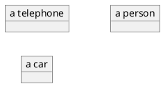
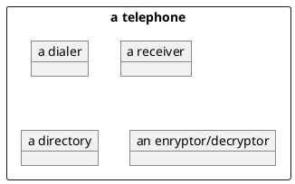
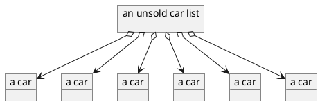
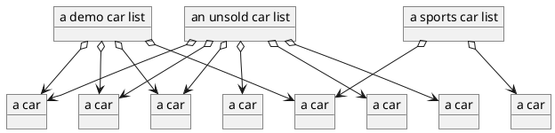

# 1 Object Structures

This chapter introduces **objects** and **object structures**.
It explains what they are and what to look for while studying them.

## 1.1 The Study of Object Structures

Object structures are mechanisms for keeping track of numerous objects in
software.
If a problem calls for more objects than can be reasonably identified
with individual names,
we must have a way to keep them organized so that they can be systematically located.
This is the role that object structures play:
They are objects that keep track of other objects.

Studying an object structure has two major components:
the what and the how.
Our first concern when encountering a new structure is to establish what
it is and what it does.
Then we will consider several competing answers to the question
“How can we set it up and write it so that it behaves that way?”
We will compare the various ways to implement each object structure and analyze the trade-offs involved.

As students and authors of object structures,
our attitude is that of service providers:
Somebody comes to us with a need for a way to keep track of objects for a specific purpose,
and our task is to provide them with object structures that fulfill those requirements.
To do that, we must be able to state clearly what our data structures expect from the rest of the software,
and what they will in turn ensure,
“if used as directed,”
as is often said on product boxes.
This methodology is known as “Design by Contract” [3, 4].
It greatly simplifies overall programming of the system by clearly dividing responsibilities among objects,
which are often written by different programmers.
Design by Contract will permit us to create truly interchangeable implementations of object structures,
so that we can not only pick the best implementation for a given utilization,
but also replace it with a different one should the circumstances of its use change.

The study of object structures grew out of what is called
“data structures.”
At the time this is written,
data structure courses still outnumber courses in object structures,
and no other object structure text is available.
Readers who have been exposed to data structure studies will find many similarities in the material
—after all, the object-oriented programming paradigm is closely
related to the data processing paradigm:
Both are procedural,
but the objectoriented one offers better organized software.
Although we study object structures instead of data structures,
we still concern ourselves with efficient use of time and space.
However, we keep a clear distinction between what makes something a certain type of object,
and the various ways of implementing it in software.

## 1.2 Objects

An object is a software component.
It often represents a physical object in 
“the real world,”
 but it can represent abstract objects equally well.
For example, there may be objects in the software system that correspond to specific automobiles,
or to telephones, or to springs and pulleys, or to people
—all of which are physical.
They can also correspond to intangibles:
bank accounts, theorems, telephone numbers, coordinates, and ages
(Figure 1.1).

#### Figure 1.1 Examples of objects.
Observe that their covers are opaque:
We cannot examine or manipulate their contents at our whim.

Figure 1.2 A peek inside a phone object.
A telephone contains its own instances of other objects.

As in the physical world,
objects may contain other objects.
For example,
a line object may contain two endpoint objects;
a book may contain chapters;
a telephone may contain a dialer, a receiver, and a number directory
(which in turn contains associations of labeled buttons and telephone numbers);
an automobile may contain an engine, doors, etc.
(Figure 1.2).

It is also possible for an object to keep track of other objects without actually containing them.
A person may be able to identify his or her father, mother, and house, 
without (one would certainly hope) containing any of them.
A car dealer may have a list of unsold cars,
and they are not physically contained in the list (Figure 1.3).

#### Figure 1.3 A list of unsold cars.
This object keeps track of other objects without actually containing them.

## 1.3 Object Structures

Object structures are objects that keep track of other objects,
generally without containing them,
such as the unsold car list in Figure 1.3.
An object may occur in several structures at once:
A student may be listed in several class lists;
a car may appear in the unsold list as well as a list of sports cars and a list of low mileage demonstration units (Figure 1.4);
a person may be a parent of several other persons.

Object structures differ in behavior.
A user picks a structure whose behavior makes it easiest to use for a given purpose.
Some object structures will keep objects in a specific order,
while others will not.
Some will allow access to all objects,
while others will only let us deal with objects at the edges.
Of those that order their objects,
some will do it chronologically
(based on when the object got added to the structure),
others will use an ordering scheme imposed by the objects themselves.
Once an object structure is selected,
trade-offs among its possible implementations need to be considered.
Object structures usually utilize internal objects to do “bookkeeping” and to keep track of the objects assigned to them,

Figure 1.4 Several object structures may keep track of the same object.

and the space they occupy may be a consideration in choosing an implementation.
These bookkeeping objects can be chosen to speed up certain aspects of an
object structure’s behavior
—usually at the expense of making other aspects less efficient.
Sadly, the “No Free Lunch” law does apply to object structures:
*There is always a trade-off*.

For pedagogical reasons,
this text groups object structures according to the overall design of their implementations.
Part II of this text will concentrate on **linear** object structures:
those where the tracked objects are organized along a straight line.
Part III will deal with keeping track of objects that are identifiable by some feature:
ordering them in the object structure according to that feature,
and using that feature (and, if applicable, the ordering)
to locate a specific object in a linear structure.
Part IV will study how searching can be sped up by using object structures organized in two dimensions rather than one.
We will use the remainder of Part I to learn how to create and interact with objects.
