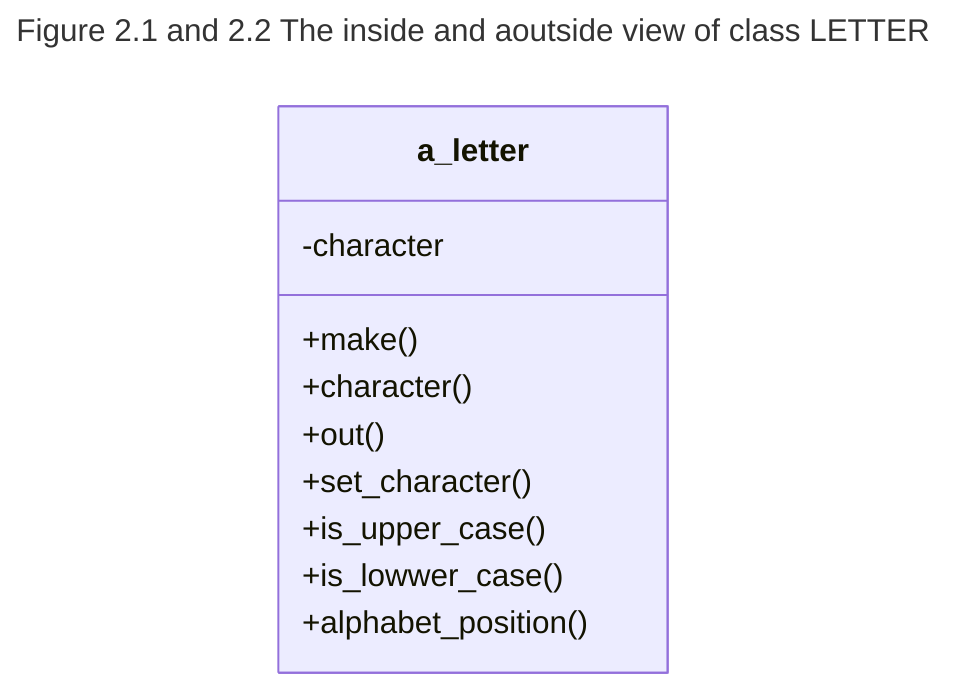

# Objects and Classes

The language used in this text is Eiffel. 
We chose Eiffel because it offers far-reaching support for the methodology presented. 
It is easy to learn and will not distract the student from the task at hand. 
While one may use a less suitable language in the workplace, once the foundation is laid, 
adapting to the syntax and limitations or advantages of a different language should be relatively easy; 
it is just a matter of reading a good book on that language and working with it. 

We will introduce aspects of Eiffel as needed. 
Readers who are uncomfortable with this approach are referred to Robert Switzer's "Eiffel: An Introduction"[#10]. 
The definitive book on the language Eiffel (meant to be detailed enough for Eiffel compiler writers) is Bertrand Meyer's "Eiffel: The Language"[#5]. 

As an illustration, we will create a class of letters 
(the kind that make up words, not the kind that get delivered). 
We will use letter objects in later chapters, 
where our object structures will need "guinea pigs" to track.

[#10]: TODO Reference for Eiffel an introduction

[#5]: TODO Reerence for Eiffil the language

## 2.1 Objects and Classes in Eiffel

How do we define objects? In Figure 1.4,  there were many objects, 
but they fell into two types: cars and lists. 
It would be madness to have to define every single car "from scratch," 
since they are all quite similar. 
What we do instead is define a whole class of *cars* by describing their common *features*. 
Features are the set of questions and actions that can be asked of an object. 
Cars have many features, 
so before we present a class definition, 
let us pick a more manageable example.
While we are at it,
we will create an object that we can easily use to test our object structures in the following chapters. 

For our purposes, 
a class of letters is very convenient 
(we can use it later as something to track with our object structures).
What can a letter object be asked?
As a start, it can be programmed as follows:


* To report the letter it stores as a character 
  (Characters are built into Eiffel,
  so they are off-the-shelf building blocks and donot need to be defined by us);
* To set the letter it stores to another character
* To report if it is upper case
* To report if it is lower case
* To identify its position in the alphabet
* To report a string representation of itself

The entire Eiffel definition of this class is presented in Listing 2.1. 
Note the naming and capitalization conventions: 

- Class names are all upper case. 
- The predefined entity /result is capitalized
    (we will encounter other predefined entities later). 
- Everything else is lower case. 
- Underscores are used to separate words within a name.


```python
      $ cd $TESTDIR
      $ ec -config ./2_code_examples/project.ecf -pretty ./2_code_examples/letter2.e | expand -i --tabs 2
      class LETTER
      
      inherit
        ANY
          redefine
            out
          end;
      creation
        make
      feature
        character: CHARACTER;
          --The character representation of the letter.
        make (initial: CHARECTER)
            --Create a new letter, load it with initial.
          require
          do
            character := initial
          end;
      
        set_character (new: CHARACTER)
            -- Change the letter to new.
          require (('a' <= new and new <= 'z') or ('A' <= new and new <= 'Z')) do
            character := new
          end;
      
        is_lower_case: BOOLEAN
            -- Is this a lower case letter?
          do
            Result := 'a' <= character and character <= 'z'
          end;
      
        is_upper_case: BOOLEAN
            -- Is this an upper case letter?
          do
            Result := 'A' <= character and character <= 'Z'
          end;
      
        alphabet_position: INTEGER
            -- Relative position in the English alphabet (A = 1).
          do
            if is_upper_case then
              Result := character.code - ('A').code + 1
            else
              Result := character.code - ('a').code + 1
            end;
          end;
      
        out: STRING
            -- String representation of this letter.
          do
            Result := character.out
          end;
      
      invariant
        either upper_or_lower: is_upper_case /= is_lower_case
      
      end
    
```

Eiffel is not case sensitive, 
so an Eiffel compiler will understand you if you write “Character” or “character” or even “CHaRaCHTeR” instead of the conventional “CHARACTER”
—but other Eiffel programmers may not.
Most software is written in multiprogrammer teams, 
and flaunting team coding conventions is an easy way to get fired.

In the text, 
**identifiers** (which is compilerese for “names”) 
are *italicized* (e.g., *character*) and 
**keywords** (“words defined for us by the compiler”) 
are shown in **boldface**  (e.g., **feature**).
When a compiler processes Eiffel code, 
it is usually all in one font, 
but some Eiffel code editors may offer this typesetting convention to programmers.

Everything between a “——” and the end of a line is a comment and is skipped by the compiler.
Semicolons (“;”) separate program statements. [^2]

Let us now step through the LETTER example.
As promised, 
we restrict ourselves to those aspects of Eiffel’s syntax and semantics that are relevant to the subject at hand.
We will use the notation “\<marker\>” to indicate a placeholder for programmer-supplied code.


### 2.1.1 Class Declaration

The format of a class declaration is:

```python
class <class name>
inherit 
    <parent class name>
    <feature adaptations>
creation
    <names of features that can initialize objects of this class>
feature 
    <feature declarations>
invariant 
    <what must be true about any object of this class>
end
```

### 2.1.2 Redefining an Inherited Feature

In an object-oriented software system, 
classes of objects are related to each other by means of **classification**.
Briefly (we will study this in more detail in Chapter 4), 
one class may be an heir of another (the latter is known as the parent of the former).

An heir inherits all features from its parent class, 
and may provide its own, additional features.  
It may also provide a better way of implementing some of the features that it inherited.  
When that happens, 
Eiffel insists that we explicitly mention that fact in the `inherit` clause.  
Otherwise, the compiler will assume that we accidentally used a feature name that we already had, 
thanks to our generous parent.  

But what is this class `ANY` anyway, 
and why do we need to inherit its features?  
Well, we do not have much choice in the matter.  
`ANY` is the ancestor of all programmer-supplied classes in an Eiffel system: 
all classes we write will inherit, directly or indirectly, from `ANY`.  
If we omitted the whole `inherit ... redefine ... end` part, we would be inheriting everything from `ANY` by default.  
`ANY` provides many useful features, 
and this automatic inheritance will save us from writing a lot of code.  

For example, the `print` feature we will use in Listing 2.2 is inherited by `LETTER_TESTER` from `ANY`.  
One of the features that `ANY` provides is `out`, which reports the preferred character string representation of the object.  
That representation is used by the inherited feature `print` to display the object.  
Feature `out` will be redefined in most of the classes we write because we will want to customize it so that each object’s string representation is most obvious to the reader.  

### 2.1.3 Feature Declarations

The section headed with keyword **`feature`** lists features of objects of class `LETTER` that may be requested by other objects.  
There are two types of features: entities and routines.  
Class `LETTER` contains only one entity: `character`, which is a member of the predefined class `CHARACTER`.  
Entity declarations take the form:

```python
<entity name>: <class name>;
```

After a declaration `e: C`, we say that entity `e` is of type `C`.  
This means that `e` may keep track of objects that are members of class `C`.  

Routines themselves generally fall into two categories:  
1. The kind that modify the state of the object (commonly referred to as “procedures”).  
2. Those that compute and return a value without altering the object (“functions”).  

Routine declarations take the form:

```python
<routine name>(<parameter declarations>): <type of Result> is ——Brief description.
require
    <what must be true before this routine is invoked>
local
    <declarations of entities local to this routine>
do
    <steps to take to perform this routine>
ensure
    <what is promised to be true after this routine exits>
end; ——<routine name>
```

If the routine takes no parameters, omit `(<parameter declarations>)`.  
If it does not compute and return a value, omit `: <type of Result>`.  
Parameter declarations look just like entity declarations, but they do not declare new entities.  
They name values that are passed to the routine by the object that invoked it.  
The first value passed gets the first name, the second gets named with the second name, and so on.  

Class `LETTER` does not have routines that require more than one parameter.  
The invoking object is responsible for seeing that the value passed through a parameter is allowable for that parameter’s type.  

The Boolean expressions (called “assertions”) listed in the `require` section are known as the preconditions of the routine.  
The object that requests this feature must assure that all the preconditions are true.  
Otherwise, the whole program may crash or produce unpredictable results.  
If there are no preconditions, then the whole `require` section can be omitted.  

The `local` section can be used to introduce temporary entities to use in the `do` section of this routine.  
It is also omitted when no local entities are needed.  
The statements in the `do` section are performed when the routine is invoked.  
If the routine computes a value, it must assign that value to the predefined local entity `Result`, from where it will be passed by the Eiffel system back to the calling object.  

The `ensure` section states what must be true after the routine is executed.  
We will discuss it in detail in Section 3.1.1.  

### 2.1.4 The Class Invariant

The expressions listed in the class invariant must be true about any object of that class.  
They define what it means for an object of this class to be valid.  
A feature may make these assertions temporarily untrue while it is executing, but it must restore their truthfulness before it is finished.  

[2]: Semicolons in Eiffel are optional in most situations.
However, the Eiffel style guidelines [5, Appendix A] recommend their use.*

### 2.1.5 The if Statement

The form of the if statement is

```python
if <condition> then
  <things to do if the condition is true>
else
  <things to do if the condition is false>
end;
```

The “else” part may be omitted.
(Programmers of Pascal, C, and other languages
that use the Algol-60 form of if, take note: There is no “begin,” and the end is
required.)

It takes only one condition to select one of two choices. In some situations,
there are several choices, distinguished by several conditions:

```python
if <Condition 1> then
  <things to do if Condition 1 is true>
elseif <Condition 2> then
  <things to do if Condition 1 is false and Condition 2 is true>
elseif <Condition n> then
  <things to do if Conditions 1—(n — 1) are false and Condition n is true>
else
  <things to do if Conditions 1—n are false>
end;
```

(The short form of the if statement is just the long form with zero *elseif* parts.)

### 2.1.6 Odds and Ends

“:=” is the assignment operator (pronounced “gets”). “<=” stands for “≤”. 
The Boolean operators *and* and *or* evaluate both of their sides.[^5]

[5]: The compiler’s optimizer may decide that only one side needs to be evaluated,
but a programmer cannot count on it. 
Eiffel also provides short-circuiting forms (“or else” and “and then”),
which will be discussed in Section 3.1.1.

## 2.2 Requesting a Feature of an Object

Another object would use our class declaration along the lines shown in Listing 2.2.
We already saw how to declare an object’s entity.
Listing 2.2 does something very similar to declare an entity called a_letter of type LETTER:
it uses a local section to declare an entity local to the feature test.
The name “a_letter” refers to that particular entity only within the scope of routine test.

### 2.2.1 Creating an Object

The statement `letter.make('J')`
instructs the Eiffel system to allocate a new object of class LETTER and makes
entity a_letter refer to that object.
Then it asks that object to initialize itself
by executing the creation routine make(initial: CHARACTER) with initial set to: `'J'`.

The purpose of a creation routine is to turn a blank blob of memory into an
object that is a valid member of this class 
(in other words, one for which the class invariant is true).

```python
class LETTER_TESTER
creation 
  test
feature
  test is
    ——Test an object of class LETTER.
  local
    a_letter: LETTER;
  do
    a_letter.make('J');
    print("The letter ");
    print (a_letter);
    print(" is number ");
    print (a_letter.alphabet_ position);
    print(" in the alphabet .%N");
    check
      a_letter.is_upper_case;
    end;

    a_letter.set_character('k');
    print("The letter ");
    print (a_letter);
    print(" is number ");
    print (a_letter.alphabet_position);
    print(" in the alphabet.%N");
    check
      a_letter.is_lower_case;
    end;

    print("%NTest finished. %N");
  end; ——test
end —-class LETTER_TESTER
```

Listing 2.2 An example of using an object of class LETTER.

### 2.2.2 Requesting a Feature

The form of requesting a feature of an object[^6] is

```python
<anything that identifies the object>.<feature name>(<actual parameters>)
```

If there are no parameters, omit the `(<actual parameters>)`.

Usually, an entity name will appear to the left of the dot,
but it can be anything that identifies an object. 
For example, “a_letter.character” results in an object of type CHARACTER,
and we can request features of it without assigning it to an entity.
Thus, 

```python
a_letter.character.code.out
```

performs the following three actions:

1. Feature character is requested of the LETTER object identified by entity a_letter,
  and it results in an object of type CHARACTER.

2. Feature code is requested of that CHARACTER object,
  and it results in an object of type INTEGER
  (whose value is, on most systems, the ASCII representation of that character).

3. Feature out is requested of that INTEGER object,
  and it results in the string of decimal digit characters that a human reader would interpret as that number.

It is important to know what exactly happens when a string of feature requests like this is encountered,
but all one needs to remember is that only one feature can be requested of an object at a time.
With this in mind, there is only one possible way to interpret the statement in the above example:
`((a_letter.char-acter).code).out`
(in fact, it could be written with the parentheses, but they are not needed).
When an object requests a feature that happens to be an entity,
it may use its value but may not change it.
For instance,

```python
print(a_letter.character)
```

is perfectly reasonable, but

!!! Warning
    Invalid Eiffel!   `a_letter.character := 'Q’`

is illegal. 

!!! Tip
    This has changed in latter versions of eiffel with the getters and setters.

Thus, features that are entities behave exactly like features that are functions with no parameters.

This allows an author of a class to change the implementation of a feature from computing it “on the fly” using a function to storing it in an entity,
without bothering the objects that use that feature.


It is also possible to omit the “<anything that identifies the object>.” part.
In that case, the feature is implicitly requested of the object that is executing the statement. For example,

```python
print(a_letter);
```

requests the feature print of the current object
(the member of class LETTER_TESTER that is executing that line).

There is also a way to refer to the current object explicitly.
There is an automatic feature called “Current” which always refers to the current object.[^7]
Thus, another way to write the above print request is

```python
Current.print(a_letter);
```


[7]: It is safe to pretend that Current is inherited from ANY,
    though for reasons too technical to discuss here it is not.

### 2.2.3 Creation Routines vs. Regular Features
In the LETTER example,
routines `make(initial:CHARACTER)` and `set_character (initial: CHARACTER)` are very similar.
Yet, they are requested quite differently in our example:

```python
{a_letter}.make('x');
```

versus

```python
a_letter.set_character(' x’ );
```

`{a_letter}` creates a blank object and `.make(’ x’ )` initializes it.
We could not have just said `a_letter.make('x')`
(without the `{ ..}`), 
because `a_letter` was not referring to any object of class LETTER yet!

Outside of a creation statement, 
all features (creation or noncreation) can be requested of valid objects,
and only of valid objects.
(Recall that an object is valid if and only if it has been created and it obeys its class invariant.)

Creation routines, however, are special. 
They may be used in creation statements, 
and the invariant is moot until a creation routine is finished initializing the object.

Thus, though make and set_character happen to perform the same actions in their do section,
they are intended for fundamentally different purposes:
make is intended to initialize a newly created object,
while set_character is meant to modify one that already exists.

But despite the fact that we intend to use them in different circumstances,
make and set_character are identical.
As a shortcut, Eiffel provides a way to declare them both at the same time, as shown in Listing 2.3.

Note that we are still restricted to using the name `make` in creation statements,
since it was the only name we listed in the creation part of the class LETTER declaration.

```python
make, set_character(contents: CHARACTER)
  ——Make the letter contain contents.
  require
      (‘a’ <= contents and contents <=     'z')or
      (’A’ <= contents and contents <=     'Z')
  do
    character := contents;
  end; ——make, set_character
```
[Listing [2.3] When two routines happen to do the same thing, they can be declared simultaneously]

### 2.2.4 How print Works
The routine `print(x)`,
inherited from class ANY,
prints out the string that is the result of `x.out`.
If the object passed to `print` is a *STRING* that contains a percent sign `(’%’)`
(as does the constant string `" in the alphabet .%N"`),
then the feature out defined in class STRING will perform some formatting transformations. 
For instance, the `%N` gets replaced with a “new line” output command
(usually a “carriage return, line feed” sequence).

## 2.3 Inside, Outside
Objects have solid shells.
It is not possible for one object to manipulate entities within another object without the latter’s cooperation.
The feature section can specify what types of objects may request the features listed within it by listing those types in curly braces (`{...}`)
after the word `feature` 
(for example, `feature {LETTER}`).
Features listed in a `feature {X}` part may be requested by an object only if its class is X or an heir of X.
The predefined type `NONE` is used to protect features that are nobody’s business but the object’s: `feature {NONE}`.
If the type restriction is omitted, then `feature {ANY}` is assumed.
Since all classes are heirs of ANY, any object may request those features.
The external view of a letter object,
such as the one identified by entity `a_letter` of [Listing 2.2],
is shown in Figure 2.1:


[Figure [2.1] The outside view of an object of class LETTER]

The hard shell hides all internal features,
but buttons are provided for requesting the advertised ones
(called “exported features”).

On the other hand, the inside view
(visible only to the program segments within the definition of the object’s class and of the heirs of its class),
shown in Figure 2.2,
includes the fact that character is an entity,
thus allowing assignments of objects to it.
It would also include all the `feature {NONE}` features, if we had any.

## Summary
Objects are software components encased in shells.
An object’s internal representation cannot be accessed directly from the outside; 
instead, one utilizes the features of an object to communicate with it.
When a feature is requested,
the object decides how to accommodate the request.
Objects that behave the same way under the same circumstances are members of a class.
A class definition in Eiffel specifies what features objects in that
class make available to other objects,
and how those features are implemented.

The class definition also includes the class invariant,
which is a set of Boolean expressions (assertions) that are true about all objects in that class.
An object that obeys its invariant is said to be valid.
Creation routines take an uninitialized new object and make it valid.
All features of the class must maintain the validity of its objects.

## Exercise

1. Use your Eiffel system to compile LETTER and LETTER_TESTER and run LETTER_TESTER’s test feature.

TODO_NEXT_START_PAGE 46
make a script tha takes the above numbe runs pdftotex from page 42 + 3 and appends it to the text where the above line was done, bonus poing to get chrome to open the book in that page.