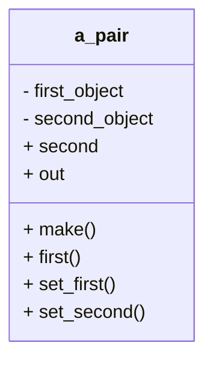

# 3 Pairs
The first object structure we consider is a PAIR.
It is very simple:
It keeps track of two things (Figure 3.1).
It is hardly résumé material, 
but it will serve as an example for creating more complicated object structures,
and it will give you an opportunity to get accustomed to the particular programming environment you will use for developing object structures.

## 3.1 What a PAIR Is and What It Does

In order for a pair to keep track of two objects,
what do we want a PAIR object to do once it is created? 
There is not much that it can do: 
It can make a given object its first object 
(we will call that feature “set_first”);
it can make a given object its second object (“set_second”);
it can tell us what objects are currently
its first and the second objects (“first” and “second”).

We can also ask it to represent itself as a string using the common notation for pairs: “(<first>,<second>).” 
This gives us the outside view of class PAIR shown in Figure 3.2
and also a skeleton of the class definition in Listing 3.1.



Figure 3.1 A PAIR object. Its job is to keep track of two objects.
Figure 3.2 The outside view of an object of class PAIR.

With this skeleton,
we immediately run into a problem:
When we pass the objects as parameters to features set_first and set_second,
we have to specify their types, but we do not know them.
Similarly, we do not know what types of values features first and second return.
We do not even know yet if the two objects will be of the same type!
Since it is more flexible to allow them to be of different types,
we will design PAIR that way.
Obviously,
whatever type `set_first` takes as its parameter must be the type of `first`,
and the same goes for `set_second` and `second`.
Thus, we will set up class `PAIR` to depend on two type parameters
(called “generic parameters”),
which we will call “ITEM1” and “ITEM2”.

```python
class PAIR
create make
feature
    first:???;
        ——First item.
    second: ???;
        ——Second item.
    make
        ——Initialization.
    do
        deferred
    end; ——make

    set_first (an_item: ???)
        ——Track an_item as first item.
    do
        deferred
    end

    set_second (an_item: ???)
        ——Track an_item as second item.
    do
        deferred
    end; ——set_second

    out: STRING
        ——Printable representation of the pair.
    do
    ...
    end; ——out
end —-—class PAIR
```

Listing 3.1 Definition of class PAIR, feature list.

The class declaration starts with `class PAIR[ITEM1,ITEM2]`,
and then uses ITEM1 and ITEM2 as the types of the first and the second item in the pair, respectively.
(In general, we will use the term “item” to refer to an object kept track of by our object structure.)
This leads to the class skeleton in Listing 3.2.

```python
class PAIR[UITEM1,ITEM2] 
    inherit
        ANY
    redefine
        out
    end;

    create
        make
feature
    first: ITEM1;
        ——First item.
    second: ITEM2;
        ——Second item.
    make
        ——Initialization.
    do
        deferred
    end; ——make

    set_first (an_item: ITEM1)
        ——Track an_item as first item.
    do
        deferred
    end; ——set_first

    set_second (an_item: ITEM2)
        ——Track an_item as second item.
    do
        deferred
    end; ——set_second

    out: STRING
        ——Printable representation of the pair.
    do
        deferred
    end; ——out
end ——class PAIR
```
Listing 3.2 Definition of class PAIR, take 2:
now using type parameters ITEM1 and ITEM2.

### 3.1.1 The Contract

Having established what a PAIR object should do,
we must make it clear when
it can be used and what can be expected of it.
This clarification will form a **contract** between the programmer who writes class PAIR (“the supplier”)
and the programmer who uses objects of that class (“the user”).
