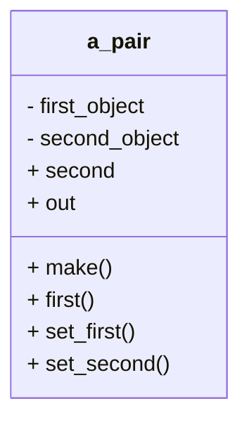

# 3 Pairs
The first object structure we consider is a PAIR.
It is very simple:
It keeps track of two things (Figure 3.1).
It is hardly résumé material, 
but it will serve as an example for creating more complicated object structures,
and it will give you an opportunity to get accustomed to the particular programming environment you will use for developing object structures.

## 3.1 What a PAIR Is and What It Does

In order for a pair to keep track of two objects,
what do we want a PAIR object to do once it is created? 
There is not much that it can do: 
It can make a given object its first object 
(we will call that feature “set_first”);
it can make a given object its second object (“set_second”);
it can tell us what objects are currently
its first and the second objects (“first” and “second”).

We can also ask it to represent itself as a string using the common notation for pairs: “(<first>,<second>).” 
This gives us the outside view of class PAIR shown in Figure 3.2
and also a skeleton of the class definition in Listing 3.1.



Figure 3.1 A PAIR object. Its job is to keep track of two objects.
Figure 3.2 The outside view of an object of class PAIR.

With this skeleton,
we immediately run into a problem:
When we pass the objects as parameters to features set_first and set_second,
we have to specify their types, but we do not know them.
Similarly, we do not know what types of values features first and second return.
We do not even know yet if the two objects will be of the same type!
Since it is more flexible to allow them to be of different types,
we will design PAIR that way.
Obviously,
whatever type `set_first` takes as its parameter must be the type of `first`,
and the same goes for `set_second` and `second`.
Thus, we will set up class `PAIR` to depend on two type parameters
(called “generic parameters”),
which we will call “ITEM1” and “ITEM2”.

```python
class PAIR
create make
feature
    first:???;
    second: ???;
    make
    do
    end; ——make

    set_first (an_item: ???)
    do
    end

    set_second (an_item: ???)
    do
    end; ——set_second

    out: STRING
    do
    ...
    end; ——out
end —-—class PAIR
```

Listing 3.1 Definition of class PAIR, feature list.

The class declaration starts with `class PAIR[ITEM1,ITEM2]`,
and then uses ITEM1 and ITEM2 as the types of the first and the second item in the pair, respectively.
(In general, we will use the term “item” to refer to an object kept track of by our object structure.)
This leads to the class skeleton in Listing 3.2.

```python
class PAIR[UITEM1,ITEM2] 
    inherit
    redefine
    end;

    create
feature
    first: ITEM1;
    second: ITEM2;
    make
    do
    end; ——make

    set_first (an_item: ITEM1)
    do
    end; ——set_first

    set_second (an_item: ITEM2)
    do
    end; ——set_second

    out: STRING
    do
    end; ——out
end ——class PAIR
```
Listing 3.2 Definition of class PAIR, take 2:
now using type parameters ITEM1 and ITEM2.

### 3.1.1 The Contract

Having established what a PAIR object should do,
we must make it clear when
it can be used and what can be expected of it.
This clarification will form a **contract** between the programmer who writes class PAIR (“the supplier”)
and the programmer who uses objects of that class (“the user”).

A **contract** consists of five components:

1. The names of public features;
2. The types of parameters the public features take and the types of values in which they result;
3. The preconditions of the public features, which specify what must be true when a feature is invoked (the user’s obligation);
4. The postconditions of the public features, which specify what can be
expected to be true after a feature is finished doing its work
(the supplier’s obligation); and
5. The class invariant, which specifies (using only the public information,
of course)
what must be true about any valid object of this class.

Postconditions are listed in an ensure section at the end of a feature declaration.
Its syntax is identical to that of the require sections we used in Chapter 2 to list the preconditions.

Let us consider each feature’s part of the contract.
The first is make, a creation routine.
What distinguishes creation routines from other features is their
ability to work in situations where the object is not valid
(i.e., the invariant is unsatisfied),
as is often the case right after memory is allocated for the new
object.
A creation routine takes a blank blob of memory and turns it into a
valid object.
In fact, all features —not just creation routines— 
have to leave the object that executes them in a state where the class invariant is true.

Since `make` accepts its task under any circumstances,
it has no preconditions and hence no require section.
Since it does not promise anything more
than the standard “the object is valid” condition,
it has no postconditions and no ensure section.

Next is `set_first`.
Since it is not a creation routine,
it will be executed only by objects that are already valid.

Should it require its parameter, `an_item`, to be valid also? 
Do we care if we are told to make the first item of a `PAIR` void?
We don’t if the user only plans to retrieve it back by requesting the feature `first`:
In this case, we can just follow the “garbage in, garbage out” principle.
Only if the user tries to get the string representation of the pair
(using the out feature)
will there be trouble,
but the user may have no plans to do that.
Thus, we will not insist on getting valid items through set_first,
and put in a check for void items into feature out,
displaying something reasonable in that case
(we will attend to out a little later).
This leaves set_first with no preconditions.

How about the postconditions? What can we promise to the user?
We can definitely promise that after the set_first(an_item) is performed,
a first request will result in the same an_item.

Can we promise anything about second?
We can specify that there will not be any side effect on the second item in the pair.
This would preclude the kind of pair-based structures in which the objects first and second are interconnected in a certain way,
so in general we don’t want to make such a promise.
However, let us go ahead and make it just to see how it can be done.

We use the operator old, which returns the value of an expression as it was
before the routine was invoked:

``` note
    work in progress
    ```pythan
    ensure
    second_is_unchanged: second = old second;
    ```

(We label the assertions with the names “first_was_replaced” and “second_is_ unchanged” so that if one of them is violated when we execute the program, the error message will include its label.)

So far so good, but second_is_unchanged is not quite right.
All it says is that the reference to the item in the second position will be unchanged,
i.e., that the entity second is tracking the same item as before.
It does not say that the item’s value will be unchanged.
For that, we need to use the standard
feature    `is_equal: “second.is_equal(old second)”`
(inherited from ANY).
So, our next attempt at the postcondition is

!!! note
    work in progress
    ```python
    ensure
    ```

This assumes that is_equal is a feature of class ITEM2.
Since ANY provides that feature to its heirs, that is a safe bet.
If a class refuses to provide is_equal, its members cannot be tracked by our pairs.

Unfortunately, second_is_unchanged is still wrong.
In fact, there are two problems with it.
The first is that when set_first is requested of a newly made
pair,
second will not be tracking a valid item yet.
And since we have decided to
allow the user to track invalid items in pairs,
this situation can happen at any
time.
But we cannot request is_equal of a void object!
To guard against that situation,
a way to say “item is void” is needed.

Eiffel provides, through class ANY,
a standard object tracked by the feature “Void” that has a unique purpose:
It is the only object that has the right —nay, obligation!—
to be invalid.
If an entity does not yet refer to a valid object
(for example, when it is not initialized by a creation routine),
it is automatically made to refer to Void’s object.
In fact, to make entity *e* let go of the object
of which it keeps track, we say `e := Void`.
Thus, an entity that keeps track of
Void’s object is said to be “invalid” or “void” and we can use the test `e = Void`
to identify that situation.
If there is nothing else keeping track of the object that used to be identified by `e`,
that object is automatically recycled:
 The memory it occupies is released for other uses
(this automatic activity is known as **“garbage collection”**).

But can’t an entity be tracking an object that is not void,
but is invalid because it got messed up somehow?
No. Impossible.
If such was the case,
the program would have stopped as soon as the class invariant of that object was violated.
If it reached the point where we are using the object,
it must be either valid or void.

Given the feature *Void*,
there are two equivalent ways to express that `second` should be equal to    `**old** second` whenever second is a valid item:

```python
second_is_unchanged: second /= Void **implies** second.is_equal (**old** second);
```

(“/=” means “does not equal” in Eiffel) and

```python
second_is_unchanged: second = Void or else second.is_equal (old second);
```

Both **implies** and **or else** (as well as **and then**)
only evaluate the expression on their right if the expression on the left does not decide the result.
Thus, their meanings are as shown in Table 3.1.
Using this kind of expression allows us to evaluate `second.is_equal(old second)` only when `second /= Void`.
Since /x **implies** y/ is logically equivalent to /not x or else y/,
the choice between them is a matter of taste.
I prefer the “implies” form.

Table 3.1 Eiffel operators that do not evaluate their right-hand side unless it is necessary.
| Operator | Meaning |
|----------|---------|
| <left> and then <right> | Compute <left>. If it is **false**, then the answer is **false**, else compute <right> and use its answer.|
|<left> or else <right>| Compute <left>. If it is true, then the answer is true, else compute <right> and use its answer. |
|<left> implies <right>| Compute <left>. If it is false, then the answer is true, else compute <right> and use its answer. |

That takes care of the first problem.
The second problem is more subtle.
The tricky part is `**old** second`.
Since second merely stores the reference to 
the tracked object, `old second` is just the old value of that reference.
If the object changed but the reference to it didn’t,
then both second and old second refer to
the same object,
and of course it will report that it is_equal to itself!
If we are to state that the object did not change,
we will have to squirrel away a copy of it:

```python
ensure
    first_was_replaced: first = an_item
    second_is_same: second = old second
    second_is_unchanged: second /= Void implies second.is_equal(old deep_clone(second));
```

The feature `deep_clone` is also provided by our ancestor `ANY`.
That will do it for set_first.

Feature `first`, being either an entity
(as in our current implementation)
or a function, should not modify any entities of the PAIR object.
Although we cannot specify postconditions for entities in Eiffel
(preconditions and postconditions are only possible for routines),
“nothing about this object changed” is
always an assumed postcondition with entity and function features.
(Eiffel programmers almost never allow their functions to change the object,
although it is permitted by the language.)

What works for `set_first` and `first` also works for `set_second` and `second`,
except that the roles of first and second are reversed in the postconditions.

While first and second do not care if the two items are valid, `out` does:
If even one of the items is invalid,
it will not be able to build a string representation for the pair.
Thus, we would want the following preconditions for out:

!!! Warnining Invalid for out
```python
require
    first_not_void: first /= Void;
    second_not_void: second /= Void;
```

Too bad—we cannot have them.
Since our out is a redefinition of the one inherited from ANY,
it is not allowed to have preconditions that are more stringent than those of the original out.
This restriction is due to the relationship between the contracts of a parent and an heir,
which we will study in Chapter 4.
Part of that relationship is that an heir cannot refuse to respond to a feature request under circumstances in which the ancestor would respond to it.

This means that we may be faced with void items.
There are two ways to deal with a request to produce the string representation of a pair that contains a void item.
The first is to let an error be generated when we request the out
feature of the void item.
This would only happen if one of the preconditions
desired above had been violated.
This, of course, is no solution: Since we did not tell the user in the contract not to invoke out when either of the items is void,
we are responsible for making out work without crashing the program
even with one or both items being void.

The other way is to fulfill the contractual obligation—buckle down and
deal with it.
We could use a predefined string to represent void objects.
How about “"-void-"”?
That is what we will do.

Because out, being a function,
does not change the PAIR object or anything it tracks,
it has the same implied postconditions as `first` and `second` and any
other function.
Finally, we need to consider what to list in the class invariant for `PAIR`:
nothing.
As long as a pair exists as a `PAIR` object, it is valid
(even, as we saw, if one or both of the items it tracks are void).
Thus, we can omit the **invariant** section of the class definition.

Combined with the class skeleton we had earlier,
all these assertions give us a skeleton that can serve as the contract (Listing 3.3).
This completes the definition of PAIR.

```python
       $ cd $TESTDIR
       $ ./code-listing for ./ch3_code/pair.e ./ch3_code/ch3_code.ecf
       note
         description: "Summary description for {PAIR}."
         author: ""
         date: "$Date$"
         revision: "$Revision$"
       
       class PAIR [ITEM1, ITEM2]
       
       inherit
       
         ANY
           redefine
             out
       
           end
       feature
         first: detachable ITEM1 -- First item.
         second: detachable ITEM2 -- Second item.
       
         make
             -- Initialization.
           deferred
       
           end
       
         set_first (an_item: ITEM1)
             --Track an_item as first item.
           deferred
           ensure
             first_was_replaced: first = an_item
             second_is_same: second = old second
             second_is_unchanged:
               attached old first as old_first
               and then attached first as new_first
               implies
               new_first.is_equal (old_first.deep_twin)
           end
       
         set_second (an_item: ITEM2)
             --Track an_item as second item.
           deferred
           ensure
             second_was_replaced: second = an_item
             first_is_same: first = old first
             first_is_unchanged:
               attached old first as old_first
               and then attached first as new_first
               implies
               new_first.is_equal (old_first.deep_twin)
           end
       
         out: STRING
             --Printable representation of the pair
             --(void items replaced with "-void-").
           do
             if attached first as x and attached second as y then
               Result := x.out + y.out
             elseif attached first as x and not attached second then
               Result := x.out + "-void-"
             elseif not attached first and attached second as x then
               Result := "-void" + x.out
             else
               Result := "-void-" + "-void-"
             end
           end
       
       end
```
Listing 3.3 Definition of class PAIR, take 3: the contract.

### 3.1.2 How Detailed Should the Contract Be?

On the one hand, the more detailed the contract is,
the less potential there is for misunderstanding between the user and the supplier.
As suppliers, we have a vested interest in making the preconditions as detailed as we can;
it is in the interest of the users to make the postconditions as detailed as possible.
It is also easier to test the program with detailed contracts:
As a tester object exercises feature requests in our object structure,
the preconditions and postconditions are checked automatically.

On the other hand, most of the postconditions are of the form “nothing
changes” or “almost nothing changes.” 
In the case of a PAIR object, where there were only two features that could have changed to begin with, 
it takes three postconditions each in two procedures to state that fact.
As our object structures get more complicated, this could get out of control.
There is, however, a shortcut in Eiffel that we can use, and we will consider it when the time comes (in Section 6.4.1).

As with any contract, it is very tempting to adopt global conventions and
leave things unmentioned explicitly.
As with any contract, doing so increases the risk of things going wrong.
In general, we want to make the contract as detailed as possible.
One exception to this rule is the implicit “nothing changed” postcondition for any function.
There are two reasons for this exception:

1. Writing a function that causes changes
(also called “side effects”) is very poor engineering:
If such a function is used twice in one expression, 
one cannot be sure which request the compiler will issue first,
and thus you may get different results from running the same program under different compilers.

2. Since you cannot attach a postcondition to an entity, attaching one to any feature advertises it in the contract as a function and not an entity.
That, however, should remain an implementation decision:
If at all possible, we want to leave open the option to store that feature as an entity within the object instead of computing it on-the-fly as a function.

Also, the elaborate scheme we have derived for specifying “nothing else
changes” tends to be too restrictive and too cumbersome to be useful.
It is a good illustration on how the keyword old can be used in postconditions,
as well as how important it is to understand the distinction between a reference to an object and the object itself.
However, it is rarely used by Hiffel programmers,
and we will come back to it only once, in Section 6.4.1, when we look at another potentially useful but rarely used technique.

## 3.2 How a PAIR Does What It Does

Now that we have defined what a PAIR is and what it does (the definition),
we can consider how it does it (an **implementation** of *PAIR*).
Most object structures can be implemented in several good ways, but there is really only one good way in Eiffel to implement a pair of items of arbitrary types.
Thus, we will only consider one implementation of PAIR in this text.

