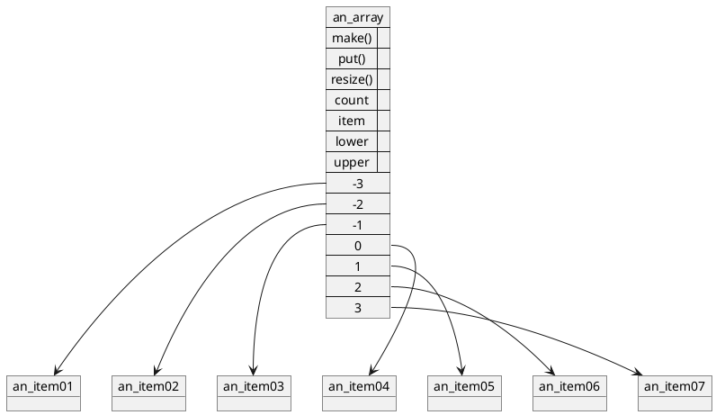
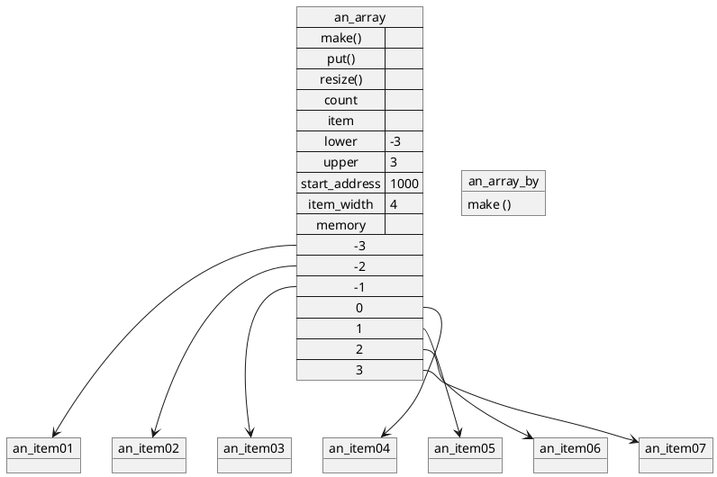

# Arrays

Arrays are the one object structure in this text that we will not be implementing because it is already provided to us in standard Eiffel libraries,
and described in the language and library references [5, 6].
We will, however, discuss one possible way to implement it.
We study class ARRAY because we will be using it to implement other object structures in later chapters.

## 5.1 What an ARRAY Is and What It Does

An array keeps track of objects by their relative positions within the array.
The positions are numbered consecutively,
and the range of position numbers is specified when an array is created.
For example, after the entity declaration
```python
x: ARRAY [SOME_TYPE};
y: ARRAY [SOME_OTHER_TYPE)];
```

the statement

```python
x.make (1,100);
```

creates an array of 100 positions (“capacity 100”),
in which position number 1 (“lower bound”) is first,
and position number 100 (“upper bound”) is last,
and attaches it to entity x.
Similarly,

```python
create y.make (-3,3);
```

attaches to *y* a new array of capacity 7
(don’t forget to count position 0!),
where the lowest numbered position is number -3,
and the highest is number 3.

To make position *n* of an array *x* refer to object *obj1*,
we use the “put (<what>,<where>)” feature, for example:

```python
x.put (0bj1,75);
```

makes position 75 of array x track object obj1.
Feature *item (n)* returns the object tracked by position n.
For example,

```python
print (x.item (75));
```

requests the out feature of object at position 75 and displays the result.
As a shortcut, we say that an object is “at position *n* in array *x*”
if it is tracked by that position of that array.

Other features of class ARRAY have to do with its dimensions:
*lower* and *upper* result in the number of the lowest numbered position
(the lower bound)
and the highest numbered position
(the upper bound);
*count* returns the number of positions in the array
(its capacity, always equal to upper - lower + 1);
and *resize(new_lower,new_upper)*
changes the bounds of an *ARRAY* object,
copying it to a less crowded spot in memory if needed
(as discussed in Section 5.2).
Figure 5.1 shows an example of such an array.

The full interface to the standard ARRAY class is given in The Eiffel Library Standard [2] and reproduced in Appendix B.



Figure 5.1 An external view of a typical ARRAY object.
This one was created using `make (-3,3)` and then an item was put into each of its positions.

## 5.2 One Way for an ARRAY to Do What It Does

We do not know exactly how *ARRAY* does what it does.
Implementation of class *ARRAY* is up to the supplier of the Eiffel compiler.
However, most array implementations use similar techniques, and we can describe them in general.

Consider laying all the positions of array x in memory,
starting at memory location a.
Suppose that each array position occupies w memory units
(for example, 4 bytes).
Then, position `x.lower` is at location `a`, position `x.lower + 1`
is at location `a + w`, position `x.lower + 2` is at location `a + 2w`,
`x.lower + 3` is at `a + 3w`, and so on.
The highest numbered position of x will be at location `a + (x.count - 1)w`.

Thus, position p of array x will be at memory location

```python
a + (p - x.lower)w
```

Given a position number, subtracting the lower bound gives us how many positions from the beginning of the array one must move to get to that position.
If we multiply that number by the width of each position,
we get the distance from the beginning of the array in memory to the position we seek
(as demonstrated in Figure 5.2).


Figure 5.2 A typical internal view of the ARRAY shown in Figure 5.1.

This mechanism is very fast,
and it works for position `x.lower` as quickly as for `x.upper` or any position between.
Most array implementations use this technique.

However, in order for it to work, all positions must be lined up in a continuous segment of memory.
Usually, this is not a problem.
The only place this restriction is noticeable is in the implementation of `resize`:
If the new lower bound is lower than the old one, or if the new upper bound is higher than the old one,
a different location for all the positions may have to be found
(since there may not be any vacant memory immediately below or above the space occupied by the array),
requiring us to move all those object references to the new location.
This is a slow operation, and it gets slower as the array gets larger
(the time it takes to perform it is directly proportional to the size of the array).
Thus, `resize` should be used sparingly.

# Summary
An `ARRAY` keeps track of objects by numbering them.
Class `ARRAY` is part of the base class library in Eiffel.
It is implemented in such a way that object number `n` can be located directly,
without scanning the array.

# Exercises
1. What can a PAIR object do that an ARRAY object of capacity 2
(e.g., the result of `create a.make (1,2)`) cannot?

2. Write a class ARRAY TESTER and test the class ARRAY that came with your Eiffel system.
