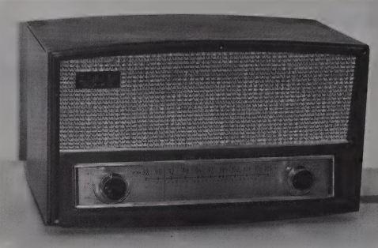
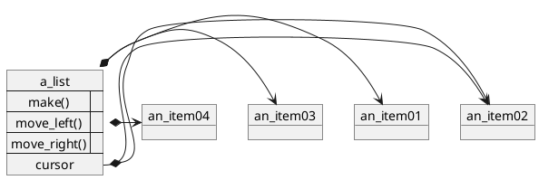
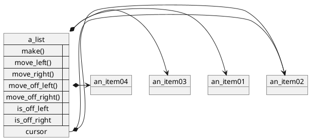
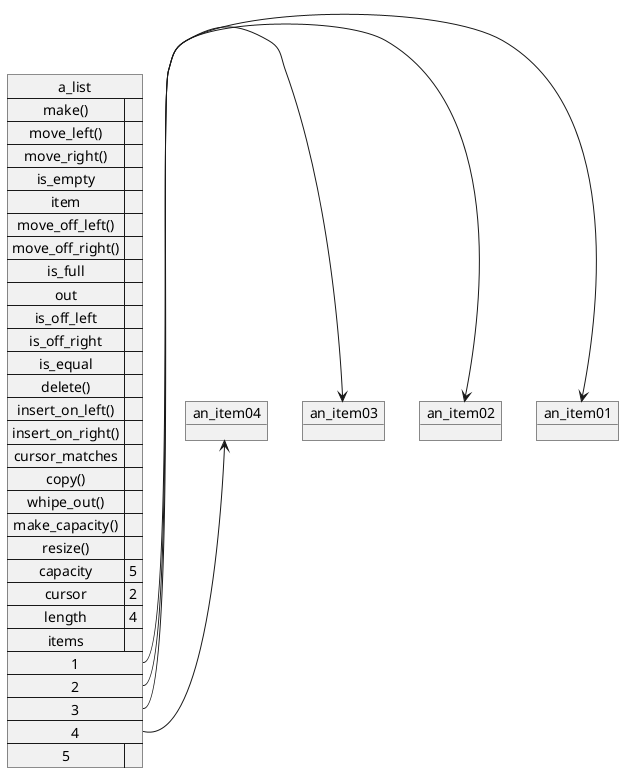
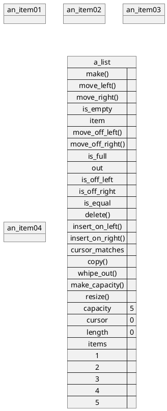
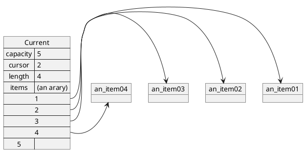
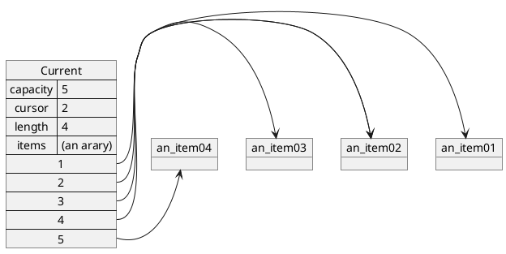
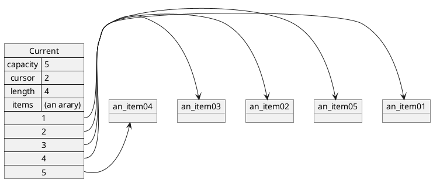
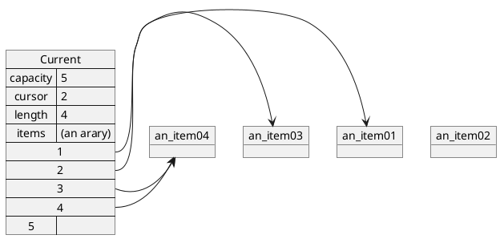
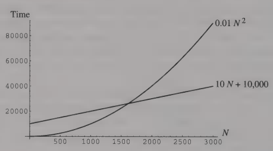

# 6 Lists

Lists are the first nontrivial object structure we will write.
In this chapter,
we will consider what a list is and does,
and then look at one variation of how it can do it:
by using an array.
In Chapter 7, we will do two more implementations.

Eiffel systems usually come with at least one LIST class;
we will be creating our own instead of using those.
Our version of LIST was inspired by their predecessor,
presented in [3],but it offers a slightly different interface.

## 6.1 What a LIST ls and What It Does
While an ARRAY keeps track of objects by an absolute position
(e.g., “the object at position 7”),
a LIST organizes them by relative position (“the object immediately to the right of this object”).
Positions in a *LIST* are *not* numbered.

To support this type of interface, we need to be able to, figuratively,
put a finger on a position in the list and say “I want *this* one!” How can we do that
without numbering the positions and specifying the number?
Consider a radio.
Nowadays, there are radio tuners where one can simply  punch in the frequency of a station
(e.g., “89.5”),
or even just its call letters (“KENW”).
That is the equivalent of just saying “object at position 7”
(well, position 89.5 in this case\).

Believe it or not, radios were not always like that.
They looked like the one shown in Figure 6.1.
A long strip of paper had the stations’ positions marked on it,
but they were so imprecise that the best one could use them for was educated guessing.
It was not possible to just point to a place on this rough scale and get the desired station.
Instead, there was a needle that claimed that if you interpolated between the nearest markings on the scale and figured out what number would appear right under the needle,
you would get the frequency of the carrier wave that was bringing you the noise you were hearing.
To select a different station, you turned a knob.


Figure 6.1 A good old-fashioned radio.

If you turned it clockwise, the needle would move to the right;
turning it counterclockwise would move the needle to the left.
You knew you were at a station when the proportion of music to noise was at its best.

In fact, the radio was perfectly operable without the scale:
just turn the knob to change stations in either direction.
Even if you found yourself in a strange city with a receiver in which the scale had fallen off,
you could still make perfectly good use of the radio:
Move the needle all the way to the left,
so that it is off the scale on the left side
(“off-left,” for short), then move it one station to the right,
see if you want to listen to it, and keep moving to the right,
one station at a time, until you find one you like.

We can use a similar user interface to navigate through a LIST:
We start out on the left side
(off-left), and move to the right until we are at the item we want
for whatever reason we want it.
We may end up going all the way offright.
Inside the LIST we also have a needle, but, being sophisticated computer scientists,
we call it a “cursor” instead of a “needle.”
(A **cursor** is something that indicates current position.)

### 6.1.1 Moving the Cursor

Thus, we start out with an external view of a LIST shown in Figure 6.2,
with features *move_left* and *move_right*.
The precondition for *move_left* is that we can be anywhere but off-left,
and for *move_right*, we can be anywhere but off-right.
To be able to specify these preconditions, 
and to give our user a way to check whether or not the cursor is off-left or off-right,
we supply Boolean features *is_off_left* and *is_off_right*.


Figure 6.2 External view of a LIST object,
take 1: obvious movement routines.
(This one tracks four items, the cursor is on the second one.)

```python
class LIST [ITEM]
create make
feature
    is_off_left:BOOLEAN is
    do

    end;

    is_off_right: BOOLEAN is
    do

    end;

    move_left is
    require
    do

    ensure
    end;

    move_right is
    require
    do

    ensure
    end;

    invariant
end;
```
Listing 6.1 Definition of class LIST, take 1: essential movement routines.


This leads us to the skeleton in Listing 6.1.
Note that we have not yet committed ourselves to deciding whether is_off_left and is_off_right will be functions or entities:
That is an implementation decision.
These four routines are all the user needs to move around the list.
However, there are two other movements that are often useful:
moving all the way off-left and moving all the way off-right.
We do not have to provide them, because the user can simply use what we already offer in a loop
(we will discuss Eiffel loops in detail in Section 6.3.3),
for example:

```python
from
until the_list.is_off_left
loop
    the_list.move_left;
end
```

Yet, for convenience and efficiency,
we can provide routines *move_off_left* and *move_off_right* that do the job.
These features are common enough that by supplying them in class LIST we can save users from repeating loops like the
preceding one in their code,
thus making the whole system easier to maintain and debug.

```python
move_off_left is
    --Move the cursor to the off-left position.
    do

    ensure
    end;

move_off_right is
    --Move the cursor to the off-right position.
    do

    ensure
    end;
```
Listing 6.2 Additional movement routines for the definition of class LIST.

Besides, when we get to implementing them, we will find that we can do it much more efficiently than stepping through the whole list.
(Even in the radio analogy, one can just spin the knob to the left until the needle stops off-left there is no need to stop at every station on the way!)

Thus, we add the routines in Listing 6.2 to the skeleton in Listing 6.1,
giving us the external view in Figure 6.3.



Figure 6.3 External view of a LIST object, take 2: all features that support movement.

### 6.1.2 What an Empty LIST Looks Like
Having  described  how *move_left, move_right, move_off_left, move_off_right, is_off_left,* and *is_off_right* interact,
we can specify what an empty *LIST* looks like. If a LIST is empty, then:

1. There are no items in it;
2. It is either off-left or off-right (since there are no items for the cursor to be on);
3. If it is off-left and *move_right* is requested, it will become off-right; and
4. If it is off-right and *move_left* is requested, it will become off-left.

The four features that are most affected by these observations are *make*,
since it has to make a new empty list; *is_empty*, 
which reports if the list is empty; *wipe_out*, which empties a list;
and *length*, which reports how many items are in the list
(the first observation could be written as “length = 0”).

Before we use these properties in pre- and postconditions of specific routines,
let us see if any of them relate to a *LIST* object as a whole,
so that we can list them in the class invariant.
Since the invariant is a Boolean expression,
it can only contain requests of features that are entities or functions
(and not procedures, since procedure calls cannot appear inside an expression).
This restriction eliminates from consideration the *move_...*
features and leaves *is_off_left, is_off_right, is_empty,and length*.
Indeed, these are related for all objects,
so we upgrade the class invariant to the following:

```python
invariant
    not_both_off_left_and_off_right: not(is_off_left and is_off_right\);
    not_on_item_if_empty: is_empty implies (is_off_left or is_off_right\);
    empty_iff_zero_length:is_empty = (length = 0\);
    length_not_negative: length >= 0;
```

Now we can look at postconditions of make.
The first and most obvious one is that the list is empty.
According to the class invariant,
this automatically means that its length is zero.
But is it off-left or off-right? 
We must either make a choice and specify it in the contract,
or not specify our choice at all,
thus forcing the user to do an explicit *move_off_left or* *move_off_right* right after the make.
Since any choice we make in the first option is arbitrary,
the second option is the most general one.
However, having make leave the new *LIST*
object in an unknown state makes me nervous,
so let us choose *is_off_left* as a postcondition of *make*.

For consistency, we make the same choice for *wipe_out*.
This adds the features in Listing 6.3 to the class skeleton.

```python
make is
    -- Initialize to get an empty, off-left list.
    do

    ensure
    end;

    wipe_out is
    do

    ensure
    end;

is_empty: BOOLEAN is
    --Is this list empty?
    do

    end;

length: INTEGER is
    --The number of items currently in this list.
do

end;
```
Listing 6.3 Routines that deal with an empty list.

### 6.1.3 Moving Items In and Out of the Lists

To add a new item to the list,
we insert it near the cursor.
We cannot insert it exactly *under* the cursor,
since there is something there already:
either an item, or an off-left or off-right delimiter.
We can, however, insert the new item immediately to the left or immediately to the right of the cursor.
Not knowing 

whether the insert-on-left or insert-on-right behavior will be more convenient to our user,
we will provide both features: *insert_on_left and insert_on_right*.

Of course, restrictions apply to when these features may be requested:
One cannot insert to the left of an off-left cursor or to the right of an off-right cursor;

and it is impossible to insert into a list that is already full
(we will need to provide an is_full feature to make the latter an enforceable precondition).
Finally, we need to specify what happens to the cursor after the insertion:
Does it stay with the same item,
or move to the new one?
Let us make it stay with the same item.
The skeleton of these features is shown in Listing 6.4.

Feature delete deletes the item under the cursor from the list.
For this to work, the cursor can be neither off-left nor off-right.
Also, it has to move a step either to the left or to the right,
because it cannot stay with the deleted item; 
since the choice is, once again, arbitrary, we will move it a step to the right.
This routine’s skeleton is also shown in Listing 6.4.

```Eiffel
is_full: BOOLEAN is
    --Is there no room in this list for one more item?
do

end;

insert_on_left (new_item:ITEM)is
    --Insert new_item to the left of the cursor.
require
    not_full: not is_ full;
    not_off_left: not is_off_left;
do

ensure
    one_more_item:length = old length + 1;
end;

insert_on_right (new_item: ITEM) is
    --Insert new_item to the right of the cursor.
require
    not_full: not is_full;
    not_off_right: not is_off_right;

ensure
    one_more_item: length = old length + 1;
    end;

delete is
    --Remove the item under the cursor from the list.
require
    not_off_left:not is_off_left;
    not_off_right:not is_off_right;
do

ensure
    one_less_item:
    length = old length - 1;
end;


item: ITEM is
    --The item under the cursor.
require
    not_off_left: not is_off_left;
    not_off_right: not is_off_right;
do

end;
    --item
replace (new_item:ITEM) is
    --Replaces the item under the cursor with new_item.
require
    not_off_left:not is_off_left;
    not_off_right:not is_off_right;
do

ensure
    item_replaced:item = new_item;
    length_unchanged:length = old length;
end;
```
Listing 6.4 Routines that move items in and out of the list.


Note how the pre- and postconditions and the class invariant cooperate:
It is not necessary to state “**not** is_empty” in the precondition of delete,
since the conjunction of assertions `not_off_left` and `not_off_right`
in the precondition and `not_on_item_if_empty` in the invariant is logically equivalent to “not is_empty.”

Similarly, it would have been redundant to state “not is_empty” in the postcondition of insert_on_left and insert_on_right,
since the conjunction of `length_incremented` with `length_not_negative` and `empty_iff_zero_length` is equivalent to “not is_empty.”

If the user needs to replace an item that is under the cursor with a new one,
the following combination of steps can be taken:

```python
the_list.delete;
the_list.insert_on_left (new_item);
```

However, it is both nice and more efficient to provide a routine to replace the item,
so we added its skeleton to Listing 6.4.

Finally, we need a function that returns to the user the item that is under the cursor.
We will simply call it item, as shown in Listing 6.4.

#### 6.1.4 The String Representation

Next, we provide the routine out,
which returns the string representation of its object.
Among other things, it will allow the user to say “print (the_list)”
and get consistent and meaningful output.
For a list, we will have out result in a string of the form
"< <1st item>.out <2nd item>.out ...<last item>.out >"

As we did with class `PAIR`, we allow void items into the list,
and replace them with "-void-" in out’s result.

### 6.1.5 Comparing and Duplicating

As usual, we provide the is_equal feature.
Two lists are equal if they keep track of the same (not just equal) items in the same order.
We do not insist that their cursors match too-for that we provide a separate cursor_matches feature,
which determines whether the two lists’ cursors are the same number of steps away from the left edge of their respective lists.
(We have to measure the dis tance from a specified end of the list,
since the lists may not be of the same length.)

A copy of a list is a new list that is interchangeable with the original.
That means that the copy and the original are equal (but not the same list),
and their cursors match. As we discussed in Chapter 4, only *copy* needs to be redefined;
clone calls it to do the copying.

We add these skeletons to the class,
as shown in Listing 6.5.

```Eiffel
out: STRING is
    --Returns "< <lstitem>.out...<last item>.out >".
do

end;

is_equal (other: LIST): BOOLEAN is
    --Do this list and other keep track
    --of the same items in the same order?
do

end;

cursor_matches (other: like Current): BOOLEAN is
    --Is this list’s cursor the same distance
    --from off-left as other’s cursor?
do

end;

copy (other:like Current) is
    --Copies other onto Current.
do

ensure then
    copy_same_cursor: cursor_matches (other);
end;
```
Listing 6.5 String representation, comparison and copying features.

```plantuml
@startuml
object an_item01
object an_item02
object an_item03
object an_item04

map a_list {
    make() =>
    move_left() =>
    move_right() =>
    is_empty =>
    item => 
    move_off_left() =>
    move_off_right() =>
    is_full =>
    copy() =>
    insert_on_left() =>
    insert_on_right() =>
    cursor_matches =>
    delete()=>
    whipe_out()=>
    length
    cursor *-> an_item02
}

a_list *-> an_item01
a_list *-> an_item02
a_list *-> an_item03
a_list *-> an_item04

@enduml
```
Figure 6.4 Complete outside view of a LIST object.

### 6.1.6 The Contract

This concludes our specification of a LIST.
The resulting outside view is shown in Figure 6.4.
Putting all these skeletons together, we get the contract.
To save printing space, we present it after discussing deferred classes in the next section.

### 6.2 How a LIST Does What It Does: Multiple Implementations
The `LIST` is the first object structure for which we will provide multiple implementations.
First,let us address the logistics of doing that.

One way to do multiple implementations is to have a copy of the class LIST for each implementation,
and simply compile in the one we want to use. 
The problem with this approach is that if we do make changes in the interface
(the contract),
we will have to remember to make them in all three versions.
Alas, experience shows that human memory is not a tool suitable for keeping multiple versions of software synchronized.

### 6.2.1 Using a Deferred Class to Keep the Contract

Instead, what we can do is set up a little hierarchy of classes.
At the top will be a deferred class called “LIST 1”,
which will be the keeper of the contract, but will have no implementation. 
For each implementation, we will create a subclass of LIST.
As subcontractors, objects in those classes will have to follow contracts that are compatible to LIST objects
(see the section on subcontracting).

The resulting class LIST is shown in Listing 6.6.
While we were at it, we reorganized the routines under several **feature** sections.

```Eiffel
       $ cd $TESTDIR
       $ ./code-listing file ./ch6_code/my_list/my_list.e --tag 37d94
       Preparing worktree (detached HEAD 37d9470)
       HEAD is now at 37d9470 deleted the word 'is'
       note
        description: "Summary description for {MY_LIST}."
        author: ""
        date: "$Date$"
        revision: "$Revision$"
       
       deferred class MY_LIST [ITEM]
       
       inherit
        ANY
         undefine --to make them deferred
          out, is_equal, copy
         redefine --to add comments or improve the contract
          out, is_equal, copy
         end;
       
       feature --Creation and initialization
        make
          -- Initialize to get an empty, off-left list.
         deferred
         ensure
          empty: is_empty;
          off_left: is_off_left;
         end;
       
       feature -- Moving through the list
        move_left
          -- Move the cursor one step to the left.
         require
          not_off_left: not is_off_left;
         deferred
         ensure
          not_off_right: not is_off_right;
          -- The cursor is one step to the left of where it was.
         end;
       
        move_right
          -- Move the cursor one step to the right.
         require
          not_off_right: not is_off_right;
         deferred
         ensure
          not_off_left: not is_off_left;
          -- The cursor is one step to the right of where it was.
         end;
       
        move_off_left
          --Move the cursor to the off-left position.
         deferred
         ensure
          off_left: is_off_left;
         end;
       
        move_off_right -- Move the cursor to the off-right position.
         deferred
         ensure
          off_right: is_off_right;
         end;
       
        is_off_left: BOOLEAN -- Is the cursor off-left?
         deferred
         end;
       
        is_off_right: BOOLEAN -- Is the cursor off-right?
         deferred
         end;
       
       feature -- Moving items into and out of the list
        insert_on_left (new_item: ITEM)
          -- Insert new_item to the left of the cursor.
         require
          not_full: not is_full;
          not_off_left: not is_off_left;
         deferred
         ensure
          one_more_item: length = old length + 1;
          -- The cursor is on the same item as it was before.
         end;
       
        insert_on_right (new_item: ITEM)
          -- Insert new_item to the right of the cursor.
         require
          not_full: not is_full;
          not_off_right: not is_off_right;
         deferred
         ensure
          one_more_item: length = old length + 1;
          -- The cursor is on the same item as it was before.
         end;
       
        delete --Remove the item under the cursor from the list.
         require
          not_off_left: not is_off_left;
          not_off_right: not is_off_right;
         deferred
         ensure
          one_less_item: length = old length - 1;
          -- The cursor is on the item to the right of the deleted one.
         end;
       
        wipe_out --Make this list empty and off-left.
         deferred
         ensure
          empty: is_empty;
          off_left: is_off_left;
         end;
       
        replace (new_item: ITEM)
          -- Replaces the item under the cursor with new_item.
         require
          not_off_left: not is_off_left;
          not_off_right: not is_off_right;
       
         deferred
         ensure
          item_replaced: item = new_item;
          length_unchanged: length = old length;
         end;
       
        item: ITEM --The item under the cursor.
         deferred
         end;
       
       feature --Sizing
        is_empty: BOOLEAN
          -- Is this list empty?
         deferred
         end;
       
        is_full: BOOLEAN
          -- Is there no room in this list for one more item?
         deferred
         end;
       
        length: INTEGER --The number of items currently in this list.
         deferred
         end;
       
       feature --Comparisons and copying
        is_equal (other: like Current): BOOLEAN
          -- Do this list and other keep track of the same items in the same order?
         deferred
         end;
       
        cursor_matches (other: like Current): BOOLEAN
          -- Is this list\x00s cursor the same distance from off-left as other\x00s cursor? (esc)
         deferred
         end;
       
        copy (other: like Current) --Copies other onto current.
         deferred
         ensure then
          copy_same_cursor:
           cursor_matches
            (other);
         end;
       
       feature --Conversions
        out: STRING --"< <1st item>.out ... <last item>.out >".
         deferred
         end;
       
       invariant
       
        not_both_off_left_and_off_right: not (is_off_left and is_off_right);
        not_on_item_if_empty: is_empty implies (is_off_left or is_off_right);
        empty_iff_zero_length: is_empty = (length = 0);
        length_not_negative: length >= 0;
       
       end
```
Listing 6.6 Deferred class LIST with the contract.

## 6.3 An Implementation Using an ARRAY
In our first implementation,
we use an ARRAY object inside the LIST object to keep track of the items.
Recall that in Eiffel, ARRAY objects are resizable,
but the resizing can be very expensive.
Thus, we want to avoid automatic resizing:
Chances are that if the user picked the array implementation,
they know the maximum size they will need.
All we have to do is provide a way for them to specify the list’s capacity when they create it.

For compatibility with the contract,
we will have a `make` routine with no parameters that picks its own capacity.
In addition, we will provide routines `make_capacity` and `resize` that take capacity as a parameter,
allowing our user to specify and explicitly (since it is expensive) change the capacity of a list.

Now that we have decided to use an array of a given capacity (let us name it “items”)
and that the capacity may change during execution
(if the user calls `resize`),
we know that we need an entity capacity,
whose value is the current capacity.
Also, since we will not be using the entire array all of the time,
we need an entity to keep track of the current length of the list-but we already have it:
We can use the feature `length` that we inherited from class LIST.
Thus, the items in the list may be accessed as `items.item(1),...,items.item(length)`.
The current position of the cursor is just a number in the range `[1,...,length]`,
and we will create an entity called “cursor” to hold it.
This gives us the internal view of a list as shown in Figure 6.5.

We now have enough information to get started on writing the code, in particular:
to redefine inherited features is_empty and is_full;
to define new private features `items` and `cursor` and a new public feature capacity as entities;
and to define the inherited feature length as an `INTEGER` entity.


Figure 6.5 The internal view of a LIST_ARRAY object.
This particular list is of capacity 5,  has 4 items in it
(in positions 1 through 4),
and the cursor is on the item in position 2.

### 6.3.1 Off-Left, Off-Right, and Empty LIST

Before we can write make, though, we need to visualize the empty LIST_ARRAY.
It would have some capacity; the length would be 0; and the cursor
would be either off-right or off-left ... for which we have no position numbers!
How do we indicate “off-left” and “off-right?”

To answer that question, we need to first implement move_left and move_right.
Then, using move_left when the cursor is on the leftmost item 
(position 1 in this implementation)
should yield an off-left cursor;
similarly, using move_right when the cursor is on the rightmost item
(position length) should give us an off-right cursor.

To move a cursor one step to the left,
we simply need to decrement the cursor entity,
and increment it to move one step to the right.
Now we see that the list is off-left when cursor = 0 and off-right when cursor = length + 1,
so the range of the cursor entity is actually `[0,...,length + 1]`.

### 6.3.2 Creating a LIST
Now we are ready to write make and make_capacity:
They need to create an object that looks like the one in Figure 6.6.
In fact, the implementations of *resize, is_off_left,is_off_right, move_off_left, and move_off_right*
also fall into place.
The result is the early version of class LIST_ARRAY, 
which is shown in Listing 6.7.


Figure 6.6 An empty LIST_ARRAY object of capacity 5.
This one is off-left, as would be made by make according to its postcondition.

```Eiffel
class LIST_ARRAY [ITEM] inherit
LIST ITEM]
creation make,
make_capacity
feature {LIST_ARRAY} --Visible only to similar lists
items:
ARRAY
(ITEM);
--The array tracking the items.
cursor:
INTEGER;
--Index within items of the item under the cursor.
feature --Creation,
initialization,
resizing

make is
--Initialize to get an empty,
off-left list
--of default capacity.
do
make_capacity
(100);
--Default capacity.
end;
--make

make_capacity
(initial_capacity:
INTEGER) is
--Initialize to get an empty,
off-left list
--of capacity initial_capacity.

require
initial_capacity >= 0;

do
capacity := initial_capacity;

"items.make
(1,initial_capacity);
--First item is always at index 1.
length := 0;
--Start out empty.
cursor := 0;
--Start out off-left.
end;
--make_capacity

resize
(new_capacity:
INTEGER) is
--Resizes the list to new_capacity.
Could be very expensive.
require
new_capacity > = 0;

do
capacity := new_capacity;

items.resize
(1,
new_capacity);
--First item is always at index 1.
--May have to truncate this list to fit the new array.
if cursor > capacity+1 then
cursor := capacity + 1;
end;

if length > capacity then
length := capacity;
end;

end;
--resize
feature --Sizing
capacity:
INTEGER;
--Current capacity.
length:
INTEGER;
--The number of items currently in this list.
is_empty:
BOOLEAN is
--Is this list empty?
do
Result := length = 0;
end;
--is_empty
is_full:
BOOLEAN is
-~Is there is no room in this list for one more item?
do

Result := length = capacity;
end;
--is_full
feature -- Moving through the list
move_left is
--Move the cursor one step to the left.
do
cursor := cursor - 1;

end;
--move_left
move_right is
--Move the cursor one step to the right.
do
cursor := cursor + 1;

end;
--move_right
move_off_left is
--Move the cursor to the off-left position.
do
cursor := 0;

end;
--move_off_left
move_off_right is
--Move the cursor to the off-right position.
do
cursor := length + 1;
end;
--move_off_right

is_off_left:
BOOLEAN is
--Is the cursor off-left?
do
Result := cursor = 0;
end;
--is_off_left
_ts_off_right:
BOOLEAN is
--Is the cursor off-right?
do
Result := cursor = length+1;
end;
--is_off_right
invariant
capacity_not_negative:

0 <= capacity;

length_in_range:
length <= capacity;
cursor_in_range:
0 <= cursor and cursor <= length+1;
good_array:
items /= Void and then
items.count = capacity and items.lower = 1;
end -~class LIST _ARRAY
```
Listing 6.7 Initial sketch of class LIST_ARRAY:
features dealing with initialization, sizing, and movement through lists.

Particular care has to be taken with resize.
What do we do when the new capacity is smaller than the list’s current length?
There are two options:

1. No problem, just truncate the list; or
2. This is an error.

This should be discussed with the user.
If the first option is preferred,
then the implementation of resize used in Listing 6.7 is appropriate:
just truncate the list to fit the smaller capacity.

On the other hand, if it is an error to remake the list into one too small to
continue tracking the same items, then the precondition “new_capacity>=length”
must be added to the description of resize in LIST_ARRAY’s contract.
(This will not disturb LIST’s contract, since resize is not mentioned there at all.
A user who relies on LIST’s contract for list creation will not attempt to resize it.)

The invariant in Listing 6.7 is different from invariants we have seen before,
in that it talks about hidden features: cursor and items.
This is known as an **implementation invariant**.
When the program short extracts the interface of this class,
it leaves out assertions that talk about hidden features
(we do not want to tie our hands by giving out details of our current implementation, do we?).
They are not part of the contract; they are just safety checks we put in for our own benefit.
Our user will never see them (unless we show him or her our source code).

### 6.3.3 Inserting and Deleting ITEMs
With move_left and move_right,
we started with a routine that would work in the middle of the list,
and then adapted the internal object structure so that the same routines work at both ends
(thus defining “off-left” and “off-right”).
We will use the same strategy with insert_on_left, insert_on_right, and delete.

Let us consider insert_on_left first. We start with the list in Figure 6.7a.
To insert new_item to the left of the cursor, we need to make room for it.
The easiest way to do this is to “smudge” the object references by one position to the right,
as shown with the arrows.
Great care must be taken in the order in which this copying to the right is done:
If we start with cursor and copy its item to the right,
then we will lose the connection to the item that was on the right of the cursor!
We will end up with the cursor’s item smudged all the way to offright.
Instead, we must copy the last item’s reference one position to the right,
then the one before it, then the one before it, and so on, as shown in the figure.
This results in Figure 6.7b.
Finally, we attach new_item to the slot we made available,
giving us Figure 6.7c.


a. The order of copying needed to make room for new_item.


b. Room has been made for new_item to the left of cursor.

Figure 6.7 Responding to request “insert_on_left(new_item)”.
(The object’s routines are still there, they were omitted to save page space.)


c. Item new_item is in the correct place. Current


d. A promise is a promise


Are we done? Well, let’s check the postconditions:

1. length = old length + 1 (oops!)
2. --The cursor is on the same item as it was before (oops again!)

We are not done yet.
We need to increment /ength to keep up with the new list length,
and increment cursor to keep it at the same item as it was before.
This takes us into Figure 6.7d.
Now are we done?
That depends on whether we are still obeying the class invariant
(otherwise, we cause the list to be invalid).
A check of the class invariant shows that it was not affected by these changes.

Knowing what needs to be done, we write the Eiffel routine `insert_on_left`,
as shown in Listing 6.8.

The repetitive copying of object references within the array is done using
the Eiffel **loop** statement.
Its form is[^1]

```Eiffel
from
    <things to do before the loop starts>
until
    <exit condition>
loop
    <things to do repetedly until the exit condition is true (loop body)>
end
```

[1]: This is a simplified form of loop. The complete form is presented in Section 12.2.1.

```Eiffel
insert_on_left
(new_item:

ITEM)

is

--Insert new_item to the left of the cursor.

local
index:
INTEGER;

do
--Smudge the items between cursor and length
--one step to the right.
from

index := length;
until
index < cursor

loop
items.
put
(items.item
(index),
index+1);
index := index - 1;
end;

--Put new_item into its place.
items.put
(new_item,
cursor);

--Fulfill the postconditions.
cursor := cursor + 1;

length := length + 1;
end;
--insert_on_left
delete is

--Remove the item under the cursor from the list.
local
index:
INTEGER;
void_item:
ITEM;

do
--Smudge the items between cursor+1 and length
--one step to the left.
from
index := cursor + 1;
until
index > length
loop
items.
put
(items.item
(index),
index-1);
index := index + 1;
end;
--Disconnect the rightmost item from its former position
--(for future garbage collection).
items.put
(void_item,
length);

--Fulfill the postconditions.
length := length - 1;
--cursor is already where it belongs.
end;
--delete
```
Listing 6.8 Features insert_on_left and delete of class LIST_ARRAY.


You may have programmed in a language where the loop has an automatic
increment mechanism; Eiffel loop does not have one.
If we want index to be incremented by 1 before the body of the loop is executed again,
we put an explicit ““tem:=item+1” statement at the end of the loop body.

Deleting the item under the cursor requires that the same steps be taken
in reverse order, as shown in Figure 6.8. The Eiffel code for that operation is
shown also in Listing 6.8.


a. The order of copying needed to remove the hole that would be left by deleting the item under the cursor.


b. The item that was under the cursor has been removed from the list and cast adrift
(if there are no entities tracking it, it will be picked up by the garbage collector).
Due to the nature of the compaction, the value of cursor
is such that the cursor is over the item to the right of the one that got deleted,
which is what the postcondition requires.


map Current {
    capacity => 5
    cursor => 2
    length => 4
    items => (an arary)
    1 *-> an_item01
    2 *-> an_item03
    3 *-> an_item04
    4 =>
    5 =>
}
@enduml
```
c. The tracking information in the last position has been wiped out. The remaining postcondition has been taken care of.

Figure 6.8 Responding to request “delete”. (The object’s routines are not shown to save page space.)

To sever the connection from the last position of the array to the rightmost item,
delete puts void_item into that position.
The local feature void_item is an entity of type ITEM that is left at its initial value (void).
We cannot just use “Void” in its place, because of a deep-rooted rule in the Eiffel language;
let us just leave it at that.[^2]

Finally, consider wipe_out. There are three things to do there:

1. Reset the length to zero.
2. Reset the cursor to off-left.
3. Set adrift the items that the array had been tracking
(some of them may get garbage-collected at this time).

Since the standard ARRAY class does not provide a wipe_out feature,
we would have to write a loop to do the last step.
It is easier to just recreate the array!
But if we do that, we end up with a routine that is just like make_capacity,
except it does not change capacity.
So the easiest thing to do is to let `make_capacity` do the work:

```Eiffel
wipe_out is
--Make this list empty and off-left.
do
make_capacity
(capacity);
--Start from scratch,
same capacity.
end;--wipe_out

[2]: Some Eiffel systems actually do allow Void to be used here, but the “void entity of type ITEM” solution always works.

### 6.3.4 Is_equal
Two lists are equal if they track the same items in the same order.
At first glance, it may seem that all we need to do is ask the arrays inside them if they are equal.
If we do, however, we may not get the right answer, since we do not want to compare all positions in those arrays.
We only care about comparing items that are within the lists: positions *1 through...length?*
But the lists could have different lengths!
Well, if they do, they are not equal.
We can check this condition before we even bother comparing respective items.
Listing 6.9 shows the implementation.

### 6.3.5 Copying and Cloning
We saw in Section 4.5.2 how clone first makes its Result a bit-by-bit copy of the original object,
and then requests *“Result.copy(<original>)”* (Listing 4.4).
That bit-by-bit copy has a major (and unpleasant) influence on how we redefine copy.

```Eiffel
is_equal
(other:
like Current):
BOOLEAN is
--Do this list and other keep track
-~of the same items in the same order?

local
index:
INTEGER;

do
if length /= other.length then
--Can’t be equal,
so no sense going through the loop.

Result := false;
else

from
Result :=true;
--Equal until proven unequal.
index := 1;

until
Result = false --Exit as soon as inequality is detected
or index > length --or when the list ends.
loop
Result := items.item
(index) = other.items.item
(index);

index := index + 1;
end;
end;

end;
--is_equal
```
Listing 6.9 Feature is_equal of class LIST_ARRAY.

```Eiffel
copy
(other:
like Current) is
--Copy other onto Current.
local
index:
INTEGER;
void_item:

ITEM;

do
--Start from scratch.
make_capacity
(other.capacity);
length := other.length;
cursor := other.cursor;
--Copy all the item references.
from
index := 1;
until

index > length
loop
items.
put
(other.items.item
(index),
index);
index := index + 1;
end;

end;
--copy
```
Listing 6.10 Feature copy for class LIST_ARRAY.

If it was not for clone, 
copying other onto Current would mean resizing items if necessary to other.length,
copying the item references from other,
and wiping out the item references in positions between other.length and Current’s old length.

But if copy has been called from clone,
then Current’s items is a reference to the same array as other.items!
Whatever we do to items will just be done to other.items,
no real copying happens.
This situation, when several entities unexpectedly refer to the same object, is called aliasing
(more on that in Section 15.5).

So to account for the possibility that copy is executing by request from clone,
we have to disconnect items from the aliased array,
and create a new one,
using *“create items.”* The resulting routine is given in Listing 6.10.

### 6.3.6 String Representation
Just as we could not use items.is_equal,
we could not use items.out even if class ARRAY provided a good out feature
(which it does not).
It is up to us to write a feature that results in a string of the form specified in out’s description.
One such implementation is shown in Listing 6.11.

```Eiffel
out:
STRING is
--Returns "< <1st item>.out...<last item>.out >".
local
index:
INTEGER;
do
Result = clone("< ");
--Left delimiter.
from
index := 1;

until
index > length
loop
Result.append_string
(items.item(index).out);
--Item’s representation.
Result.append_string(" ");
---Space between item representations.
index := index + 1;
end;

Result.append_string
(">");
--Right delimiter.
end;
--out
```
Listing 6.11 Feature out of class LIST_ARRAY.

## 6.4 Testing List Implementations

Listing 6.12 presents a tester object for testing this list implementation.
The parts that are implementation dependent are marked with “--imp.”
Note that there are only three such places in the program!

```Eiffel
class LIST_TESTER

creation test
feature {NONE}
full_at_4:
BOOLEAN is false;
--imp:
set to true if list fills up at 4
--The following lines control which implementation is being tested.
listl:
LIST_ARRAY|LETTER];
--imp:
use make_capacity in test
--list1:
LIST_DOUBLY_LINKED[(LETTER)];
--imp:
use make in test
--list1:
LIST_SINGLY_LINKED[(LETTER];
--imp:
use make in test
list2:
like list 1;
write_cursor
(the_list:
like list1) is
--Displays information about the cursor.
do
if the_list.is_off_left then
print
("off-left");

elseif the_list.is_off_right then
print
("off-right");

else
print("at

the

");

print
(the_list.item);
end;
end;
--write_cursor

display
(the_list:
like list1;
name:
STRING) is
--Displays informations about the list.
do
print("The list ");
print(@ame);
print(" is...%3N");
print
(the_list);
print("$N...and its cursor is ");
write_cursor
(the_list);
print
(".3N");
end;
--display
step_right
(through_list:
like list
1;
list_name:
STRING) is
--Steps through the list from off-left through off-right.
local
count:
INTEGER;

do
print("Moving
print("

and

off-left

stepping

in ");
print
(list_name);
through

the whole

list...%N");

print(" the length is ");
print
(through_list.length);
through_list.move_off_left;
print(" step 0,
cursor is ");
write_cursor
(through_list);
from
count := 1;

until
count > through_list.length + 1
loop
through_list.move_right;
print(" step ");
print
(count);
print(",
cursor
print
("SN");

is

");
write_cursor(through_list);

count := count + 1;
end;
print
("SN");

end;
--step_right
step_left
(through_list:
like list1;
list_name:
STRING) is
--Steps through the list from off-right through off-left.
local
count:
INTEGER;

LISTS
do
print("Moving
print("
print("

and
the

off-right

in

");
print
(list_name);

stepping back through the whole list...%N");
length is ");
print
(through_list.length);

through_list.move_off_right;
print("SN

step

0,

cursor

is

");

write_cursor
(through_list);
from
count := 1;

until
count > through_list.length + 1
loop
through_list.move_left;
print("SN

step

");
print
(count);

print(",
cursor is
count := count + 1;
end;

");
write_cursor
(through_list);

print
("SNSN" );
end;
--step_left
feature

test is
--Test the list class.
local
item:
LETTER;

do
print("Creating list list1...%N");
'Jist1.make_capacity
(4);
--imp:
for LIST_ARRAY
--!!list1.make;
--imp:
for LIST_DOUBLY_LINKED
--and LIST_SINGLY_LINKED
print("...done.%N%N");
check
list1_not_void:
list1 /= Void;
list1_not_full:
not list1.is_full
end;
display
(list1,
"list1");
print("%NMoving

to off-left

in list1...%N");

list1.move_off_left;
print("...done.%N");
Nitem.make(’A’‘);

print("SNAdding an ‘A’ to list1...%N.");
list1.insert_on_right
(item);

print("...done.
NN");
display
(list1,
"list1");
check
list1_not_full:
not list1.is_full;
list1_off_left:
list1.is_off_left
end;
'item.make('B’ );
--Lets go of old item and creates a new one.
print("SNAdding

a

‘B’

to

list1

at

the

right

end...%N");

to

Tilsti

at

the

left

end.
..3N");

list1

after

list1.move_off_right;
list1.insert_on_left
(item);
print("...done.
NSN");

display
(list1,
"list1");
check
not list1.is_full;
not list1.is_off_left;
list1.is_off_right
end;
'item.make('C’‘);
print("SNAdding

a

’C”’

list 1.move_off_left;
listl.insert_on_right
(item);
print("...done.%N%N");
display
(list1,
"list1");
check
not list1.is_full;
list1.is_off_left;
not list1l.is_off_right
end;
"item.make('D‘);
print("SNAdding

a

'D’

to

the

‘A’...%N");

list1.move_off_left;
list1.move_right;
list1.move_right;
listl.insert_on_right
(item);
print("...done.%N%N");
display
(list1,
"list1");
check
list1.is_full = full_at_4,;
not list1.is_off_left;
not list1.is_off_right
end;
step_right
(list1,
"list1");

step_left
(list1,
"list1");

print
("%SNMoving off-left twice in a row.
5 oan B
list1.move_off_left;
list1.move_off_left;
print("...done.%N&N");
check
not list 1.is_empty;

list1.is_full = full_at_4
end;
print
("Moving

off-right

twice

in a row..

.2N");

list 1.move_off_right;
list1.move_off_right;
print("...done.
3N$N");
check
not list1.is_empty;
list1l.is_full = full_at_4,
end;

display
(list1,
"list1");
print
("SNMaking list2
list2 := clone
(list1);
print("...done.%N");
display
(list2,
"list2");
print
("SN");
print("Letting

a clone

of listl..

.2N");

go of list2.%N");

list2 := Void;
print("%NDeleting

the

second

item

from

list1...%N");

list1.move_off_left;
list1.move_right;
list1.move_right;
list1.delete;

print("...done.
NN");
display
(list1,
"list1");
check
not list1.is_empty;
not list1.is_off_left;
not list1.is_off_right
end;
print("%NDeleting

the first

item

list1.move_off_left;
list1.move_right;
list1.delete;
print("...done.
%N%N");
display
(list1,
"list1");
check
not list1.is_empty;
not list 1.is_off_left;
not list 1.is_off_right
end;

print("%NDeleting the last item from list1...%N");
list1.move_off_right;
list1.move_left;
list1.delete;

print("...done.
N&N");
display
(list1,
"list1");
check
not list1.is_empty;

not list1.is_off_left;
list1l.is_off_right
end;
print("SNMaking

list1

empty...%N");

list1.wipe_out;
print("...done.
NN");
display
(list1,
"1ist1");
print
("SN");
step_right
(list1,
"list1");

step_left
(list1,
"list1");
print("SNTest

done.
%N");

end;
--test
end --class LIST TESTER

```
Listing 6.12 LIST_TESTER, a class to test list classes.


### 6.4.1 Stronger Assertions with `strip()`

When we were writing our implementations,
we came to appreciate how preconditions keep the routine simple.
When we write the tester object,
good postconditions begin to pay off.

Until now, we have avoided listing in the postconditions all things about the object that do not change,
because it would have been distracting.
Even now, it would be too tedious to enumerate all the unchanged features of the object
and, remember, we not only created our own features, we inherited many, too!

To make this task possible, Eiffel provides a “strip expression.”
The experssion

```Eiffel
strip(a,b,...)
```

results in an array whose elements are all the entities of the current object except *a,b,..*

The strip expression allows us to write much stronger postconditions.
For example, the postcondition for move_right can now be written as

```Eifffel
ensure
    not_off_left: not is_off_left; 
    -- The cursor is one step to the right of where it was.
    strip(cursor).is_equal(old deep_copy(strip(cursor)));
```

With one line, we specified that no entity except the cursor changed about this object.

A limitation of strip() is that it only works on features that are entities.
Thus, the new assertion above will check that length stayed the same only if length is implemented as an entity and not a function.
As was mentioned in Section 3.1.2, 
the “nothing else changes” postconditions are rarely used for practical reasons,
and the presence of **strip()** does not change that.
Consider LIST_ARRAY’s routines, for example:
If items does not change, we would need to deep_copy the whole array every time!
This would leave us no choice but to turn off postcondition checking to have reasonable performance-which brings us to the next topic.

## 6.5 Performance of the Array Implementation

The two important aspects of software performance are how much time it consumes and how much space
(usually in memory) it requires.
Neither aspect should be measured in absolute terms:
We cannot say that a certain piece of code will run in x seconds,
because absolute performance depends on plenty of other factors,
starting with the speed of the computer.
Instead, we care about how performance changes as the number of items in the object structure changes.
If we have ten times more items in the list,
will it take us the same amount of time to move off-right?
twice as long? ten times as long? twenty? one hundred?
The same questions can be asked about how much more space overhead will be required.

In other words, if there are N items in an object structure,
we want to know in what way the time it takes to do a specific operation is proportional to N.
This is known as the time complexity of that operation.
Similarly, the space complexity is an expression that indicates how the amount of additional space needed to run the operation is related to N.
By evaluating performance of algorithms as a function of N, 
we have whatwe need to compare competing implementations of routines,
so that we can choose the best one for the job.

Formal analysis of a routine usually uses **recurrence relations**,
which yield a precise measurement,
such as “3/2*N + 9N - 1”.
This text does not use recurrence relations:
They are considered overkill for our purposes,
and there are better places to study them
(such as in a course on algorithm analysis or on discrete mathematics).
Recurrence relations are too precise for our purposes.
Instead of going through the trouble of deriving the formula above,
we say that the complexity is “O(N^2)” (pronounced “order N squared”).
This is known as **“big O notation.”** To get from a precise measurement to an order-of measurement,
we take the following steps:

1. Discard everything except the fastest growing term.
2. Discard the constant factor and dress up what’s left in *“O(...).”*

In the preceding example,
step 1 leaves us with “3/2*N^2” and step 2 turns it
into “O(N^2).” But... aren't we throwing away valuable information?
Well, no. First of all, we probably do not need it.
Second, if we do need it, we know where to find it.

The precise measurement is often unnecessary for comparing two implementations.
Consider two implementations, one of which (call it A) is O(N),
while the other (B) is O(N^2).
Suppose that the actual measurement for A is 10N + 10,000,
while for B it is 0.01*N^2.
If we plot them out (Figure 6.9),
we see that despite the penalizing factor and the bias of the second term,
the O(N) A still overtakes the less efficient, O(N^2) B.
The extra information merely tells us how large N has to be to make the implementation with the lower order of complexity more desirable.

We do need the discarded information if the two implementations we are comparing have the same order of complexity.



Figure 6.9 Regardless of the discarded constants and slower growing terms,
an O(N) implementation is always better than an O(N^2) implementation for large enough N.

Practically, however, the recurrence relation does not give us a sufficiently precise result because there are too many factors beyond the boundaries of the algorithm that can influence the actual performance:
locality of memory reference, performance of the memory management system and other disk interfaces, etc.
The most practical way to choose among two algorithms of the same order of complexity is to test them both in action on the real input and measure their absolute performances.
The choice may vary from system to system, and from input set to input set.
What is best for one of your customers may not be the best for another.

Object structure features tend to have one of the following complexities,
in increasing order:
O(1) (meaning that the complexity of the operation is not dependent on WN at all, so it is O(N^0))); O(log N); O(N); O(N log N); and O(N^2) (this list is by no means exhaustive).

* O(1) is often called “constant complexity,”
* O(log N) is “logarithmic complexity,” 
* O(N) is “linear,” and 
* O(N^2) is “quadratic.”

Since we tend to discuss time complexity much more frequently than space complexity,
the reference to time is often omitted:
If we talk about a feature’s complexity without specifically naming space complexity,
then *time* complexity is the subject of discussion.

### 6.5.1 Complexity of Features of LIST_ARRAY

Most features of class LIST_ARRAY do not depend on the length of the list,
so they are O(1).
For example, *move_left* and *move_right* just increment and decrement an integer,
so they are O(1).
So are *move_off_left* and *move_off_right*, since they just assign an integer.

Some of the features, however, must step through the whole list to do their job.
Since they visit every item exactly once, they are all O(N).
Feature `out` is one of these.

Routine `make` just needs to make a few assignments,
and request `items.make`.
On most systems, make in class ARRAY is O(count),
so our `make` is O(capacity).
So is copy, since it must start from scratch because of the aliasing that occurs when it is called from clone
(see Section 6.3.5).

While *is_equal* is similar in its loop to out,
it does not have to go through the whole list.
The best case scenario is when the lists are not of the same length-then the feature is O(1).
The trouble with best case scenarios is that they clash with Murphy’s Law.
If the lists are of equal length,
we must look through them until we either find corresponding positions that hold different items or until we reach the end of the list.
Thus, the worst case is when the two lists are indeed equal,
in which case the feature is O(N).
Not knowing anything about the nature of the problem,
we can venture a guess that on the average,
we may have to search through half the list before finding an unmatched pair of items.
Thus, the average case complexity is also O(N).
(There is no such thing as “O(N/2)”, since the constant 1/2 is discarded when we use the big O notation.)

Similar situations arise with *insert_on_left, insert_on_right, and delete.*
In these routines, the time-consuming part is moving to the left (during deletion)
or to the right (during insertion) all the item references that are to the right of the target position.
Thus, the worst case is when we insert into or delete from the leftmost position of the list:
We have to move O(N) item references.
The best case is when we are working with the rightmost position of the list:
There is nothing to move, so the operation is O(1).
On the average, we will be working somewhere in the middle of the list,
which is still O(N)).

The O(N) complexities of *out* and *is_equal* cannot be helped:
The very nature of these operations demands that we deal with O(N) items.

Not so with insertion and deletion.
The only reason we are getting O(N) performance with those is that we chose to store our item references in consecutive positions of an array,
with one end of the list nailed down to one end of the array.
This implementation is just fine if we usually work on the cheap end of the list
(the right end, in our case) and avoid the expensive (left) end.
If we know that our object structure will be used in circumstances where most of the inserting and deleting happens on the left side of the array,
we can easily derive an implementation in which the list is nailed down on the right instead of on the left,
thus giving O(1) performances on the left and O(N) on the right.

On the other hand,
if we do many insertions or deletions in the middle portions of the array,
choosing an end to nail down will do us no good.
We need a representation with which we can do insertions and deletions in O(1) time.
We will study it in the next chapter.

# Summary

A list is an object structure that keeps track of each object based on its position relative to its neighbors.
Our list model is based on the notion of a “current position”
(indicated by the cursor),
and the list provides operations to move the cursor to the left or to the right.
Items can be inserted as left or right neighbors of the object under the cursor,
and the item under the cursor may be deleted from the list.
These operations are embodied in the contract, which is kept in class LIST.

LIST is a deferred class,
because it defers the implementation of the routines in its contract to its heirs.
One such heir is LIST_ARRAY, which uses an ARRAY to keep track of the objects.
It provides good (O(1)) performance in movement routines,
but average and worst case time complexity for insertion and deletion are poor (O(N)).

# Exercises
1. 
  1. Implement deferred class LIST.
  2. Implement and test class LIST_ARRAY.
2. Use the strip() expression to strengthen the postconditions of the routines in each list implementation that you have written. Can LIST_TESTER be simplified now?
If so, simplify it.
3. You have a list implemented as LIST_ARRAY.
  1. It is tracking 1,000,000 items, you insert an item at its left end, and it  takes x seconds. 
     How long would you expect to wait if the list had 2,000,000 items?
  2. It is tracking 1,000,000 items, you insert an item at its right end, and it  takes x seconds.
     How long would you expect to wait if the list had 2,000,000 items?
  3. It is tracking 1,000,000 items, you insert an item in the middle of it, and it takes x seconds.
     How long would you expect to wait if the list had 2,000,000 items?
4. Suggest a way to speed up delete in the array implementation. What features have to be modified? Are they adversely affected?
5. What is the time complexity of LIST_ARRAY’s wipe_out? Can it be improved? If so, discuss the trade-offs involved. If not, explain why not.
