# Linked Implementations of Lists 

Now we look at a different way to implement a list, by making its structure 
more dynamic. This method is a little harder to program, but it will provide a 
much more efficient implementation in many cases—two implementations, in 
fact. We will see how inheritance can be utilized to share code between two 
similar classes, and consider the trade-offs between sharing a feature in the 
parent class versus implementing it separately in the heirs. 

# 7.1 Linked Implementations 

We discussed in Chapter 5 that an ARRAY accomplishes its O(1) performance 
(though we did not call it that at the time) for features item and put by arrang- 
ing all its positions in consecutive memory locations. While it was perfect for 
an array, that design decision is what forced us to do all that copying of item 
references when we did insertion and deletion with LIST_ARRAY. 

Suppose the item references were not all stored in consecutive memory 
locations. How would we be able to get from one item to the next? For each 
item, we would need to keep track not only of the item, but of at least one of its 
neighbors, thus making a chain of item references, as shown in Figure 7.1a. 
Traditionally, each element of such a chain is called a “node.” 

Effectively, the array of items that we used in the array implementation of 
lists was also a chain of nodes: The right neighbor was immediately to the right 
in memory, and the left neighbor was immediately to the left. In a linked chain, 
the neighbors could be anywhere in memory, so each node tracks its neighbors 
explicitly. 


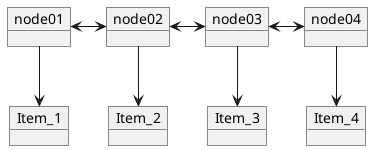
a. Before inserting a new node. 

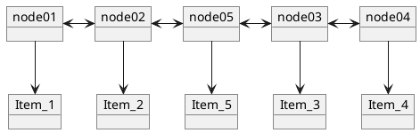
b. After inserting a new node and the item it tracks. 

Figure 7.1 A chain of NODE objects with the items they track. 


The chief advantage of this approach is that there is no need to squeeze in 
a new node between two neighbors. To add a new node, all we need to do is make 
sure that it knows where its neighbors are, and let them know that it is now 
their new neighbor. For example, after inserting a new node between nodes 2 
and 3 into the chain of Figure 7.1a, we get the chain of Figure 7.1b. Nothing 
needs to be moved aside, so the operation requires the same number of steps 
regardless of the length of the chain—an O(1) operation! 

## 7.1.1 The Contract for Class NODE 

There are a couple of common ways to implement a NODE object, and we will 
deal with them in Section 7.2. The detailed external view of a NODE is shown 
in Figure 7.2, and its interface (as it would be produced by short) is given in 
Listing 7.1. Note that the contract allows us to set any of the three references 
(to the item and to either neighbor) to Void. 


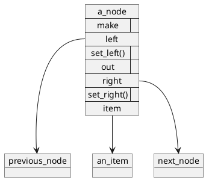
Figure 7.2 The outside view of a NODE object. 

::: TODO
  When you write the code export this code from ec short or interface view.

```Eiffel
class interface NODE[ITEM]
create
  make 
  --Standard initialization. 

ensure 

item_is_void: item = Void; 
left_is_void: left = Void; 
right_is_void: right = Void; 

features -- exported

left: like Current 

--The left neighbor. 

right: like Current 

--The right neighbor. 

item: ITEM 

--The tracked object. 

set_left (new_left: like Current) 

--Make new_left this node’s left neighbor. 

ensure 

left_updated: left = new_left; 

set_right (new_right: like Current) 

--Make new_right this node’s right neighbor. 

ensure 

right_updated: right = new_right; 

set_item (new_item: ITEM) 

--Make this node track new_item. 

ensure 

item_updated: item = new_item; 

end
```
Listing 7.1 The interface and contract of class NODE, take 1. 


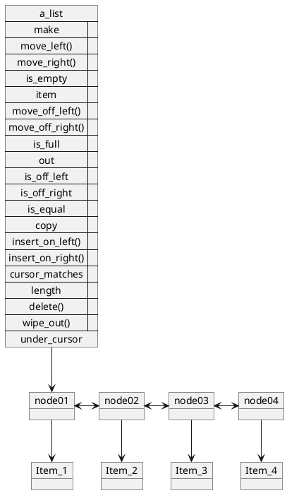
Figure 7.3 The inside view of a LIST_LINKED object, take 1. 

### 7.1.2 A Linked Representation of a List 

Given a contract for NODE, we can sketch an internal view of a linked imple- 
mentation of a list, and we do just that in Figure 7.3. Instead of storing the 
number of the position in an array that tracks the item under the cursor, 
attribute under_cursor tracks the NODE object that tracks that item. 

### 7.1.3 Moving Left and Right 

This linked representation of a list makes move_left and move_right easy: 
All we have to do is make `under_cursor` track the left or the right neighbor, 
respectively, of the node that it is currently tracking. For instance, move_right 
is simply 

```Eiffel
move_right is 
  --Move the cursor one step to the right. 
  do 
    under_cursor := under_cursor.right; 
  end; ——move_right 
```
and move_left is analogous. 

### 7.1.4 Inserting and Deleting an Item 

We already saw in Figure 7.1 what needs to be done to insert a new item, so all 
we need to do now is make it fit our list implementation. We will use insert_ 
on_right as the example. We start out with the list in Figure 7.4a. Then we 
create a new node and use a local entity called new_node to track it. Before we 
forget, we hook new_item to it. That gives us Figure 7.4b. Then, while the two
nodes between which we will insert new_node still remember each other, we let 
new_node know that they are its left and right neighbors; now we have Figure 
7.4c. Next, we tell new_node’s left and right neighbors that new_node is now 
their right and left neighbor, respectively, yielding Figure 7.4d. 


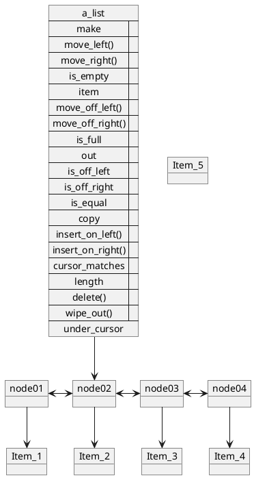
a. The list with which we started


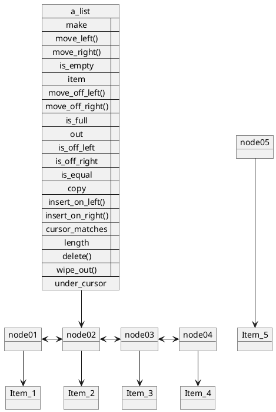
b. New_node has been made and is tracking new_item. 


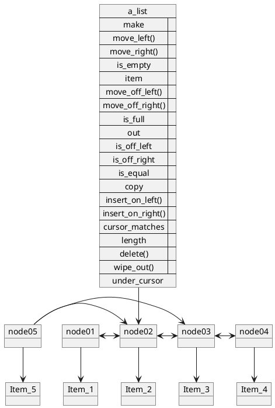
c. New_node has been told about its neighbors. 

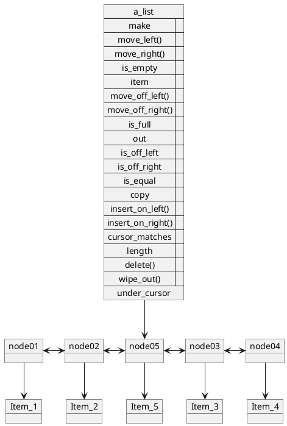
d. New_node’s neighbors have been told about new_node. 

Figure 7.4 Responding to request “insert_on_right (new_item)”. (The object's routines are not shown in order to save page space.) 

Checking our postconditions, we see that the cursor is already over the 
same item as in the old list, and the length ... we have not defined length yet, 
so we will have to check that postcondition again after we have done so. The 
code for insert_on_right is given in Listing 7.2. 

```Eiffel
insert_on_right (new_item: ITEM) is 

——Insert new_item to the right of the cursor. 

local 

new_node: NODE|ITEM]; 

do 

——Make a new node and make it track new_item. 
'new_node.make; 
new_node.set_item (new_item); 

——Let new_node know about its neighbors. 
new_node.set_left (under_cursor); 
new_node.set_right (under_cursor.right); 

——Let new_node’s neighbors know about it. 
new_node.left.set_right (new_node); 
new_node.right.set_left (new_node); 

end; ——insert_on_right 
```
Listing 7.2 Linked list implementation’s insert_on_right. (Work in Progress)

Deleting an item from a linked list is as simple as making the chain bypass 
the node that tracks it. We start again with a list as shown in Figure 7.5a, and 
simply tell the neighbors of the node under the cursor that they are each other’s 
neighbors instead (Figure 7.5b). Now we have to make entity under_cursor 
track another node—according to the postcondition, the one to the right. Doing 
that results in Figure 7.5c. 

Now, how do we expel the unnecessary node from the list? We do not have to. 
Nothing in the list is tracking it anymore, so it is not part of the list anymore. 


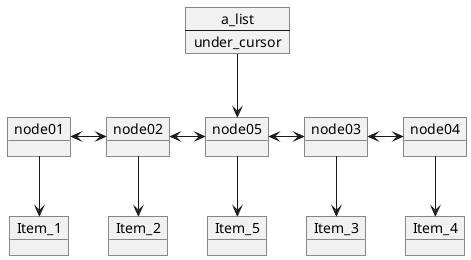
a. The list with which we started. 

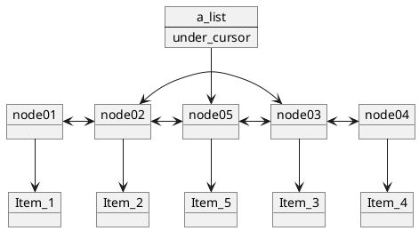
b. Under_cursor’s neighbors have been told to bypass under_cursor. 


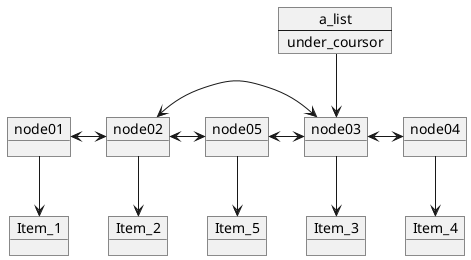
c. The entity under_cursor is made to track the node to under_cursor’s right. 

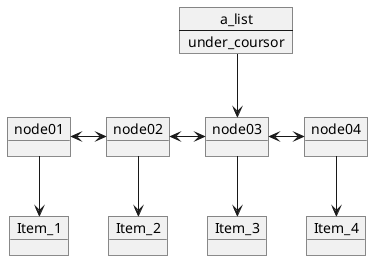
d. Just cleaning up the diagram. Since nothing in this list is tracking the bypassed node, it is not part of the picture anymore. 

Figure 7.5 Responding to request “delete”. (The object’s routines are not shown in order to save page space.) 

Since nothing outside the list is tracking it either, the garbage collector will 
recycle it. When that happens, it may be that the item it tracked is also unref- 
erenced, in which case that item will also be recycled. Just cleaning up our 
mental picture of the list, we get Figure 7.5d. The code to do that is shown in 
Listing 7.3. 

```Eiffel
delete is 

——Delete the item under the cursor. 

do 

——Make wnder_cursor’s neighbors track each other 
——instead of under_cursor. 
under_cursor.left.set_right (under_cursor.right); 
under_cursor.right.set_left (under_cursor.left); 

——Advance the cursor one step to the right. 
under_cursor := under_cursor.right; 

end;
```
Listing 7.3 Linked list implementation’s delete. 

### 7.1.5 Making It Work at the Endpoints 

These versions of insert_.... and delete work when there is a node on each side 
of the target node. What do we do if we want to insert to the right of the rightmost item or to the left of the leftmost one? How do we delete the leftmost or 
the rightmost item? And now that we are considering the ends of the list, how 
do we determine if the list is off-left or off-right? 

We simply modify our internal representation so that the routines do work 
at the endpoints of the list: We add an empty node to the left of the node that 
tracks the leftmost item, and another one to the right of the node that tracks 
the rightmost item. These nodes make natural off-left and off-right markers. 
We add hidden entities to track them, so that we can go off-left and off-right 
quickly (in O(1) time). This gives an inside view of a LIST_LINKED as shown 
in Figure 7.6. 

This little change answers many implementation questions. The `insert_...` 
and `delete` routines we have written already will work at the endpoints as well 
as in the middle. We know now what an empty list looks like (see Figure 7.7), 
so we can write make and wipe_out. We know how to write move_off_left and 
move_off_right. Some of these routines are given in Listing 7.4; I will let you fill 
in the rest. 

A few notes are in order here. First, observe how simple the `wipe_out` 
implementation is. This simplicity is made possible by the **garbage collection** 
system. If our language did not support automatic garbage collection (and such 
languages are numerous), it would be our job to loop through all the nodes 
between off _left and off_right and manually deallocate the space they occupy. 
Otherwise, those useless nodes would be occupying memory —a mistake known 
as a “memory leak.” (If you have friends who learned how to do linked lists in a 
language that doesn’t offer automatic garbage collection, ask them how many 
points they lost because of this on their assignments, or how much it cost their 
company to send out bug fix releases that plugged up such leaks.) 


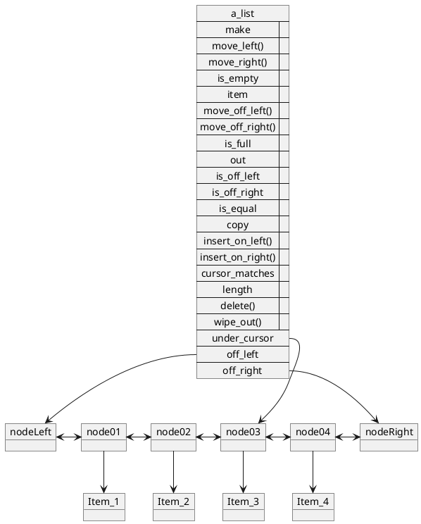
Figure 7.6 The inside view of a LIST_LINKED object, take 2. 

Second, note how the features’ implementations and their pre- and post- 
conditions interoperate. For instance, if we try to use insert_on_right when 
the cursor is on the rightmost node (the empty one), it will fail. But it is not 
expected to work in that situation, because that is the is_off_right condition, and 
the preconditions for insert_on_right rule it out. Many of the features will not 
work when the cursor is one of the end markers, but all of them are exempted 
by their preconditions from working under these circumstances. This is not 
cheating on our part: We defined the preconditions because they made sense, 
not to make our implementation easier—we had not even considered the imple- 
mentation at that time! Yet it is a good illustration of how a set of well-defined 
preconditions makes implementation easier. 

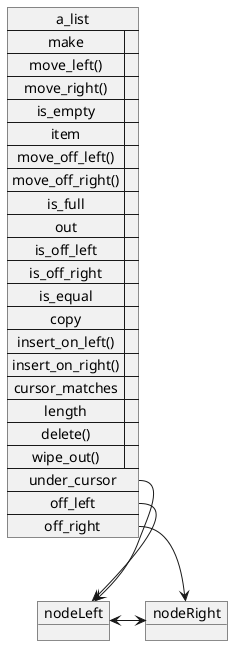
Figure 7.7 The inside view of an empty LIST_LINKED object. 

```Eifffel
feature {LIST_LINKED} ——Entities visible only to linked lists 

off_left: NODE(UITEM]; 

——Off-left marker (an empty node). 

off_right: like off _left; 

——Off-right marker (an empty node). 

under_cursor: like off_left; 

——Tracks the node under the cursor. 

feature 

wipe_out is 

——Make this list empty and off-left. 

do 

off _left.set_right (off_right); 
off_right.set_left (off _left); 
under_cursor := off _left; 

end; ——wipe_out 

make is 

——Initialize to get an empty, off-left list. 

do 

Noff_left.make; 
Noff_right.make; 
wipe_out; 

end; ——make 

move_off_left is 

——Move the cursor to the off-left position. 

do 

under_cursor := off _left; 

end; ——move_off_left 

move_off_right is 

——Move the cursor to the off-right position. 

do 

under_cursor := off_right; 

end; ——move_off_right
```
Listing 7.4 Features dealing with the endpoints of the list. 

### 7.1.6 Dealing with is_full 

A full list is one into which no more items can be inserted. It was easy to write 
`is_full` for the array implementation, because we knew the capacity of the array 
inside the list. When all positions in the array are in use, the list is full. 

In a linked list, we can insert new items as long as there is enough memory 
available to make nodes for them. Thus, the straightforward way to implement 
`is_full` is to make it ask the memory management system if there is enough 
room left for another node. Unfortunately, that is not enough. 

Since `not is_full” is a precondition to the insertion routines, we have to 
set things up so that the following code always works for the user: 

```python
if not a_list.is_full then 
  a_list.insert_on_right (new_item); 
end 
```

Thus, as soon as we return false as the result of is_full, we are committed to 
making one insertion into that list work as promised. But we cannot get that 
guarantee by asking the memory management system if there is more space, 
since other parts of the system may be competing for memory with this pro- 
gram: The memory may be available during the execution of `is_full`, but may 
disappear before execution of insert_on_right. 

It is not enough to check if room is available, we must also make a reservation.! 
It would be bad form to make that reservation during the evaluation of 
is_full: It is a function and should not have any side effects. The program 
should run the same way whether or not is_full is called. Since it is called from 
within the **ensure** clause of the insertion routines, we could run into this nasty 
situation: 

1. Precondition checking is turned off, and the program runs out of memory  during list insertion and crashes. 

2. We turn on precondition checking, and the program gets past the point in 
which it crashed because the precondition calls is_full and makes a reservation, but may run out of memory and crash at a different point. 

Instead, we will make our reservation as soon as we create the list. We will 
make each list carry a “spare tire’—a spare node. If during an insertion we 
run out of memory, we will use the spare. Thus, the list is not full as long as the 
spare is available. When we delete an item, we check to see if we had consumed 
the spare. If we had, we make the node that used to track the deleted item our 
new spare, otherwise we cast it adrift and let the garbage collector recycle it. 

[1]: This is going to get complicated. On your first try to implement a linked list, you 
may want to just make is_full always result in false, and hope that you never run out of 
memory—not a bad risk if you are just doing this as an exercise for an object structures 
course on a system with virtual memory. 

Thus, we revise *make, insert_on_right, and delete* into the ones shown later 
in Listing 7.6. To make their new implementation possible, we create private 
features spare and another_node, shown in Listing 7.5. 

The private feature another_node attempts to create another node. If there 
is memory for it, the new node is the result, and the insertion routines use it to 
track the new item. When the system is unable to oblige us with more memory, 
it generates an error condition—“raises an **exception**” in programmer talk. 
You have probably encountered other situations in which an exception is raised; 
requesting a feature of a void entity is a common example, as is dividing a 
number by zero. 

Normally, an exception causes the program to “crash.” But what does that 
mean? Does the whole computer come to a halt? Well, maybe; if yours does, you 
may want to shop around for a decent operating system. Usually, though, only 
your program terminates, and the rest of the system hums along. The system 
provides an **exception handler**, which is a piece of code that gets executed 
when the error occurs. Generally, the standard handler prints out an error 
message and exits the program. 


```Eiffel
feature {NONE} ——Visible only to this list 

spare: like off_left; 

——Spare node to guarantee safe is_full. 

another_node: like off_left is 

——A node for use in insertion. 

local 

already_tried: BOOLEAN; 

do 

if not already_tried then 

——Try creating another node. 
'Result.make; 

else 

——No more memory, so use the spare. 
Result := spare; 
spare := Void; 

end; 
rescue 

already_tried := true; 
retry; 

end; ——another_node 
```
Listing 7.5 Versions of is_full, make, insert_on_right, and delete that use a  “spare tire.” 


```Eiffel
feature 

make is 

——Initialize to get an empty, off-left list. 

do 

Noff_left.make; 
Noff_right.make; 
'spare.make; 
wipe_out; 
end; ——make 

insert_on_right (new_item: ITEM) is 

——Insert new_item to the right of the cursor. 

local 

new_node: like off_left; 

do 

——Make a new node and make it track new_item. 

new_node := another_node; 
new_node.set_item (new_item); 

——Let new_node know about its neighbors. 
new_node.set_left (under_cursor); 
new_node.set_right (under_cursor.right); 

——Let new_node’s neighbors know about it. 
new_node.left.set_right (new_node); 
new_node.right.set_left (new_node); 

end; ——insert_on_right 

delete is 

——Delete the item under the cursor. 

do 

——Keep uwnder_cursor as the spare if necessary. 
if spare = Void then 

spare := under_cursor; 

end; 

——Make under_cursor’s neighbor track each other instead of 
——under_cursor. 
under_cursor.left.set_right (under_cursor.right); 
under_cursor.right.set_left (under_cursor.left); 

——Advance the cursor one step to the right. 
under_cursor := under_cursor.right; 

end; ——delete 

is_full: BOOLEAN is 

——Is there no room in this list for one more item? 

do 

Result := spare /= Void; 

end; ——is_full 
```
Listing 7.6 Versions of is_full, make, insert_on_right, and delete that use a  “spare tire.” 


In many languages, including Eiffel, it is possible for the programmer to 
provide more specialized exception handlers. A specific handler could be as 
simple as one that prints a more accurate error message and exits the pro- 
gram. However, it may also be capable of doing some damage control so that the 
program may continue operation. 

Here is how this works in Eiffel. 

A feature may have a rescue section 
between the do and ensure sections. If an exception happens while the do 
part of the feature is running, the rescue part will get an opportunity to clean 
up the mess. The rescue section does not have to perform miracles. Its pur- 
pose is to see that even though the feature fails (and it does fail, causing an 
exception in the routine that invoked it), the object is still valid (i.e., the invari- 
ant is true). 

But for those who refuse to accept failure, a rescue section may contain 
the command retry, which causes the do part to be run all over again. If we 
use this technique, we need to make sure that the same exception does not 
keep happening while we retry the feature over and over again. 

In the case of another_node, there are two courses of action. The first is to 
create another node. The backup plan—for the retry action—is to use the 
spare. All we need is to be able to tell in the do part which time around we are 
executing it. The way to do this is to take advantage of automatic initialization 
of entities: 

= Object-tracking entities are initialized to Void. 

= Numeric entities are initially zero. 

= Boolean entities start out false. 

The last one is just what we need. We use a local Boolean feature called 
already_tried. The first time through the do, it is false. If the “create Result.make” 
fails, an exception is raised and the rescue part is invoked, setting already_ 
tried to true and doing a retry. This time around the do, we know that we have 
already tried making a new node, so we use the spare. 

### 7.1.7 Checking If Cursors of Two Lists Match 

In `LIST_ARRAY`, feature cursor_matches simply checked to see if the values of 
entity *under_cursor* in the two lists were equal. That is insufficient in the linked 
implementation: The only way for two cursors to be equal is if both refer to the 
same node, which only works if they are both within the same list object. In 
general, we have to step through both lists from the left, and look for a cursor 
in either list at that distance from off-left. As soon as we find a cursor, we can 
stop the looping. If both lists have a cursor at that position, then the cursors of 
the two lists match, otherwise they do not. This routine is shown in Listing 7.7. 

A similar loop can be used to implement is_equal. 

### 7.1.8 Cloning 

As we did with the array version, we need to write feature copy to support 
cloning. 

```Eiffel
cursor_matches (other: like Current): BOOLEAN is 
——Is this list’s cursor the same distance 
——from off-left as other’s cursor? 

local 

node_in_current: like off _left; 
node_in_other: like off _left; 

do 

——Find a distance from off-left in which 
——at least one of the lists has its cursor. 
from 

node_in_current := off _left; 
node_in_other := other.off_left; 

until 

node_in_current = under_cursor 

or node_in_other = other.under_cursor 

loop 

node_in_current := node_in_current.right; 
node_in_other := node_in_other.right; 

end; 

Result := 

node_in_current = under_cursor and 
node_in_other = other.under_cursor; 

end; ——cursor_matches 
```
Listing 7.7 Linked list implementation’s cursor_matches. 

*Copy (other)* can simply follow a loop similar to the one in Listing 7.7 to 
build a copy of *other* and leave *under_cursor* in the same loop step where we 
find *other.under_cursor*. We will do something along those lines later, but first, 
we consider a twist on the linked implementation. 

## 7.2 Singly vs. Doubly Linked Lists and Their Class Hierarchy 

There are two common ways to implement class NODE. The most straightfor- 
ward way is to simply make it track both of its neighbors. A list that is imple- 
mented using such nodes is known as **doubly linked**. 

The other way is to track only one of the neighbors—by convention, the one 
on the right—and find the neighbor on the left by scanning the list. A list organized this way is called **singly linked**. There are problems in which lists are 
usually (or even always) traversed in only one direction. For such implementations, it makes little sense to store references to both neighbors in each node. 
If the list is long, using singly linked nodes can result in considerable space savings. 

We have two very similar implementations here. They are so similar that 
many of the routines—those which do not use the left feature of class NODE— 
are going to be the same for both implementations! It would not be productive 
to have two independent classes for singly and doubly linked lists if many of 
the routines will be duplicated. Somehow, we should be able to “factor out” the 
similar parts, and accommodate only the differences in separate classes. 

The simplest way to do this would be to have just one class for linked lists, 
and make it take either a singly linked or a doubly linked node as a parameter. 
A doubly linked node tracks both of its neighbors using entities left and right; 
a singly linked node tracks only the neighbor to its right with entity right, but 
its feature left searches the list for its left neighbor every time it is called. 

There are two problems with this solution: (1) it limits reusability and 
(2) it does not work. It reduces reusability of class NODE, because it assumes 
that it is a node in a linked list. Later, we will want to use nodes in a different 
object structure, one for which “searching the list for the node’s left neighbor” 
is a meaningless activity. Even when the action makes sense, the way it is car- 
ried out would be different from one object structure to another. A node should 
not be concerned with what structure encloses it. 

It does not work because a node does not have enough information to find 
its left neighbor: It does not know what list it is in, so it cannot know where to 
start looking! 

No, we need two distinct (though related) classes to do the two versions of 
linked list implementations. The doubly linked version asks its nodes for their 
left neighbors; the singly linked version finds them itself. To save space, the 
singly linked version uses an implementation of nodes that does not track the 
left neighbor. 

Let us take another look at what types of nodes we have. For a singly 
linked list, we need a node that tracks its right neighbor; let us call it NODE_R 
(“R” for “right”). For a doubly linked list, we need a node that tracks its right 
neighbor and also tracks its left neighbor, let us call it NODE_LR (“L” for “left” 
and “R” for “right”). Do you think we should define NODE_L while we are at it? 
Be my guest, but we do not need it for now. 

How are NODE_R and NODE_LR related? Are they related by inheri- 
tance? If so, then one should be able to subcontract for the other. 
A NODE_R 
cannot subcontract for a NODE_LR, since the latter may get a request for fea- 
ture left, and a NODE_R object cannot handle it. 

On the other hand, a NODE_LR can do whatever a NODE_R can do, plus 
it has its own talents (knowing where its left neighbor is). Thus, class 
NODE_LR is an heir of class NODE_R. Stating it in terms of the “can act as a” 
relationship: 
A NODE_LR (node that tracks its left and its right neighbors) 
can act as a NODE_R (node that tracks its right neighbor). 

The implementations of NODE_R and NODE_LR are given in Listing 7.8. 

```Eiffel
class NODE_R[ITEM] 

creation make 

feature 

make is 

——Initialize the node to track nothing and have no neighbors. 

do 

——Nothing needs to be done. 

end; ——make 

right: like Current; 

——The right neighbor. 

item: ITEM; 

——The tracked object. 

set_right (new_right: like Current) is 

——Make new_right this node’s right neighbor. 

do 

right := new_right; 

ensure 

right_updated: right = new_right; 

end; ——set_right 

set_item (new_item: ITEM) is 

——Make this node track new_item. 

do 

item := new_item; 

ensure 

item_updated: item = new_item; 

end; ——set_item 

end —-class NODE_R 

class NODE_LR[ITEM] inherit NODE_R[{ITEM] 

creation make 

feature 

left: like Current; 

——The left neighbor. 

set_left (new_left: like Current) is 

——Make new_left this node’s left neighbor. 

do 

left := new_left; 

ensure 

left_updated: left = new_left; 

end; ——set_left 

end —-class NODE_LR 
```
Listing 7.8 Implementation of classes NODE_R and NODE_LR. 

Note that make has nothing to do (all entities will be set to Void automatically), but is provided in case a future heir will want to redefine it with a more 
active one. 

How, then, are the singly and doubly linked list classes related? The answer 
to this question is not quite as obvious. They both implement the same set of 
features, with the same pre- and postconditions. Either one could serve as a 
subcontractor for the other, but neither adds functionality to the other. 

Instead, we can do something similar to what we did with class LIST with 
respect to its implementations. First, we make class LIST_LINKED, which 
implements those features that the singly and doubly linked implementations 
do the same way and defers all the rest. Then we define for it subclasses 
LIST_SINGLY_LINKED and LIST_DOUBLY_LINKED, which implement 
their respective versions of routines in which they differ. The resulting inheri- 
tance hierarchy is shown in Figure 7.8. 


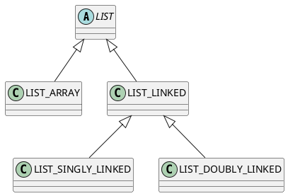
Figure 7.8 The hierarchy of list classes. 

We have looked at what happens with double linking. We will consider the 
special aspects of single linking next. Then we will contemplate which fea- 
tures go into the deferred class LIST_LINKED and which belong in the 
specific classes. 

## 7.3 Implementing a Singly Linked List 

For convenience, an inside view of a singly linked list is given in Figure 7.9 (it 
differs from Figure 7.6 only in directionality of the arrows between nodes). 

Some routines do not need to refer to a node’s left neighbor in the singly 
linked implementation. Consider, for example, insert_on_right. Since there 
is never a reason to look left of the cursor, there is no need to find the left - 
neighbor of the node under the cursor. Since the left neighbors are not tracked, 
there is no need to ever call set_left. The steps taken by insert_on_right 
in a singly linked list are shown in Figure 7.10, and the code for it is in Listing 7.9.


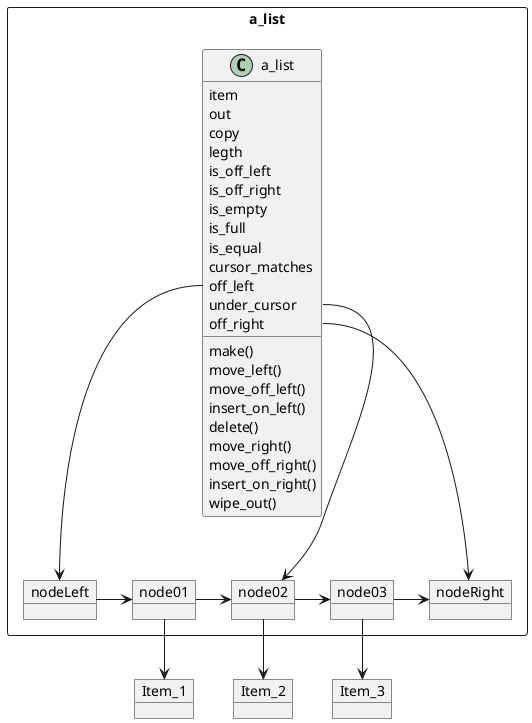
Figure 7.9 The inside view of a LIST_SINGLY_LINKED object, take 1. 

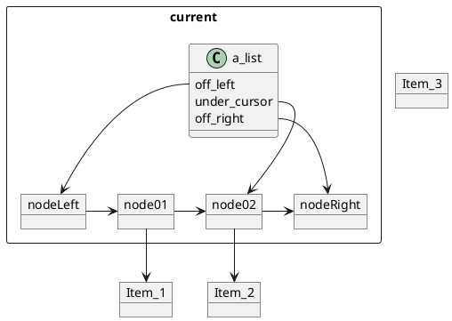
a. The list with which we started. 

Figure 7.10 A singly linked list responds to request “insert_on_right (new_item)”. (The object’s routines are not shown in order to save page space. ) 

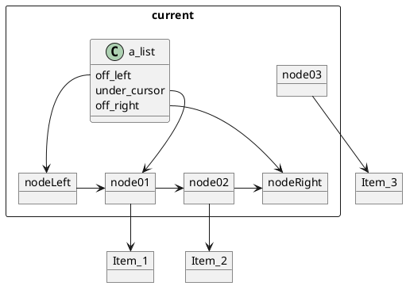
b. New_node has been made and is tracking new_item. 

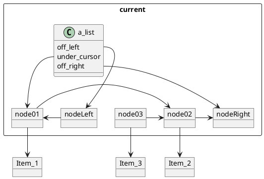
c. New_node has been told about its right neighbor. 

Figure 7.10 (continued ) 


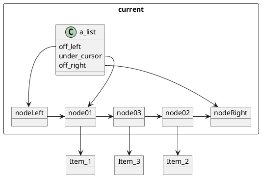
Figure 7.10 (continued ) 

Observe that without tracking the last item of the list (or the off-left 
marker in an empty list), the off-right marker has nothing to do: It tracks no 
item and it never has a right neighbor to track. All it has to do is “be there,” so 
that we know when we have reached the right end of the list. That being the 
case, there is no need to create a whole new node: Comparing an entity with a 
reference to Void is just as good as comparing it with a specially allocated but 
otherwise unused node. This gives us a just slightly more efficient representa- 
tion of a singly linked list as shown in Figure 7.11. 

On the other hand, `delete` does require looking to the left of the node under 
the cursor in order to set up a bypass from the left neighbor to the right neighbor, as shown in Figure 7.12. 

```Eiffel
insert_on_right (new_item: ITEM) is 

——Insert new_item to the right of the cursor. 

local 

new_node: like off_left; 

do 

——Make a new node and make it track new_item. 
'Inew_node.make; 
new_node.set_item (new_item); 

——Let new_node know its right neighbor. 
new_node.set_right (under_cursor.right); 

——Let new_node’s left neighbor know about it. 
under_cursor.set_right (new_node); 

end; ——insert_on_right 
```
Listing 7.9 Singly linked list’s implementation of insert_on_right. 


```plantuml
@startuml

package a_list <<Rectangle>> {
class a_list {
 make()
 item
 out
 copy
 legth
 move_left()
 move_off_left()
 is_off_left
 insert_on_left()
 delete()
 move_right()
 move_off_right()
 is_off_right
 insert_on_right()
 wipe_out()
 is_empty
 is_full
 is_equal
 cursor_matches
 off_left
 under_cursor
 off_right
}

Object nodeLeft
Object node01
Object node02
Object node03
Object nodeRight as "Void"


nodeLeft -right-> node01
node01 -right-> node02
node02 -right-> node03
node03 -right-> nodeRight

a_list::off_left --> nodeLeft
a_list::under_cursor --> node02
a_list::off_right --> nodeRight
}

Object Item_1
Object Item_2
Object Item_3

node01 -down-> Item_1
node02 -down-> Item_2
node03 -down-> Item_3
@enduml
```
Figure 7.11 The inside view of a LIST_SINGLY_LINKED object, take 2. 

```plantuml
@startuml

package a_list <<Rectangle>> {
class a_list {
 off_left
 under_cursor
 off_right
}

Object nodeLeft
Object node01
Object node02

Object nodeRight as "Void"


nodeLeft -right-> node01
node01 -right-> node02
node02 -right-> nodeRight

a_list::off_left --> nodeLeft
a_list::under_cursor --> node02
a_list::off_right --> nodeRight
}

Object Item_1
Object Item_2

node01 -down-> Item_1
node02 -down-> Item_2

@enduml
```
a. The list with which we started. 

```plantuml
@startuml

package a_list <<Rectangle>> {
class a_list {
 off_left
 under_cursor
 off_right
}

Object nodeLeft
Object node01
Object node02

Object nodeRight as "Void"


nodeLeft -right-> node01
node01 -right-> nodeRight

a_list::off_left --> nodeLeft
a_list::under_cursor --> node02
a_list::off_right --> nodeRight
}

Object Item_1
Object Item_2

node01 -down-> Item_1
node02 -down-> Item_2

@enduml
```
b. Under_cursor’s left neighbor has been told to bypass under_cursor. 

```plantuml
@startuml

package a_list <<Rectangle>> {
class a_list {
 off_left
 under_cursor
 off_right
}

Object nodeLeft
Object node01
Object node02

Object nodeRight as "Void"


nodeLeft -right-> node01
node01 -right-> node02
node02 -right-> nodeRight

a_list::off_left --> nodeLeft
a_list::under_cursor --> node02
a_list::off_right --> nodeRight
}

Object Item_1
Object Item_2

node01 -down-> Item_1
node02 -down-> Item_2

@enduml
```
a. The list with which we started. 

```plantuml
@startuml

package a_list <<Rectangle>> {
class a_list {
 off_left
 under_cursor
 off_right
}

Object nodeLeft
Object node01
Object node02

Object nodeRight as "Void"


nodeLeft -right-> node01
node01 -right-> nodeRight

a_list::off_left --> nodeLeft
a_list::under_cursor --> nodeRight
a_list::off_right --> nodeRight
}

Object Item_1
Object Item_2

node01 -down-> Item_1
node02 -down-> Item_2

@enduml
```
c. The entity under_cursor is made to track the node to under_cursor’s right. 
```plantuml
@startuml

package a_list <<Rectangle>> {
class a_list {
 off_left
 under_cursor
 off_right
}

Object nodeLeft
Object node01


Object nodeRight as "Void"


nodeLeft -right-> node01
node01 -right-> nodeRight

a_list::off_left --> nodeLeft
a_list::under_cursor --> nodeRight
a_list::off_right --> nodeRight
}

Object Item_1


node01 -down-> Item_1


@enduml
```
d. Just cleaning up the diagram. Since nothing in this list is tracking the  bypassed node, it is not part of the picture anymore. 

Figure 7.12 A singly linked list’s response to request “delete”. (The object’s  routines are not shown in order to save page space.)

Since a singly linked list cannot ask a node to identify its left neighbor, the 
list has to do the job itself. We create a private feature for that task and call it 
“left_of (<node>).” Its code is shown in Listing 7.10, together with make and 
delete. 

Using left_of, conversion of the routines described in Section 7.1 is straight
forward. 

```Eiffel
class LIST_SINGLY_LINKED [ITEM] 
inherit LIST_LINKED[ITEM] 
create make 
feature {NONE} 

left_of (node: like off_left): like off_left is 

——The node to the left of node in this list. 

require 

——node is somewhere in this list 

do 

from 

Result := off_left 

until 

Result.right = node 

loop 

Result := Result.right; 

end; 
ensure 

Result.right = node 

end; ——left_of 

feature 

make is 

——Initialize to get an empty, off-left list. 

do 

INODE_R{ITEM)!off_left.make; 
——Leave off_right = Void. 
Wwipe_out; 
end; ——make 

delete is 

——Delete the item under the cursor. 

do 

——Make under_cursor’s left neighbor track under_cursor’s right neighbor 
——instead of under_cursor. 
left_of(under_cursor).set_right (under_cursor.right); 

——Advance the cursor one step to the right. 
under_cursor := under_cursor.right; 

end; ——delete 

end ——class LIST_SINGLY_LINKED 
```

Listing 7.10 A beginning of class LIST_SINGLY_LINKED. 

## 7.4 Factoring Out Implementation Commonalities 

The implementations of arrayed lists and linked lists had very little in common. The only thing they shared was the external view, so their common ancestor, LIST, deferred all implementations to them. 

In contrast, LIST_SINGLY_LINKED and LIST_DOUBLY_LINKED are 
quite similar in their implementations. This gives us an opportunity to place 
some common code into LIST_LINKED (Figure 7.13). 

Several considerations are relevant to deciding which routines to factor out of the more specific classes into their common ancestor. 


```plantuml
@startuml
abstract LIST
LIST <|-- LIST_ARRAY 

LIST <|-- LIST_LINKED 

LIST_LINKED <|-- LIST_SINGLY_LINKED 

LIST_LINKED <|-- LIST_DOUBLY_LINKED 

note bottom of LIST_LINKED : Features which do not depend on left-links are implemented here 
note bottom of LIST_SINGLY_LINKED : Features which avoid using left-links are implemented here 
note bottom of LIST_DOUBLY_LINKED : Features which use left-links are implemented here 
```
Figure 7.13 A plan for distributing feature implementations among the linked list classes. 

1. *Avoiding code duplication.* All other things being equal, it is better to have 
something implemented once rather than twice. If there is a bug in the code 
(not that this ever happens to *you*, but hypothetically speaking), it is more 
likely to be caught during testing if it is used in twice as many situations. 
If you fix it in one place, two classes are fixed at once. 

2. *Does the common ancestor have everything it needs to implement a routine?*
Since implementations of the specific classes do differ, putting a feature into 
the common ancestor may require it to use features that are implemented 
in the more specific classes. This may take some additional planning. 

3. *Is there an unacceptable loss of performance?* If an implementation of a feature in the ancestor would be significantly slower, then it should be done in 
the heirs instead, the previous two considerations notwithstanding. 

### 7.4.1 Simple Example: move_left and move_right 

Let us look at some of the features of LIST_LINKED and decide the level at 
which to implement them. Move_left and move_right are excellent examples of 
how to apply the three considerations. 

All move_right does is advance the cursor one step to the right: 

```Eiffel
under_cursor := under_cursor.right;
```

That code is identical for both singly and doubly linked lists. Thus, it is a good 
candidate for being factored out into LIST_LINKED. Before we make that decision, we need to determine what its pre- and postconditions need. The precondition is “not is_off_right” and the postcondition is “not is_off_left.”
Does this  mean that we need to implement is_off_left and is_off_right in LIST_LINKED? 
Not at all. They need to be defined, but they already are (in LIST). Their implementation, though, may be left to the specific classes. When move_right is 
requested of a LIST_SINGLY_LINKED object, it will use its own implementation of is_off_left and is_off_right, at whichever level that was defined. That 
does not mean that we must not define them at the LIST_LINKED level, but 
we do not have to. Thus, move_right goes into LIST_LINKED. 

The singly and doubly linked implementations of move_left are quite different. LIST_DOUBLY_LINKED’s version cannot possibly be used on a singly 
linked list, because NODE_R objects do not provide the left feature. LIST_SINGLY_LINKED’s version must start off-left and seek out the node to the left 
of under_cursor. Now, we could use that version on doubly linked lists too, but 
that is a perfect example of why we have consideration 3: Searching for the left 
neighbor from off-left is an O(N) operation, while asking a NODE_LR for it is 
O(1)—how’s that for unacceptable loss of performance? No, move_left better 
stay in the more specific classes. 

### 7.4.2 A More Subtle Example: out

Since out builds the list’s string representation left-to-right, it would seem a 
good candidate for being factored out of the specific classes into LIST_LINKED. 
Let us write it and see. Listing 7.11 is the result. 


```Eiffel
out: STRING is 

=—"< Istlitem.out ... last_item.out $s". 

local 

node: like off _left; 

do 

Result := clone("< "); -—Left delimiter. 
from 

node := off_left.right; 

until 

node = off_right 

loop 

Result.append_string (node.item.out); -—Item’s representation. 
Result.append_string(" "); -—Space between item representations. 
node := node.right; 

end; 
Result.append_string (">"); -—Right delimiter. 

end; ——out 
```
Listing 7.11 Feature out of class LIST_LINKED. 

```Eiffel
feature {LIST_LINKED} 

off_left: NODE_R|ITEM] is 
——The off-left marker. 

deferred. 
end; —-—off_left 

off_right: like off_left is 

——The off-right marker. 

deferred 
end; —-off_right 
```
Listing 7.12 Making off_left and off_right known in class LIST_LINKED. 

If we rush off to compile this now, we will get a blunt reminder that off _left 
and off_right are not defined at this level. Of course, we already knew that. So, 
can we define it here for both of the heir classes? It would be easier not to do 
that at this time. For instance, off_right will need to be a NODE_LR in LIST _ 
DOUBLY_LINKED but a NODE_R in LIST_SINGLY_LINKED. So, let us just 
define them as deferred features of the most general type of node we have: 
NODE_R (as shown in Listing 7.12). 

I will let you work out how to spread the rest of the features between the 
two levels of the class hierarchy. When I did it, I ended up with a LIST_LINKED 
class consisting of three deferred features and a fully implemented one in the 
“feature {LIST_LINKED}” section, and 14 fully implemented features visible 
by all classes. That left eight features to be added in LIST_SINGLY_LINKED 
and LIST_DOUBLY_LINKED, and, of course, the three features that were 
deferred in the ancestor had to be defined too. 

## 7.5 Choosing an Implementation: Performance Analyses 

It is time to step back and look at the “big picture.” Given three implementations (deferred classes do not count), when does it make sense to use each one? 

### 7.5.1 Time Considerations 

First, let us summarize the worst case and average time complexities of each 
feature in each implementation in Table 7.1 (average and worst case time complexities do not always coincide, but they do in these classes). 

Table 7.1 Average and worst case time complexities for implementations 
of lists. N = length, M = other.length. 

| FEATURE         | ARRAY         | SINGLY_LINKED | DOUBLY_LINKED |
|-----------------|---------------|---------------|---------------|
| make            | O(capacity)   | O(1)          | O(1)          |
| move_left       | O(1)          | O(N)          | O(1)          |
| move_right      | O(1)          | O(1)          | O(1)          |
| move_off_left   | O(1)          | O(1)          | O(1)          |
| move_off_right  | O(1)          | O(1)          | O(1)          |
| is_off_left     | O(1)          | O(1)          | O(1)          |
| is_off_right    | O(1)          | O(1)          | O(1)          |
| is_empty        | O(1)          | O(1)          | O(1)          |
| is_full         | O(1)          | O(1)          | O(1)          |
| item            | O(1)          | O(1)          | O(1)          |
| replace         | O(1)          | O(1)          | O(1)          |
| insert_on_left  | O(N)          | O(N)          | O(1)          |
| insert_on_right | O(N)          | O(1)          | O(1)          |
| delete          | O(N)          | O(N)          | O(1)          |
| wipe_out        | O(capacity)[^a]| O(1)[^b]     | O(1)[^b]      |
| out             | O(N)          | O(N)          | O(N)          |
| copy            | O(capacity)   | O(M)          | O(M)          |
| is_equal        | O(N)          | O(N)          | O(N)           |
| cursor_matches  | O(N)          | O(N)          | O(N)          |
| length          | O(1)          |See Exercise 7.4|See Exercise 7.4

[a]: See Exercise 6.5. 

[b]: The garbage collector may have to do O(N) work to recycle the discarded nodes. 

The doubly linked implementation appears to be the clear winner: In the 
array and the singly linked implementations, each feature has either the same 
or worse complexity. Why, then, don’t we simply use the doubly linked version 
and not bother with the other two? 

Well, for one thing, the user may not need the expensive (O(N)) routines. For 
example, if user code never requests the move_left, insert_on_left, and delete 
features, then the singly linked implementation is as fast as the doubly linked 
one. As we will discuss in Section 7.5.2, the singly linked implementation 
requires less space. 

The other consideration is where within the list the cursor is when a feature is requested. Table 7.2 shows the best case complexities for the various 
features, and the circumstances under which they happen. 

Fine, but when are we lucky enough to have the user request features only 
under the best circumstances? Very rarely. However, in later chapters we will 
be using linear object structures where we only support insertions at one end 
of a list and place a similar restriction on removals. When that happens, we 
will revisit this analysis, rather than trying to figure it all out again. 

Table 7.2 Best case time complexities for implementations of lists, and the situations in which they occur. N = length, M = other.length. 

| FEATURE         | ARRAY         | SINGLY_LINKED | DOUBLY_LINKED |
|-----------------|---------------|---------------|---------------|
| make            | O(capacity)   | O(1)          | O(1)          |
| move_left       | O(1)          | O(1) On first item          | O(1)          |
| move_right      | O(1)          | O(1)          | O(1)          |
| move_off_left   | O(1)          | O(1)          | O(1)          |
| move_off_right  | O(1)          | O(1)          | O(1)          |
| is_off_left     | O(1)          | O(1)          | O(1)          |
| is_off_right    | O(1)          | O(1)          | O(1)          |
| is_empty        | O(1)          | O(1)          | O(1)          |
| is_full         | O(1)          | O(1)          | O(1)          |
| item            | O(1)          | O(1)          | O(1)          |
| replace         | O(1)          | O(1)          | O(1)          |
| insert_on_left  | O(1) Off-right  | O(1) On first item          | O(1)          |
| insert_on_right | O(1) On last item          | O(1)          | O(1)          |
| delete          | O(1) On last item         | O(1) On first item          | O(1)          |
| wipe_out        | O(capacity)| O(1)     | O(1)      |
| out             | O(N)          | O(N)          | O(N)          |
| copy            | O(capacity)   | O(M)          | O(M)          |
| is_equal        | O(1) Lengths differ          | O(1) 1st differ          | O(1) 1st differ           |
| cursor_matches  | O(1)          | O(1) Both off-left| O(1) Bath off-left|
| length          | O(1)          |See Exercise 7.4|See Exercise 7.4

### 7.5.2 Space Considerations 

Now let us look at how much space overhead these implementations require. 
Let us call the amount of space taken up by one reference to an object “R.” At 
the time of this writing, R is typically 32 bits (4 bytes). 

The array implementation will occupy R X capacity, plus a little more 
space for other attributes in the object (e.g., length). It does not matter how 
many items are in the list; enough room is reserved for capacity items. Thus, 
the space complexity of the array implementation is O(capacity). 

A singly linked representation uses two references per node: a reference to 
the item and a reference to the node’s right neighbor. But since nodes are allocated only when needed, the number of nodes is approximately N (plus a small, 
constant number of nodes for the end markers and the spare, if any). Thus, the 
space utilization is about 2R x N, which is OW). 

The doubly linked implementation is similar in its space consumption, 
except that there is an additional reference in each node for tracking its left 
neighbor. Thus, the space consumption is roughly 3R x N, also O(N). 

With complexities so similar, we do have to pay attention to the constants. 
All other considerations aside, paying attention only to space use, when does it 
make sense to use which implementation? 

Suppose we have an array-based list with capacity 1,000,000. If it tracks 10 
items, we are using 1,000,000R bytes (or whatever memory units we use) for 
the job. A singly linked representation would only use 20R bytes, and a doubly 
linked—30R. On a system with 4-byte R, the array representation loses by 
almost 4 megabytes. 

On the other hand, suppose it is tracking 999,990 items. In the array 
representation, we are still using the same 1,000,000R bytes, but a singly 
linked representation uses 1,999,980R, and the doubly linked—2,999,970R! 
On a machine with 4-byte references, the array representation beats the singly 
linked representation by almost 4 megabytes, and the doubly linked list by 
almost 8 megabytes! 

The break-even points are easy to compute. For array vs. singly linked, we have: 

2R X N = R X capacity 

N = capacity / 2 

For array vs. doubly linked, we get N = 3 capacity. When N is smaller than the 
break-even point, the linked representation is more space efficient; above the 
break-even point, the array representation wins. 

An important thing to consider is whether it is important to use only 
enough memory to track the current number of items. On a multi-purpose system, it is important not to “hog” memory that you are not using. However, if 
the object structure resides in a fixed amount memory that nobody else wants 
(for example, a buffer box), then we might as well allocate the whole thing for 
the array, and thus be capable of tracking twice as many items as with the 
singly linked representation, and three times as many as with the doubly 
linked version. 

### 7.5.3 Is Time or Space More Important? 

That, of course, depends on the circumstances. That is why there are different 
implementations to consider. There is always a trade-off. 

If the system is restricted in memory space (for example, it could be an 
oscilloscope or a cheap personal computer), then memory considerations prevail. If, on the other hand, the system is loaded with physical memory, then 
space efficiency may be sacrificed to get more speed. 

Why just “physical memory’; isn’t virtual memory just as good? Well, if you 
think that space efficiency is not important on a virtual memory system (as 
most general-purpose operating systems now are), think again. If your object 
structure is spread over too many memory pages, the system will have to do 
swapping with the hard disk to access parts of it. There is no easier way to slow 
down the execution of your program than by having to wait for disk access to 
complete: Disk access is thousands of times slower than memory access. 

# Summary 

Linked lists use interconnected nodes to keep track of objects. Insertion and 
deletion entail manipulating node references, and are potentially O(1) in time 
complexity. 

Linked lists can be singly linked or doubly linked. In a doubly linked list, a 
node has references to both of its neighbors; in a singly linked list, only to one 
neighbor. Singly linked lists occupy less space, and their implementations of 
some of the features are simpler. However, moving in the direction opposite of 
the node reference chain is an O(N) operation, so all operations that require it 
become O(N) or worse. Doubly linked lists have the best time complexity, but 
require more space per node. 

Classes SINGLY_LINKED_LIST and DOUBLY_LINKED_LIST have 
enough feature implementations in common to warrant the creation of a 
shared parent class, LINKED_LIST (which is an heir to LIST). 

# Exercises 

1. Consider the “spare tire” implementation of linked lists. 

a. Draw an empty list. 

b. Draw the result of inserting an item into the list you drew in part (a), 

assuming that there is room for another node in the system. 

c. Draw the result of inserting an item into the list you drew in part (b), 
assuming that there is not enough room for another node in the system. 

d. Draw the result of deleting an item from the list you drew in part (c). 

2. Suppose we did want to have a class NODE_L. How would it fit in with the 
other node classes discussed in this chapter? Suggest a class hierarchy for 
these classes, stating which methods are implemented and which (if any) 
are deferred in each class. (Note: A class may have more than one parent.) 
3. Which features should be implemented in class LIST_LINKED, and which 
should be deferred to LIST SINGLY _LINKED and LIST_DOUBLY_ 
LINKED? 

4. Sketch two different ways of implementing feature length in class LIST_LINKED (deferring it does not count). Discuss the trade-offs between the 
two implementations. 

5. a. Implement deferred class LIST_LINKED. 

b. Implement class LIST_DOUBLY_LINKED. 

c. Implement class LIST_SINGLY_LINKED. 

d. Changing only the lines marked “——imp” in LIST_TESTER, test classes 

LIST_DOUBLY_LINKED and LIST_SINGLY_LINKED. 

6. Consider the typical implementation of ARRAY discussed in Chapter 5. 
What are the time complexities of the operations item, put, and resize? 
Explain your answers. 
