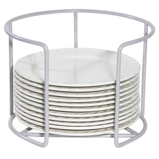
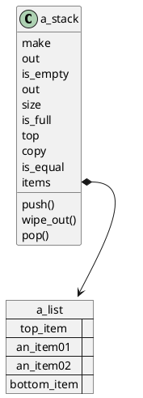
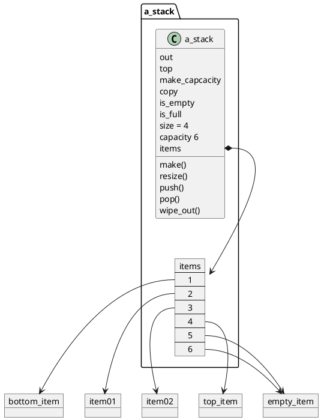
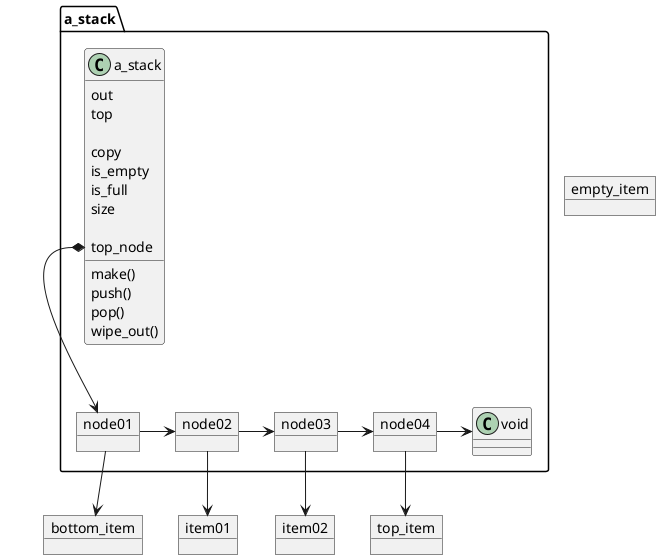
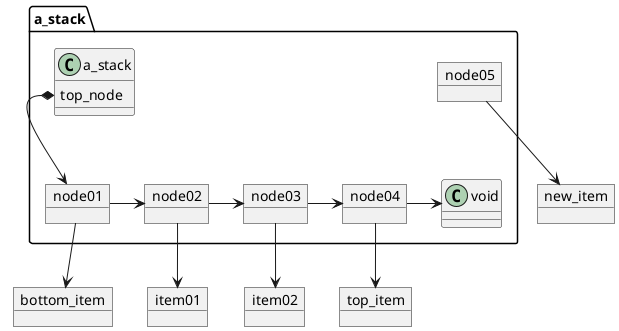
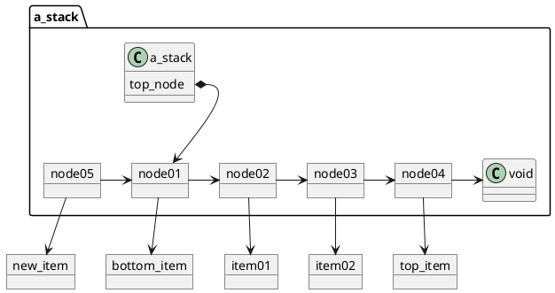
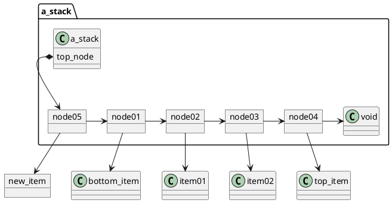
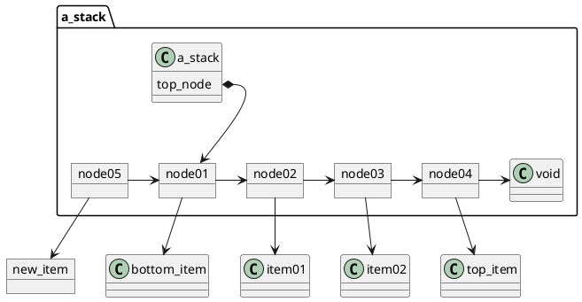
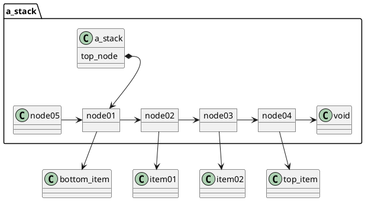

# Stacks 

Now that we have thoroughly studied the linear object structure in its most general form, we take a couple of chapters to examine two structures that have more specific behaviors.
Both of them keep track of objects in an order determined by the time at which they were asked to track each one.
They start tracking an object in a specific way, and they provide access to them only in the prescribed order. 

In this chapter, we look at **stacks**, which give access only to the last object to be inserted into the object structure.
We will consider three implementations for it:
using a list, an array, and a linked representation designed specifically for stacks. 

## 8.1 What a STACK Is and What It Does 

A stack is a linear object structure that can only be accessed and modified on one end.
To understand the terminology computer scientists use for stacks, 
imagine a cylinder with a spring-loaded piston at the bottom, and a latch at the top (Figure 8.1).
Objects are stacked inside, and the latch prevents the spring from shooting all the objects out of the cylinder.
The **top** object is visible from outside the cylinder. 

If you tap the latch, the top object will **pop** off, and the object that was just under it will become the top object (Figure 8.2).
The latch only lets through one object at a time and then it snaps back. 

To insert an object into the cylinder, **push** it onto the stack of objects inside 
(Figure 8.3).
The latch will let it through and snap back. 

Note that the last object to go onto the stack is always the first to come off. 
The stack is a **last in, first out** (“**LIFO**,” pronounced “LIFE-oh”) object structure.
It is used in situations where most recently tracked objects are of the most interest. 


a. outside view 




b. inside view 

Figure 8.1 A metaphor for the STACK object structure. 

just remove the top plate

Figure 8.2 The result of popping the stack in Figure 8.1. 

Just imagine puting a plate on top of the stack of plates

Figure 8.3 The result of pushing object G onto the stack in Figure 8.1. 

### 8.1.1 The Contract 

Because the only way to insert an item into a stack is to push, the only way to remove one is to pop, and the only way to access one is through the top, the interface with a *STACK* is considerably simpler than the interface with a *LIST*. 
Thus, the contract will be simpler.
Listing 8.1 provides the complete contract. 
(Compare that with LIST’s contract in Listing 6.6.) 

Many of the specifications in Listing 8.1 are analogous to their LIST counterparts.
There is a slight change in terminology:
Whereas a list has length, we traditionally talk about a stack’s size[^1].
Another minor change is in out’s delimiters:
a bar at the top and a bracket at the bottom. 

The features for moving items into and out of the stack are the only ones that are significantly different from those we defined for lists.
There are only three of them, and their postconditions are simpler because there is no cursor location to worry about.
There is one thing that we can say about push that had 
no convenient equivalent in the insert_... routines for lists: the postcondition
promises that one of the results of push (new_item) will be that top will return new_item.
(In LIST’s contract, the position of the cursor with respect to the new item had to be promised in a comment instead of a checkable assertion.) 

```python
new_item_on_top: top = new_item 
```

[1]: If you like “length” more than “size,” hold on until the next chapter: We will be back to “length” with queues.
There is a school of thought that similar features should have the same name in all classes, regardless of the tradition;
for example, the ISE library uses the name “count” for each class’s sizing feature. 

```Eiffel
deferred class STACK{ITEM] inherit 
ANY 

undefine ——to make them deferred 
out, is_equal, copy 
redefine ——to add comments 
out, is_equal 
end; 

feature ——Creation and initialization 
make is 
——Initialize to get an empty stack 
deferred ensure 
empty:
is_empty; 

end; ——make 
feature —— Moving items into and out of the stack 
push(new_item: ITEM) is 
——Push new_item onto this stack. 

require 
not_full:
not is_full; 

deferred ensure 
one_more_item:
size = old size + 1; 

new_item_on_top:
top = new_item; 

end; ——push 
pop is 
——Remove the top item. 

require 
not_empty:
not is_empty; 

deferred ensure 
one_fewer_item:
size = old size — 1; 

end; ——pop 
top: ITEM is 
——The top item. 

require 
not_empty:
not is_empty; 

deferred end; ——top

wipe_out is 
——Make this stack empty. 

deferred ensure 
empty:
is_empty; 

end; ——wipe_out 
feature —-—Sizing 
is_empty: BOOLEAN is 
——Is this stack empty? 

deferred end; ——is_empty 
is_full: BOOLEAN is 
——Is there is no room on this stack for one more item? 

deferred end; —-is_full 
size: INTEGER is 
——The number of items currently on this stack. 

deferred end; ——size 
feature ——Comparisons and copying 
is_equal (other:
like Current): BOOLEAN is 
——Do this stack and other keep track ——of the same items in the same order? 

deferred end; ——is_equal 
feature ——Simple input and output 
out: STRING is 
——"| <top item>.out ...<bottom item>.out ]" or —-"[ <bottom item>.out ...<top item>.out |". 

deferred 
end; ——out 
invariant 
empty_iff_zero_size:
is_empty = (size = 0); 
size_not_negative:
size >= 0; 

end —-—class STACK 
```
Listing 8.1 Deferred class STACK with the contract. 

## 8.2 How a STACK Does What It Does: 

We will consider three different ways to implement a STACK:
using a LIST; 
with an ARRAY;
and through a linked object structure. 

## 8.3 Using a LIST to Implement a STACK 

A STACK lays its items out in a straight line, as does a LIST (though we picture lists as going from left to right and stacks as going from top to bottom). 
Thus, it is worth considering whether we can reuse all that work we have done for LIST classes for our STACK implementation. 

First, let us consider if we can make STACK_LIST an heir to LIST or to one of LIST’s heirs.
We ask the question, 

Can a STACK act as a LIST? 

No.
For one thing, a STACK must not allow insertion of an item into its middle, 
or it will not be a LIFO structure.
So a STACK object cannot subcontract to a LIST object. 

While we cannot reuse LIST through inheritance, we can still take advantage of its implementations by putting a LIST object inside our STACK object, 
as illustrated in Figure 8.4
(just as we used an ARRAY object inside a LIST_ARRAY object).
That LIST will be used to track the STACK’s items.
The STACK object’s features will utilize the LIST’s features to do most of the work. 

For example, if we call the internal LIST object “items,” feature `size` becomes 
simply 

```Eiffel
size: INTEGER is 
——The number of items currently on this stack. 

do 
Result := items.length; 

end; ——size
```

Thus, we reuse the work we have put into the LIST implementation for keeping count of the tracked items.
Many of the features will be as simple as that. 


Figure 8.4 The inside view of an implementation of STACK that uses a LIST object. 

### 8.3.1 Moving Items In and Out

The LIST object allows insertion and deletion anywhere,
but a STACK needs to use its LIST’s features to operate only on the end that we designate as the top of the stack.
Let us arbitrarily pick the left end of the list as the top of the stack
(we will discuss the performance implications of this choice later). 

Consider *push*.
It has to insert the new item in such a way that it becomes the leftmost item.
We have two ways to do that: 

1. Go off-left and then insert on right. 
2. Go to the leftmost item and insert on left. 

The first way is more convenient:
Both `insert_on_left` and `insert_on_right` leave the cursor where it is.
Thus, the first method will leave the cursor off-left and ready for the next `push` without any cursor movement.
The second method, however, will leave the cursor at what is now the second item from the top, and we will need to do a move_left to get back to where we can do another `insert_on_left`. 

So, to speed up `push`, we can adopt the convention that the list is always off-left.
However, if we do that, we will need to do cursor movement for `top` and `pop`,
because both require the cursor to be right on the top item.
For example, `top` becomes 

```Eiffel
top: ITEM is 
——The top item. 

do 
items.move_right; 
Result := items.item; 
items.move_off_left; 

end; ——top
```

Which is requested more often, `push` or `pop` and `top`?
In general, we can expect to do the same number of *pushes* and *pops*, and at least a few *tops*.
(Why would our users bother stacking up items if they never look at them?)
Thus, there should be more pops and tops than there are pushes, so it makes more sense to keep the cursor on the top item.
Unfortunately, we have no efficient Boolean expression to indicate that, so we have to turn that part of the implementation invariant into a comment: 

```Eiffel
invariant 
have_list:
items /= Void; 
——The cursor in items is on the leftmost item, 
—-or off-right if items.is_empty.
```

To support this invariant, we make sure that all routines leave the cursor one step right of off-left.
For example, make as shown in Listing 8.2 creates an empty list object that is off-right (which is one step to the right of off-left in an empty list). 

```Eiffel
class STACK_LIST[ITEM] inherit 
STACK [ITEM] 

creation make 
make is 
do 
—~Initialize to get an empty stack. 

Nitems.make; 
items.move_off_right; 

end; ——make 
feature ——Sizing 
size: INTEGER is 
——The number of items currently on the stack. 

do 
Result := items.length; 

end; ——size 
feature —— Moving items into and out of the stack 
push (new_item: ITEM) is 
——Push new_item onto this stack. 

do 
——Put new_item into its place. 
items.insert_on_left (new_item); 

——Fulfill the invariant. 
items.move_left; 

end; ——push 
pop is 
——Removes the top item. 

do 
items.delete; -—We rely on the “cursor moves right” postcondition. 

end; ——pop 
invariant 
have_list:
items /= Void; 
—-—The cursor in items is on the leftmost item, 
—-or off-right if items.is_empty. 

end —-—class STACK LIST 
```
Listing 8.2 A partial implementation of STACK_LIST. 

### 8.3.2 A Programmer to One Struciure, a User to Another 

When we were implementing `LIST_ARRAY`, we were a user for `ARRAY`.
We did not write `ARRAY`, so behaving like a user was not hard.
Now, however, we are users of one of our own structures (`LIST`).
For example, look at the out feature in Listing 8.3.
It reads like a tester routine for `LIST`! 

When programmers use one of their own structures to implement another, 
they may be tempted to modify the old structure to better accommodate the new one.
For instance, I was tempted to add an is_on_leftmost_item feature to LIST just to make the `STACK_LIST` class invariant codable in Eiffel.
Such temptation should be resisted: If a feature or a behavior did not seem necessary before,
it is often better to work around it and leave the old structure alone.
Remember, any class modification needs to be followed by more testing; 
the longer a class has gone with no modifications other than bug fixes,
the less likely it is to contain mistakes. 

```Eiffel
feature ——Conversions 
out: STRING is 
——"| <top item>.out ...~<bottom item>.out ]". 

do 
Result := clone("| "); -—Top delimiter. 
from 
——Start at the top item (already there). 

until 
items.is_off_right 
loop 
Result.append_string (items.item.out); 
Result.append_string(" "); 
items.move_right; 

end; 
Result.append_string ("|"); -—Bottom delimiter. 

——Move back to the top item. 
items.move_off_left; 
items.move_right; 

end; ——out
```
Listing 8.3 Feature out illustrates how a programmer of one object structure  (STACK_LIST) acts as a user of another (LIST). 

### 8.3.3 Deciding Which LIST Implementation to Use

Since LIST is a deferred class (the keeper of the contract and not a complete implementation), we cannot actually create an object of class LIST.
Listing 8.2 
uses LIST_DOUBLY_LINKED, but that was an arbitrary choice.
Let us put some thought into it. 

Our choices of list implementations are LIST_ARRAY, LIST_DOUBLY_ 
LINKED and LIST_SINGLY_LINKED.
The features we have requested of them so far are make, move_off_left, move_off_right, move_left, move_right, is_off_right, length, insert_on_left, and delete (you will run into others as you write the class).
Of these, insert_on_left, move_left, delete, and item are of greatest concern to us, since they are used in push, pop, and top, the most frequently used stack features. 

Table 8.1 summarizes the average and worst case time complexities of those features (abstracted from Table 7.1).
Judging by that table, it would seem that LIST_DOUBLY_LINKED is the only good choice.
Not so. 

What makes those O(N) features in the singly linked implementation slow? 
In the case of `move_left`, it is having to start at the left end of the list to find the previous node (since each node tracks its right neighbor but not its left).
But if the cursor is on the leftmost node, that is only a one-step loop!
This is the best case scenario, and the complexity is O(1), not O(N).
The same situation applies to insert_on_left and delete. 


Table 8.1 Average and worst case time complexities for critical features 
of the three list implementations. 

| Feature | Used In | Array | Singly Linked | Doubly Linked |
|---------|---------|-------|---------------|---------------|
|insert_on_left | push | O(N) | O(N) | O(1) |
|move_left | push | O(1) | O(N) | O(1) |
|delete | pop | O(N) | O(N) | O(1) |
|item  | top | O(1) | O(1) | O(1) |


Best case situations rarely arise randomly, but they can be made to happen by design
(or, in this case, by a lucky fifty—fifty choice). 

What makes those O(N) features in the array implementation slow?
Deleting and inserting an item into the array implementation requires all items to the right to be moved over, hence the O(N) complexity.
If we are operating on the left end of the list, we have to move all of the other items—the worst case scenario. 

Thus, the array column is unchanged, the singly linked column is updated, 
and we get Table 8.2.
Now it looks like the singly linked implementation is the best, since the doubly linked implementation has more space overhead (because each node tracks its left neighbor as well as the right one). 

Well, do not write off the array implementation just yet. 
Recall that the decision to align the left end of the list with the top of the stack was arbitrary.
What if we aligned the top with the right end instead?
The rightmost item would be the top item, so all of our routines would be mirror images of the ones presented above:
push would use insert_on_right followed by move_right, pop would do delete followed by move_left (since delete moves the cursor to the right and we need it to move to the left), and so on. 

The reason this rearrangement makes a difference is that the best case conditions are on the right end in the array implementation of lists.
If we are at the right end of the list, there are no items on the right to move, so the operations are O(1). 

Table 8.2 Time complexities for critical features operating on the left end 
of the three list implementations. 

| Feature        | Used In | Array | Singly Linked | Doubly Linked |
| -------------- | ------- | ----- | ------------- | ------------- |
| insert_on_left | push    | O(1)  | O(1)         | O(1)          |
| move_left      | push    | O(1)  | O(1)         | O(1)          |
| delete         | pop     | O(1)  | O(1)         | O(1)          |
| item           | top     | O(1)  | O(1)         | O(1)          |


Table 8.3 Time complexities for critical features operating on the right end of 
the three list implementations. 

| Feature         | Used In | Array | Singly Linked | Doubly Linked |
| --------------- | ------- | ----- | ------------- | ------------- |
| insert_on_right | push    | O(1)  | O(1)          | O(1)          |
| move_right      | push    | O(1)  | O(1)          | O(1)          |
| delete          | pop     | O(1)  | O(N)          | O(1)          |
| move_left       | pop     | O(1)  | O(N)          | O(1)          |
| item            | top     | O(1)  | O(1)          | O(1)          |

The rearrangement hurts the singly linked implementation:
move_left is O(N) at the right end of the list,
since it has to traverse the entire list left-toright to find the node to the left of the rightmost node.
This does not affect push since it does not need move_left anymore, but pop does.
The complexities in the “top is on the right” alignment are summarized in Table 8.3. 

## 8.4 Using an ARRAY to Implement a STACK 

Using a list inside a stack is a quick way to implement stacks—if you already have lists.
Does that mean that if you need a stack you need to write list classes first?
Obviously not;
instead of using an array implementation of a list we could manipulate an array directly, and we can write a linked stack as easily as a linked list
(even easier, since there are fewer features in a stack).
If good list classes are unavailable, or if measurements show that going through a list’s interface is too slow for the purpose at hand, it is better to just write lower level implementations of stacks.
We start by writing a `STACK_ARRAY` class, and will do `STACK_LINKED` later. 

We use an array called items and put the bottom item into position 1, the second from the bottom item into position 2, and so on, up to the top object in position size, as shown in Figure 8.5.
Thus, we can get the top object by using the `size` feature: 

```Eiffel
top: ITEM is 
——The top item. 

do 
Result := items.item (size); 

end; —-—top 
```
To push a new item, we increment size and make the new size position track 
the new item: 


Figure 8.5 The inside view of an implementation of STACK that uses  an ARRAY object. 

```Eiffel
push
(new_item: ITEM) is 
——Push new_item onto this stack. 

do 
size := size + 1; 
——Put new_item into its place. 
items.put
(new_item, size); 

end; ——push 
To pop an item, we set the top item adrift by disconnecting it from the 
array, and then decrement size: 

pop is 
——Remove the top item. 

local 
void_item: ITEM; 

do 
items.put
(void_item, size); -—Set the old top item adrift. 

size := size — 1; 

end; ——pop
```

Nice, simple, and O(1).
The remaining features are analogous to their counterparts in LIST_ARRAY. 


Figure 8.6 An inside view of a STACK_LINKED object. 

## 8.5 A Singly Linked Implementation of STACK 

We observed earlier that a singly linked structure is sufficient to `push`, `pop`, 
and get the top in O(1) time, as long as the top is aligned with the leftmost node.
Thus, we will not bother with a doubly linked implementation.
Instead, we will just write a singly linked implementation of stacks and call it “STACK_LINKED.” 

Using the example of LIST_SINGLY_LINKED (Figure 7.11),
we design the inside view of STACK_LINKED shown in Figure 8.6. 

To push a new item onto such a stack (Figure 8.7a),
we create the new node and make it track the new item (Figure 8.7b),
make the new node track the former top node as its right neighbor (Figure 8.7c),
and then make top_node track the new node (Figure 8.7d). 


```plantuml
@startuml
object bottom_item
object item01
object item02
object top_item

package a_stack {
  class a_stack {
    top_node
  }

  node01 -right-> node02
  node02 -right-> node03
  node03 -right-> node04
  node04 -right-> void

  a_stack::top_node *--> node01
}

  object node01
  object node02
  object node03
  object node04
  
node01 -down-> bottom_item
node02 -down-> item01
node03 -down-> item02
node04 -down-> top_item

object new_item

@enduml
```
a. The stack with which we started. 


b. New_node has been made and is tracking new_item. 


c. New_node now tracks the old top node. 


d. Top_node now tracks new_node, making new_item the top item on the stack. 

Figure 8.7 Responding to request “push (new_item)”.
(Routines are not shown in order to save page space.) 


To pop the stack (Figure 8.8a),
all we need to do is make top_node track the second node instead of the first (Figure 8.8b).
Since nothing is tracking the former top node anymore, it is swept up by the garbage collector, as is its item if nothing else is tracking that (Figure 8.8c). 


a. The stack with which we started. 


b. Top_node tracking the second node. 


c. Just cleaning up the diagram.
Since nothing in this stack is tracking the 
former top node, it is not part of the picture anymore. 

Figure 8.8 Responding to request “pop”. (Routines are not shown in order to save page space.) 

## 8.6 Choosing the Best STACK Implementation for a Given Use 

We have seen several `STACK` implementations that have O(1) time performance in the most frequently used routines (push, pop, and top).
How do we pick one? 
Since modifying a counter is faster than allocating memory and setting tracking information, the array implementations (using either an ARRAY or a LIST_ARRAY) may be a little faster—as long as there is no need to resize the array.
But as soon as we hit the capacity, we take a tremendous penalty in performance.
Thus, the array implementations are desirable from the speed point of view only when we can avoid resizing them, which occurs when we know the maximum size of the stack we will need. 

From the space efficiency point of view, an array implementation is more efficient if the stack is usually at least half full.
If it is less than half full, it is more efficient to use a singly linked implementation, even though the latter has twice as much tracking information per item.
It is also a question of what else could be done with that space: If nothing else could possibly use the space, 
we might as well use it all in one big array. 

We will not discuss the time complexities of the other features, because it is important for you to work them out for at least one implementation by yourselves (see the end-of-chapter exercises).
You may want to refer back to the discussion of the list implementation time complexities for examples. 

## 8.7 Who Needs It? 

Most object structures in this book have straightforward uses.
In fact, we use some of them ourselves to build higher level structures—for example, an array is used to implement a stack in STACK_ARRAY, and a list is used to implement it in STACK_LIST.
We will continue using them throughout the book. 

The applicability of chronological structures (the stack and the queue, which is discussed in Chapter 9),
however, is not as apparent. 

Starting with Chapter 13, we implement some of our structures’ features recursively: The feature will request the current or a different object of the same class to execute the same feature (probably with different parameters). 
Though recursion does not involve the stack classes we have written in this chapter, the Eiffel run-time system uses a stack to keep track of what object requested what feature at what time, and what the values were of the feature’s local entities at the time of the call.
I refer you to a compiler design course for details;
let me just say now that most (if not all) modern programming languages support recursion and thus utilize a run-time stack. 

The stack that supports recursion is invisible to the programmer, but there are plenty of cases where STACK object structures are needed.
In Chapter 10, 
for instance, we will build a program that utilizes stacks in two different ways, 
neither of which has anything to do with recursion. 

# Summary 

A stack is a last in, first out (LIFO) object structure.
Objects are pushed onto the stack through the top, and popped from the top of the stack.
It is useful in situations where the most recently encountered object is the object of interest. 
If implemented correctly, the stack performs its time-critical operations 
(push, pop, and top) in O(1) time. 

# Exercises 

1. Using LIST_TESTER as an example, write STACK_TESTER. 
2. Implement (efficiently, of course) class STACK_LIST using a LIST_SINGLY_LINKED object. 
3. Implement class STACK_LIST using a LIST_ARRAY object. 
4. Draw the inside view of an empty STACK_ARRAY. 
5. Implement class STACK_ARRAY. 
6. Draw the inside view of an empty STACK_LINKED. 
7. Implement class STACK_LINKED. 
8. Make a table of time complexities for each routine 
  1. in the STACK_LINKED implementation, and 
  2. in the STACK_ARRAY implementation. 
9. How can STACK_LINKED be written to make the time complexity of its size feature O(1)?
What are the trade-offs involved?
When is it worth it? 

10.  Note how similar some of the routine implementations in STACK ARRAY and LIST_ARRAY are.
Can you think of a way to use inheritance to factor them out? (Hint: A class may have more than one parent!) 
