# Queues 
Just as LIFO structures have their uses, computer science has a niche for **first in, first out** (“**FIFO**”) object structures.
These are known as **queues**.
As we did with stacks, we briefly look at an implementation using a list, and then study the linked and the array versions in detail. 

## 9.1 What a QUEUE Is and What It Does 

The term “queue” means exactly the same thing in computer science as it does in everyday English: “a line to wait in.” When an object is added to the queue,  it is placed at the back.
Objects are removed from the front.[^1]
The feature that adds a new item to a queue object structure is traditionally called `enqueue`, 
and the object removal feature is named ``dequeue`.[^2]
There is also a feature called `front` that results in the object currently at the front of the queue—the object that is next in line to be dealt with. 

### 9.1.1 The Contract 
It is your turn to write the contract.
A couple of considerations before you start: 

1. Tradition dictates that while a stack has “size,” a queue has “length.” 
2. I recommend "> <back item>.out ... <front item>.out >" or "< <front item>.out ... <back item>.out <" for the string representation. 

[1]: Actually, our queues are a little more predictable than the ones in real life, since objects do not try to cut into the line or leave from the middle of the queue when they get tired of waiting. 
[2]: `Add` and `remove` are also used sometimes. 


## 9.2 How a QUEUE Does What It Does 

As we did with stacks, we will first use a LIST to implement a QUEUE.
Then we will look at doing a linked representation.
We will do the array representation last (it happens to be the one needing the longest explanation). 

## 9.3 Using a LIST to Implement a QUEUE 

The inside view of this implementation shown in Figure 9.1 is very similar to STACK_LIST’s inside view (Figure 8.4).
It reflects an arbitrary decision to enqueue objects into the left end of the list, and dequeue them from the right. 

### 9.3.1 Moving Items In and Out 
Since we cannot keep the LIST’s cursor at both ends at once, we will not try to keep it positioned in the right place for the next feature request, as we had done with stacks.
Instead, we will move it to the left end when responding to enqueue requests, and to the right end in response to dequeue and front requests.
If the internal LIST object is called “items,” we get the features shown in Listing 9.1. 


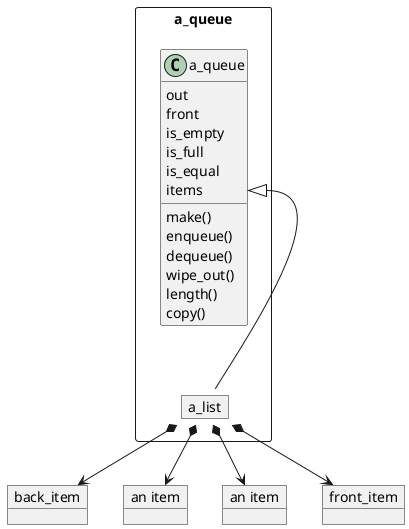
Figure 9.1 The inside view of an implementation of QUEUE that uses a LIST object.


```Eiffel
feature —— Moving items into and out of the queue 
enqueue (new_item: ITEM) is 
——Add new_item to the back of this queue 
do 
——Put new_item into its place. 
items.move_off_left; 
items.insert_on_right (new_item); 

end; ——enqueue 
dequeue is 
——Remove the front item. 

do 
——Place the cursor over the front item. 
items.move_off_right; 
items.move_left; 

——Do the work. 
items.delete; 
end; ——dequeue 
front: ITEM is 
——The front item. 

do 
——Place the cursor over the front item. 
items.move_off_right; 
items.move_left; 

——Do the work. 
Result := items.item; 

end; ——front 
```
Listing 9.1 Features for moving items into and out of a queue, using a LIST object. 

### 9.3.2 Deciding Which LIST Implementation to Use 
With STACK_LIST, we could use an array list if we aligned the top with the right end, and a singly linked list if we aligned the top with the left end.
Both allowed us to work on their respective best case ends of the list. 

Since we work on both ends of the list in QUEUE_LIST, either enqueue or dequeue and front will be on the worst case end of the list, no matter how we align the front of the queue. 

Consider the singly linked list version.
If we align the front with the right end, as we did in Figure 8.4, then the items.move_left and the items.delete in dequeue make it an O(N) operation.
If we make the left end the front and replace enqueue with its mirror image, then the items.insert_on_left while in off-right position is an O(N) operation. 

A similar problem occurs if we use STACK_ARRAY: Either the insertion or  the deletion will be done on the left end of the list, where it is O(N). 

There is only one implementation of LIST that is suitable for use in *STACK_LIST: LIST_DOUBLY_LINKED*, where all the features we need are O(1). 

## 9.4 A Singly Linked Implementation of QUEUE 

We cannot use *LIST_SINGLY_LINKED* to efficiently implement a stack, but is it possible to use a singly linked structure if we bypass *LIST’s* interface, like we did with *STACK_LINKED*?
Can we set things up in a way that avoids the O(N) operations?
They were slow because we needed to move one node left in the list.
Suppose we keep track of that node instead of looking for it every time? 
Sticking to our “front is on the right” alignment, we get the inside view in Figure 9.2.
Does it speed up front and dequeue?
It certainly does speed up front: It just becomes “Result := front_node.item”. 

It does not help *dequeue*, though, since it would have to move front_node 
one step to the left, which is still O(N). 

Time to try the “front is on the left” alignment (Figure 9.3).
The top implementation is still as trivial.
To dequeue, we just make front_node track front_node.right.
But that is the cheap end of the list anyway;
it is *enqueue* that is vulnerable now.
Well, since `enqueue` adds the new node to the right of the one under back_node, it becomes an O(1) operation too.
This alignment allows us to have O(1) on both ends of the queue, since both enqueue and dequeue move from left to right, as does the tracking information. 


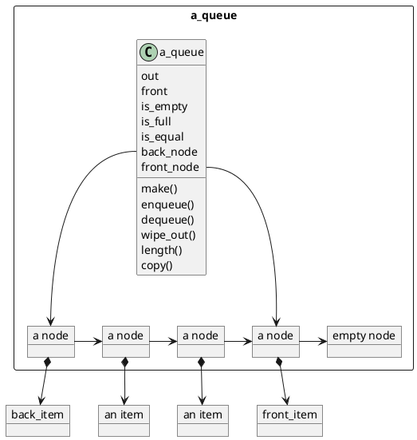
Figure 9.2 Inside view of QUEUE_LINKED, with the front of the queue aligned with the right end of the chain of nodes. 
QUEUES 


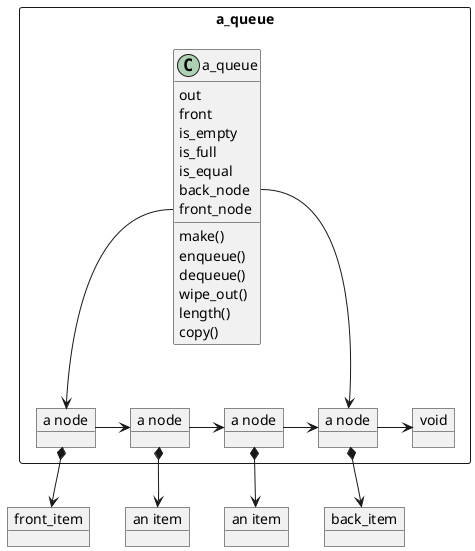
Figure 9.3 Inside view of QUEUE_LINKED, this time with the front of the queue aligned with the left end of the chain of nodes. 

Before we write the code for these routines, let us consider the purpose of the convention of putting a Void reference at the right end of the chain.
In LIST_SINGLY_LINKED, it was there to give the internal off_right feature a value, so that LIST_LINKED routines that use off_right still work;
we do not need it for this purpose in QUEUE_LINKED.
In STACK_LINKED, it was used to denote the bottom of the stack, and the stack was empty when top_node = 
Void.
How do we indicate an empty queue?
We could use top_node=bottom_node=Void, but that only solves half of our problem. 

Consider the implementations of `enqueue` and `dequeue` given in Listing 9.2. 
If `back_node = Void` when the queue is empty, then enqueue will crash on back_node.set_right(...).
In order for `enqueue` to work on an empty queue, we need to have a dummy node at the end of the chain.
The queue is then empty when front_node and back_node both track the dummy. 

```Eiffel
feature —— Moving items into and out of the queue 
enqueue (new_item: ITEM) is 
——Add new_item to the back of this queue. 

local 
new_node: like front_node; 
do 
——Make a new node and make it track new_item. 
'Inew_node.make; 

new_node.set_item (new_item); 

——The former back node’s right neighbor is new_node. 
back_node.set_right (new_node); 

: 

——new_node is the new back node. 
back_node := new_node; 

end; ——enqueue 
dequeue is 
——Remove the front item. 

do 
——Make front_node track the second node from the front, 
——casting the former front node adrift. 
front_node := front_node.right; 

end; ——dequeue 
front: ITEM is 
——The front item. 

do 
Result := top_node.item; 

end; ——front 
```
Listing 9.2 Features for moving items into and out of a QUEUE_LINKED, take 1. 


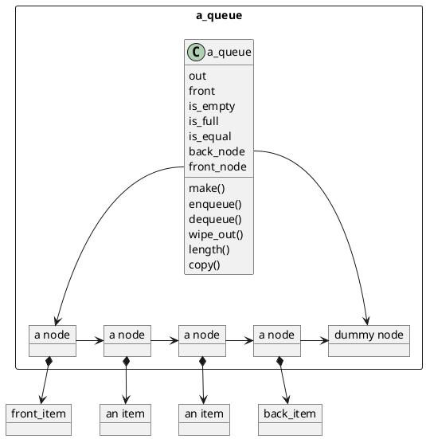
Figure 9.4 Inside view of a QUEUE_LINKED object, the final edition. 

```Eiffel
enqueue (new_item: ITEM) is 
——Add new_item to the back of this queue. 

local 
new_node:
like front_node; 

do 
_——Make a new dummy node and attach it on the right end. 

'new_node.make; 
back_node.set_right (new_node); 

——The former dummy gets to track new_item. 
back_node.set_item (new_item); 

——The new dummy is the new back node. 
back_node := new_node; 

end; ——enqueue 
```
Listing 9.3 A modified enqueue that deals with the dummy node at the end. 

Once we do that, we need to put some “dummy avoidance” code into our routines.
If we leave `enqueue` unmodified, then it will keep adding nodes on the right, and the dummy will always be at the front of the queue.
We would need to modify both front and dequeue to avoid it and work on the second node from the left instead. 

Another option is to modify enqueue so that the dummy is always at the right end of the chain—in fact, we can use it as the end marker instead of comparing with `Void`.
This gives us, finally, the inside view in Figure 9.4.
The modified enqueue is shown in Listing 9.3, and Figure 9.5 illustrates its operation. 

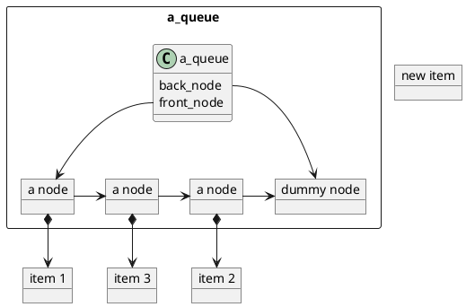
a. The queue with which we started. 

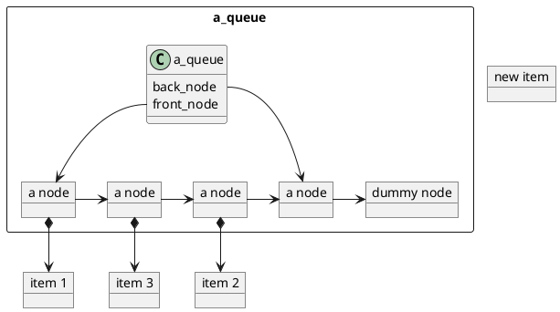
b. The new dummy node has been made and liked up

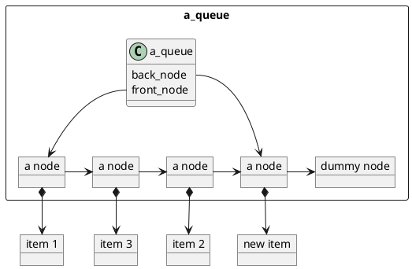
c. The former dummy node is now tracking new_item. 

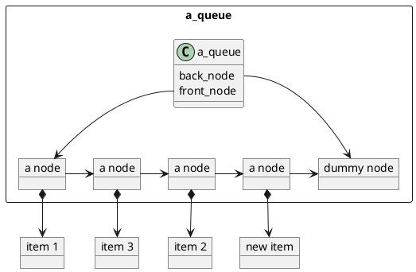
d. back_node is now tracking the new dummy. 

Figure 9.5 Responding to request “enqueue (new_item)”. (Routines are not shown in order to save page space.)

## 9.5 Using an ARRAY to Implement a QUEUE 

In `STACK_ARRAY`, we nailed the bottom of the stack down to the left end of the array, and let the top extend toward the right end, where best case conditions existed for adding and removing items. 

In `QUEUE_ARRAY`, if we nail the front to the left end and let the back extend to the right, we will get O(1) `enqueue` but O(N) `dequeue`.
If we nail the back down to the left end and let the front extend to the right, we will get O(1) `dequeu` but O(N)`enqueue`. 

Suppose we use an array implementation that mimics the linked representation we just finished discussing?
Then both the front and the back of the queue will advance along the array as dequeue and enqueue, respectively, are requested.
The first attempt at this representation is shown in Figure 9.6, and the enqueue and dequeue routines for it are given in Listing 9.4. 

The problem with this approach is that if our user does enough enqueues, 
we will have our back_index against the wall.
We will be unable to enqueue more items no matter how many times dequeue has been requested.
For example, suppose the object in Figure 9.6 gets one enqueue and one dequeue.
That will make its back_index = 6 and its front_index = 3.
The queue is not full yet (the length of the queue is only 4, while the capacity is 6),
but another enqueue attempt will crash. 

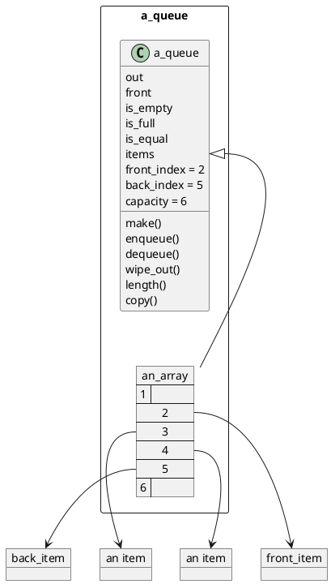
Figure 9.6 A first attempt at the inside view of a QUEUE_ARRAY object. 

```Eiffel
feature ——Sizing 
capacity: INTEGER; 

——Current capacity. 

feature {QUEUE_ARRAY } ——Visible only to similar queues 
front_index: INTEGER; 

——Index of the front item. 

back_index: INTEGER; 

——Index of the back item. 

items: ARRAY [ITEM]; 

——The array tracking the items. 

feature ——Moving items into and out of the queue 
enqueue (new_item: ITEM) is 
——Add new_item to the back of this queue. 

do 
back_index := back_index + 1; 
items.put (new_item, back_index); 

end; ——enqueue 
dequeue is 
——Remove the front item. 

local 
void_item: ITEM; 

do 
items.put (void_item, front_index); -—Set the old front item adrift. 
front_index := front_index + 1; 

end; ——dequeue 
front: ITEM is 
——The front item. 

do 
Result := items.item (front_index); 

end; ——front
```
Listing 9.4 A first attempt at QUEUE_ARRAY features for moving items into and out of the queue.

What we need is an array that does not have a right edge, but that wraps itself back so that its index 6 is followed by index 1 again (since that is where the next available position is).
We have two options: 

1. Create class CIRCULAR_ARRAY. 

2. Treat our ARRAY object as if it were circular. 

The first option is more appealing aesthetically, since it is easy to envision CIRCULAR_ARRAY as a self-contained class.
However, creating a good CIRCULAR_ARRAY requires a study of circular object structures, which is outside the scope of this text.
Instead, we will follow the second option.[^3] We will use a linear array in a circular manner. 

[3]: The second option also happens to be slightly more efficient, but that was not the reason for choosing it.

### 9.5.1 Making Array Indices Go in Circles 

Take a circle of circumference C units.
Take any two points on that circle and call them a and b.
If you always follow the circle in one direction—say, counterclockwise—you have an infinite number of ways to get from a to b: 

0. Go from a and stop when you reach b. 
1. Go from a one full circle and keep going until you reach b. 
2. Go from a two full circles and keep going until you reach b. 
3. Go from a three full circles and keep going until you reach b. 
4. Etc. 

So to get from a to b, one can travel for (6 — a) units, or (6 — a) + C units, . 
or (6 — a) + 2C units, or (6 — a) + 3C units, etc.
In short, the distance along the circle from a to b is 

```math
n*C + (b - a) 
```

where n is any integer, including zero and the negatives (—1C is one trip around the circle in the opposite direction). 

If we are told that C = 10 and some trip ¢ from a to b took 64 units, how do we determine the shortest distance from a to b along the circle?
We throw away all those extra nC’s: 

64=n X 10+ (6-a) 

means that n = 6 and (6 — a) = 4. Namely, n =[t/C] and 
(b — a) = remainder of t/C
Note that when a = 0, all “(6 — a)” become just “b.” 

So much for the review of trigonometry—now back to arrays.
Suppose we have an array that is shaped like a circle and its indices range from 0 to 9, and that x is index 5 of that array. 

If y is the index that is 2 slots away from x, what is it?
It is 7, of course, since 5 + 2 = 7.
But if y is 9 slots away from x, what is y?
5 + 7 = 12 and 12 is outside of the index range of the array, so that cannot be right.
A simple count shows that the answer is 2, but let us see how we can do it without counting with our fingers. 

In the past, we have found it convenient to start our arrays at index 1, 
but this time the array starts at 0.
The reason is that if the array starts at 0, 
then each index is also the distance from the array’s beginning:
position 0 is 0 slots away from the beginning of the array,
position 5 is 5 slots away from the beginning, etc.
Since the array is a circle, asking for the index of the (5 + 7)’th position is like asking how far it is from the beginning of the circle.
Since the circle starts at 0 and its circumference is 10 (0 through 9 is ten positions),
the answer is 

remainder of `(5 + 7) / 10` which is 2. 

The way to write “integer_division (a b)" in Eiffel is “a // 6,” and “remainder of a=b” is written 
as “a \\ b.” Since the Eiffel notation is shorter, we will use it from now on. 

To summarize, to compute the index of the position in array items that is d positions away from index x in the same array, we can simply compute 

```Eiffel
(x + d) \\ items.count 
```
provided that the first index of items is 0. 

This observation leads us to the modified enqueue and dequeue in Listing 9.5. 

enqueue (new_item: ITEM) is 
——Add new_item to the back of this queue. 

do 
back_index := (back_index + 1) \\ items.count; 
items.put (new_item, back_index); 

end; ——enqueue 
dequeue is 
——Remove the front item. 

QUEUES 

171 

local 
void_item: ITEM; 

do 
items. put (void_item, front_index); -—Set the old front item adrift. 
front_index := (front_index + 1) \\ items.count; 

end; ——dequeue 
Listing 9.5 Features enqueue and dequeue modified to treat the items array  as a circular structure. 

### 9.5.2 Detecting Full and Empty Queues 

A QUEUE_LINKED is empty when front_node and back_node are equal and tracking the dummy node.
In QUEUE_ARRAY, when `front_index` and `back_index` are equal, we get a queue of length 1 instead, as shown in Figure 9.7a. 
Doing a `dequeue` gives us the empty queue in Figure 9.7b. 

Aha, so the queue is empty when `front_index` gets one step ahead of `back_index`!
That means that is_empty is 

```Eiffel
is_empty: BOOLEAN is 
——Is this queue empty? 

do 
Result := front_index = (back_index + 1) \\ items.count; 

end; ——is_empty 
```

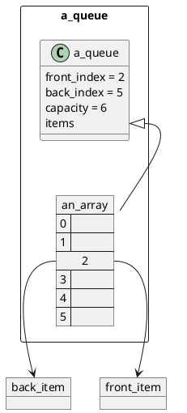
a. A queue of length 1. 

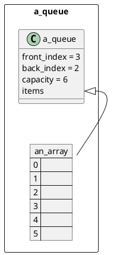
b. Result of a dequeue request. 

Figure 9.7 Going from a length 1 QUEUE_ARRAY to an empty one. 

Let us consider the full queue condition the same way.
If we start with the empty queue in Figure 9.7b and enqueue five objects in a row, we will get the almost full queue shown in Figure 9.8a.
Then the sixth enqueue gives us Figure 9.8b. 

We now see that the is_full condition occurs when ... `front_index` is one step ahead of `back_index`.
Unfortunately, we have already made that our is_empty condition. 

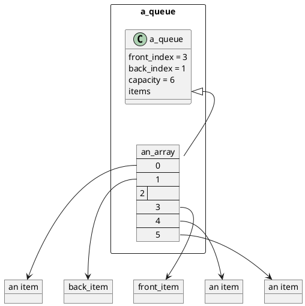
a. A queue that is almost full. 

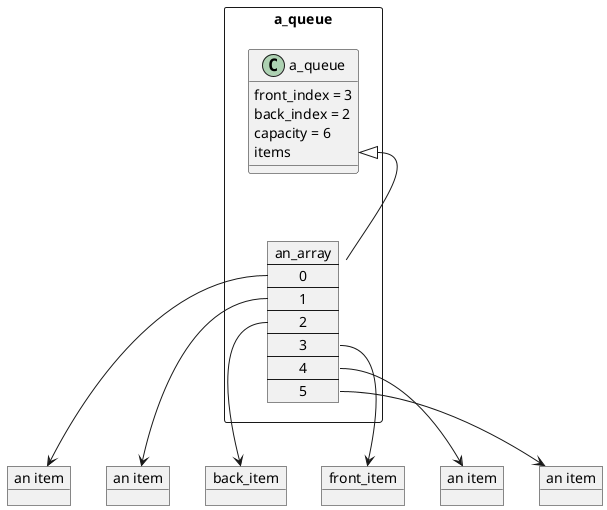
b. Result of an enqueue request. 

Figure 9.8 Going from an almost full QUEUE_ARRAY to a full one. 

There are two common solutions to this problem: 

1. Make length an attribute, increment it in each enqueue, decrement it in  each dequeue, and compare it with capacity in is_full. 

2. Consider the queue in Figure 9.8a to be full, making “front_index is two steps ahead of back_index” the is_full condition. 

There is not much difference in the efficiencies of the two techniques.
The space occupied by the unused position in the array is about equal to the space occupied by length as an attribute.
Counting the length up and down in each dequeue and enqueue does slow them down a bit, but that may or may not be noticeable. 
Let us use the second method—simply because it is more interesting. 

First, if we want our queue to have capacity X, we need an array inside of capacity X + 1.
That means that the array will have indices 0 through capacity instead of 0 through capacity — 1. 

Second, since we are not counting the length up and down, we need to compute it on demand.
If the queue does not go across the array boundary (where the index restarts at 0),
then the length is simply 

```Eiffel
back_index — front_index + 1 
```
(try it on Figure 9.7a). 

If the queue crosses the array boundary, then front_index is a greater integer than back_index, so the preceding formula will yield a negative length, 
because instead of measuring the distance from front_index to back_index, it measures its complement (the distance from back_index to front_index).
We can compensate for it by adding one full circle to the answer: 

```
back_index — front_index + 1 + items.count 
```
(try it on Figure 9.8a). 

We can combine these two into one formula by always adding the full circle, 
and then chopping it off with the remainder operator in case the answer was positive at the beginning.
This gives us the following length feature: 

```Eiffel
length: INTEGER is 
——The number of items currently in the queue. 

do 
Result := 

(back_index — front_index + 1 + items.count) \\ items.count; 

end;
```
We have finally zeroed in on the appropriate inside view of QUEUE_ARRAY objects.
It is given in Figure 9.9. 

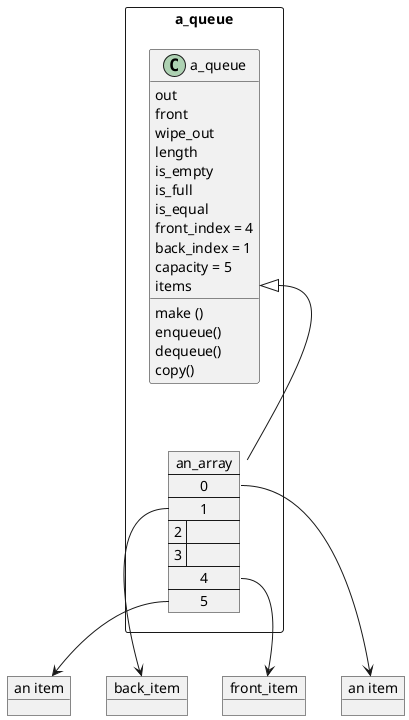
Figure 9.9 The inside view of a QUEUE_ARRAY object, with appropriately numbered array indices.
The queue’s capacity is one less than the array’s capacity to allow is_empty and is_full to differ from each other. 

### 9.5.3 Testing for Equality
The last feature of QUEUE_ARRAY that deserves special attention is `is_equal`.
Comparing *QUEUE_ARRAYs* is almost as straightforward as comparing *STACK_ARRAYs* or *LIST_ARRAYs*.
The only difference is that two equal queues do not have to start at the same index in their respective arrays.
Also, 
their arrays may not be of equal capacity, which means that while advancing the index in other’s array, we have to remember to use “x \\ other.items.count” 
instead of “x \\ items.count.” These concerns appear in other features as well, 
so Listing 9.6 shows the implementation of is_equal as an example. 

```Eiffel
is_equal (other:
like Current): BOOLEAN is 
——Do this queue and other keep track ——of the same items in the same order? 

local 
current_index: INTEGER; 
other_index: INTEGER; 

do 
if length /= other.length then 
——Can't be equal, so no sense going through the loop. 
Result := false; 

else 
from 
Result := true; -—Equal until proven unequal. 
current_index := front_index; 
other_index := other.front_index; 

until 
——Exit as soon as inequality is detected Result = false ——or when queues end. 
or else current_index = (back_index + 1) \\ items.count 
loop 
Result := 

items.item (current_index) = other.items.item (other_index); 

current_index := (current_index + 1) \\ items.count; 

other_index := (other_index + 1) \\ other.items.count; 

end; 

end; 

end; ——is_equal 
```
Listing 9.6 Feature is_equal of class QUEUE_ARRAY. 

#### 9.6 Choosing the Best QUEUE Implementation for a Given Use 

The trade-offs among the three QUEUE implementations are almost identical to the trade-offs among their STACK counterparts.
All three offer O(1) performance in the critical features (enqueue, dequeue, and front).
QUEUE_ARRAY is better if the maximum capacity can be predicted, and if the queue is usually at least half full or that memory is not needed for anything else.
If the queue length is too unpredictable, QUEUE_LINKED is better.
If pressed for development time and a doubly linked list is available, use it to implement QUEUE_LIST. 

## 9.7 Who Needs It? 

Queues are most useful in multiprocess programming, where they serve as buffers in transmission of objects from one process to another.
However, there are uses for it that have nothing to do with parallelism. 

In the calculators we will build in Chapter 10, we will be using queues to organize parsed (partially compiled) arithmetic expressions.
In Section 15.3.3, we will use a queue to implement a breadth-first traversal of a tree.[^4]
[4]: If you do not know yet what the terms “breadth-first,” “traversal,” and “tree” mean, please wait until Chapter 15. 

# Summary 

A queue is a first in, first out (FIFO) object structure.
Objects are enqueued at one end of it and dequeued at the other. 

If implemented correctly, enqueue, dequeue, and front have a time complexity of O(1). 

# Exercises 

1. Write the contract for queues in the form of a deferred class QUEUE. 
2. Using STACK_TESTER or LIST_TESTER as an example, write QUEUE_TESTER. When testing the array implementations, make sure it makes the queue cross the array boundary at least once (for example, fill it to capacity, then dequeue twice, then enqueue twice). 
3. Implement and test QUEUE_LIST. 
4. Implement and test QUEUE_LINKED. 
5. Implement and test QUEUE_ARRAY. 
6. Show how the if statement in is_equal can be combined with the loop. 
